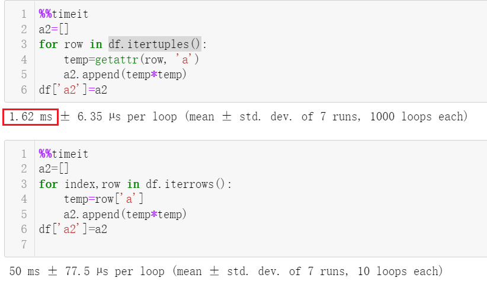

Python Pandas Numpy
<a name="gHMEt"></a>
## 1、NumExpr
NumExpr 是一个对NumPy计算式进行的性能优化。NumExpr的使用及其简单，只需要将原来的numpy语句使用双引号框起来，并使用numexpr中的evaluate方法调用即可。经验上看，数据有上万条+ 使用NumExpr才比较优效果，对于简单运算使用NumExpr可能会更慢。如下较复杂计算，速度差不多快了5倍。
```python
import numexpr as ne

import numpy as np

a = np.linspace(0,1000,1000) 

print('# numpy十次幂计算')
%timeit a**10

print('# numexpr十次幂计算')
%timeit ne.evaluate('a**10')
```

<a name="SX8XV"></a>
## 2、Numba
Numba 使用行业标准的LLVM编译器库在运行时将 Python 函数转换为优化的机器代码。Python 中 Numba 编译的数值算法可以接近 C 或 FORTRAN 的速度。<br />如果在数据处理过程涉及到了大量的数值计算，那么使用numba可以大大加快代码的运行效率（一般来说，Numba 引擎在处理大量数据点 如 1 百万+ 时表现出色）。numba使用起来也很简单，因为numba内置的函数本身是个装饰器，所以只要在自己定义好的函数前面加个`@nb.`方法就行，简单快捷！
```python
# pip install numba

import numba as nb

# 用numba加速的求和函数
@nb.jit()
def nb_sum(a):
    Sum = 0
    for i in range(len(a)):
        Sum += a[i]
    return Sum

# 没用numba加速的求和函数
def py_sum(a):
    Sum = 0
    for i in range(len(a)):
        Sum += a[i]
    return Sum

import numpy as np
a = np.linspace(0,1000,1000) # 创建一个长度为1000的数组
print('# python求和函数')
%timeit sum(a) 
print('# 没加速的for循环求和函数')
%timeit py_sum(a)
print('# numba加速的for循环求和函数')
%timeit nb_sum(a) 
print('# numpy求和函数')
%timeit np.sum(a) 
```
当前示例可以看出，numba甚至比号称最接近C语言速度运行的numpy还要快5倍+，对于python求和速度快了几百倍。<br />此外，Numba还支持GPU加速、矢量化加速方法，可以进一步达到更高的性能。
```python
from numba import cuda
cuda.select_device(1)

@cuda.jit
def CudaSquare(x):
    i, j = cuda.grid(2)
    x[i][j] *= x[i][j]


#numba的矢量化加速
from math import sin
@nb.vectorize()
def nb_vec_sin(a):
    return sin(a)
```
<a name="Zqlgv"></a>
## 3、Cupy
CuPy 是一个借助 CUDA GPU 库在英伟达 GPU 上实现 Numpy 数组的库。基于 Numpy 数组的实现，GPU 自身具有的多个 CUDA 核心可以促成更好的并行加速。
```python
# pip install cupy
import numpy as np
import cupy as cp
import time

### numpy
s = time.time()
x_cpu = np.ones((1000,1000,1000))
e = time.time()
print(e - s)

### CuPy 
s = time.time()
x_gpu = cp.ones((1000,1000,1000))
e = time.time()
print(e - s)
```
上述代码，Numpy 创建(1000, 1000, 1000)的数组用了 1.68 秒，而 CuPy 仅用了 0.16 秒，实现了 10.5 倍的加速。随着数据量的猛增，CuPy的性能提升会更为明显。
<a name="e8JQR"></a>
## 4、Pandas 使用技巧
更多pandas性能提升技巧请戳官方文档：[https://pandas.pydata.org/pandas-docs/stable/user_guide/enhancingperf.html](https://pandas.pydata.org/pandas-docs/stable/user_guide/enhancingperf.html)
<a name="lCPWG"></a>
### 4.1 按行迭代优化
按行对dataframe进行迭代，一般会用`iterrows`这个函数。在新版的pandas中，提供了一个更快的`itertuples`函数，如下可以看到速度快了几十倍。
```python
import pandas as pd
import numpy as np
import time
df = pd.DataFrame({'a': np.random.randn(100000),
                     'b': np.random.randn(100000),
                    'N': np.random.randint(100, 1000, (100000)),
                   'x':  np.random.randint(1, 10, (100000))})

%%timeit
a2=[]
for row in df.itertuples():
    temp=getattr(row, 'a')
    a2.append(temp*temp)
df['a2']=a2
%%timeit
a2=[]
for index,row in df.iterrows():
    temp=row['a']
    a2.append(temp*temp)
df['a2']=a2
```

<a name="Ry1ke"></a>
### 4.2 `apply`、`applymap`优化
当对于每行执行类似的操作时，用循环逐行处理效率很低。这时可以用`apply`或`applymap`搭配函数操作，其中`apply`是可用于逐行计算，而`applymap`可以做更细粒度的逐个元素的计算。
```python
# 列a、列b逐行进行某一函数计算
df['a3']=df.apply( lambda row: row['a']*row['b'],axis=1)
# 逐个元素保留两位小数
df.applymap(lambda x: "%.2f" % x)
```

<a name="FvPtj"></a>
### 4.3 聚合函数`agg`优化
对于某列将进行聚合后，使用内置的函数比自定义函数效率更高，如下示例速度加速3倍
```python
%timeit  df.groupby("x")['a'].agg(lambda x:x.sum())

%timeit  df.groupby("x")['a'].agg(sum)

%timeit  df.groupby("x")['a'].agg(np.sum)
```

<a name="yaXk9"></a>
### 4.4 文件操作
Pandas读取文件，pkl格式的数据的读取速度最快，其次是hdf格式的数据，再者是读取csv格式数据，而xlsx的读取是比较慢的。但是存取csv有个好处是，这个数据格式通用性更好，占用内存硬盘资源也比较少。此外，对于大文件，csv还可以对文件分块、选定某几列、指定数据类型做读取。
<a name="hxT9N"></a>
### 4.5 pandas.eval
pandas.eval 是基于第一节提到的numexpr，pandas也是基于numpy开发的，numexpr同样可以被用来对pandas加速）。使用eval表达式的一个经验是数据超过 10,000 行的情况下使用会有明显优化效果。
```python
import pandas as pd 
nrows, ncols = 20000, 100
df1, df2, df3, df4 = [pd.DataFrame(np.random.randn(nrows, ncols)) for _ in range(4)]

print('pd')
%timeit df1 + df2 + df3 + df4
print('pd.eval')
%timeit pd.eval("df1 + df2 + df3 + df4")
```

<a name="KaWc8"></a>
## 5、Cython优化
Cython是一个基于C语言的Python 编译器，在一些计算量大的程序中，可以Cython来实现相当大的加速。考虑大部分人可能都不太了解复杂的cython语句，下面介绍下Cython的简易版使用技巧。通过在Ipython加入 Cython 魔术函数`%load_ext Cython`，如下示例就可以加速了一倍。进一步再借助更高级的cython语句，还是可以比Python快个几十上百倍。
```python
%%cython
def f_plain(x):
    return x * (x - 1)
def integrate_f_plain(a, b, N):
    s = 0
    dx = (b - a) / N
    for i in range(N):
        s += f_plain(a + i * dx)
    return s * dx

```

<a name="ZIyv4"></a>
## 6、swifter
swifter是pandas的插件，可以直接在pandas的数据上操作。Swifter的优化方法检验计算是否可以矢量化或者并行化处理，以提高性能。如常见的apply就可以通过swifter并行处理。
```python
import pandas as pd
import swifter

df.swifter.apply(lambda x: x.sum() - x.min())
```
<a name="d5hVk"></a>
## 7、Modin
Modin后端使用dask或者ray（dask是类似pandas库的功能，可以实现并行读取运行），是个支持分布式运行的类pandas库，简单通过更改一行代码`import modin.pandas as pd`就可以优化 pandas，常用的内置的read_csv、concat、apply都有不错的加速。**注：并行处理的开销会使小数据集的处理速度变慢。**
```python
!pip install modin
import pandas
import modin.pandas as pd
import time

## pandas

pandas_df = pandas.DataFrame({'a': np.random.randn(10000000),
                     'b': np.random.randn(10000000),
                    'N': np.random.randint(100, 10000, (10000000)),
                   'x':  np.random.randint(1, 1000, (10000000))})


start = time.time()

big_pandas_df = pandas.concat([pandas_df for _ in range(25)])

end = time.time()
pandas_duration = end - start
print("Time to concat with pandas: {} seconds".format(round(pandas_duration, 3)))

#### modin.pandas
modin_df = pd.DataFrame({'a': np.random.randn(10000000),
                     'b': np.random.randn(10000000),
                    'N': np.random.randint(100, 10000, (10000000)),
                   'x':  np.random.randint(1, 1000, (10000000))})

start = time.time()
big_modin_df = pd.concat([modin_df for _ in range(25)])

end = time.time()
modin_duration = end - start
print("Time to concat with Modin: {} seconds".format(round(modin_duration, 3)))

print("Modin is {}x faster than pandas at `concat`!".format(round(pandas_duration / modin_duration, 2)))
```

