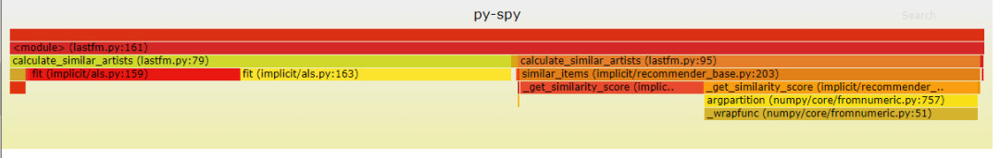
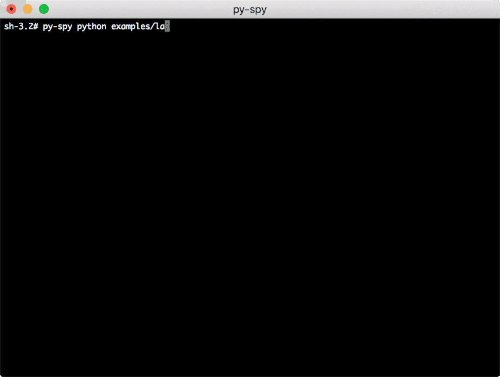
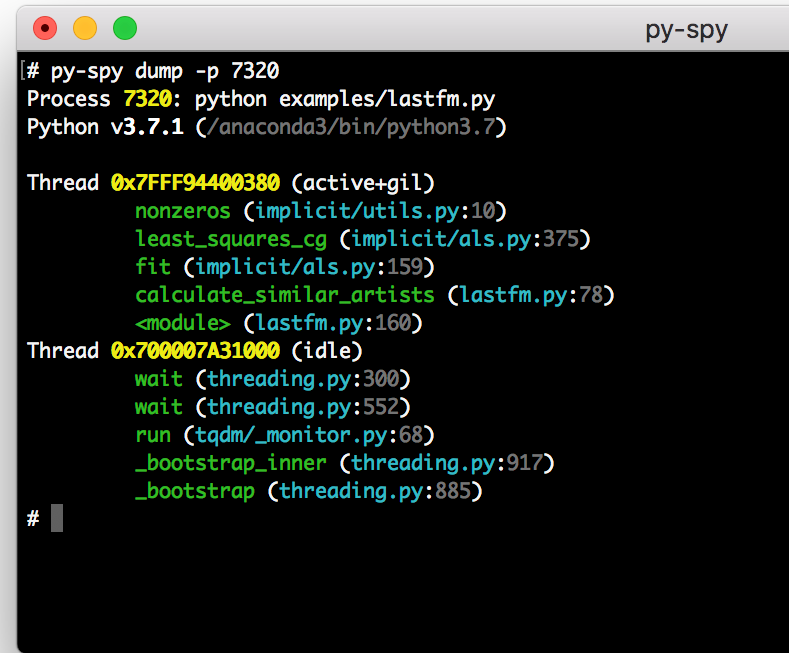

Python<br /><br />py-spy 是用于 Python 程序的性能监控、分析器。它使你可以直观地看到 Python 程序花费的时间，而无需重新启动程序或以任何方式修改代码。<br />py-spy 的开销非常低：为了最大化提高速度，它是用 Rust 编写的，并且与配置的Python 程序不在同一进程中运行。这意味着 py-spy 可以安全地用于生产环境的 Python 程序。<br />py-spy 可在 Linux，OSX，Windows 和 FreeBSD 上运行，并支持所有最新版本的 CPython 解释器（2.3-2.7 和 3.3-3.8 版）进行性能分析。
<a name="t5RfU"></a>
## 1、安装
可以通过以下方式从 PyPI 安装预构建的二进制 wheel 文件：
```bash
pip install py-spy
```
也可以从 GitHub Release Page 下载预构建的二进制文件。<br />GitHub Release Page：[https://github.com/benfred/py-spy/releases](https://github.com/benfred/py-spy/releases)
<a name="do7ri"></a>
## 2、用法
py-spy 在命令行中进行工作，获取要从监控的程序的 PID 或要运行的 python 程序的文件。分别有三种分析方法 **record**，**top **以及 **dump**：
<a name="OHc9x"></a>
### **record**
py-spy 支持使用record命令将配置文件记录到文件中。例如，可以通过执行以下操作来生成 python 进程的热力图：

```bash
py-spy record -o profile.svg --pid 12345
# OR
py-spy record -o profile.svg -- python myprogram.py
```
它将生成一个交互式 SVG 文件，如下所示：<br /><br />可以使用参数 `--format` 更改文件格式。请参阅参考资料：`**py-spy record --help**` 以获取有关其他选项的信息，包括更改采样率，仅包含 GIL 的线程进行过滤，对本机 C 扩展进行概要分析，显示线程 ID，概要分析子进程等。
<a name="r1Jn9"></a>
### **Top**
Top 显示了在 python 程序中花费最多时间的函数的实时视图，类似于 Unix top 命令。使用以下命令运行：
```bash
py-spy top --pid 12345
# OR
py-spy top -- python myprogram.py
```
将显示 python 程序的实时函数消耗：<br />
<a name="DhemS"></a>
### **Dump**
py-spy 还可以使用 dump 命令显示每个 python 线程的当前调用堆栈：
```bash
py-spy dump --pid 12345
```
这会将每个线程的调用堆栈以及其他一些基本进程信息转发到控制台：<br />对于需要一个调用堆栈来确定 python 程序挂在何处的情况，这很有用。该命令还可以通过设置 `--locals` 标志来打印出与每个堆栈帧关联的局部变量。<br />
