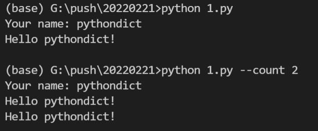
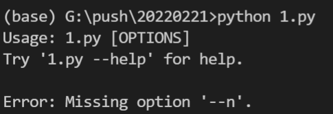
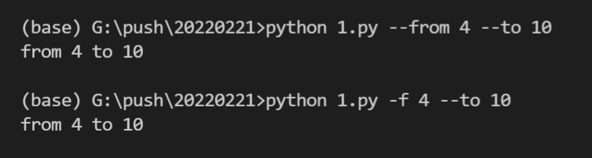
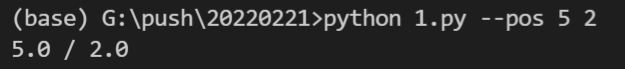
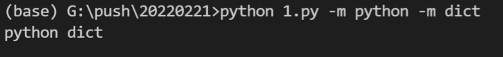
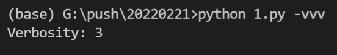
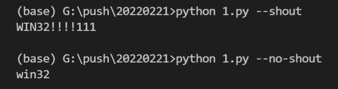
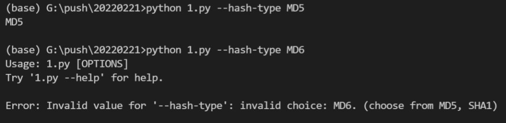
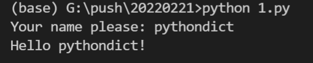

Python<br />Click 是一个简洁好用的Python模块，它能用尽量少的代码实现漂亮的命令行界面。它不仅开箱即用、还能支持高度自定义的配置。<br />官方文档：[https://click.palletsprojects.com/en/8.0.x/](https://click.palletsprojects.com/en/8.0.x/)<br />一个简单的示例如下：
```python
import click

@click.command()
@click.option('--count', default=1, help='Number of greetings.')
@click.option('--name', prompt='Your name',
              help='The person to greet.')
def hello(count, name):
    """Simple program that greets NAME for a total of COUNT times."""
    for x in range(count):
        click.echo(f"Hello {name}!")

if __name__ == '__main__':
    hello()
```
效果如下：<br /><br />可见这个模块的强大之处，只需要在对应的函数上加几个装饰器，就能实现带提示符的命令行界面的创建，相当方便。
<a name="d8Q2z"></a>
## 1、准备
首先需要电脑安装好了Python环境，并且安装好了Python开发工具。<br />请选择以下任一种方式输入命令安装依赖：

1. Windows 环境 打开 Cmd (开始-运行-CMD)。
2. MacOS 环境 打开 Terminal (command+空格输入Terminal)。
3. 如果用的是 VSCode编辑器 或 Pycharm，可以直接使用界面下方的Terminal。
```bash
pip install click
```
<a name="aRs0n"></a>
## 2、基本使用
如文首所示的例子一样，`@click.option` 是最基本的选项，它既可以设定参数默认值，也可以设定必须传入参数：
```python
@click.command()
@click.option('--n', default=1) # 设定了默认值
def dots(n):
    click.echo('.' * n)
    

@click.command()
@click.option('--n', required=True, type=int) # 设定必须传入参数值
def dots(n):
    click.echo('.' * n)
```
如果设置了必须传入相关参数，那么在没传入参数的情况下，效果是这样的：<br /><br />当然，它还支持设定多种参数别名，比如下面的 `--from` 和 `-f` 是等效的：
```python
@click.command()
@click.option('--from', '-f', 'from_')
@click.option('--to', '-t')
def reserved_param_name(from_, to):
    click.echo(f"from {from_} to {to}")
```

<a name="ZAtqN"></a>
## 3、多值参数
如果选项需要多个参数，Click也能实现这个需求。
```python
@click.command()
@click.option('--pos', nargs=2, type=float)
def findme(pos):
    a, b = pos
    click.echo(f"{a} / {b}")
```
可见，通过配置nargs参数，可以将用户传递的值存入元组，并在代码中解包这个元组拿到所有的值。<br />效果如下：<br /><br />还可以配置一个参数叫 multiple，这个参数可以接受N个值：
```python
@click.command()
@click.option('--message', '-m', multiple=True)
def commit(message):
    click.echo(' '.join(message))
```

<a name="kIrkg"></a>
## 4、其他功能
还可以使用Click来计数，这个使用非常罕见：
```python
@click.command()
@click.option('-v', '--verbose', count=True)
def log(verbose):
    click.echo(f"Verbosity: {verbose}")
```
效果如下：<br />
<a name="I6Rqb"></a>
### 布尔标志
此外，Click还带有布尔标志功能，可以直接使用 "/" 来标志参数为二选一参数，函数中直接就会拿到布尔型的变量：
```python
import sys

@click.command()
@click.option('--shout/--no-shout', default=False)
def info(shout):
    rv = sys.platform
    if shout:
        rv = rv.upper() + '!!!!111'
    click.echo(rv)
```

<a name="MdQGe"></a>
### 选择选项
可以直接限定用户的输入范围：
```python
@click.command()
@click.option('--hash-type',
              type=click.Choice(['MD5', 'SHA1'], case_sensitive=False))
def digest(hash_type):
    click.echo(hash_type)
```

<a name="xhGRc"></a>
### 提示文本
在文首提到的例子中，输出了个 "You name:" 的提示，其实是 option 中的`prompt`参数控制的：
```python
@click.command()
@click.option('--name', prompt='Your name please')
def hello(name):
    click.echo(f"Hello {name}!")
```
<br />Click的功能就介绍到这里，他还有许多高级的用法，比如动态默认值、回调函数等等，大家可以通过官方文档了解这些高级功能的使用方法：[https://click.palletsprojects.com/en/8.0.x/options/#name-your-options](https://click.palletsprojects.com/en/8.0.x/options/#name-your-options)
