Python Rich<br />Rich 是一个 Python 库，可以在终端中提供富文本和漂亮、精美的格式。<br />使用 Rich API 可以很容易的在终端输出添加各种颜色和不同风格。它可以绘制漂亮的表格，进度条，markdown，突出显示语法的源代码及回溯等等，优秀的功能不胜枚举。<br />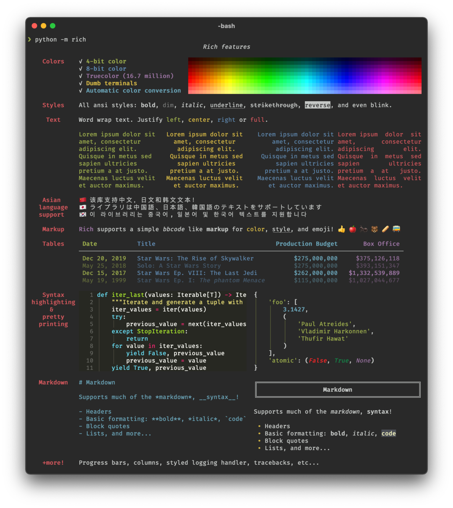
<a name="pz1iU"></a>
## 1、Rich 兼容性
Rich 适用于 Linux，OSX 和 Windows。可与新的 Windows 终端一起使用，Windows 的经典终端仅限 8 种颜色。<br />Rich 还可以与 Jupyter NoteBook 一起使用，而无需其他配置。
<a name="FnETj"></a>
## 2、Rich 安装说明
请选择以下任一种方式输入命令安装依赖：

1. Windows 环境 打开 Cmd (开始-运行-CMD)。
2. MacOS 环境 打开 Terminal (command+空格输入Terminal)。
3. 如果用的是 VSCode编辑器 或 Pycharm，可以直接使用界面下方的Terminal.
```bash
pip install rich
```
<a name="XSA4N"></a>
## 3、Rich 的 Print 功能
想毫不费力地将 Rich 的输出功能添加到Python脚本程序中，只需导入 `rich print` 方法，该方法和其他 Python 的自带功能的参数类似。可以试试：
```python
from rich import print

print("Hello, [bold magenta]World[/bold magenta]!", ":vampire:", locals())
```
<br />可以看到，基于 rich 的 `print` 方法输出的内容都是带颜色、带重点的，相比于Python自带的 `print` 有明显的优势。
<a name="z5nVq"></a>
## 4、自定义 Console 控制台输出
想要对 Rich 终端内容进行更多的自定义设置，需要导入并构造一个控制台对象：
```python
from rich.console import Console

console = Console()
```
`Console` 对象含有一个 `print` 方法，它的界面与 Python 内置的 `print` 功能相似。可以试试：
```python
console.print("Hello", "World!")
```
这时终端上会显示“ Hello World！”，请注意，与内置的“打印”功能不同，Rich 会将文字自动换行以适合终端宽度。<br />有几种方法可以为输出添加自定义颜色和样式。可以通过添加 style 关键字参数来为整个输出设置样式。例子如下：
```python
console.print("Hello", "World!", style="bold red")
```
输出如下图：<br />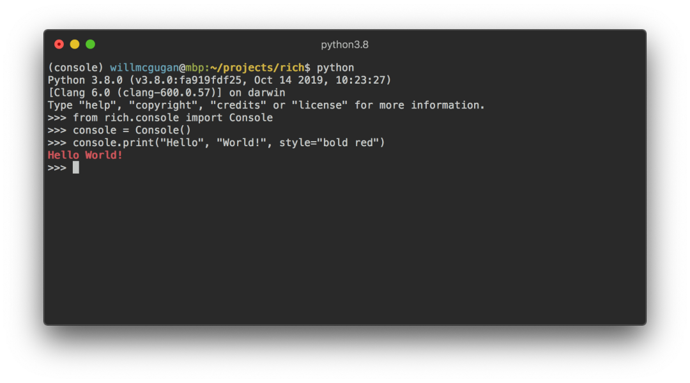<br />这个范例一次只设置了一行文字的样式。如果想获得更细腻更复杂的样式，Rich 可以渲染一个特殊的标记，其语法类似于 bbcode。示例如下：
```python
console.print("Where there is a [bold cyan]Will[/bold cyan] there [u]is[/u] a [i]way[/i].")
```
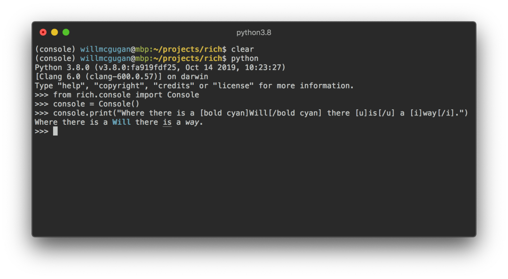
<a name="WYWJN"></a>
## 5、`Console` 控制台记录
`Console` 对象具有一个 `log()` 方法，该方法具有与 `print()` 类似的界面，除此之外，还能显示当前时间以及被调用的文件和行。<br />默认情况下，Rich 将针对 Python 结构和 repr 字符串进行语法突出显示。如果记录一个集合（如字典或列表），Rich 会把它漂亮地打印出来，使其切合可用空间。下面是其中一些功能的示例：
```python
from rich.console import Console
console = Console()

test_data = [
    {"jsonrpc": "2.0", "method": "sum", "params": [None, 1, 2, 4, False, True], "id": "1",},
    {"jsonrpc": "2.0", "method": "notify_hello", "params": [7]},
    {"jsonrpc": "2.0", "method": "subtract", "params": [42, 23], "id": "2"},
]

def test_log():
    enabled = False
    context = {
        "foo": "bar",
    }
    movies = ["Deadpool", "Rise of the Skywalker"]
    console.log("Hello from", console, "!")
    console.log(test_data, log_locals=True)


test_log()
```
以上范例的输出如下：<br />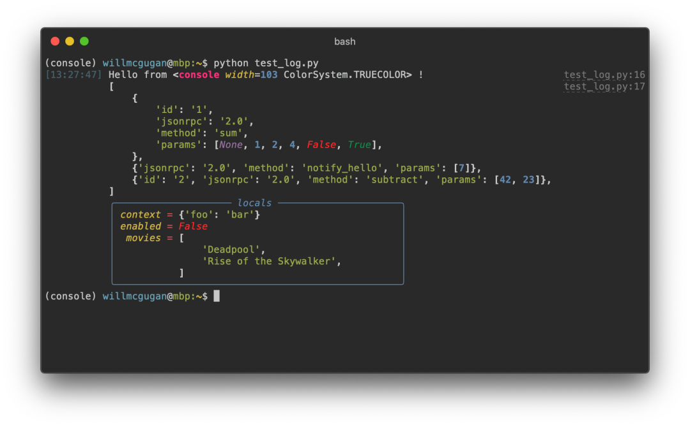<br />注意其中的 log_locals 参数会输出一个表格，该表格包含调用 log 方法的局部变量。<br />log 方法既可用于将长时间运行应用程序（例如服务器）的日志记录到终端，也可用于辅助调试。<br />Logging 处理程序<br />还可以使用内置的处理类来对 Python 日志记录模块的输出进行格式化和着色。下面是输出示例：<br />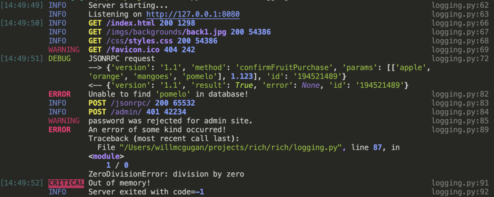
<a name="K9yMs"></a>
## 6、表情符号
将名称放在两个冒号之间即可在控制台输出中插入表情符号。示例如下：
```python
>>> console.print(":smiley: :vampire: :pile_of_poo: :thumbs_up: :raccoon:")
😃 🧛 💩 👍 🦝
```
请谨慎地使用此功能。
<a name="FJjWV"></a>
## 7、表格
Rich 包含多种边框，样式，单元格对齐等格式设置的选项。下面是一个简单的示例：
```python
from rich.console import Console
from rich.table import Column, Table

console = Console()

table = Table(show_header=True, header_style="bold magenta")
table.add_column("Date", style="dim", width=12)
table.add_column("Title")
table.add_column("Production Budget", justify="right")
table.add_column("Box Office", justify="right")
table.add_row(
    "Dev 20, 2019", "Star Wars: The Rise of Skywalker", "$275,000,000", "$375,126,118"
)
table.add_row(
    "May 25, 2018",
    "[red]Solo[/red]: A Star Wars Story",
    "$275,000,000",
    "$393,151,347",
)
table.add_row(
    "Dec 15, 2017",
    "Star Wars Ep. VIII: The Last Jedi",
    "$262,000,000",
    "[bold]$1,332,539,889[/bold]",
)

console.print(table)
```
该示例的输出如下：<br />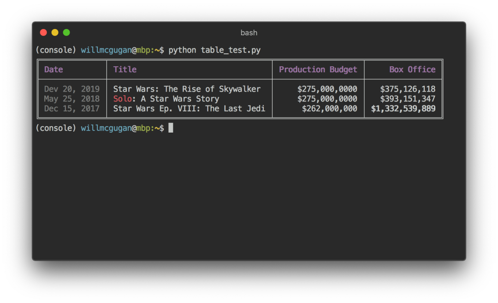<br />请注意，控制台标记的呈现方式与 `print()` 和 `log()` 相同。实际上，由 Rich 渲染的任何内容都可以添加到标题/行（甚至其他表格）中。<br />Table 类很聪明，可以调整列的大小以适合终端的可用宽度，并能根据需要做文本环绕的处理。下面是相同的示例，输出与比上表小的终端上：<br />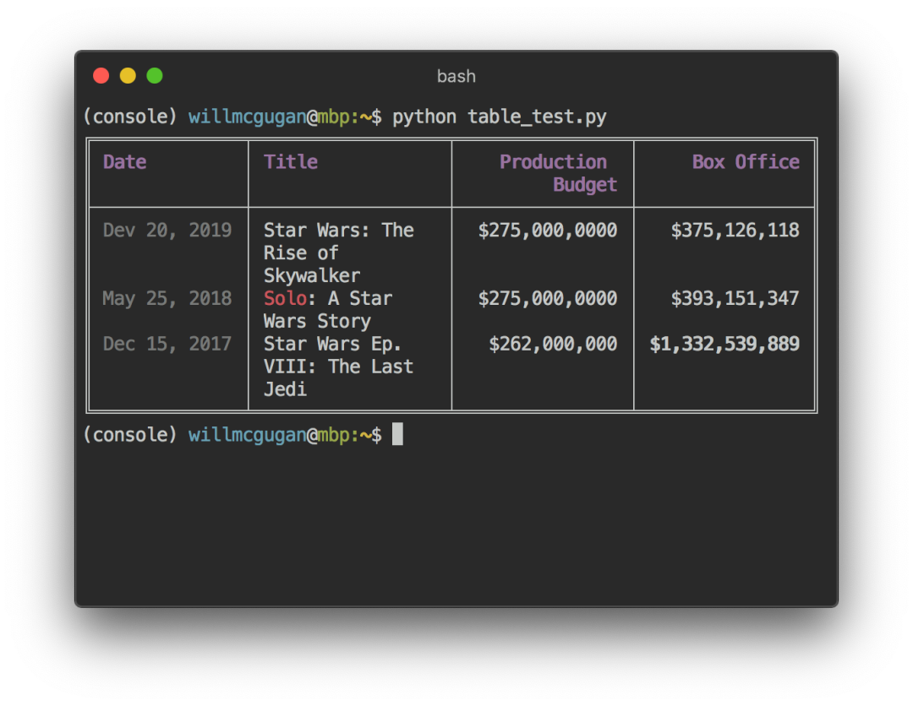
<a name="zZHw7"></a>
## 8、进度条
Rich 可以渲染多个不闪烁的进度条形图，以跟踪长时间运行的任务。<br />基本用法：用 track 函数调用程序并迭代结果。下面是一个例子：
```python
from rich.progress import track

for step in track(range(100)):
    do_step(step)
```
添加多个进度条并不难。以下是效果示例：<br />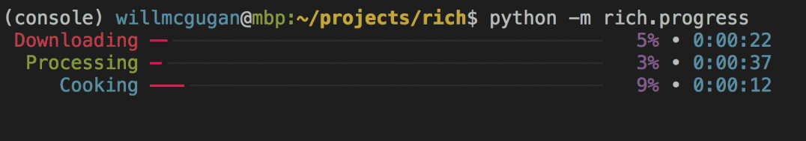<br />这些列可以配置为显示所需的任何详细信息。<br />内置列包括完成百分比，文件大小，文件速度和剩余时间。下面是显示正在进行的下载的示例：<br />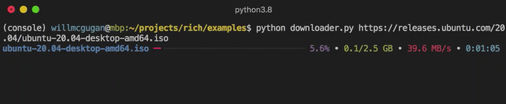<br />它可以在显示进度的同时下载多个 URL。
<a name="VMNDG"></a>
## 9、按列输出数据
Rich 可以将内容通过排列整齐的，具有相等或最佳的宽度的列来呈现。下面是（macOS / Linux） ls 命令的一个非常基本的克隆，用列来显示目录列表：
```python
import os
import sys

from rich import print
from rich.columns import Columns

directory = os.listdir(sys.argv[1])
print(Columns(directory))
```
以下屏幕截图是列示例的输出，该列显示了从 API 提取的数据：<br />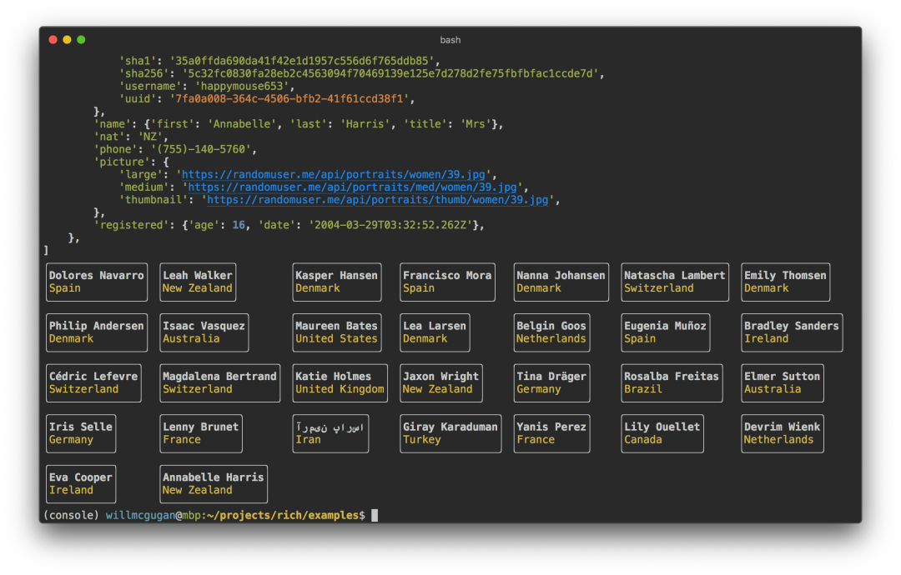
<a name="Onrpp"></a>
## 10、Markdown
Rich 可以呈现markdown，相当不错的将其格式显示到终端。<br />为了渲染 markdown，请导入 Markdown 类，将其打印到控制台。例子如下：
```python
from rich.console import Console
from rich.markdown import Markdown

console = Console()
with open("README.md") as readme:
    markdown = Markdown(readme.read())
console.print(markdown)
```
该例子的输出如下图：<br />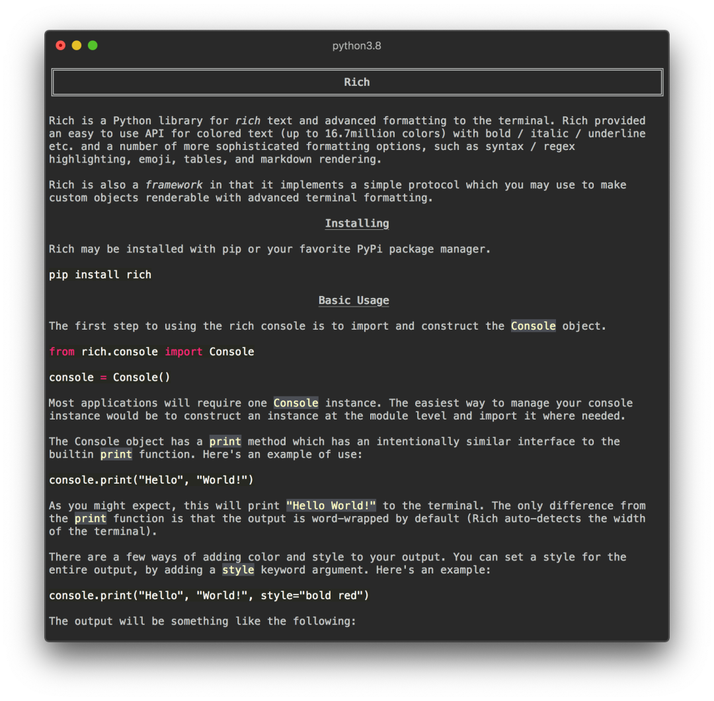
<a name="C1okC"></a>
## 11、语法突出显示
Rich 使用 pygments 库来实现语法高亮显示。用法类似于渲染 markdown。构造一个 Syntax 对象并将其打印到控制台。下面是一个例子：
```python
from rich.console import Console
from rich.syntax import Syntax

my_code = '''
def iter_first_last(values: Iterable[T]) -&gt; Iterable[Tuple[bool, bool, T]]:
    """Iterate and generate a tuple with a flag for first and last value."""
    iter_values = iter(values)
    try:
        previous_value = next(iter_values)
    except StopIteration:
        return
    first = True
    for value in iter_values:
        yield first, False, previous_value
        first = False
        previous_value = value
    yield first, True, previous_value
'''
syntax = Syntax(my_code, "python", theme="monokai", line_numbers=True)
console = Console()
console.print(syntax)
```
输出如下：<br />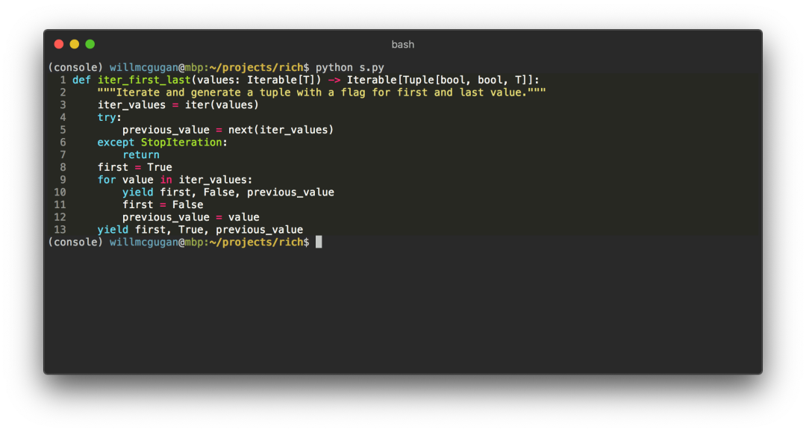
<a name="UjB7d"></a>
## 12、错误回溯(traceback)
Rich 可以渲染漂亮的错误回溯日志，比标准的 Python 回溯更容易阅读，并能显示更多代码。<br />可以将 Rich 设置为默认的回溯处理程序，这样所有异常都将由 Rich 呈现。<br />下面是在 OSX（与 Linux 类似）上的外观：<br />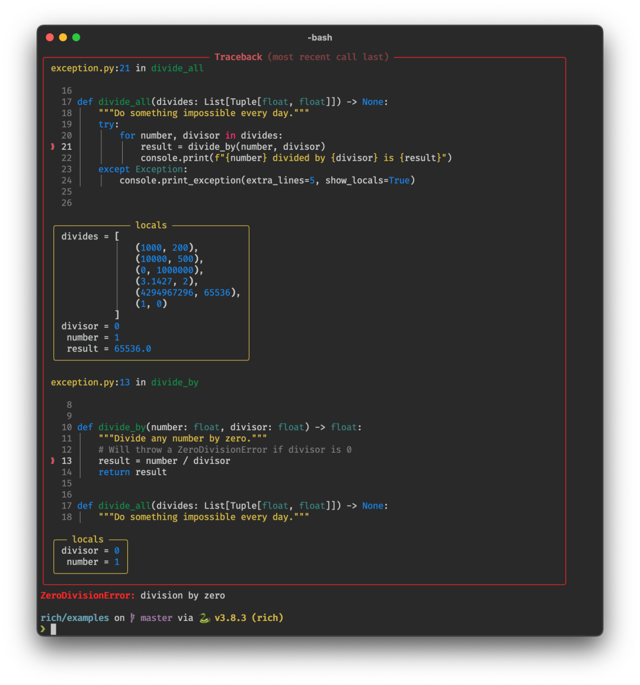
