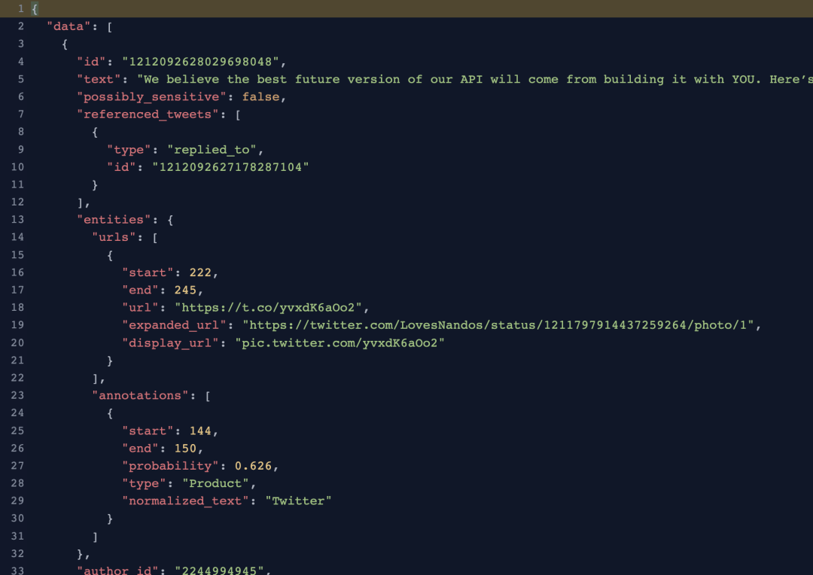
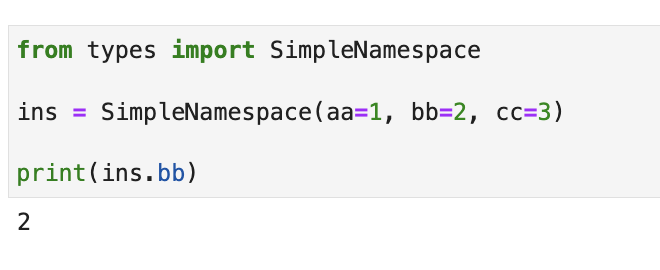
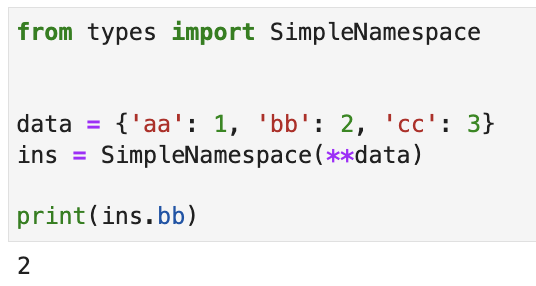
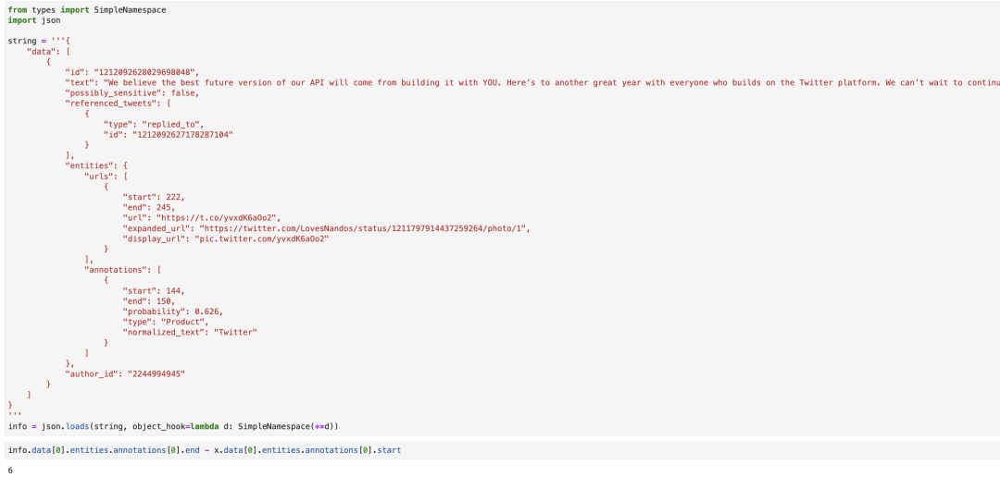

在Python里面，要把JSON转成字典是非常容易的，只需要使用`json.loads(JSON字符串)`就可以了。<br />但如果这个JSON转成的字典，嵌套比较深，那么要读取里面的数据就非常麻烦了。如下图所示：<br /><br />如果要读取把图中的end减去start字段，那么用字典的时候，代码要写成这样：
```python
result = info['data'][0]['entities']['annotations'][0]['end'] - info['data'][0]['entities']['annotations'][0]['start']
```
光是看到这些方括号和单引号，就够让人头晕了。<br />但如果改成下面这样，看起来就清爽多了：
```python
result = info.data[0].entities.annotations[0].end - info.data[0].entities.annotations[0].start
```
那么如何快速把一个嵌套很深的字典转换为对象呢？其实非常简单，使用Python自带的`SimpleNamespace`就可以了。<br />使用`SimpleNamespace`可以快速创建一个空对象，并设置它的属性，用法如下：
```python
from types import SimpleNamespace

ins = SimpleNamespace(aa=1, bb=2, cc=3)

print(ins.bb)
```
运行效果如下图所示：<br /><br />基于字典创建也非常简单：
```python
from types import SimpleNamespace

data = {'aa': 1, 'bb': 2, 'cc': 3}
ins = SimpleNamespace(**data)

print(ins.bb)
```
<br />对于深层嵌套的JSON字符串，在使用`json.loads`时，额外设置一个参数：object_hook，就可以实现递归式转换内层字典：
```
x = json.loads(JSON字符串, object_hook=lambda d: SimpleNamespace(**d))
```
如下图所示：<br /><br />关于参数object_hook的具体用法，大家可以看[**官方文档**](https://docs.python.org/3/library/json.html#json.loads)
<a name="Nk01H"></a>
### 参考资料
官方文档：[_https://docs.python.org/3/library/json.html#json.loads_](https://docs.python.org/3/library/json.html#json.loads)
