Python

## 1、简介
在日常使用Python的过程中，经常会使用json格式存储一些数据，尤其是在web开发中。而Python原生的json库性能差、功能少，只能堪堪应对简单轻量的json数据存储转换需求。  这里要介绍的第三方json库orjson，在公开的各项基准性能测试中，以数倍至数十倍的性能优势碾压json、ujson、rapidjson、simplejson等其他Python库，且具有诸多额外功能，下面就来领略其常用方法吧~

## 2、orjson常用方法
orjson支持3.7到3.10所有版本64位的Python，这里演示对应的orjson的版本为3.7.0，直接使用`pip install -U orjson`即可完成安装。下面来对orjson中的常用方法进行演示：

### 2.1 序列化
与原生json库类似，可以使用`orjson.dumps()`将Python对象序列化为JSON数据，注意，略有不同的是，orjson序列化的结果并不是str型而是bytes型，在下面的例子中，对包含一千万个简单字典元素的列表进行序列化，orjson与json库的耗时比较如下： 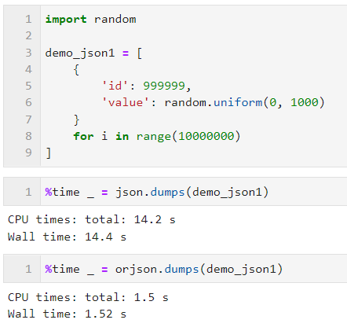

### 2.2 反序列化
将JSON数据转换为Python对象的过程称之为反序列化，使用`orjson.loads()`进行操作，可接受bytes、str型等常见类型，在前面例子的基础上添加反序列化的例子： 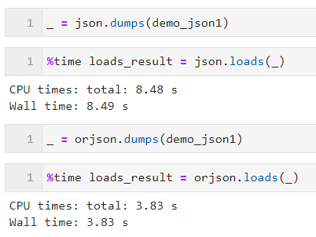

### 2.3 丰富的option选项
在orjson的序列化操作中，可以通过参数option来配置诸多额外功能，常用的有：

#### OPT_INDENT_2
通过配置`option=orjson.OPT_INDENT_2`，可以为序列化后的JSON结果添加2个空格的缩进美化效果，从而弥补其没有参数indent的不足： 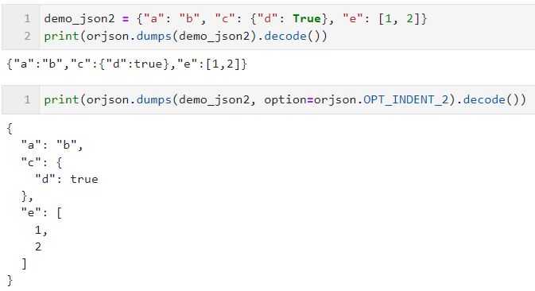

#### `OPT_OMIT_MICROSECONDS`
`orjson.dumps()`可以直接将Python中datetime、time等标准库中的日期时间对象转换成相应的字符串，这是原生json库做不到的，而通过配置`option=orjson.OPT_OMIT_MICROSECONDS`，可以将转换结果后缀的毫秒部分省略掉： 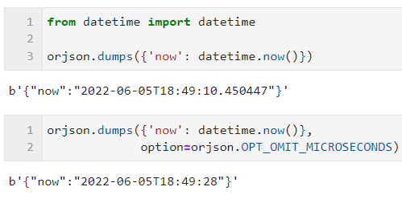

#### `OPT_NON_STR_KEYS`
当需要序列化的对象存在非数值型键时，orjson默认会抛出TypeError错误，这时需要配置`option=orjson.OPT_NON_STR_KEYS`来强制将这些键转换为字符型： 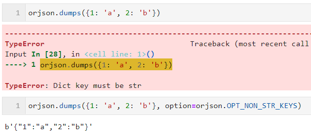

#### `OPT_SERIALIZE_NUMPY`
orjson的一大重要特性是其可以将包含numpy中数据结构对象的复杂对象，兼容性地转换为JSON中的数组，配合`option=orjson.OPT_SERIALIZE_NUMPY`即可： 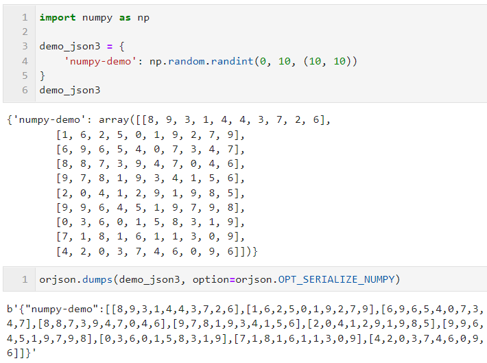

#### `OPT_SERIALIZE_UUID`
除了可以自动序列化numpy对象外，orjson还支持对UUID对象进行转换，在orjson 3.0之前的版本中，需要配合`option=orjson.OPT_SERIALIZE_UUID`，而这里演示的3.X版本则无需额外配置参数： 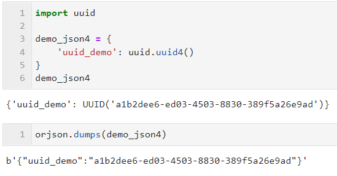

#### OPT_SORT_KEYS
通过配合参数`option=orjson.OPT_SORT_KEYS`，可以对序列化后的结果自动按照键进行排序： 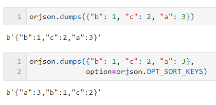

#### 组合多种option
当序列化操作需要涉及多种option功能时，则可以使用|运算符来组合多个option参数即可： 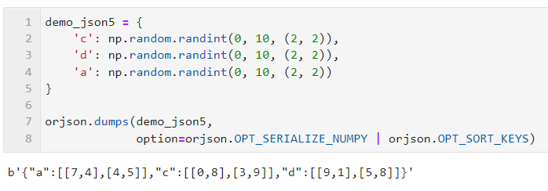

### 2.4 针对dataclass、datetime添加自定义处理策略
当需要序列化的对象中涉及到dataclass自定义数据结构时，可以配合`orjson.OPT_PASSTHROUGH_DATACLASS`，再通过对default参数传入自定义处理函数，来实现更为自由的数据转换逻辑，譬如下面简单的例子中，可以利用此特性进行原始数据的脱敏操作： 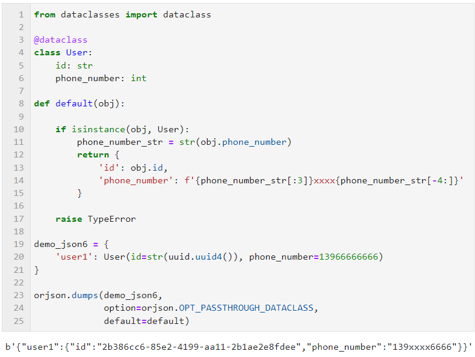 类似的，针对datetime类型数据，同样可以配合`OPT_PASSTHROUGH_DATETIME`和自定义`default`函数实现日期自定义格式化转换： 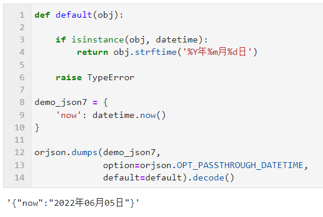 orjson更多特性可前往官方仓库[https://github.com/ijl/orjson](https://github.com/ijl/orjson)了解更多~
