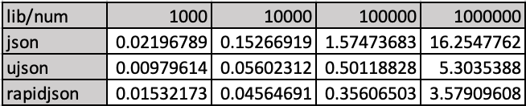
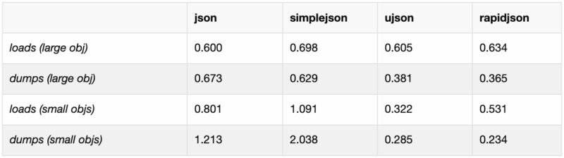
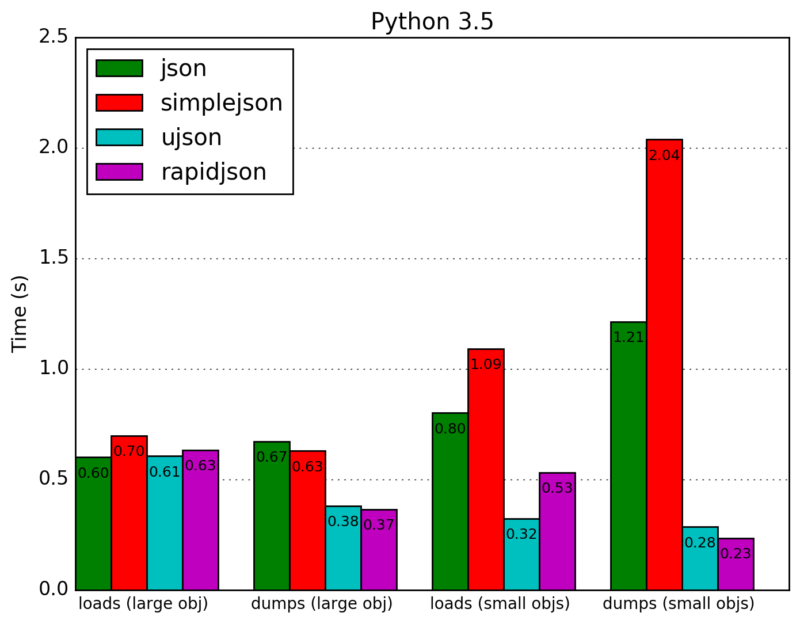
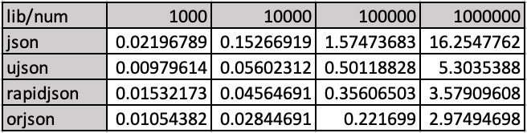

Python ujson orjson<br />在 Python 使用用  `json.dumps(data)` 时突然发现特别慢，`data` 本身不大，但是一个包含很多元素的列表，所以寻找一个替代的 JSON 处理库。大概对比了一个 ujson(UtltraJSON), python-rapidjson(RapidJSON) 和 Python 自带的 json 库。还有一个 simplejson 是为兼容 Python 2.6 以前用的(json 是 Python 2.6 新加入的 API)，性能有些差。<br />想要收获更好的性能，还得仰赖传统的 C/C++ 语言，ujson 是用纯 C 写的，RapidJSON 是 C++ 写的，后者还是十美分的开源产品。json, ujson, rapidjson 三者 `loads()` 方法的性能差别不太明显，但 `dumps()` 大对象时 Python 自带的 json 库就要考验用户的耐心了。
:::info
**注：最开始本来认定了 ujson 为最佳选择, 所以先从 usjon 和 rapidjson 切入的，后来从 usjon 的自我介绍中发现了 Rust 写的 orjson 很显眼，才加入了 orjson 的测试， orjson 更值得拥有。**
:::
以上三个 json 组件的安装方式分别为
```bash
$ pip install ujson
$ pip install python-rapidjson
$ pip install simplejson
```
测试 ujson 和 rapidjson 与 Python json 库的 `dumps()` 的性能，simpejson 不太考虑了。测试代码如下
```python
# test.py

from time import time
import sys
import string

num = int(sys.argv[1])
lib = sys.argv[2]

items = []
for i in range(num):
    items.append({c:c for c in string.ascii_letters})
start = time()
if lib == 'ujson':
    import ujson
    ujson.dumps(items)
elif lib == 'rapidjson':
    import rapidjson
    rapidjson.dumps(items)
else:
    import json
    json.dumps(items)

print(time() - start)
```
执行 `python 1000|10000|100000|1000000 json|ujson|rapidjson`, 试结果统计如下(数字为不同情况下的耗时)：<br /><br />基本上测试的性能和 Benchmark of Python JSON libraries 中的是一致的。从原文中截取了两张图如下：<br /><br />在 UltraJSON 的 Github 项目页面中也有对比 ujson, nujson, orjson, simplejson, json 的 Benchmarks。其中列出的 orjson(pip install orjson) 和 nujson(pip install nujson, Fork 了 UltraJSON 来支持 Numpy 序列化的) 性能表现上不错，orjson 表现上比 ujson 还更为卓越。<br />看到了 `orjson` 后，赶紧做个对比测试，在上面的 test.py 代码中再加上
```python
elif lib == 'orjson':
    import orjson
    orjson.dumps(items)
```
再列出完整的对比数据<br /><br />继续翻看 orjson 的 Github 主页面 ijl/orjson, 它既非用 C 也不是用 C++ 写的，而是 Rust 语言，，Rust 程序运行速度真的能与 C/C++ 相媲美的。orjson 或许是更佳的选择。
:::tips
orjson 的 dumps() 函数使用略有不同，不再用 `indent` 参数，并且返回值是 bytes，所以格式化成字符串的写法如下
:::
```python
import orjson
json_str = orjson.dumps(record, option=orjson.OPT_INDENT_2).decode()
```
另外，在使用 ujson 时碰到的一个 bug 。ujson 3.0.0 和 3.1.0 版本的 `dumps()` 的 indent 参数工作不正常，有个未关闭的 ticket **'indent' parameter for dumps doesn't indent properly in 3.0.0 #415**。比如使用 ujson 3.1.0 时的现像是
```python
>>> import ujson
>>> ujson.dumps({'a': 1, 'b': 2})
'{"a":1,"b":2}'
>>> ujson.dumps({'a': 1, 'b': 2}, indent=0)
'{"a":1,"b":2}'
>>> ujson.dumps({'a': 1, 'b': 2}, indent=1)
'{\n "a": 1,\n "b": 2\n}'
>>> ujson.dumps({'a': 1, 'b': 2}, indent=2)
'{\n "a": 1,\n "b": 2\n}'
>>> ujson.dumps({'a': 1, 'b': 2}, indent=8)
'{\n "a": 1,\n "b": 2\n}'
```
indent 大于 1 时都当作 1。<br />换回到 ujson 2.0.3 版本时没问题
```python
>>> import ujson
>>> ujson.dumps({'a': 1, 'b': 2}, indent=2)
'{\n "a": 1,\n "b": 2\n}'

>>> ujson.dumps({'a': 1, 'b': 2}, indent=8)
'{\n "a": 1,\n "b": 2\n}'
```
在这个问题未解决之前就暂时用 `pip install ujson==2.0.3` 安装 ujson 2.0.3 ，但是这个版本无法序列化 `datetime` 类型。
