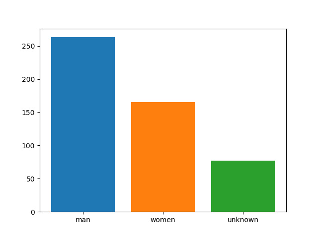

Python itchat<br />itchat是一个开源的微信个人号接口，使用Python调用微信从未如此简单。使用不到三十行的代码，就可以完成一个能够处理所有信息的微信机器人。当然，该api的使用远不止一个机器人，更多的功能值得探索与发现。
<a name="hONF0"></a>
### 1、实现微信消息的获取
```python
import itchat
@itchat.msg_register(itchat.content.TEXT)
def print_content(msg):
    print(msg['Text'])
itchat.auto_login()
itchat.run()
```
<a name="Qv2Xj"></a>
### 2、实现微信消息的发送
```python
import itchat
itchat.auto_login(hotReload=True)
# 注意实验环境的中文输入切换
itchat.send(u'测试消息发送', 'filehelper')
```
> 如果接收到TEXT类型的消息，则执行以下的方法，msg是收到的消息，`return msg.text`是返回收到的消息的内容，实际效果是别人发给你什么，程序自动返回给他什么。

```python
import itchat
from itchat.content import TEXT
@itchat.msg_register
def simple_reply(msg):
  if msg['Type'] == TEXT:
    return 'I received: %s' % msg['Content']
itchat.auto_login()
itchat.run()
```
<a name="Dwl9c"></a>
### 3、使用itchat统计微信好友
```python
import itchat
import matplotlib.pyplot as plt
itchat.auto_login(hotReload=True)   #itchat.auto_login()自动登陆命令
                                    # #hotReload为热加载即是否缓存
# 统计你的好友的男女比例
# friends是一个类似列表的数据类型, 其中第一个是自己的信息， 除了第一个之外是你的好友信息.
friends = itchat.get_friends()
info = {}  # 'male':1, 'female':, 'other':          #存储信息
for friend in friends[1:]:                          #获取好友信息
    #以用此句print查看好友的微信名、备注名、性别、省份、个性签名（1：男 2：女 0：性别不详）
    print(friend['NickName'],friend['RemarkName'],friend['Sex'],friend['Province'],friend['Signature'])
    if friend['Sex'] == 1:                          #判断好友性别，1为男性，2为女性，0为其他。
        info['male'] = info.get('male', 0) + 1
    elif friend['Sex'] == 2:
        info['female'] = info.get('female', 0) + 1
    else:
        info['other'] = info.get('other', 0) + 1
print(info)  #{'male': 263, 'other': 77, 'female': 165}
# 柱状图展示
for i, key in enumerate(info):
    plt.bar(key, info[key])
plt.show()
```

<a name="3GIpM"></a>
### 4、获取微信群聊信息
```python
import itchat
itchat.auto_login(hotReload=True)   #itchat.auto_login()自动登陆命令
                                    # #hotReload为热加载即是否缓存
chatrooms = itchat.get_chatrooms(update=True)
for i in chatrooms:
    print(i['NickName'])
```
<a name="wfGo1"></a>
### 5、下载好友头像图片
```python
import itchat
itchat.auto_login(True)
friend =  itchat.get_friends(update=True)[0:]
for count, f in enumerate(friends):
    # 根据userName获取头像
    img = itchat.get_head_img(userName=f["UserName"])
    imgFile = open("img/" + str(count) + ".jpg", "wb")
    imgFile.write(img)
    imgFile.close()
```


<a name="i6JYE"></a>
### 6、微信好友头像拼接图
```python
x = 0
y = 0
imgs = os.listdir("img")
random.shuffle(imgs) #打乱顺序
# 创建640*640的图片用于填充各小图片
newImg = Image.new('RGBA', (640, 640))
# 以640*640来拼接图片，math.sqrt()开平方根计算每张小图片的宽高，
width = int(math.sqrt(640 * 640 / len(imgs)))
# 每行图片数
numLine = int(640 / width)
for i in imgs:
    img = Image.open("img/" + i)
    # 缩小图片
    img = img.resize((width, width), Image.ANTIALIAS)
    # 拼接图片，一行排满，换行拼接
    newImg.paste(img, (x * width, y * width))
    x += 1
    if x >= numLine:
        x = 0
        y += 1
newImg.save("all.png")
```

<a name="6gSoT"></a>
### 7、自动回复消息
微信和QQ最大的不同就是不知晓是否在线，发送的消息不知道是否及时能看到。如果能及时处理或自动回复消息，则避免了误解。下面这个可以完成回复所有文本信息（包括群聊@自己的消息，可以设置成和QQ离线消息一样的功能）。
```python
import itchat
import requests
def get_tuling_response(_info):
    print(_info)
    #图灵机器人网址
    ## 构造了要发送给服务器的数据
    api_url = "http://www.tuling123.com/openapi/api"
    data = {
        'key' : '824073e601264a22ba160d11988458e0',
        'info' : _info,
        'userid' : 'villa'
    }
    ##其中userId是用户的标志
    ##Key来告诉图灵服务器有权和他对话
    ##info接收的信息
    res = requests.post(api_url,data).json()
    # 字典的get方法在字典没有'text'值的时候会返回None而不会抛出异常
    print(res['text'])
    return res['text']
#时刻监控好友发送的文本消息，并且给予一回复
# isGroupChat=True接收群聊消息中的文本信息， 并让图灵机器人自动回复;
# isMapChat=True接收群聊消息中的文本信息， 并让图灵机器人自动回复;
@itchat.msg_register(itchat.content.TEXT)
def text_reply(msg):
    #获取好友发送消息的内容
    content = msg['Content']
    #将好友的消息发送给机器人处理，处理结果就是返回给好友的消息
    returnContent = get_tuling_response(content)
    return returnContent
# if __name__ == "__main__":
itchat.auto_login(hotReload=True)
itchat.run()
```
<a name="uxbgV"></a>
### 8、绕过网页版微信无法登录的限制
2017年后，新注册的微信基本登录不了网页版，`itchat-uos`版本利用统信UOS的网页版微信，可以绕过网页微信的登录限制。<br />只需要执行下条命令便能复活itchat
```bash
pip install itchat-uos
```
然后再`import itchat`就可以使用了。
<a name="QmYzd"></a>
### 9、防撤回消息的拦截
```python
import itchat
from itchat.content import *
import os
import time
import xml.dom.minidom    # 解析xml模块

# 这是保存撤回消息的文件目录(如：图片、语音等)，这里已经写死了，大家可以自行修改
temp = '/Users/yourname/Documents/itchat' + '/' + '撤回的消息'
if not os.path.exists(temp):
    os.mkdir(temp)

itchat.auto_login(True)    # 自动登录

dict = {}    # 定义一个字典


# 这是一个装饰器，给下面的函数添加新功能
# 能够捕获好友发送的消息，并传递给函数参数msg
@itchat.msg_register([TEXT, PICTURE, FRIENDS, CARD, MAP, SHARING, RECORDING, ATTACHMENT, VIDEO])  # 文本，语音，图片
def resever_info(msg):
    global dict    # 声明全局变量

    info = msg['Text']  # 取出消息内容
    msgId = msg['MsgId']  # 取出消息标识
    info_type = msg['Type']  # 取出消息类型
    name = msg['FileName']  # 取出消息文件名
    # 取出消息发送者标识并从好友列表中检索
    fromUser = itchat.search_friends(userName=msg['FromUserName'])['NickName']
    ticks = msg['CreateTime']  # 获取信息发送的时间
    time_local = time.localtime(ticks)
    dt = time.strftime("%Y-%m-%d %H:%M:%S", time_local)  # 格式化日期
    # 将消息标识和消息内容添加到字典
    # 每一条消息的唯一标识作为键，消息的具体信息作为值，也是一个字典
    dict[msgId] = {"info": info, "info_type": info_type, "name": name, "fromUser": fromUser, "dt": dt}


@itchat.msg_register(NOTE)  # 监听系统提示
def note_info(msg):
    # 监听到好友撤回了一条消息
    if '撤回了一条消息' in msg['Text']:
        # 获取系统消息中的Content结点值
        content = msg['Content']
        # Content值为xml，解析xml
        doc = xml.dom.minidom.parseString(content)
        # 取出msgid标签的值
        result = doc.getElementsByTagName("msgid")
        # 该msgId就是撤回的消息标识，通过它可以在字典中找到撤回的消息信息
        msgId = result[0].childNodes[0].nodeValue
        # 从字典中取出对应消息标识的消息类型
        msg_type = dict[msgId]['info_type']
        if msg_type == 'Recording':    # 撤回的消息为语音
            recording_info = dict[msgId]['info']  # 取出消息标识对应的消息内容
            info_name = dict[msgId]['name'] # 取出消息文件名
            fromUser = dict[msgId]['fromUser'] # 取出发送者
            dt = dict[msgId]['dt'] # 取出发送时间
            recording_info(temp + '/' + info_name) # 保存语音
            # 拼接提示消息
            send_msg = '【发送人:】' + fromUser + '\n' + '发送时间:' + dt + '\n' + '撤回了一条语音'
            itchat.send(send_msg, 'filehelper') # 将提示消息发送给文件助手
            # 发送保存的语音
            itchat.send_file(temp + '/' + info_name, 'filehelper')
            del dict[msgId] # 删除字典中对应的消息
            print("保存语音")
        elif msg_type == 'Text':
            text_info = dict[msgId]['info'] # 取出消息标识对应的消息内容
            fromUser = dict[msgId]['fromUser'] # 取出发送者
            dt = dict[msgId]['dt'] # 取出发送时间
            # 拼接提示消息
            send_msg = '【发送人:】' + fromUser + '\n' + '发送时间:' + dt + '\n' + '撤回内容:' + text_info
            # 将提示消息发送给文件助手
            itchat.send(send_msg, 'filehelper')
            del dict[msgId] # 删除字典中对应的消息
            print("保存文本")
        elif msg_type == 'Picture':
            picture_info = dict[msgId]['info'] # 取出消息标识对应的消息内容
            fromUser = dict[msgId]['fromUser'] # 取出发送者
            dt = dict[msgId]['dt'] # 取出发送时间
            info_name = dict[msgId]['name'] # 取出文件名
            picture_info(temp + '/' + info_name) # 保存图片
            # 拼接提示消息
            send_msg = '【发送人:】' + fromUser + '\n' + '发送时间:' + dt + '\n' + '撤回了一张图片'
            itchat.send(send_msg, 'filehelper') # 将图片发送给文件助手
            # 发送保存的语音
            itchat.send_file(temp + '/' + info_name, 'filehelper')
            del dict[msgId] # 删除字典中对应的消息 
            print("保存图片")


itchat.run()
```
