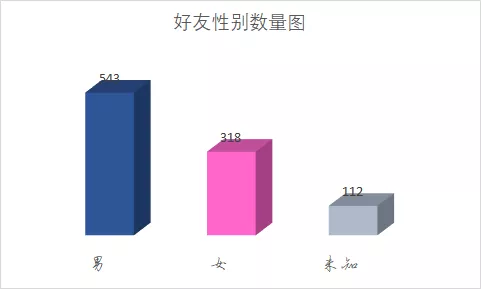
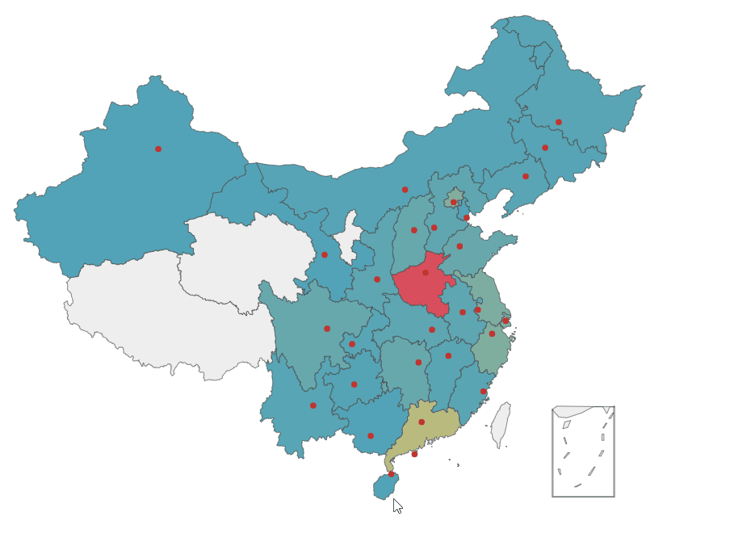
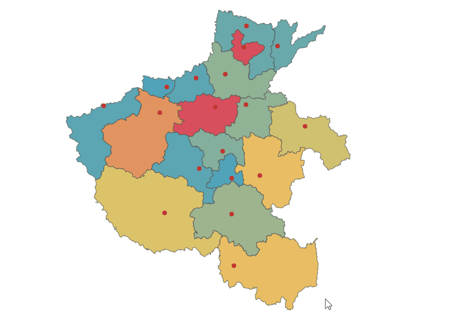

Python itchat
<a name="shnfD"></a>
## 1、数据采集
使用的是Itchat库来获取的微信好友数据。
<a name="BXjum"></a>
## 1、登陆
用Itchat库来获取微信好友数据，首先需要先进行登陆。代码如下：
```python
itchat.auto_login(hotReload=True)
```
其中`hotReload=True`的作用是，在短时间内获取数据不需要重复进行登陆验证。
<a name="LRwJK"></a>
## 2、获取好友数据
Itchat库的`get_friends()`功能可以获取所有好友的数据。但是它获取的数据类型是一种Itchat类型，因为没用正则来提取数据，所以要将数据转化成字符串类型，代码如下：
```python
all_friends = str(itchat.get_friends())
```
此时就可以开始对数据进行提取了，这里提取的是好友个性签名、好友性别、好友所在省份和地市，这四个数据来进行可视化展示。代码如下：
```python
#签名
Signature = re.findall("'Signature': '([\u4e00-\u9fa5].*?)',",all_friends)
c = 0
for i in Signature:
   with open(r'签名.txt','a') as f:
       try:
           f.write(i)
       except:
           pass
#统计性别数量
Sex = re.findall("'Sex': (.*?),",all_friends)
man = woman = other = 0
for i in Sex:
   if i == '1':
       man+=1
   elif i == '2':
       woman+=1
   else:
       other+=1
#省份和城市数据
shengfens = re.findall(r"'Province': '(.*?)',",all_friends)
chengshis = re.findall(r"'City': '(.*?)',",all_friends)
#绘制朋友省份分布地图
shengfen = []
for i in range(len(shengfens)):

   if shengfens[i] == '':
       pass
   else:
       shengfen.append(shengfens[i])
# 绘制河南省内朋友分布图
chengshi = []
for i in range(len(chengshis)):
   if shengfens[i] == '河南':
       chengshi.append(chengshis[i])
```
<a name="tw5X7"></a>
## 2、可视化展示
一共获取了973个好友的数据，下面对这些数据，来进行数据可视化展示。
<a name="ypIok"></a>
### 1、签名词云可视化
通过对所有好友的个性签名进行词云可视化，可以发现，努力、生活、时间、世界、没有这几个词语最多。<br /><br />代码如下：
```python
with open("签名.txt",) as f:
   job_title_1 = f.read()
job_title_2 = re.sub('span','',job_title_1)
job_title_3 = re.sub('class','',job_title_2)
job_title_4 = re.sub('emoji','',job_title_3)
job_title_5 = re.sub('自己','',job_title_4)
job_title_6 = re.sub('回复','',job_title_5)
# job_title_7 = re.sub('位于','',job_title_6)
contents_cut_job_title = jieba.cut(job_title_6)
contents_list_job_title = " ".join(contents_cut_job_title)
wc = WordCloud(stopwords=STOPWORDS.add("一个"), collocations=False,
              background_color="white",
              font_path=r"K:\苏新诗柳楷简.ttf",
              width=400, height=300, random_state=42,
              mask=imread('xin.jpg', pilmode="RGB")
              )
wc.generate(contents_list_job_title)
wc.to_file("推荐语.png")
```
<a name="tmm8y"></a>
### 2、性别数量图
通过对好友性别进行可视化，可以发现男性好友543人，女性好友318人，还有112人没有填写这项信息。<br />
<a name="t9A8Y"></a>
### 3、省份分布图
通过对这973个好友所在省份进行可视化展示发现，可以发现好友最多集中在河南，有263位，其次是广东，有69位。<br /><br />代码如下：
```python
province_distribution = dict(Counter(shengfen).most_common())
provice = list(province_distribution.keys())
values = list(province_distribution.values())
map = Map("中国地图",width=1200, height=600)
map.add("", provice, values, visual_range=[0, 200], maptype='china', is_visualmap=True,
visual_text_color='#000',is_label_show=True)
map.render(path="地图.html")
```
<a name="yed2X"></a>
### 4、河南省内好友分布
通过上面分析发现，河南的好友最多，那么接着对自己河南省内好友的地市分布进行了可视化展示。<br />从展示图中发现，好友最多集中在郑州，有116位，其次是鹤壁，有38位。<br /><br />代码如下：
```python
city = []
values = []
for k,v in dict(Counter(chengshi).most_common()).items():
    city.append(k+'市')
    values.append(v)
map2 = Map("河南地图",'河南', width=1200, height=600)
map2.add('河南', city, values, visual_range=[1, 25], maptype='河南', is_visualmap=True, visual_text_color='#000')
map2.render(path="河南地图.html")
```
