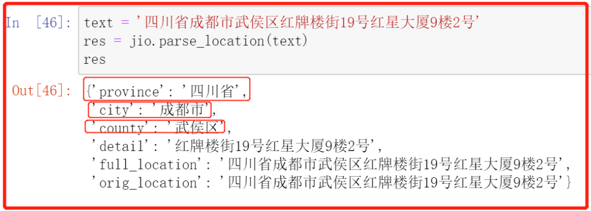
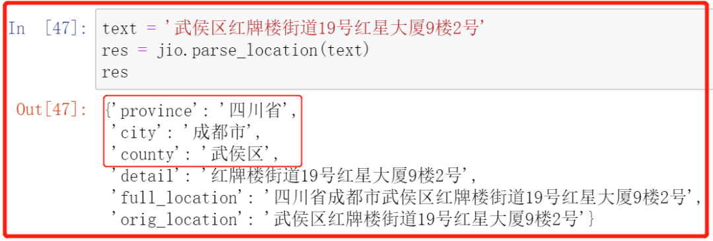
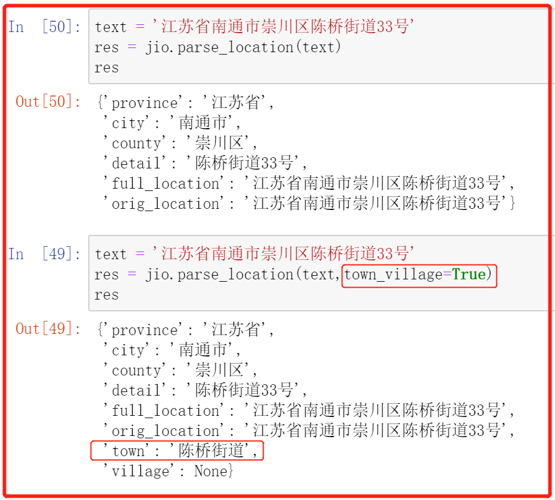
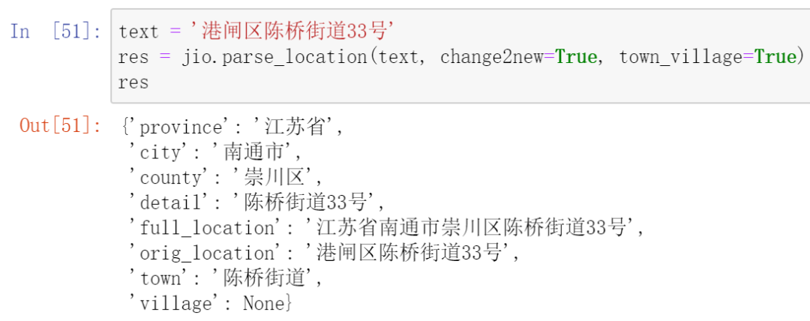

Python
<a name="aLUdA"></a>
## 1、库的安装与简介
在日常数据处理的过程中，假如获取了一个完整的地址信息。如果需要从该地址中解析出省、市、县三级地名，或乡镇、村、社区两级详细地名，应该怎么办呢？<br />首先，需要用到一个第三方库，因此可以提前安装一下。
```python
pip install jionlp -i https://pypi.douban.com/simple/
```
为了实现快速的安装，这里选择使用“豆瓣镜像”进行安装，当然也可以选择其它的国内源下载。
<a name="bsVWv"></a>
## 2、库的使用
安装并导入该库后，就可以进行使用了。
```python
import jionlp as jio
```
<a name="rvBy6"></a>
### Ⅰ基础省市信息的提取
任意给出一个完整的地址，即可提取出其中的省市区信息。
```python
text = '四川省成都市武侯区红牌楼街19号红星大厦9楼2号'
res = jio.parse_location(text)
print(res)
```
最终效果如下：<br />
<a name="m5ulh"></a>
### Ⅱ 自动补全省市信息
假如给定的地址信息不完整，没有省市信息，那么是否可以实现地址的自动补全，并进行正确的提取呢？<br />其实上述方法，本身就可以实现省市信息的 自动补全。
```python
text = '武侯区红牌楼街道19号红星大厦9楼2号'
res = jio.parse_location(text)
res
```
最终效果如下：<br />
<a name="RQIbu"></a>
### Ⅲ 街镇乡、村或居委会信息提取
通过将参数`town_village`设置为True，即可实现这个需求。
```python
text = '江苏省南通市崇川区陈桥街道33号'
res = jio.parse_location(text,town_village=True)
res
```
最终效果如下：<br />
<a name="rq1b1"></a>
### Ⅳ 自动将旧地名映射为新地名
国内行政区划有变动，支持使用`change2new(bool)`自动将旧地名转换为新地名，仅限省、市、县三级的转换。<br />2020年国务院批准，港闸区变为了崇川区。
```python
text = '港闸区陈桥街道33号'
res = jio.parse_location(text, change2new=True, town_village=True)
res
```
最终效果如下：

<br />除此之外，`parse_location()`还具有旧地名修正为新地名、自定义行政区划词典等功能，可以在其官方文档[https://github.com/dongrixinyu/JioNLP/wiki/Gadget](https://github.com/dongrixinyu/JioNLP/wiki/Gadget)-说明文档#地址解析中了解更多。
