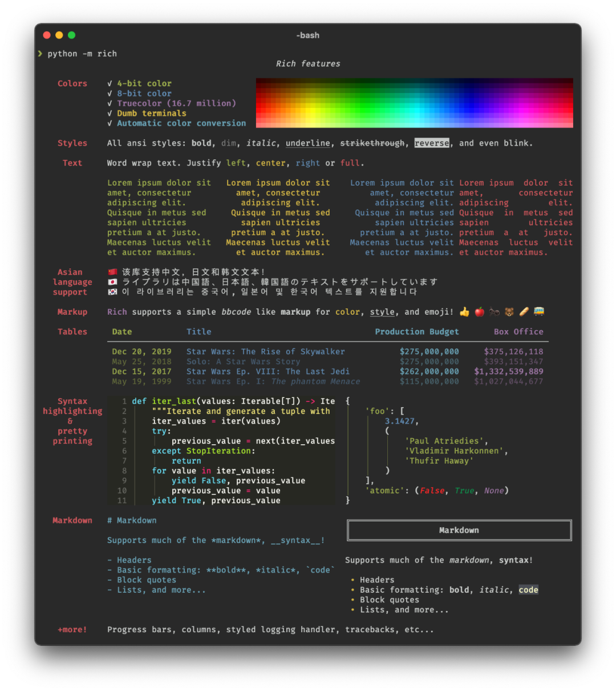
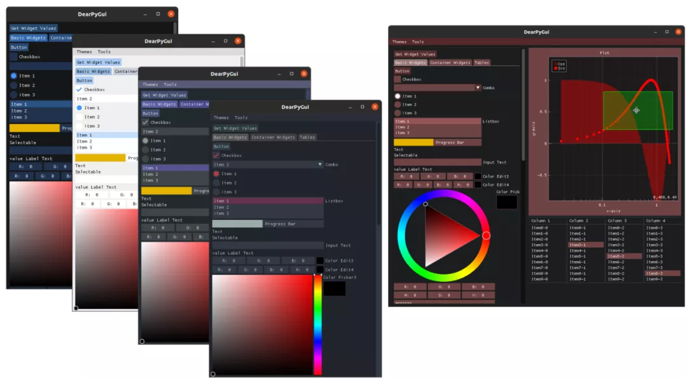
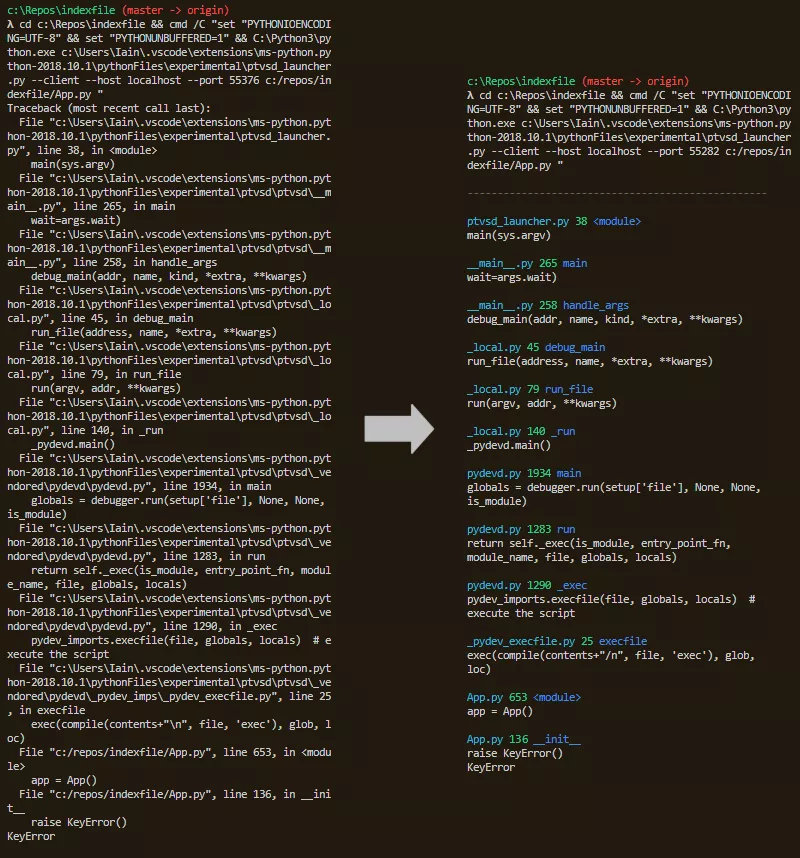
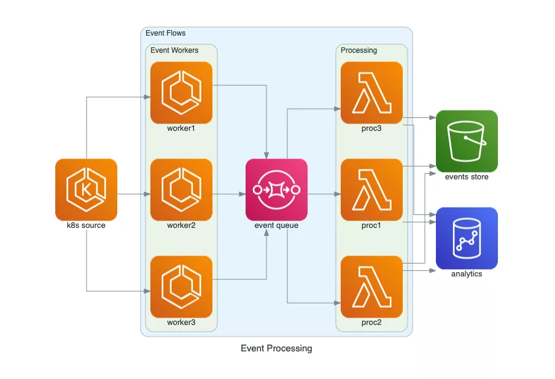
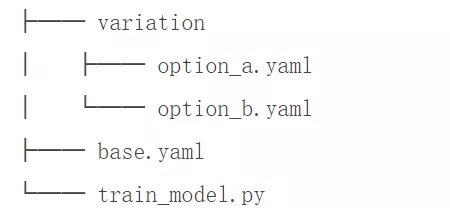
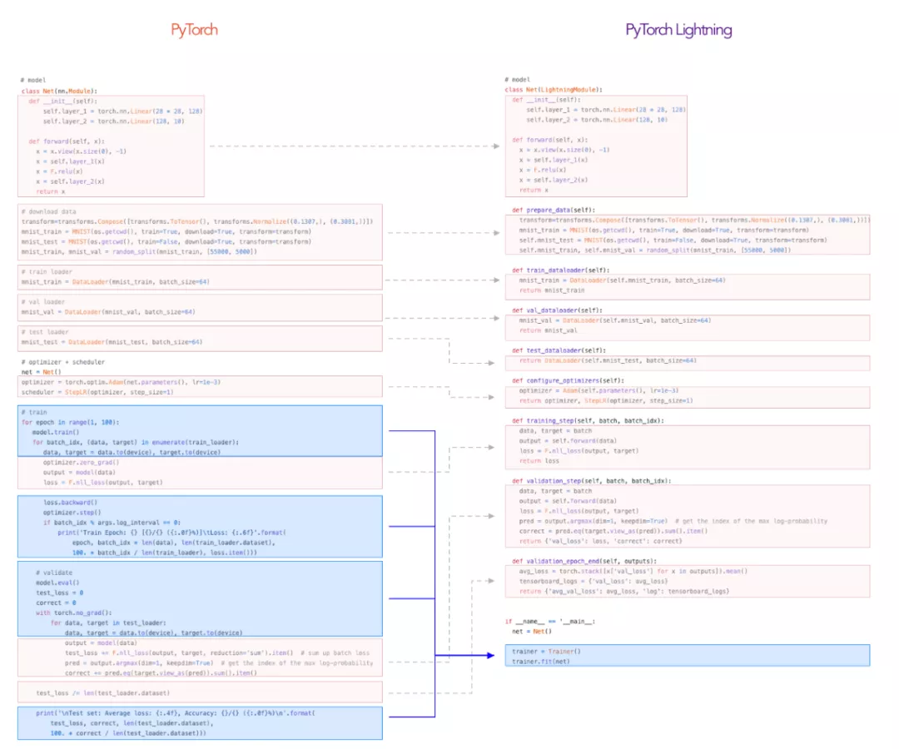
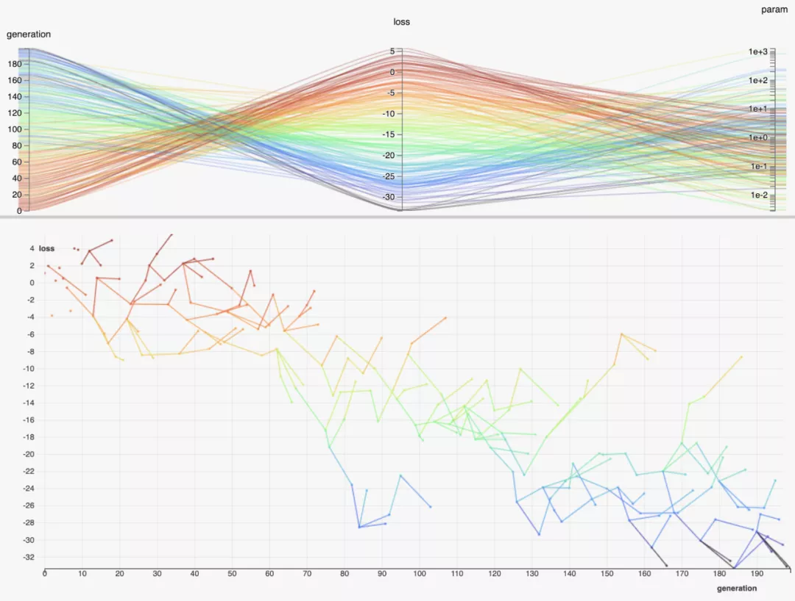
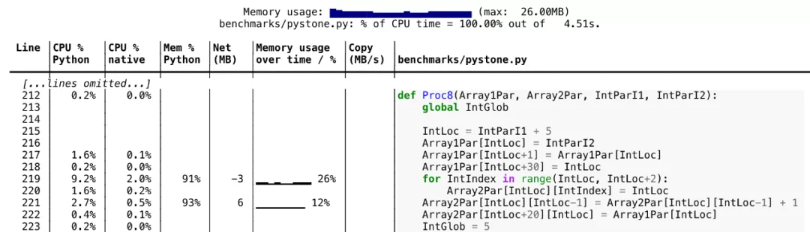

Python
<a name="vvK3K"></a>
## 1、Typer
你可能并不怎么需要写CLI应用程序，但在有些时候还是需要用到，在FastAPI取得巨大成功之后，tiangolo使用同样的原理开发了typo，这是一个新的库，它允许利用Python 3.6+的类型提示特性来编写命令行接口。<br /><br />这样的设计除了可以确保代码得到适当的文档化，还可以更快速的得到一个带有验证的CLI界面。通过使用类型提示，可以在编辑器（如VSCode）代码自动补全，大大提高工作效率。<br />为了增强它的特性，Typer还能配合命令行神器Click使用，这意味着Typer可以充分利用Click的所有优点和插件，并根据自己的需求实现更加复杂的功能。<br />开源地址：[https://github.com/tiangolo/typer](https://github.com/tiangolo/typer)
<a name="SzQHd"></a>
## 2、Rich
谁说终端应用程序就一定是单一的黑白色？其实它也可以是彩色的。<br /><br />想要在终端添加颜色和样式么？想要在终端可以快速打印复杂的表么？想要轻松地显示漂亮的进度条、Emojis么？以上这些功能通通都可以在Rich中实现，看看下面的示例截图就懂了：<br />这个库将终端应用程序的体验提升到了一个全新的水平。<br />开源地址：[https://github.com/willmcgugan/rich](https://github.com/willmcgugan/rich)
<a name="wCJ5K"></a>
## 3、Dear PyGui
尽管Rich可以让终端应用程序变得很漂亮，但有时这还不够，更需要的是一个真正的GUI，Dear PyGui是一个便于使用、功能强大的Python GUI框架。<br /><br />Dear PyGui使用了在电子游戏中很流行的即时模式范式。这基本上意味着动态GUI是逐帧独立绘制的，不需要持久化任何数据。这也是Dear PyGui与其他Python GUI框架不同的地方，Dear PyGui的高性能，是工程、模拟、游戏或数据科学应用程序中经常需要用到的。<br />Dear PyGui支持Windows 10 (DirectX 11), Linux (OpenGL 3) and MacOS (Metal)<br />开源地址：[https://github.com/hoffstadt/DearPyGui](https://github.com/hoffstadt/DearPyGui)
<a name="DTXbU"></a>
## 4、PrettyErrors
<br />PrettyErrors是一个精简Python错误信息的工具，PrettyErrors只做一件事，它支持在终端进行彩色输出，标注出文件栈踪迹。这样一来，就不需要扫描整个屏幕来找到异常的部分。<br />开源地址：[https://github.com/onelivesleft/PrettyErrors](https://github.com/onelivesleft/PrettyErrors)
<a name="vaPwF"></a>
## 5、Diagrams
<br />程序员喜欢解决问题和编写代码，但有时，需要向其他同事解释复杂的架构设计，作为项目文档的一部分。一般情况下，会使用GUI工具处理图表，并将文稿进行可视化处理。但是还有更好的方法。<br />Diagrams可以在没有任何设计工具的情况下直接用Python代码绘制云系统架构，它的图标对包括括AWS、Azure、GCP在内的几家云服务提供商来说都很有用。这使得创建箭头和组变得非常容易，而且只需要几行代码就能实现。<br />开源地址：https://github.com/mingrammer/diagrams
<a name="P4ah6"></a>
## 6、Hydra and OmegaConf
在机器学习项目中做研究和实验时，总是有无数的设置可以尝试，在重要的应用程序中，配置管理可能会变得非常复杂，如果有一种结构化的方法来处理这些难题就好了。<br />Hydra允许以一种可组合的方式构建配置，并从命令行或配置文件中覆盖某些部分。下面举个例子，关于如何使用Hydra定义一个基本配置，然后用它们运行多个不容的任务：
```bash
python train_model.py variation=option_a,option_b
```
<br />开源地址：[https://github.com/facebookresearch/hydra](https://github.com/facebookresearch/hydra)
<a name="xqz58"></a>
## 7、PyTorch Lightning
每一个能够提高数据科学团队生产力的工具都是非常宝贵的。PyTorch Lightning通过将科学与工程分离的方式来提高效率，它有点像TensorFlow的Keras，在某种意义上，它可以使代码更加简洁，不过它依然还是PyTorch，依然可以访问所有常用的api。<br /><br />这个库能够使DL / ML研究的40多个部分实现自动化，例如GPU训练、分布式GPU（集群）训练、TPU训练等等……<br />开源地址：[https://github.com/PyTorchLightning/PyTorch-lightning](https://github.com/PyTorchLightning/PyTorch-lightning)
<a name="HxTh0"></a>
## 8、Hummingbird
<br />Hummingbird是微软的一项研究成果，它能够将已经训练好的ML模型汇编成张量计算，从而不需要设计新的模型。还允许用户使用神经网络框架（例如PyTorch）来加速传统的ML模型。它的推理API跟sklearn范例十分相似，都可以重复使用现有的代码，但是它是用Hummingbird生成的代码去实现的。<br />开源地址：https://github.com/microsoft/hummingbird
<a name="q9IUf"></a>
## 9、HiPlot
<br />几乎每一个数据科学家在他们的职业生涯中都有过处理高维数据的经历。不幸的是，人类的大脑并不能完全凭直觉处理这类数据，所以必须求助于其他技术。<br />今年早些时候，Facebook发布了HiPlot，它是用平行图和其他的图像方式，帮助AI研究者发现高维数据的相关性和模型，是一款轻巧的交互式可视化工具。HiPlot是交互式的，可扩展的，因此可以在Jupyter Notebooks或者它自己的服务器上使用它。<br />开源地址：[https://github.com/facebookresearch/hiplot](https://github.com/facebookresearch/hiplot)
<a name="OGJEe"></a>
## 10、Scalene
<br />随着Python库的生态系统变得越来越复杂，自己编写的代码越来越依赖于C扩展和多线程代码。如何测试性能这就成一个问题，因为CPython内置的分析器不能正确地处理多线程和本机代码。<br />Scalene是一个高性能的CPU内存分析器，它能够正确处理多线程代码，并区分运行Python和本机代码所花费的时间。不需要修改代码，只需要使用scalene从命令行运行脚本，它就可以生成一个文本或HTML报告，显示代码每行的CPU和内存使用情况。<br />开源地址：[https://github.com/emeryberger/scalene](https://github.com/emeryberger/scalene)
