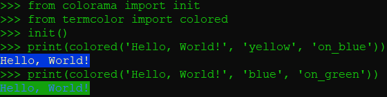
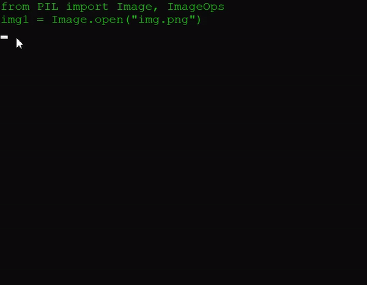
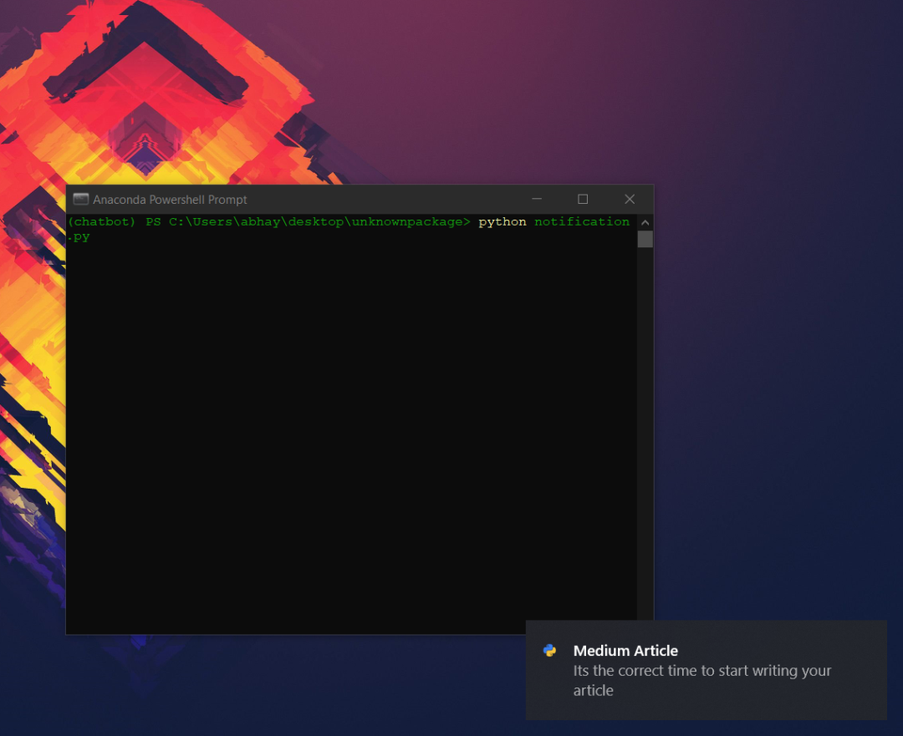
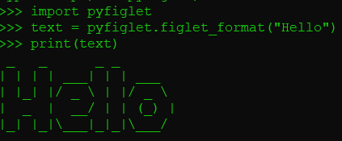

Python
<a name="89O64"></a>
## 1. Colorama
Colorama 是一个用来使终端看起来更好 Python 库，它可以用来给终端添加颜色。<br />安装：`pip install colorama`<br />
<a name="TuB3E"></a>
## 2. Pynput
此库用于控制鼠标和键盘等外部设备的瞬间。使用一些简单的代码行，可以使用库来控制键盘和鼠标。此库的最佳应用程序是使用它创建一个键盘记录程序。下面的代码解释了使用库的键盘记录器的实现。<br />安装：`pip install Pynput`
```python
from pynput.keyboard import Key, Controller,Listener
import time
keyboard = Controller()
keys=[]
def on_press(key):
    global keys
    string = str(key).replace("'","")
    keys.append(string)
    main_string = "".join(keys)
    print(main_string)
    if len(main_string)>15:
      with open('keys.txt', 'a') as f:
          f.write(main_string)   
          keys= []     
def on_release(key):
    if key == Key.esc:
        return False

with Listener(on_press=on_press,on_release=on_release) as listener:
    listener.join()
```
<a name="6FYXN"></a>
## 3. progress 和 tqdm
<a name="qU4M9"></a>
### Progress：创建进度条
安装：`pip install progress`
```python
from progress.bar import Bar
bar = Bar('Loading', max=20)
for i in range(20):
    # Any Task
    bar.next()
bar.finish()
```
下面的动画显示了可以使用进度创建不同的条形图。<br />
<a name="ZBPY5"></a>
### tqdm：创建进度条，但是看起来更有效率，并且与现代编程保持同步
安装：`pip install tqdm`
<a name="czpVW"></a>
## 4. google trans
Googletrans 是一个免费的无限制的 python 库，它是 Google 翻译 API 的一个实现。使用这个库，只需要几行代码就可以创建一个语言翻译器。<br />安装：`pip install googletrans`
```python
from googletrans import Translator , LANGUAGES
from googletrans.models import Translated
language = list(LANGUAGES.values())
translator = Translator()
translated=translator.translate(text="How are You??", src = 'english', dest = 'hindi')
print(translated)
```
还可以进一步创建一个 GUI，将一种语言翻译成另一种语言。
<a name="ekiaA"></a>
## 5. google
谷歌库允许搜索一个查询，找到相关的链接，并返回所有的链接。还可以自定义要返回的链接数量。<br />安装：`pip install google`
```python
from googlesearch import search
query = 'what is machine learning?'
for j in search(query, tld="co.in", num=1, stop=5, pause=2):  ## it will return a total of 5 links
    print(j)
```
<a name="QWE4B"></a>
## 6. Pillow
Pillow 是一个用于图像处理的 python 库。它可以用来创建缩略图，转换文件格式，旋转，应用过滤器，显示图像，等等。如果希望批量执行任务，那么它是一个理想的库。<br />安装：`pip install pillow`<br />为了快速了解这个库，下面是一些代码，可以显示一个图像并将其更改为灰度。
```python
from PIL import Image, ImageOps
img1 = Image.open("img.png") ## Load a imge
img1.show()
img2 = ImageOps.grayscale(img1) ## gray scale
img2.show()
```
<br />原始图像向灰度的转换
<a name="rSnOL"></a>
## 7. wikipedia
Wikipedia 库允许通过 Python 脚本与 Wikipedia 进行交互。通过这个，可以在终端上搜索任何东西。<br />安装：`pip install wikipedia`
```python
import wikipedia
query = 'Narendra Modi'
results = wikipedia.summary(query, sentences=2) ## change the number of sentence to get a larger words summary
print(results)
```
<a name="aUoLR"></a>
## 8. SpeechRecognition
SpeechRecognition 是一个用于识别语音并将其转换为文本的 Python 库。它在几个引擎和 api 的支持下识别语音。它甚至可以在离线模式下工作。<br />安装：`pip install SpeechRecognition`<br />下面的代码可以识别您的声音，将其转换成文本，然后在终端上打印出来。
```python
import speech_recognition as sr
r = sr.Recognizer()
with sr.Microphone() as source:
    t_end = time.time() + 5
    while time.time() < t_end:
        print("karl: Listening...")
        audio=r.listen(source)
    try:    
        query = r.recognize_google(audio)
        print(f"user:{query}")
    except"
        print("Try Again")
```
<a name="MYIXM"></a>
## 9. IPython
这个库提供了在终端、 Qt 控制台和通过 HTML 笔记本使用 IPython shell 的特性。这是木星笔记本的核心。可以在这里找到完整的文档。下面列出了一些 IPython 的特性。

- 全面的对象自省<br />
- 输入历史记录，跨会话持久化<br />
- 在使用自动生成的引用的会话期间缓存输出结果<br />
- 可扩展选项卡完成，默认支持完成 Python 变量和关键字、文件名和函数关键字<br />
- 可扩展的“magic”命令系统，用于控制环境和执行与 IPython 或操作系统相关的许多任务<br />
- 会话日志记录和重载<br />
- 针对特殊情况的可扩展语法处理<br />
- 使用用户可扩展别名系统访问系统 shell<br />
- 很容易嵌入到其他 Python 程序和 GUI 中<br />
- 调试器和 Python 分析器的集成访问<br />
<a name="B3B9H"></a>
## 10. wxpython
wxPython 是一个用于 python 的 GUI 工具包。它是许多计算机软件的强大包装器，可以在各种不同的平台上实现。它是一个跨平台的库。许多开发人员发现 wxPython 作为 Tkinter 的最佳替代品非常有效。
<a name="XIsBp"></a>
## 11. Poetry
这是一个简单易用的 Python 软件包。它允许管理 Python 打包和项目的版本控制。虽然项目依赖于许多库，但是 Poetry 可以很容易地控制它们。<br />安装：`pip install poetry`<br />
<a name="x5PGE"></a>
## 12. Pygame
Pygame 是许多 python 开发人员的最爱。它用于使用 Python 创建游戏。它是一个跨平台的库，几乎可以在每个平台上使用。尽管它是一个成熟的游戏引擎，也可以使用这个库直接从 Python 脚本播放 MP3文件。它由计算机图形学和声音库组成。<br />在 PyGame 上编写的游戏和应用程序与所有 SDL 支持的操作系统兼容。它们也可以在机器人和平板电脑上运行。<br />安装：`pip install pygame`<br />PyGame 有自己的网站 PyGame. org，其中包括教程和安装说明。
<a name="cpUWt"></a>
## 13. Text Blob
TextBlob 是一个用于处理文本数据的 Python 库。它提供了一个简单的 API，用于深入研究常见的自然语言处理(NLP)任务，如词性标注、名词短语提取、情感分析、分类、翻译等。<br />安装：`pip install textblob`
```python
from textblob import TextBlob
testimonial = TextBlob("Textblob is amazingly simple to use. What great fun!")
testimonial.sentiment
```
<a name="xVKeR"></a>
## 14. OpenCV
<br />OpenCV 是计算机视觉领域最受欢迎的库。它最初是用 C 和 C++ 编写的。现在也可以在 Python 中使用。它最初是由英特尔开发的。该库是一个跨平台的开源库。免费使用。OpenCV 是一个高度优化的库，主要关注实时应用程序。<br />安装：`pip install opencv-python`
<a name="um9dV"></a>
## 15. win10 toast
它是一个易于使用的 Python 库，用于显示 Windows 10 Toast Notifications，这对于 Windows GUI 开发非常有用。<br />安装：`pip install win10toast`<br />应用：创建提醒应用程序
```python
from win10toast import ToastNotifier 
toaster = ToastNotifier()
header = 'Medium Article'
text = 'Its the correct time to start writing your article'
toaster.show_toast(f"{header}",f"{text}",duration=10,threaded=True)
while toaster.notification_active(): time.sleep(0.005)   
```

<a name="DgLWy"></a>
## 16. playsound
这个库用于在 Python 中播放音频文件。<br />安装：`pip install playsound`<br />应用: 使用 Python 创建音乐播放器
```python
from playsound import playsound 
playsound('PATH_TO_AUDIO_FILE')
```
<a name="dexnj"></a>
## 17. webbrowser
这个 Python 包用于与网络浏览器交互。它用于在用户从命令行给出的浏览器中打开不同的链接。<br />安装：`pip install webbrowser`<br />应用：自动化日常工作应用
```python
import webbrowser
webbrowser.open("https://stackoverflow.com")
```
<a name="OfifK"></a>
## 18. Python-dateutil
这个 Python 库是 Python datetime 模块的扩展，它提供了大量的特性和功能。<br />安装：`pip install python-dateutil`
```python
from dateutil.relativedelta import *
from dateutil.easter import *
from dateutil.rrule import *
from dateutil.parser import *
from datetime import *
now = parse("Tue 11 17:13:46 Dec UTC 2020")
today = now.date()
year = rrule(YEARLY,dtstart=now,bymonth=8,bymonthday=13,byweekday=FR)[0].year
rdelta = relativedelta(easter(year), today)
print("Today is: %s" % today)
```
<a name="OFQiF"></a>
## 19. Setuptools
这个 Python 库是 Python 中所有库的父类，它用于在 Python 中创建库。<br />安装：`pip install setuptools`
<a name="VulZL"></a>
## 20. pyfiglet
Pyfiglet Python 库用于在终端中生成字符画。这是在创建 CLI 应用程序时最常用使用的软件包之一。<br />安装：`pip install pyfiglet`<br />
<a name="bamboolib"></a>
## 21. bamboolib
bamboolib是使得DataFrames数据分析变得更加容易的一款Python库。做数据相关工作的同学，对pandas肯定不会陌生。它很强大，甚至对于很多Python开发者具备着不可替代的位置，但是对于初学者却有时候让人难以理解。<br />bamboolib使得pandas DataFrames数据分析变得更加简单容易，在以往需要上百行完成的工作，在bamboolib中只需要简短的一行即可。<br />通过bamboolib的使用，它可以提升工作效率，减少在无价值的事情上浪费过多精力。<br />
<a name="a8tUD"></a>
### 安装
下面分别是本地、jupyter notebook、jupyterLab中安装的方法
```bash
pip install bamboolib
# Jupyter Notebook extensions
python -m bamboolib install_nbextensions
# JupyterLab extensions
python -m bamboolib install_labextensions
```
<a name="BkWpd"></a>
## 22. faker
faker是一款用于生成伪造数据的Python小工具。造数据，在开发过程中至关重要，尤其是在企业项目中，很多数据会涉及到敏感信息，很难获取到客户数据。这时候，如果要进行功能的开发和测试，就需要自己想办法造数据。<br />造数据是一件非常令人头疼的事情，如果随便生成一条数据会比较容易。那如果生成10000条数据呢？这就是一个即耗脑力，又耗体力的活。<br />faker就可以一行代码实现数据的生成。它可以根据不同的参数生成不同语言、不同类型的数据。
<a name="e655a410"></a>
### 安装
可以直接使用pip命令进行安装
```bash
pip install Faker
```
<a name="xQl5V"></a>
### 生成数据
```python
from faker import Faker
fake = Faker(['it_IT', 'en_US', 'ja_JP'])
for _ in range(10):
    print(fake.name())
# 鈴木 陽一
# Leslie Moreno
# Emma Williams
# 渡辺 裕美子
# Marcantonio Galuppi
# Martha Davis
# Kristen Turner
# 中津川 春香
# Ashley Castillo
# 山田 桃子
```
<a name="dabl"></a>
## 23. dabl
dabl是一款数据分析基准库。这个项目试图使监督机器学习对于初学者变的更容易，并减少见任务的复杂度。例如，利用dabl进行分类的一个示例
```python
import dabl
from sklearn.model_selection import train_test_split
from sklearn.datasets import load_digits
X, y = load_digits(return_X_y=True)
X_train, X_test, y_train, y_test = train_test_split(X, y, random_state=1)
sc = dabl.SimpleClassifier().fit(X_train, y_train)
Running ...
print("Accuracy score", sc.score(X_test, y_test))
Accuracy score 0.9...
```
就这样简单的几行代码，几秒钟的时间内既可以获得分类结果。<br />其实，dabl的最大优点并不在于机器学习，而是在于为数据探索提供了简单的接口。
<a name="kMccO"></a>
## 24. ProxyPool
ProxyPool是一款高效的代理池工具。在很多工作场景下会用到代理，例如，一个比较典型的场景：爬虫。通过这些代理，可以解决针对不同网站的请求问题，但是，有些代理是收费的，有些是免费的，当需要到用到免费代理时却无从下手。<br />ProxyPool提供了免费高效的代理池，它具有如下特点：

- 定时抓取免费代理网站，简易可扩展。
- 使用 Redis 对代理进行存储并对代理可用性进行排序。
- 定时测试和筛选，剔除不可用代理，留下可用代理。
- 提供代理 API，随机取用测试通过的可用代理。
<a name="8hRgv"></a>
### 安装依赖包
使用ProxyPool之前首先需要安装依赖包
```bash
pip3 install -r requirements.txt
```
<a name="QUQg2"></a>
### 运行代理池
ProxyPool提供Tester、Getter、Server三种方法，可以单独运行，也可以全部运行。全部运行，命令如下
```bash
python3 run.py
```
单独运行，命令如下
```bash
python3 run.py --processor getter
python3 run.py --processor tester
python3 run.py --processor server
```
<a name="helium"></a>
## 25. helium
helium是一款基于 Selenium实现的网页自动化工具，它能够实现日常各种网页的使用。<br />先看一个示例，应该就明白它到底是干什么用的。
```python
from helium import *
start_chrome('google.com')
write('helium selenium github')
press(ENTER)
click('mherrmann/helium')
go_to('github.com/login')
write('username', into='Username')
write('password', into='Password')
click('Sign in')
kill_browser()
```
看一下具体的演示，<br /><br />启动浏览器、与浏览器交互、查找相关元素、等待元素出现...，其中，较为常用的就是启动浏览器和浏览器交互。<br />helium能够输入内容、敲击键盘、点击按钮、跳转、关闭等各种日常访问网页时常用的操作。假如日常的工作就是在网站填写表格或者处理订单等重复性的工作，那么就可以写一个脚本，然后循环同样一个动作，自己就不用动手操作了。<br />还可以发散一下思维，例如:

- 批量下载音乐
- 批量下载电影、电视剧
- 下载图片
- 快速填单
- 便捷访问日常网址
