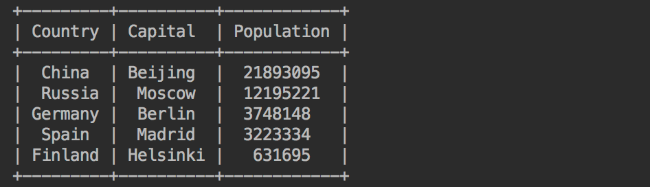

Python
<a name="yqeil"></a>
## ① 使用Bashplotlib在命令行中绘图
如果想在命令行窗口中绘制数据的情况，那么Bashplotlib是非常适合的。 <br />首先安装Bashplotlib这个库。
```bash
pip install bashplotlib -i https://mirror.baidu.com/pypi/simple/
```
下面可以使用Bashplotlib来绘制一组正态分布的数据图表。<br />使用NumPy来生成一个正态分布数字列表。<br />如果还没有NumPy，同样可以使用pip安装。
```bash
pip install numpy -i https://mirror.baidu.com/pypi/simple/
```
使用Bashplotlib的直方图绘图函数`plot_hist`。
```python
import numpy as np
from bashplotlib.histogram import plot_hist

rand_nums = np.random.normal(size=1000, loc=0, scale=1)
plot_hist(rand_nums, bincount=100)
```
结果如下。<br /><br />确实是可以在终端可视化数据。<br />通过查看源代码，得知相关参数设置。<br />
<a name="RNeCU"></a>
## ② 使用TQDM添加进度条
有时运行一个耗时较长的程序，不能看到程序的运行进度，给人的体验不是很好。<br />这里可以使用TQDM，直接在命令行中可视化程序的运行进度。<br />使用pip命令安装TQDM。
```python
pip install tqdm -i https://mirror.baidu.com/pypi/simple/
```
下面来一个示例吧～<br />遍历数字0至1000，并添加一个小的延迟，得以查看TQDM进度条的工作情况。
```python
from tqdm import trange
from time import sleep

for i in trange(1000):
    sleep(0.01)
```
结果如下。<br /><br />给人提供了一个预期，不会变的那么遥遥无期。
<a name="iQVVL"></a>
## ③ 使用PrettyTable打印漂亮的表格
在终端输出表格数据的时候，排版总是乱乱的。<br />使用PrettyTable，便能在终端输出易读的、类似于表格格式的数据展现。<br />安装。
```bash
pip install prettytable -i https://mirror.baidu.com/pypi/simple/
```
创建一个国家城市的人口表格。
```python
from prettytable import PrettyTable

table = PrettyTable()

table.field_names = ['Country', 'Capital', 'Population']
table.add_row(["China", "Beijing", 21893095])
table.add_row(["Russia", "Moscow", 12195221])
table.add_row(["Germany", "Berlin", 3748148])
table.add_row(["Spain", "Madrid", 3223334])
table.add_row(["Finland", "Helsinki", 631695])

print(table)
```
结果如下，确实变得清晰明了～<br /><br />可惜的是，并不能很好的支持中文。<br />同时，还可对表格内容进行排序等操作。
```python
table.sortby = 'Capital'
print(table)
```
以首都数据排序为例。<br /><br />可以看到，柏林排在了前头。<br />还可生成HTML代码，将表格内容插入到网站中。
```python
print(table.get_html_string())
```
结果如下。<br /><br />新建一个HTML文件，将表格放到body标签下。<br /><br />在浏览器打开这个文件，结果如下。<br />
<a name="q0Bfm"></a>
## ④ 使用Colorama为命令行着色
使用Colorama为程序输出，在命令行中有不一样的颜色显示，更快了解程序的运行情况。<br />使用pip安装。
```bash
pip install colorama -i https://mirror.baidu.com/pypi/simple/
```
支持三种不同的颜色类型。<br />foreground，是文本颜色<br />background，是背景颜色<br />style，是一些额外的颜色样式<br /><br />通过适当地配置，可以给Python命令行应用程序带来方便。<br />接下来看一些例子。 <br />首先将文本更改为绿色，以便以绿色字体显示“任务已完成”。<br />这可以通过在Fore渲染模式中将前景色更改为绿色来完成：
```python
from colorama import Fore

print(Fore.GREEN)
print("Task completed")
```
结果如下<br /><br />然后，让红色背景色的高亮表示错误，通过设置背景渲染模式Back到RED：
```python
from colorama import Back
print(Back.RED)
print("Error occurred!")
```
结果<br /><br />还可以通过更改渲染样式来使文本变暗：
```python
from colorama import Style
print(Style.DIM)
print("Not that important")
```
结果如下<br /><br />最后，如果想复原之前的设置，重置操作如下。
```python
print(Style.RESET_ALL)
print('hello')
```
