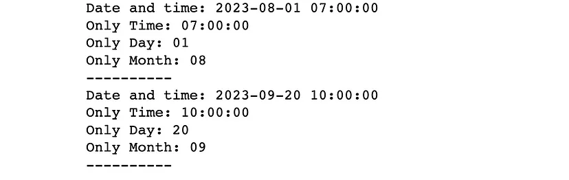
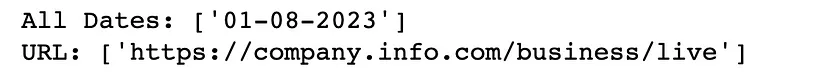
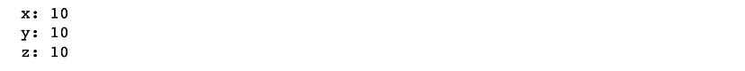
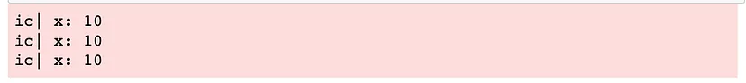
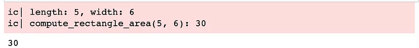
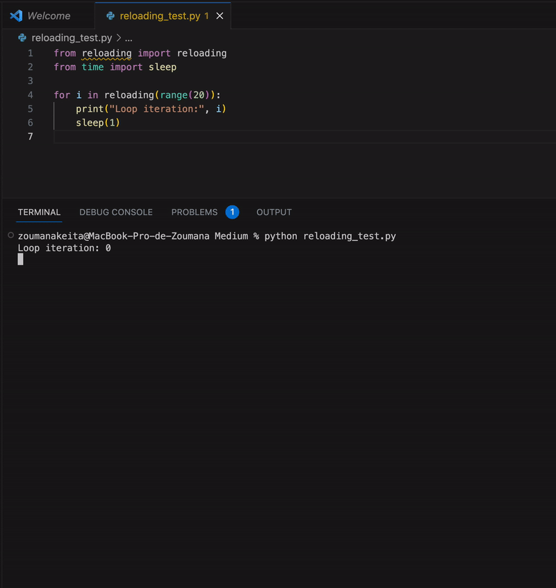
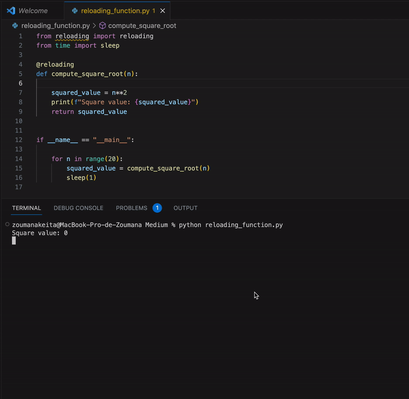

<a name="UOV5v"></a>
## 1、自动提取日期和时间
在处理非结构化文本数据时，提取日期和时间可能是具有挑战性的。这个问题可以通过使用datefinder库来解决。<br />顾名思义，datefinder可用于从文本信息中查找和提取以不同格式书写的时间和日期。<br />要安装该库，请运行以下命令：
```bash
$ pip install datefinder
```
示例任务：
```python
from datefinder import find_dates

text_data = """
I will meet the business team on August 1st, 2023 at 07 AM. The goal is 
to discuss the budget planning for September, 20th 2023 at 10 AM
"""

all_dates = find_dates(text_data)

for match in all_dates:
    print(f"Date and time: {match}")
    print(f"Only Time: {match.strftime('%H:%M:%S')}")
    print(f"Only Day: {match.strftime('%d')}")
    print(f"Only Month: {match.strftime('%m')}")
    print("--"*5)
```
`find_dates`函数返回一个包含所有日期和时间的列表，格式为：YYYY-MM-DD HH:MM:SS，其中：

- YYYY代表年份
- MM代表月份
- DD代表日期
- HH代表小时
- MM代表分钟
- SS对应两位数的秒

以下是上述示例的输出：<br />
<a name="E8rJZ"></a>
## 2、使正则表达式更易读
人们可以很容易地记住正则表达式（regex）中的元字符。然而，最困难的部分仍然是构建能够匹配给定文本中复杂模式的表达式。<br />如果能找到一种构建更易读的表达式的方法，那该多好呢？<br />这就是PRegEx库派上用场的地方！<br />安装方法如下：
```bash
$ pip install pregex
```
示例任务：<br />考虑以下文本数据，希望提取日期和URL信息。
```python
text_data = """
I will meet the business team on the 01-08-2023 at 07 AM. 
The meeting will be live on the company website at https://company.info.com/business/live
"""
```
这可以通过以下方式使用PRegEx解决：<br />首先导入下面描述的相关模块：

- `AnyButWhitespace` 匹配任何字符但不包括空格。
- `AnyDigit` 匹配0到9之间的任何数字。
- `OneOrMore` 匹配一个字符至少一次。
- `Either` 匹配给定模式中的一个。
- `Exactly` 匹配精确重复n次的字符数。

在URL模式中，故意添加了额外的信息，如.net、.fr和.org，以使模式更加通用。
```python
from pregex.core.classes import AnyButWhitespace, AnyDigit
from pregex.core.quantifiers import OneOrMore, Exactly
from pregex.core.operators import Either 

two_digits = Exactly(AnyDigit(), 2) 
four_digits = Exactly(AnyDigit(), 4)

# Define the two patterns

date_patter = (
    two_digits +
    "-" +
    two_digits +
    "-" +
    four_digits
)

# Added 
url_pattern = (
          "https://"
          + OneOrMore(AnyButWhitespace())
          + Either(".com", ".fr", ".net", ".org")
          + OneOrMore(AnyButWhitespace())
)

# Get the matches
dates_match = date_patter.get_matches(text_data)
url_match = url_pattern.get_matches(text_data)

# Print the result
print(f"All Dates: {dates_match}")
print(f"URL: {url_match}")
```
<br />如果必须使用re包，整体模式将如下所示：
```python
dates_pattern = r'\b\d{2}-\d{2}-\d{4}\b'

# Regular expression pattern for URL
url_pattern = r'http[s]?://(?:[a-zA-Z]|[0-9]|[$-_@.&+]|[!*\\(\\),]|(?:%[0-9a-fA-F][0-9a-fA-F]))+'
```
正如看到的，使用re模块一点也不友好，特别是对初学者来说！
<a name="d0iJY"></a>
## 3、使用 IceCream 轻松代码调试
使用print或log语句来调试Python代码。下面是一个例子。
```python
print(f"x: {x}")
print(f"y: {x}")
print(f"z: {x}")
```
这是一个相当好的输出，对吧？<br />使用print或log的缺点是，在处理较大的程序时可能会很耗时，特别是当需要添加文本以提高可读性时。<br />通过使用IceCream 🍦。这是一个使调试过程更简单、更可读的Python库。<br />要安装IceCream库，请运行以下命令：
```bash
$ pip install icecream
```
让试试通过显示x、y和z的值来使用IceCream。
```python
from icecream import ic

x = 10
y = 20 
z = 30 

ic(x)
ic(x)
ic(x)
```
<br />通过最小的代码，成功地获得了更易读的输出。<br />这里是另一个例子，使用一个计算矩形面积的函数。
```python
def compute_rectangle_area(length, width):

    ic(length, width)
    area = length * width
    return area

ic(compute_rectangle_area(5, 6))
```
<br />通过提供函数名、参数以及结果等详细信息，IceCream提供了更易读的结果！这不是很棒吗？
<a name="JUMFP"></a>
## 4、重新加载运行中的代码而不丢失当前状态
想象一下，已经运行了一个任务的执行，并且忘记打印或记录一些重要的变量。<br />在这种情况下，最终的解决方案将是停止执行，更新代码，然后重新运行。<br />这有时可能令人沮丧，特别是在训练机器学习模型时，在最后一个epoch时意识到并没有记录所有的指标 🤯。<br />不用再担心了，重新加载来帮助您！<br />顾名思义，重新加载是一个可以重新加载已经运行的代码而不中断其执行的Python工具。这绝对是一个改变游戏规则的工具！<br />通过运行以下命令来安装：
```bash
$ pip install reloading
```
想象一下，已经执行了以下的循环，想要同时打印i的值和它的平方根。<br />与其停止程序，可以简单地添加缺失的代码片段，如下面的动画所示：<br />在这种情况下，唯一需要做的事情是在迭代器周围包装重新加载函数。<br />在进行更改后，平方根的值会在第6次迭代时自动添加。然后，在恢复到初始状态后，从第16次迭代开始，打印语句也得到了调整。<br /><br />相同的逻辑也可以应用于一个函数，只需使用`@reloading`装饰器即可。<br />现在，考虑以下的`compute_square_root`函数，它实现了上述for循环的逻辑。<br />该函数开始时会打印n的平方根。在运行代码后，信息"n的值为：{n}"被添加到打印语句中以打印n的值。<br />
