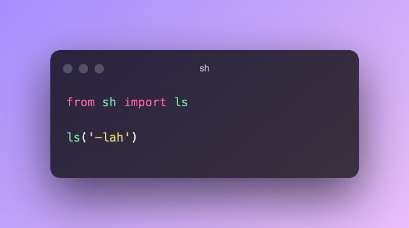
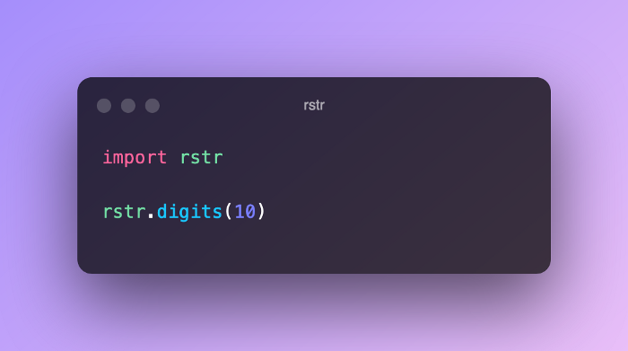
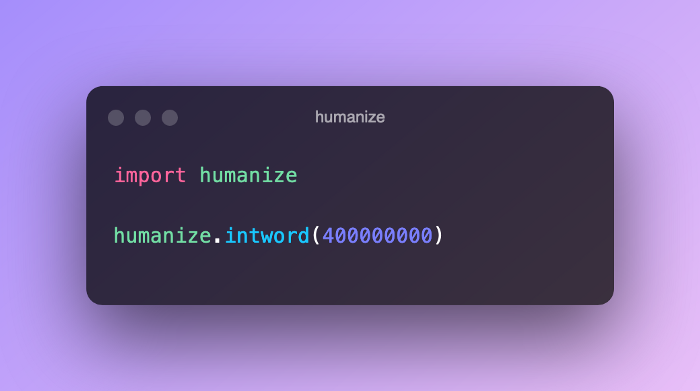
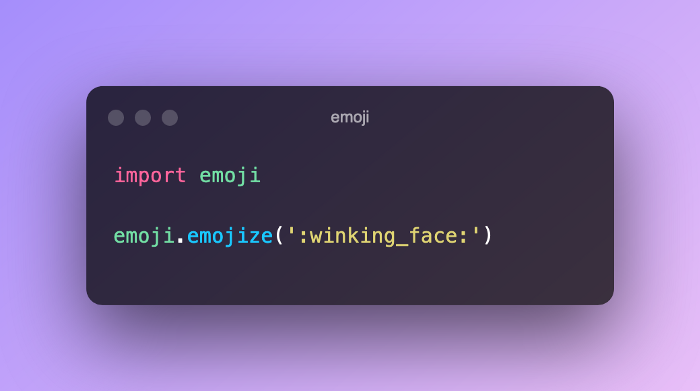

<a name="ZXceI"></a>
## **sh**
[https://github.com/amoffat/sh](https://github.com/amoffat/sh)<br />如果曾经在 Python 中使用过 subprocess 库，那么很有可能对它感到失望，它不是最直观的库，可能还有些复杂，并且很难处理底层系统调用的输出。<br />但是 sh 库结束了低效使用子进程的痛苦，使用 sh 库，几乎可以进行任何想要的系统调用，就好像它是一个普通函数一样，这使得执行这些调用变得更加简单和直观。可以像使用普通 Python 函数一样使用它们。<br />下面是使用 ls 从 sh 获取目录内容的示例：<br /><br />要做的就是像导入普通函数一样导入系统调用，最好的部分是所有函数都是动态生成的，因此应该可以访问底层系统中已经存在的大多数二进制文件。<br />下次当需要进行一些系统调用时，可以尝试使用 sh。
<a name="Ccauz"></a>
## **rstr**
[https://github.com/leapfrogonline/rstr](https://github.com/leapfrogonline/rstr)<br />如果需要一些易于访问的随机数据的次数是无法计算的，无论是为代码构建测试、填充缓冲区还是用随机数据模糊代码以查看它在哪里中断，rstr 库都能满足需求。<br />这个方便的小库可生成不同类型的随机字符串数据，它可以生成字母数字数据、特殊符号，甚至使用正则表达式构建复杂的数据模式。<br />例如，假设想要一串一定长度的数字。可以使用下面的 rstr 片段来完成此操作：<br /><br />这将打印出随机选择的 10 位数字，便利！
<a name="JlcxZ"></a>
## **IPython**
[https://ipython.org/](https://ipython.org/)<br />IPython 不是一般的模块，这是一个令人难以置信的交互式 shell 模块，可增强 Python REPL。IPython 为交互式 Python shell 带来了一套很棒的功能，例如自动完成、彩色输出和运行细节。<br /><br />使用 IPython，引入类和检查函数变得容易得多。命令历史更易于导航，并且还可以获得类似于 Zsh 的强大的选项卡完成和自动完成功能。
<a name="UShdR"></a>
## **Humanize**
[https://github.com/jmoiron/humanize](https://github.com/jmoiron/humanize)<br />这个库实在令人兴奋，它将采用日期、时间和数字等数字，并将它们“人性化”成人类可读的短语，如“三点钟”或“100 亿”，更加优秀的是它会自动执行此操作！<br />例如，假设正在处理一堆非常大的数字（想想数百万和数十亿），并且希望以更友好的方式向用户展示它们。这个库可以做到这一点，甚至不费吹灰之力：<br /><br />Ouptu：
```
400.0 million
```
人性化模块也非常适合计算股市收益（或损失……）并以易于阅读的方式呈现。
<a name="ftmvS"></a>
## **Emoji**
[https://github.com/carpedm20/emoji/](https://github.com/carpedm20/emoji/)<br />最后介绍一个有趣的库，这个库是将表情符号添加到文本中。没有人愿意将表情符号直接复制并粘贴到他们的代码中，或者在混乱的字符代码中摸索。<br />以下是如何在代码中添加眨眼表情符号的示例：<br /><br />这将打印出实际的😉表情符号，现在当用户在控制台中出错时，就可以向他们眨眼了。
