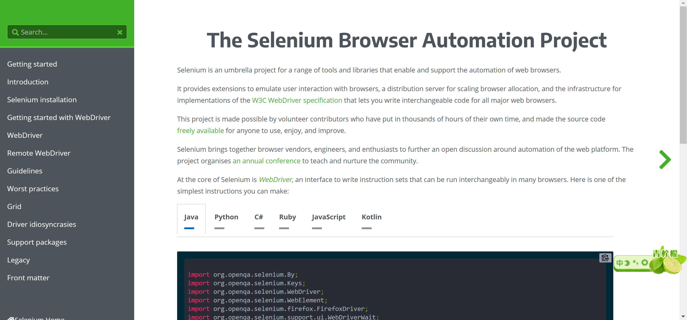
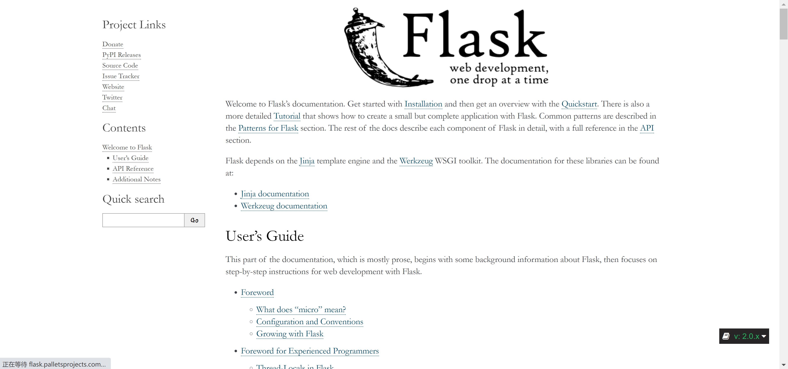
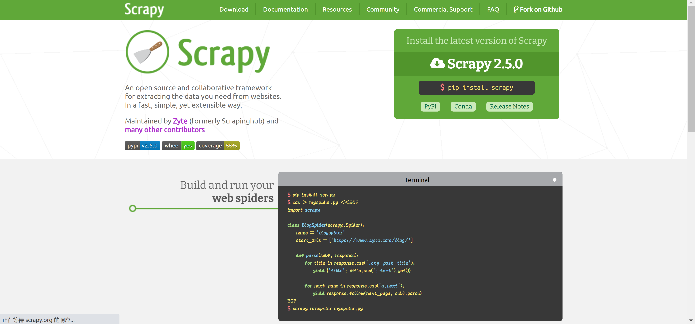
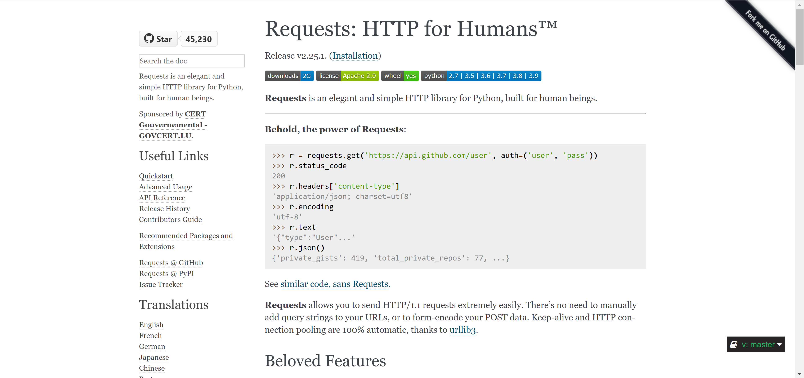
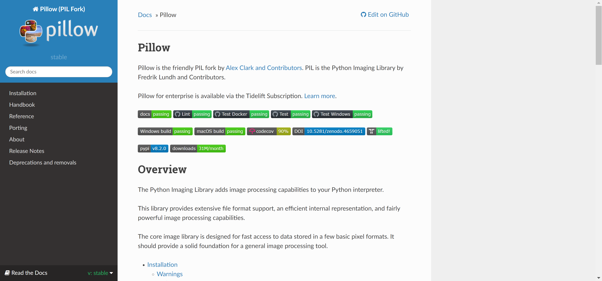

Python<br />为了提高效率，在平时工作中常会用到一些Python的效率工具，Python作为比较老的编程语言，它可以实现日常工作的各种自动化。为了更便利的开发项目，这里推荐几个Python的效率工具。
<a name="l06ji"></a>
### 1、Pandas-用于数据分析
Pandas是一个强大的分析结构化数据的工具集；它的使用基础是Numpy(提供高性能的矩阵运算)；用于数据挖掘和数据分析，同时也提供数据清洗功能。
```bash
# 1、安装包 
$ pip install pandas 
# 2、进入python的交互式界面 
$ python -i 
# 3、使用Pandas>>> import pandas as pd>>> df = pd.DataFrame() >>> print(df) 
# 4、输出结果 
Empty DataFrame 
Columns: [] 
Index: [] 
```
<a name="rOHjH"></a>
### 2、Selenium-自动化测试
[https://www.selenium.dev/documentation/en/](https://www.selenium.dev/documentation/en/)<br />Selenium是一个用于Web应用程序测试的工具，可以从终端用户的角度来测试应用程序。通过在不同浏览器中运行测试，更容易发现浏览器的不兼容性。并且它适用许多浏览器。<br /><br />可以通过打开浏览器并访问Google的主页做一个简单的测试：
```python
from selenium import webdriver 
   import time 

   browser = webdriver.Chrome(executable_path ="C:\Program Files (x86)\Google\Chrome\chromedriver.exe") 

   website_URL ="https://www.google.co.in/" 
   brower.get(website_URL) 

   refreshrate = int(3) #每3秒刷新一次Google主页。   
   # 它会一直运行，直到你停掉编译器。 
   while True: 
       time.sleep(refreshrate) 
       browser.refresh() 

```
<a name="Kirpb"></a>
### 3、Flask——微型Web框架
[https://flask.palletsprojects.com/en/2.0.x/](https://flask.palletsprojects.com/en/2.0.x/)<br />Flask是一个轻量级的可定制框架，使用Python语言编写，较其他同类型框架更为灵活、轻便、安全且容易上手。Flask是目前十分流行的web框架。开发者可以使用Python语言快速实现一个网站或Web服务。<br />
```python
from flask import Flask 
app = Flask(__name__) 

@app.route('/') 
def hello_world(): 
    return 'Hello, World!' 
```
<a name="ReUoL"></a>
### 4、Scrapy——页面爬取
[https://scrapy.org/](https://scrapy.org/)<br />Scrapy能够提供强大支持，能够精确地从网站中爬取信息。是非常实用。<br /><br />现在基本上大部分开发者都会利用爬虫工具来实现爬取工作的自动化。所以编写爬虫编码时就可以用到这个Scrapy。<br />启动Scrapy Shell也是十分的简单：<br />scrapy shell 


可以试着提取百度主页上搜索按钮的值，首先要找到按钮使用的类，一个inspect element显示该类为“ bt1”。<br />具体执行以下操作：
```python
response = fetch("https://baidu.com") 
    response.css(".bt1::text").extract_first() 
    ==> "Search" 
```
<a name="gH15Y"></a>
### 5、 Requests——做API调用
[https://docs.python-requests.org/en/master/](https://docs.python-requests.org/en/master/)<br />Requests是一个功能强大的HTTP库。有了它可以轻松地发送请求。无需手动向网址添加查询字符串。除此之外还有许多功能，比如authorization处理、JSON / XML解析、session处理等。<br /><br />官方例子：
```python
>>> r = requests.get('https://api.github.com/user', auth=('user', 'pass')) 
>>> r.status_code 
200 
>>> r.headers['content-type'] 
'application/json; charset=utf8' 
>>> r.encoding 
'utf-8' 
>>> r.text 
'{"type":"User"...' 
>>> r.json() 
{'private_gists': 419, 'total_private_repos': 77, ...} 
```
<a name="Evcsw"></a>
### 6、Faker——用于创建假数据
[https://github.com/joke2k/faker](https://github.com/joke2k/faker)<br />Faker是一个Python包，可以生成假数据。无论是需要引导数据库、创建好看的 XML 文档，还是从生产服务中获取的同名数据，Faker 都适合。<br />有了它，可以非常快速地生成假的names、addresses、descriptions等!以下脚本为例，创建一个联系人条目，包含了姓名、地址和一些描述文本：<br />安装：
```python
pip install Faker 
```
```python
from faker import Faker 
fake = Faker() 
fake.name() 
fake.address() 
fake.text() 
```
<a name="GC6kG"></a>
### 7、 Pillow——进行图像处理
[https://pillow.readthedocs.io/en/stable/](https://pillow.readthedocs.io/en/stable/)<br />Python图像处理工具——Pillow有相当强大的图像处理功能。当平时需要做图像处理时就可以用到，毕竟作为开发人员，应该选择功能更强大的图片处理工具。<br /><br />简单示例：
```python
from PIL import Image, ImageFilter 
   try: 
       original = Image.open("Lenna.png") 
       blurred = original.filter(ImageFilter.BLUR) 
       original.show() 
       blurred.show() 
       blurred.save("blurred.png") 
   except: 
       print "Unable to load image" 
```
