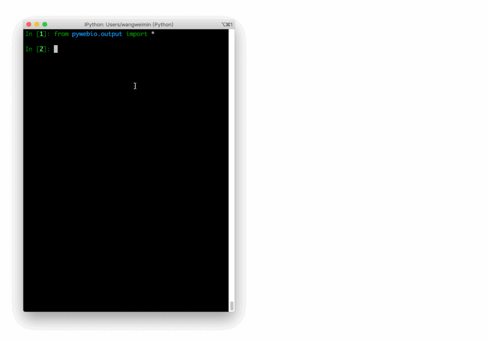

Python
<a name="MHtVa"></a>
## 数据采集
在当今互联网时代，数据实在是太重要了，首先就来介绍几个优秀的数据采集项目
<a name="UXA2h"></a>
### AKShare
AKShare 是基于 Python 的财经数据接口库，目的是实现对股票、期货、期权、基金、外汇、债券、指数、加密货币等金融产品的基本面数据、实时和历史行情数据、衍生数据从数据采集、数据清洗到数据落地的一套工具，主要用于学术研究目的。
```python
import akshare as ak

stock_zh_a_hist_df = ak.stock_zh_a_hist(symbol="000001", period="daily", start_date="20170301", end_date='20210907', adjust="")
print(stock_zh_a_hist_df)
```
Output:
```
日期          开盘   收盘    最高  ...  振幅   涨跌幅 涨跌额 换手率
0     2017-03-01   9.49   9.49   9.55  ...  0.84  0.11  0.01  0.21
1     2017-03-02   9.51   9.43   9.54  ...  1.26 -0.63 -0.06  0.24
2     2017-03-03   9.41   9.40   9.43  ...  0.74 -0.32 -0.03  0.20
3     2017-03-06   9.40   9.45   9.46  ...  0.74  0.53  0.05  0.24
4     2017-03-07   9.44   9.45   9.46  ...  0.63  0.00  0.00  0.17
          ...    ...    ...    ...  ...   ...   ...   ...   ...
1100  2021-09-01  17.48  17.88  17.92  ...  5.11  0.45  0.08  1.19
1101  2021-09-02  18.00  18.40  18.78  ...  5.48  2.91  0.52  1.25
1102  2021-09-03  18.50  18.04  18.50  ...  4.35 -1.96 -0.36  0.72
1103  2021-09-06  17.93  18.45  18.60  ...  4.55  2.27  0.41  0.78
1104  2021-09-07  18.60  19.24  19.56  ...  6.56  4.28  0.79  0.84
[1105 rows x 11 columns]
```
[https://github.com/akfamily/akshare](https://github.com/akfamily/akshare)
<a name="vPoF0"></a>
### TuShare
TuShare 是实现对股票/期货等金融数据从数据采集、清洗加工到数据存储过程的工具，满足金融量化分析师和学习数据分析的人在数据获取方面的需求，它的特点是数据覆盖范围广，接口调用简单,响应快速。<br />不过该项目有一部分功能是收费的，大家选择使用哦
```python
import tushare as ts

ts.get_hist_data('600848') #一次性获取全部数据
```
Output:
```
open    high   close     low     volume    p_change  ma5 \
date                                                                     
2012-01-11   6.880   7.380   7.060   6.880   14129.96     2.62   7.060   
2012-01-12   7.050   7.100   6.980   6.900    7895.19    -1.13   7.020   
2012-01-13   6.950   7.000   6.700   6.690    6611.87    -4.01   6.913   
2012-01-16   6.680   6.750   6.510   6.480    2941.63    -2.84   6.813   
2012-01-17   6.660   6.880   6.860   6.460    8642.57     5.38   6.822   
2012-01-18   7.000   7.300   6.890   6.880   13075.40     0.44   6.788   
2012-01-19   6.690   6.950   6.890   6.680    6117.32     0.00   6.770   
2012-01-20   6.870   7.080   7.010   6.870    6813.09     1.74   6.832 

			 ma10    ma20      v_ma5     v_ma10     v_ma20     turnover  
date                                                                  
2012-01-11   7.060   7.060   14129.96   14129.96   14129.96     0.48  
2012-01-12   7.020   7.020   11012.58   11012.58   11012.58     0.27  
2012-01-13   6.913   6.913    9545.67    9545.67    9545.67     0.23  
2012-01-16   6.813   6.813    7894.66    7894.66    7894.66     0.10  
2012-01-17   6.822   6.822    8044.24    8044.24    8044.24     0.30  
2012-01-18   6.833   6.833    7833.33    8882.77    8882.77     0.45  
2012-01-19   6.841   6.841    7477.76    8487.71    8487.71     0.21  
2012-01-20   6.863   6.863    7518.00    8278.38    8278.38     0.23
```
[https://github.com/waditu/tushare](https://github.com/waditu/tushare)
<a name="UzJrN"></a>
### GoPUP
GoPUP 项目所采集的数据皆来自公开的数据源，不涉及任何个人隐私数据和非公开数据。不过同样的，部分接口是需要注册 TOKEN 才能使用的。
```python
import gopup as gp
df = gp.weibo_index(word="疫情", time_type="1hour")
print(df)
```
Output:
```
疫情
index
2022-12-17 18:15:00  18544
2022-12-17 18:20:00  14927
2022-12-17 18:25:00  13004
2022-12-17 18:30:00  13145
2022-12-17 18:35:00  13485
2022-12-17 18:40:00  14091
2022-12-17 18:45:00  14265
2022-12-17 18:50:00  14115
2022-12-17 18:55:00  15313
2022-12-17 19:00:00  14346
2022-12-17 19:05:00  14457
2022-12-17 19:10:00  13495
2022-12-17 19:15:00  14133
```
[https://github.com/justinzm/gopup](https://github.com/justinzm/gopup)
<a name="id0jA"></a>
### GeneralNewsExtractor
该项目基于《基于文本及符号密度的网页正文提取方法》论文，使用 Python 实现的正文抽取器，可以用来提取 HTML 中正文的内容、作者、标题。
```python
>>> from gne import GeneralNewsExtractor

>>> html = '''经过渲染的网页 HTML 代码'''

>>> extractor = GeneralNewsExtractor()
>>> result = extractor.extract(html, noise_node_list=['//div[@class="comment-list"]'])
>>> print(result)
```
Output:
```
{"title": "xxxx", "publish_time": "2019-09-10 11:12:13", "author": "yyy", "content": "zzzz", "images": ["/xxx.jpg", "/yyy.png"]}
```
新闻页提取示例<br />[https://github.com/GeneralNewsExtractor/GeneralNewsExtractor](https://github.com/GeneralNewsExtractor/GeneralNewsExtractor)
<a name="moVHk"></a>
## 爬虫
爬虫也是 Python 语言的一大应用方向，很多朋友也都是以爬虫来入门的，来看看有哪些优秀的爬虫项目吧
<a name="QSnTv"></a>
### playwright-python
微软开源的浏览器自动化工具，可以用 Python 语言操作浏览器。支持 Linux、macOS、Windows 系统下的 Chromium、Firefox 和 WebKit 浏览器。
```python
from playwright.sync_api import sync_playwright

with sync_playwright() as p:
    for browser_type in [p.chromium, p.firefox, p.webkit]:
        browser = browser_type.launch()
        page = browser.new_page()
        page.goto('http://whatsmyuseragent.org/')
        page.screenshot(path=f'example-{browser_type.name}.png')
        browser.close()
```
[https://github.com/microsoft/playwright-python](https://github.com/microsoft/playwright-python)
<a name="JEoE0"></a>
### awesome-python-login-model
该项目收集了各大网站登陆方式和部分网站的爬虫程序。登陆方式实现包含 selenium 登录、通过抓包直接模拟登录等。有助于新手研究、编写爬虫。<br />不过众所周知，爬虫是非常吃后期维护的，该项目已经很久没有更新了，所以各种登录接口是否还能正常使用，还存在疑问，大家选择使用，或者自行二次开发。<br /><br />[https://github.com/Kr1s77/awesome-python-login-model](https://github.com/Kr1s77/awesome-python-login-model)
<a name="ckSnp"></a>
### DecryptLogin
相比于上一个，该项目则还在持续更新，同样是模拟登录各大网站，对于新手还是非常有研究价值的。
```python
from DecryptLogin import login

# the instanced Login class object
lg = login.Login()
# use the provided api function to login in the target website (e.g., twitter)
infos_return, session = lg.twitter(username='Your Username', password='Your Password')
```
[https://github.com/CharlesPikachu/DecryptLogin](https://github.com/CharlesPikachu/DecryptLogin)
<a name="bSdEe"></a>
### Scylla
Scylla 是一款高质量的免费代理 IP 池工具，当前仅支持 Python 3.6。
```
http://localhost:8899/api/v1/stats
```
Output:
```json
{
  "median": 181.2566407083,
  "valid_count": 1780,
  "total_count": 9528,
  "mean": 174.3290085201
}
```
[https://github.com/scylladb/scylladb](https://github.com/scylladb/scylladb)
<a name="AYaW3"></a>
### ProxyPool
爬虫代理IP池项目，主要功能为定时采集网上发布的免费代理验证入库，定时验证入库的代理保证代理的可用性，提供API和CLI两种使用方式。同时也可以扩展代理源以增加代理池IP的质量和数量。该项目设计文档详细、模块结构简明易懂，同时适合爬虫新手更好的学习爬虫技术。
```python
import requests

def get_proxy():
    return requests.get("http://127.0.0.1:5010/get/").json()

def delete_proxy(proxy):
    requests.get("http://127.0.0.1:5010/delete/?proxy={}".format(proxy))

# your spider code

def getHtml():
    # ....
    retry_count = 5
    proxy = get_proxy().get("proxy")
    while retry_count > 0:
        try:
            html = requests.get('http://www.example.com', proxies={"http": "http://{}".format(proxy)})
            # 使用代理访问
            return html
        except Exception:
            retry_count -= 1
    # 删除代理池中代理
    delete_proxy(proxy)
    return None
```
[https://github.com/Python3WebSpider/ProxyPool](https://github.com/Python3WebSpider/ProxyPool)
<a name="HxBNO"></a>
### getproxy
getproxy 是一个抓取发放代理网站，获取 http/https 代理的程序，每 15 min 更新数据。
```
(test2.7) ➜  ~ getproxy
INFO:getproxy.getproxy:[*] Init
INFO:getproxy.getproxy:[*] Current Ip Address: 1.1.1.1
INFO:getproxy.getproxy:[*] Load input proxies
INFO:getproxy.getproxy:[*] Validate input proxies
INFO:getproxy.getproxy:[*] Load plugins
INFO:getproxy.getproxy:[*] Grab proxies
INFO:getproxy.getproxy:[*] Validate web proxies
INFO:getproxy.getproxy:[*] Check 6666 proxies, Got 666 valid proxies
...
```
[https://github.com/fate0/getproxy](https://github.com/fate0/getproxy)
<a name="BQLDx"></a>
### freeproxy
同样是一个抓取免费代理的项目，该项目支持抓取的代理网站非常多，而且使用简单。
```python
from freeproxy import freeproxy

proxy_sources = ['proxylistplus', 'kuaidaili']
fp_client = freeproxy.FreeProxy(proxy_sources=proxy_sources)
headers = {
    'User-Agent': 'Mozilla/5.0 (Windows NT 10.0; Win64; x64) AppleWebKit/537.36 (KHTML, like Gecko) Chrome/98.0.4758.102 Safari/537.36'
}
response = fp_client.get('https://space.bilibili.com/406756145', headers=headers)
print(response.text)
```
[https://github.com/CharlesPikachu/freeproxy](https://github.com/CharlesPikachu/freeproxy)
<a name="MtIXj"></a>
### fake-useragent
伪装浏览器身份，常用于爬虫。这个项目的代码很少，可以阅读一下，看看`ua.random`是如何返回随机的浏览器身份的。
```python
from fake_useragent import UserAgent
ua = UserAgent()

ua.ie
# Mozilla/5.0 (Windows; U; MSIE 9.0; Windows NT 9.0; en-US);
ua.msie
# Mozilla/5.0 (compatible; MSIE 10.0; Macintosh; Intel Mac OS X 10_7_3; Trident/6.0)'
ua['Internet Explorer']
# Mozilla/5.0 (compatible; MSIE 8.0; Windows NT 6.1; Trident/4.0; GTB7.4; InfoPath.2; SV1; .NET CLR 3.3.69573; WOW64; en-US)
ua.opera
# Opera/9.80 (X11; Linux i686; U; ru) Presto/2.8.131 Version/11.11
ua.chrome
# Mozilla/5.0 (Windows NT 6.1) AppleWebKit/537.2 (KHTML, like Gecko) Chrome/22.0.1216.0 Safari/537.2'
ua.google
# Mozilla/5.0 (Macintosh; Intel Mac OS X 10_7_4) AppleWebKit/537.13 (KHTML, like Gecko) Chrome/24.0.1290.1 Safari/537.13
ua['google chrome']
# Mozilla/5.0 (X11; CrOS i686 2268.111.0) AppleWebKit/536.11 (KHTML, like Gecko) Chrome/20.0.1132.57 Safari/536.11
ua.firefox
# Mozilla/5.0 (Windows NT 6.2; Win64; x64; rv:16.0.1) Gecko/20121011 Firefox/16.0.1
ua.ff
# Mozilla/5.0 (X11; Ubuntu; Linux i686; rv:15.0) Gecko/20100101 Firefox/15.0.1
ua.safari
# Mozilla/5.0 (iPad; CPU OS 6_0 like Mac OS X) AppleWebKit/536.26 (KHTML, like Gecko) Version/6.0 Mobile/10A5355d Safari/8536.25

# and the best one, get a random browser user-agent string
ua.random
```
[https://github.com/fake-useragent/fake-useragent](https://github.com/fake-useragent/fake-useragent)
<a name="JNyHn"></a>
## Web 相关
Python Web 有太多优秀且老牌的库了，比如 Django，Flask 就不说了，大家都知道，我们介绍几个小众但是好用的。
<a name="veKEt"></a>
### streamlit
streamlit 能够快速地把数据制作成可视化、交互页面的 Python 框架。分分钟数据变成图表。
```python
import streamlit as st

x = st.slider('Select a value')
st.write(x, 'squared is', x * x)
```
Output:<br /><br />[https://github.com/streamlit/streamlit](https://github.com/streamlit/streamlit)
<a name="qLT38"></a>
### wagtail
是一个强大的开源 Django CMS（内容管理系统）。首先该项目更新、迭代活跃，其次项目首页提到的功能都是免费的，没有付费解锁的骚操作。专注于内容管理，不束缚前端实现。<br /><br />[https://github.com/wagtail/wagtail](https://github.com/wagtail/wagtail)
<a name="ffWWb"></a>
### fastapi
基于 Python 3.6+ 的高性能 Web 框架。“人如其名”用 FastAPI 写接口那叫一个快、调试方便，Python 在进步而它基于这些进步，让 Web 开发变得更快、更强。
```python
from typing import Union

from fastapi import FastAPI

app = FastAPI()


@app.get("/")
def read_root():
    return {"Hello": "World"}


@app.get("/items/{item_id}")
def read_item(item_id: int, q: Union[str, None] = None):
    return {"item_id": item_id, "q": q}
```
[https://github.com/tiangolo/fastapi](https://github.com/tiangolo/fastapi)
<a name="ZKMDH"></a>
### django-blog-tutorial
这是一个 Django 使用教程，该项目一步步带我们使用 Django 从零开发一个个人博客系统，在实践的同时掌握 Django 的开发技巧。<br />[https://github.com/jukanntenn/django-blog-tutorial](https://github.com/jukanntenn/django-blog-tutorial)
<a name="UyOGE"></a>
### dash
dash 是一个专门为机器学习而来的 Web 框架，通过该框架可以快速搭建一个机器学习 APP。<br /><br />[https://github.com/plotly/dash](https://github.com/plotly/dash)
<a name="z41rB"></a>
### PyWebIO
同样是一个非常优秀的 Python Web 框架，在不需要编写前端代码的情况下就可以完成整个 Web 页面的搭建，实在是方便。<br /><br />[https://github.com/pywebio/PyWebIO](https://github.com/pywebio/PyWebIO)
<a name="Mh73J"></a>
## Python 教程
<a name="nshDy"></a>
### practical-python
一个人气超高的 Python 学习资源项目，是 MarkDown 格式的教程，非常友好。<br />[https://github.com/dabeaz-course/practical-python](https://github.com/dabeaz-course/practical-python)
<a name="g15dK"></a>
### learn-python3
一个 Python3 的教程，该教程采用 Jupyter notebooks 形式，便于运行和阅读。并且还包含了练习题，对新手友好。<br />[https://github.com/jerry-git/learn-python3](https://github.com/jerry-git/learn-python3)
<a name="CPdtz"></a>
### python-guide
Requests 库的作者——kennethreitz，写的 Python 入门教程。不单单是语法层面的，涵盖项目结构、代码风格，进阶、工具等方方面面。一起在教程中领略大神的风采吧~<br />[https://github.com/realpython/python-guide](https://github.com/realpython/python-guide)
<a name="rLJRs"></a>
## 其他
<a name="RyWI4"></a>
### pytools
这是一位大神编写的类似工具集的项目，里面包含了众多有趣的小工具。<br /><br />截图只是冰山一角，全貌需要大家自行探索了
```python
import random
from pytools import pytools

tool_client = pytools.pytools()
all_supports = tool_client.getallsupported()
tool_client.execute(random.choice(list(all_supports.values())))
```
[https://github.com/CharlesPikachu/pytools](https://github.com/CharlesPikachu/pytools)
<a name="W311c"></a>
### amazing-qr
可以生成动态、彩色、各式各样的二维码，真是个有趣的库。
```bash
#3 -n, -d
amzqr https://github.com -n github_qr.jpg -d .../paths/
```
