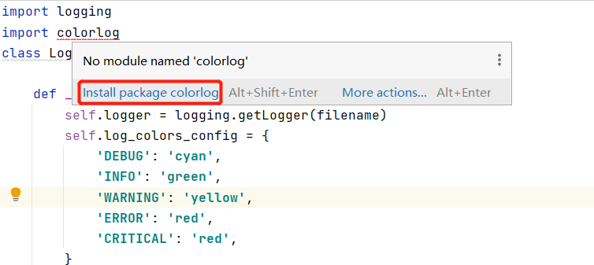
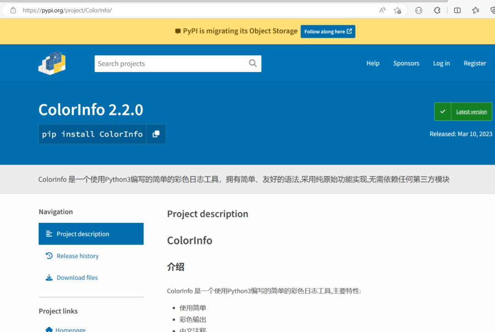
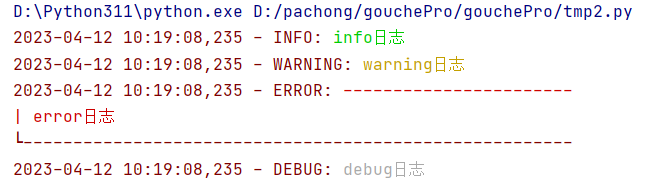
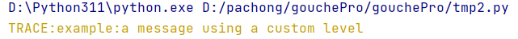
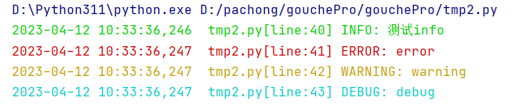
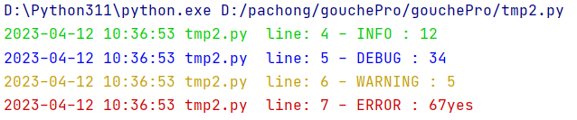
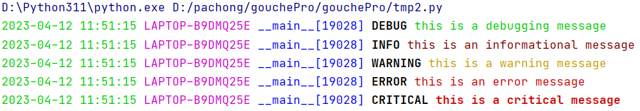
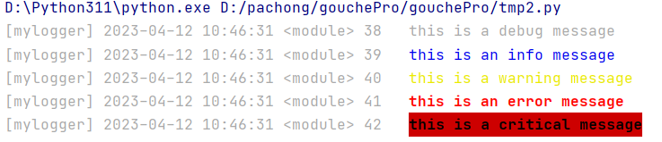

Python<br />彩色日志可以加快调试的速度，让程序中发生的事情变得有迹可循。这里分享4个技巧，可以让 Python 在控制台输出彩色的日志。<br />比较简单的办法，类似于`print()`函数自定义内容颜色。另外3种方式需要安装第三方模块：

- colorlog
- ColorInfo
- coloredlogs
<a name="pWBrb"></a>
### 模块安装
如果未安装，PyCharm中会标红，鼠标放上去点击安装即可<br /><br />_**项目主页：**_https://pypi.org/project/ + 模块名<br />比如ColorInfo的主页 [https://pypi.org/project/ColorInfo/](https://pypi.org/project/ColorInfo/)<br /><br />大家可以去主页了解具体的内容
<a name="xbxJN"></a>
### 一、自定义内容颜色
如果不想安装第三方模块，可以简单一点自定义内容颜色<br />_**自定内容颜色的格式**_
```python
logging.info("\033[显示方式；前景颜色；背景颜色m"+ "日志内容" +"\033[0m")
```
<a name="J0rEP"></a>
#### 示例代码
```python
import logging
class LogColor:
    # logging日志格式设置
    logging.basicConfig(level=logging.DEBUG,
                        format='%(asctime)s - %(levelname)s: %(message)s')

    @staticmethod
    def info(message: str):
        # info级别的日志，绿色
        logging.info("\033[0;32m" + message + "\033[0m")

    @staticmethod
    def warning(message: str):
        # warning级别的日志，黄色
        logging.warning("\033[0;33m" + message + "\033[0m")

    @staticmethod
    def error(message: str):
        # error级别的日志，红色
        logging.error("\033[0;31m"+"-" * 23 + '\n| ' + message + "\033[0m" + "\n" + "└"+"-" * 55)

    @staticmethod
    def debug(message: str):
        # debug级别的日志，灰色
        logging.debug("\033[0;37m" + message + "\033[0m")

if __name__ == '__main__':
    # 测试代码
    LogColor.info("info日志")
    LogColor.warning("warning日志")
    LogColor.error("error日志")
    LogColor.debug("debug日志")
```
效果如下图所示<br />
<a name="isEBm"></a>
### 二、colorlog
顾名思义，它的作用就是为 Python 日志记录模块的输出添加颜色。
<a name="c3Aqt"></a>
#### 使用自定义日志级别
比如`colorlog.ColoredFormatter`与添加的自定义日志级别一起使用`logging.addLevelName`：
```python
import logging, colorlog
TRACE = 5
logging.addLevelName(TRACE, 'TRACE')
formatter = colorlog.ColoredFormatter(log_colors={'TRACE': 'yellow'})
handler = logging.StreamHandler()
handler.setFormatter(formatter)
logger = logging.getLogger('example')
logger.addHandler(handler)
logger.setLevel('TRACE')
logger.log(TRACE, 'a message using a custom level')
```
运行之后的效果<br />
<a name="HAAri"></a>
#### 配合logging使用
```python
import logging
import colorlog
class LogHandler(object):

    def __init__(self,filename, level=logging.INFO):
        self.logger = logging.getLogger(filename)
        self.log_colors_config = {
            'DEBUG': 'cyan',
            'INFO': 'green',
            'WARNING': 'yellow',
            'ERROR': 'red',
            'CRITICAL': 'red',
        }
        formatter = colorlog.ColoredFormatter(
            '%(log_color)s%(asctime)s  %(filename)s[line:%(lineno)d] %(levelname)s: %(message)s',
            log_colors=self.log_colors_config)

        # 设置日志级别
        self.logger.setLevel(level)
        # 往屏幕上输出
        console_handler = logging.StreamHandler()
        # 输出到文件
        file_handler = logging.FileHandler(filename=filename, mode='a', encoding='utf8')
        file_formatter = logging.Formatter('%(asctime)s  %(filename)s[line:%(lineno)d] %(levelname)s: %(message)s')
        # 设置屏幕上显示的格式
        console_handler.setFormatter(formatter)
        # 设置写入文件的格式
        file_handler.setFormatter(file_formatter)
        # 把对象加到logger里
        self.logger.addHandler(console_handler)
        self.logger.addHandler(file_handler)


INFO = LogHandler('info.log',level=logging.INFO)
ERROR = LogHandler('error.log',level=logging.ERROR)
WARNING = LogHandler('warning.log',level=logging.WARNING)
DEBUG = LogHandler('debug.log',level=logging.DEBUG)

if __name__ == '__main__':
    INFO.logger.info("测试info")
    ERROR.logger.error("error")
    WARNING.logger.warning("warning")
    DEBUG.logger.debug("debug")
```
效果如下图所示<br />
<a name="H01bg"></a>
### 三、ColorInfo
ColorInfo 是一个使用Python3编写的简单的彩色日志工具，主要特性:

- 使用简单
- 彩色输出
- 中文注释
- 支持全部Python3版本(>=3.0)
```python
from ColorInfo import ColorLogger

logger = ColorLogger()
logger.info("1", "2")
logger.debug("3", "4")
logger.warning("5")
logger.error("6", "7", "yes")
```
效果如下图所示<br />
<a name="zrGUe"></a>
### 四、coloredlogs
<a name="pd7B2"></a>
#### 简单使用
```python
import coloredlogs, logging

# Create a logger object.
logger = logging.getLogger(__name__)
coloredlogs.install(level='DEBUG')
coloredlogs.install(level='DEBUG', logger=logger)

# Some examples.
logger.debug("this is a debugging message")
logger.info("this is an informational message")
logger.warning("this is a warning message")
logger.error("this is an error message")
logger.critical("this is a critical message")
```
效果如下图所示<br />
<a name="K9Fi7"></a>
#### 配合logging使用
可以自定义颜色等
```python
import logging
import coloredlogs
import sys


## 配置 logger
logging.basicConfig()
logger = logging.getLogger(name='mylogger')

coloredlogs.install(logger=logger)
logger.propagate = False #确保 coloredlogs 不会将我们的日志事件传递给根 logger，这可以防止我们重复记录每个事件

## 配置 颜色
coloredFormatter = coloredlogs.ColoredFormatter(
    fmt='[%(name)s] %(asctime)s %(funcName)s %(lineno)-3d  %(message)s',
    level_styles=dict(
        debug=dict(color='white'),
        info=dict(color='blue'),
        warning=dict(color='yellow', bright=True),
        error=dict(color='red', bold=True, bright=True),
        critical=dict(color='black', bold=True, background='red'),
    ),
    field_styles=dict(
        name=dict(color='white'),
        asctime=dict(color='white'),
        funcName=dict(color='white'),
        lineno=dict(color='white'),
    )
)

## 配置 StreamHandler
ch = logging.StreamHandler(stream=sys.stdout)
ch.setFormatter(fmt=coloredFormatter)
logger.addHandler(hdlr=ch)
logger.setLevel(level=logging.DEBUG)

## output
logger.debug(msg="this is a debug message")
logger.info(msg="this is an info message")
logger.warning(msg="this is a warning message")
logger.error(msg="this is an error message")
logger.critical(msg="this is a critical message")
```
效果如下图所示<br />
<a name="FXrhr"></a>
### 最后
第一种方式，自定义颜色的缺陷是只修改了日志内容的颜色。可以根据自身的需求选择使用哪种方式。
