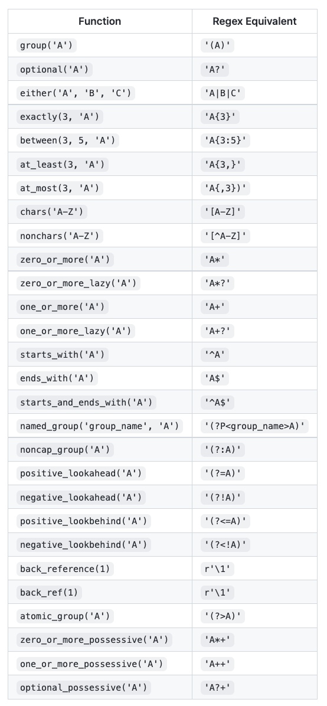
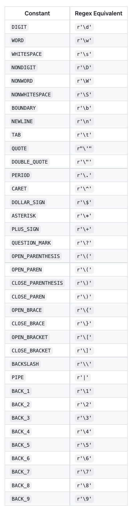
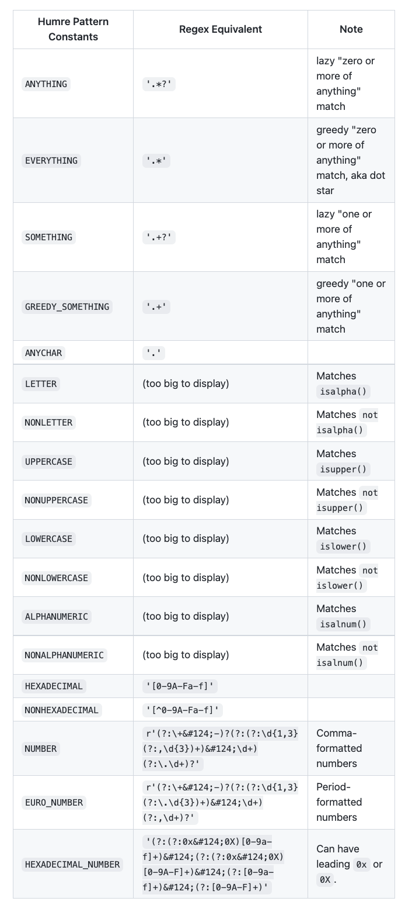

Python正则表达式
<a name="fGI2o"></a>
## **Humre**
没错，这个库就是 Humre，就是 Human（人类） + re（正则表达式） 的组合，单看这个名字还是很有来头。<br />GitHub 地址：[https://github.com/asweigart/humre](https://github.com/asweigart/humre)<br />PyPi：[https://pypi.org/project/Humre/](https://pypi.org/project/Humre/)<br />这个库其实很新，第一次 commit 是在 2022/7/21，作者是 Al Sweigart，就是写 pyautogui 库（已有 7.1k star）的那个人，所以还是有一定可信赖度的。<br />这个库解决的问题就是可以用更“人类”，也就是更语义化的方式编写正则表达式。<br />注意：当前时间（2022/9/4）这个库还没有发布 1.0 版本，所以相关 API 可能会更改，具体的最新 API 请参考原 GitHub 仓库的最新说明。
<a name="zL7yR"></a>
## **基本体验**
先来一个例子看看，比如现在要从一段文字中提取出一个电话号码，比如原文本如下：
```python
Call 415-555-1234 today!
```
需要提取出其中的电话号码，那么用常规的正则表达式就是这么写的：
```python
\d{3}-\d{3}-\d{4}
```
意思就是匹配“三个数字-三个数字-四个数字”，那么用 Python 就可以这么写：
```python
from re import *

text = 'Call 415-555-1234 today!'
regexStr = '\d{3}-\d{3}-\d{4}'
result = compile(regexStr).search(text)
print(result.group())
```
那么用 Humre 就可以写成这样：
```python
from humre import *

text = 'Call 415-555-1234 today!'
regexStr = exactly(3, DIGIT) + '-' + exactly(3, DIGIT) + '-' + exactly(4, DIGIT)
result = compile(regexStr).search(text)
print(result.group())
```
可以看到整个正则表达式就变得语义化了，`exactly` 指的就是精确匹配，`DIGIT` 指的就是数字，`exactly(3, DIGIT)` 就是精确匹配三个数字，也就是 `\d{3}`的意思。<br />运行结果都是一样的：
```python
415-555-1234
```
通过观察可以发现，这里仅仅是把 re 这个库换成了 humre，然后修改了下 regexStr 就可以实现正则表达式的语义化表示了，是不是还挺简单的？<br />这时候有人说，现在也没感觉出这个库有什么优势，反而写得更长了。<br />那好，咱们再来一个例子，找出所有十六进制数字，这个十六进制数字可能带前缀 0x 或者 0X，普通正则怎么写？
```python
import re
re.compile('(?:(?:0x|0X)[0-9a-f]+)|(?:(?:0x|0X)[0-9A-F]+)|(?:[0-9a-f]+)|(?:[0-9A-F]+)')
```
感觉可读性怎么样？<br />那如果这时候换成 Humre 呢？就可以这样写：
```python
from humre import *
compile(
    either(
        noncap_group(noncap_group(either('0x', '0X')), one_or_more(chars('0-9a-f'))),
        noncap_group(noncap_group(either('0x', '0X')), one_or_more(chars('0-9A-F'))),
        noncap_group(one_or_more(chars('0-9a-f'))),
        noncap_group(one_or_more(chars('0-9A-F')))
    )
)
```
是不是清晰多了？`either` 指的就是其中某一个符合条件就可以，然后传入了四个参数，`noncap_group` 指的就是将内容看作一个整体来匹配，`one_or_more` 指的就是一个或更多，这样就可以清晰地知道这个正则表达式什么含义了。<br />再来一个例子，匹配一个带或不带逗号的数字，并且可以匹配小数点，那么普通正则就这样写：
```python
import re
re.compile(r'(?:\+|-)?(?:(?:\d{1,3}(?:,\d{3})+)|\d+)(?:\.\d+)?')
```
颤抖吧！估计正则专家都不一定一眼读出来这是啥意思，有没有错误。<br />那用 Humre 怎么写呢？
```python
from humre import *
compile(
    # optional negative or positive sign:
    optional(noncap_group(either(PLUS_SIGN, '-'))),
    # whole number section:
    noncap_group(either(
        # number with commas:
        noncap_group(between(1, 3, DIGIT), one_or_more(noncap_group(',', exactly(3, DIGIT)))),
        # number without commas:
        one_or_more(DIGIT)
    )),
    # fractional number section (optional)
    optional(noncap_group(PERIOD, one_or_more(DIGIT)))
    )
```
是不是又清晰了？<br />这里一共拆分为了三部分，正负号、数字、小数点，其中正负号和小数点都是可选的，所以可以加一个 `optional` ，`noncap_group` 照例还是整体匹配，然后有一些常量 `PLUS_SIGN` 就可以代表加号，`between` 就可代表从几到几。整体这么一拆分，并添加注释和分级，是不是可读性就大大增强了？<br />OK，到这里，体会到 Humre 的便捷之处了吧～
<a name="mSfy0"></a>
## **Humre 真的有必要吗？**
使用正则的人可能有两种：一种是刚不怎么会刚入门的，另一种是精通正则的。<br />如果是刚入门的，那有了 Humre，其实可以不用过多关心正则的很多语法，上手起来就会快很多。<br />如果是精通正则了，那么其实可以很快写出来某个功能需求的正则表达式，这个没问题。<br />但写出来之后，如果遇到问题了想要排查，那其实还得费点功夫，<br />当然排查过程也可以借助于很多优秀的正则表达式辅助工具，比如：

- [**https://regexr.com/**](https://regexr.com/)
- [**https://regex101.com/**](https://regex101.com/)

所以排查问题还好。<br />但到了维护阶段，或者项目被别人来维护了，不管是自己还是别人，看到这个正则表达式想看出是什么意思，那其实就不太好办了。<br />所以，这种语义化的正则不论对于正则小白还是专家，都是有一定帮助的。
<a name="iNigf"></a>
## **语义化表**
了解了 Humre 的基本功能之后，如果想要使用它的话，其实就是找到它的一些 API 功能就好了，比如 `optional`, `nocap_group` 等等都什么意思，对应正则表达式的什么功能，这里总结了一些常用的方法和含义：<br /><br />另外还有一些常量表示如下：<br /><br />另外 Humre 还提供了一些常用的表达，比如十六进制 `HEXADECIMAL`，参考如下：<br /><br />这里简单列一下，但最新的 API 建议还是参考官方文档：[https://github.com/asweigart/humre#quick-reference](https://github.com/asweigart/humre#quick-reference)<br />后面需要做什么？用这个库上手写几个，感受一下，练上几个就熟练了。
<a name="kw2q4"></a>
## **提示**
当然，这个库好用是好用的，但距离成熟可能还有一点时间，在 1.0 版本之前，其中的 API 可能还会迭代，所以还不建议直接上生产环境。<br />如果真的要上生产环境，建议锁死版本号，避免带来潜在的问题。
