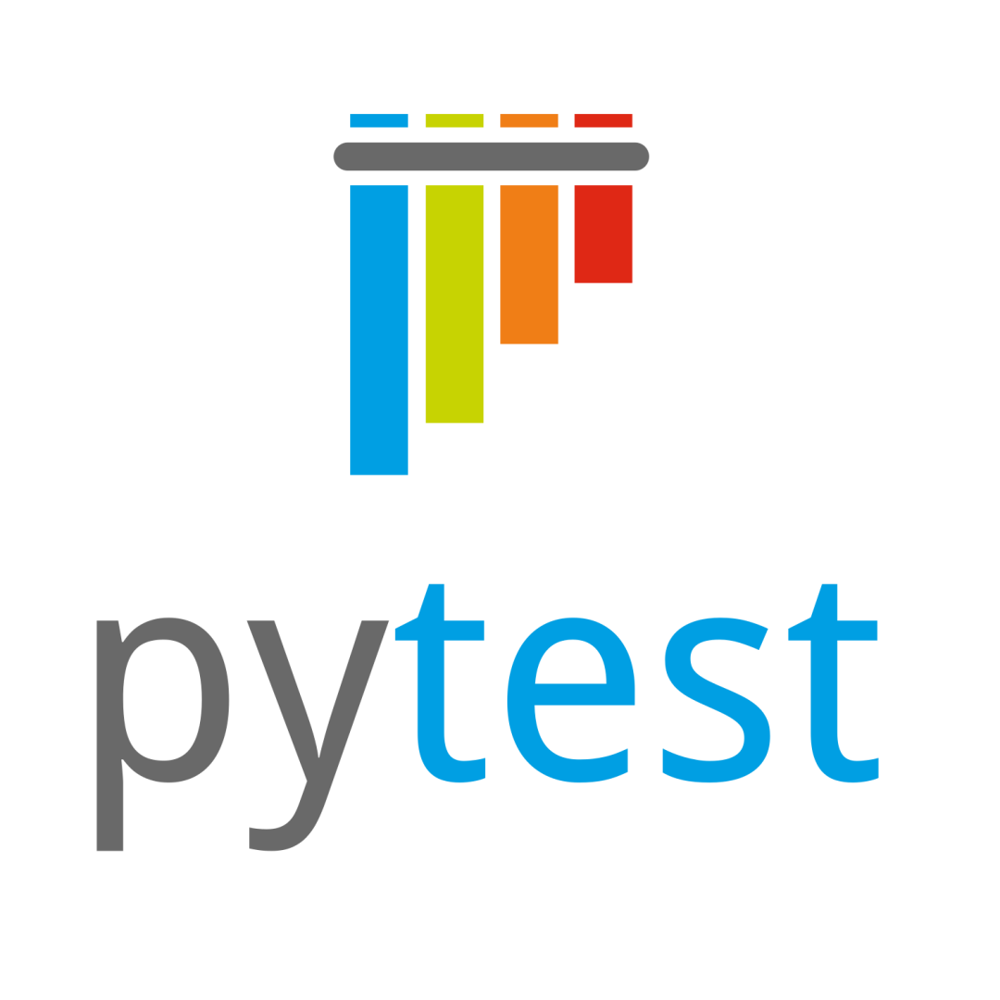
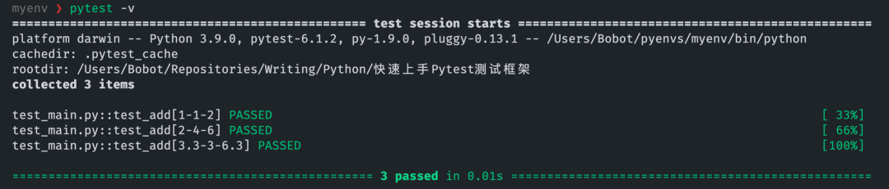
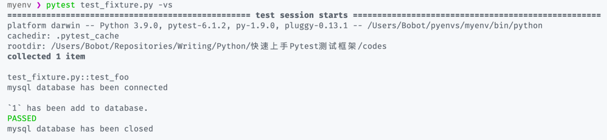
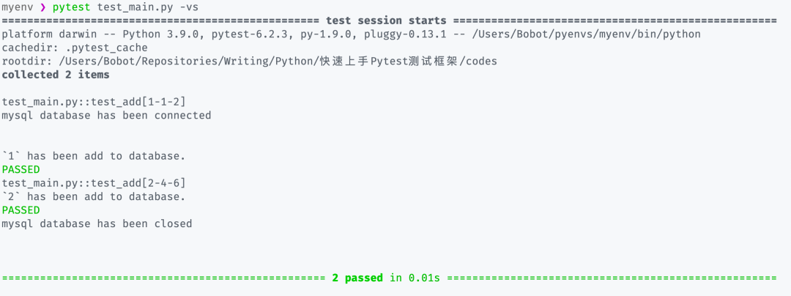
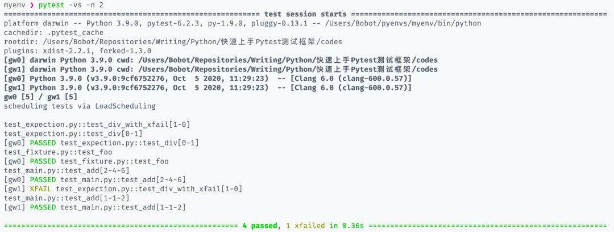

Python pytest
<a name="zaktF"></a>
## 为什么要做单元测试
相信很多 Python 使用者都会有这么一个经历，为了测试某个模块或者某个函数是否输出自己预期的结果，往往会对产出结果的部分使用`print()`函数将其打印输出到控制台上。
```python
def myfunc(*args, **kwargs):
    do_something()
    data = ...
    print(data)
```
在一次次改进过程中会不得不经常性地使用`print()`函数来确保结果的准确性，但同时，也由于要测试的模块或者函数变多，代码中也会逐渐遗留着各种未被去掉或注释的`print()`调用，让整个代码变得不是那么简洁得体。<br />在编程中往往会存在「单元测试」这么一个概念，即指对软件中的最小可测试单元进行检查和验证。这个最小可测单元可以是表达式、函数、类、模块、包中的任意一种或组合，因此可以将使用`print()`进行测试的步骤统一地放到单元测试中来进行。<br />在 Python 中官方早已经内置好了用以进行单元测试的模块`unittest`。但对于新手来说，`unittest`在学习曲线上是稍微有点难度的，因为是需要通过继承测试用例类（TestCase）来进行封装，所以需要对面向对象的知识有足够多的了解；而和类绑定在一起就意味着如果想要实现定制化或者模块解耦，可能就需要多花一些时间在设计划分上。<br /><br />所以，为了能让测试变得简单且具备可扩展性，一个名为 pytest 的测试框架在 Python 社区中诞生了，使用 pytest 可以不用考虑如何基于TestCase来实现测试，只需要简单到保持原有的代码逻辑不变，外加一个`assert`关键字来断言结果，剩下的部分 pytest 会处理。<br />main.py
```python
import pytest

raw_data = read_data(...)

def test_myfunc(*args, **kwargs):
    do_something()
    data = ...
    assert data == raw_data

if __name__ == '__main__':
    pytest.main()
```
之后只需要运行包含上述代码的main.py文件，就能在终端控制台上看到 pytest 测试得到的结果。如果结果通过，则不会有过多的信息显示，如果测试失败，则会抛出错误信息并告知运行时data里的内容是什么。<br />尽管说 pytest 已经足够简单，但它也提供了许多实用的功能（如：依赖注入），这些功能本身是存在着一些概念层面的知识；但这并不意味着劝退想要使用 pytest 来测试自己代码的人，而是拥有更多的选择，因此只有对 pytest 的这些功能及其概念有了更好地了解，才能够充分发挥 pytest 的威力。
<a name="DNAwp"></a>
## 快速实现第一个 Pytest 测试
通过`pip install pytest`安装 pytest 之后，就可以快速实现第一个测试。<br />首先可以任意新建一个 Python 文件，这里直接以test_main.py命名，然后当中留存如下内容：
```python
from typing import Union

import pytest

def add(
    x: Union[int, float], 
    y: Union[int, float],
) -> Union[int, float]:
    return x + y

@pytest.mark.parametrize(
    argnames="x,y,result", 
    argvalues=[
        (1,1,2),
        (2,4,6),
        (3.3,3,6.3),
    ]
)
def test_add(
    x: Union[int, float], 
    y: Union[int, float],
    result: Union[int, float],
):
assert add(x, y) == result
```
之后将终端切换到该文件所处路径下，然后运行`pytest -v`，就会看到 pytest 已经将待测试的参数传入到测试函数中，并实现对应的结果：<br /><br />可以看到无需重复地用`for`循环传参，并且还能直观地从结果中看到每次测试中传入参数的具体数值是怎样。这里只通过 pytest 提供的`mark.parametrize`装饰器就搞定了。也说明 pytest 的上手程度是比较容易的，只不过需要稍微了解一下这个框架中的一些概念。
<a name="FEYIy"></a>
## Pytest 概念与用法
<a name="PRbwx"></a>
### 命名
如果需要 pytest 对代码进行测试，首先需要将待测试的函数、类、方法、模块甚至是代码文件，默认都是以`test_*`开头或是以`*_test`结尾，这是为了遵守标准的测试约定。如果将前面快速上手的例子文件名中的`test_`去掉，就会发现 pytest 没有收集到对应的测试用例。<br />当然也可以在 pytest 的配置文件中修改不同的前缀或后缀名，就像官方给出的示例这样：
```python
# content of pytest.ini
# Example 1: have pytest look for "check" instead of "test"
[pytest]
python_files = check_*.py
python_classes = Check
python_functions = *_check
```
但通常情况下使用默认的 test 前后缀即可。如果只想挑选特定的测试用例或者只对特定模块下的模块进测试，那么可以在命令行中通过双冒号的形式进行指定，就像这样：
```python
pytest test.py::test_demo
pytest test.py::TestDemo::test_demo
```
<a name="f3Vjh"></a>
### 标记（mark）
在 pytest 中，mark标记是一个十分好用的功能，通过标记的装饰器来装饰待测试对象，让 pytest 在测试时会根据mark的功能对函数进行相应的操作。<br />官方本身提供了一些预置的mark功能，只挑常用的说。
<a name="lzClO"></a>
#### 参数测试：`pytest.parametrize`
正如前面的示例以及它的命名意思一样，`mark.parametrize`主要就是用于传递不同参数或不同组合的参数到一个待测试对象上的这种场景。<br />正如前面的`test_add()`示例一样，分别测试了：

- 当x=1且y=1时，结果是否为result=2的情况
- 当x=2且y=4时，结果是否为result=6的情况
- 当x=3.3且y=3时，结果是否为result=6.3的情况
- ……

也可以将参数堆叠起来进行组合，但效果也是类似：
```python
import pytest

@pytest.mark.parametrize("x", [0, 1])
@pytest.mark.parametrize("y", [2, 3])
@pytest.mark.parametrize("result", [2, 4])
def test_add(x, y, result):
    assert add(x,y) == result
```
当然如果有足够多的参数，只要写进了`parametrize`中，pytest 依旧能把所有情况都给测试一遍。这样就再也不用写多余的代码。<br />但需要注意的是，`parametrize`和后面将要讲到的一个重要的概念`fixture`会有一些差异：前者主要是模拟不同参数下时待测对象会输出怎样的结果，而后者是在**固定**参数或数据的情况下，去测试会得到怎样的结果。
<a name="J7XsD"></a>
#### 跳过测试
有些情况下代码包含了针对不同情况、版本或兼容性的部分，那么这些代码通常只有在符合了特定条件下可能才适用，否则执行就会有问题，但产生的这个问题的原因不在于代码逻辑，而是因为系统或版本信息所导致，那如果此时作为用例测试或测试失败显然不合理。比如针对 Python 3.3 版本写了一个兼容性的函数，`add()`，但当版本大于 Python 3.3 时使用必然会出现问题。<br />因此为了适应这种情况 pytest 就提供了`mark.skip`和`mark.skipif`两个标记，当然后者用的更多一些。
```python
import pytest
import sys

@pytest.mark.skipif(sys.version_info >= (3,3))
def test_add(x, y, result):
    assert add(x,y) == result
```
所以当加上这一标记之后，每次在测试用例之前使用`sys`模块判断 Python 解释器的版本是否大于 3.3，大于则会自动跳过。
<a name="jKhcX"></a>
#### 预期异常
代码只要是人写的必然会存在不可避免的 BUG，当然有一些 BUG 作为写代码的人是可以预期得到的，这类特殊的 BUG 通常也叫**异常**（Exception)。比如有一个除法函数：
```python
def div(x, y):
    return x / y
```
但根据运算法则可以知道，除数不能为 0；因此如果传递`y=0`时，必然会引发ZeroDivisionError异常。所以通常的做法要么就用`try...exception`来捕获异常，并且抛出对应的报错信息（也可以使用`if`语句进行条件判断，最后也同样是抛出报错）：
```python
def div(x, y):
    try:
        return x/y
    except ZeroDivisionError:
        raise ValueError("y 不能为 0")
```
因此，此时在测试过程中，如果想测试异常断言是否能被正确抛出，此时就可以使用 pytest 提供的`raises()`方法：
```python
import pytest

@pytest.mark.parametrize("x", [1])
@pytest.mark.parametrize("y", [0])
def test_div(x, y):
    with pytest.raises(ValueError):
        div(x, y)
```
这里需要注意，需要断言捕获的是引发ZeroDivisionError后自己指定抛出的ValueError，而非前者。当然可以使用另外一个标记化的方法（`pytest.mark.xfail`）来和`pytest.mark.parametrize`相结合：
```python
@pytest.mark.parametrize(
    "x,y,result", 
    [
        pytest.param(1,0, None, marks=pytest.mark.xfail(raises=(ValueError))),
    ]
)
def test_div_with_xfail(x, y, result):
    assert div(x,y) == result
```
这样测试过程中会直接标记出失败的部分。
<a name="eRoQg"></a>
## Fixture
在 pytest 的众多特性中，最令人感到惊艳的就是`fixture`。关于`fixture`的翻译大部分人都直接将其直译为了「夹具」一词，但如果有了解过 Java Spring 框架的 那么在实际使用中就会更容易将其理解为 IoC 容器类似的东西，它叫「载具」或许更合适。<br />因为通常情况下都是fixture的作用往往就是为测试用例提供一个固定的、可被自由拆装的通用对象，本身就像容器一样承载了一些东西在里面；使用它进行单元测试时，pytest 会自动向载具中注入对应的对象。<br />这里模拟了一下在使用数据库时的情况。通常会通过一个数据库类创建一下数据库对象，然后使用前先进行连接`connect()`，接着进行操作，最后使用完之后断开连接`close()`以释放资源。<br />test_fixture.py
```python
import pytest

class Database(object):

    def __init__(self, database):
        self.database = database
    
    def connect(self):
        print(f"\n{self.database} database has been connected\n")

    def close(self):
        print(f"\n{self.database} database has been closed\n")

    def add(self, data):
        print(f"`{data}` has been add to database.")
        return True

@pytest.fixture
def myclient():
    db = Database("mysql")
    db.connect()
    yield db
    db.close()

def test_foo(myclient):
    assert myclient.add(1) == True
```
在这段代码中，实现载具的关键是`@pytest.fixture`这一行装饰器代码，通过该装饰器可以直接使用一个带有资源的函数将其作为载具，在使用时将函数的签名（即命名）作为参数传入到测试用例中，在运行测试时 pytest 则会自动进行注入。<br /><br />在注入的过程中 pytest 会执行`myclient()`中db对象的`connect()`方法调用模拟数据库连接的方法，在测试完成之后会再次调用`close()`方法释放资源。<br />pytest 的fixture机制是一个能实现复杂测试的关键，试想以后只需要写好一个带有测试数据的fixture，就可以在不同的模块、函数或者方法中多次使用，真正做到「一次生成，处处使用」。<br />当然 pytest 提供了可调节载具作用域（scope）的情况，从小到大依次是：

- `function`：函数作用域（默认）
- `class`：类作用域
- `module`：模块作用域
- `package`：包作用域
- `session`：会话作用域

载具会随着作用域的生命周期而诞生、销毁。所以如果希望创建的载具作用域范围增加，就可以在`@pytest.fixture()`中多增加一个`scope`参数，从而提升载具作用的范围。<br />虽然 pytest 官方提供了一些内置的通用载具，但通常情况下自己自定义的载具会更多一些。所以都可以将其放到一个名为conftest.py文件中进行统一管理：<br />conftest.py
```python
import pytest

class Database:
    def __init__(self, database):
        self.database:str = database
    
    def connect(self):
        print(f"\n{self.database} database has been connected\n")

    def close(self):
        print(f"\n{self.database} database has been closed\n")

    def add(self, data):
        print(f"\n`{data}` has been add to database.")
        return True

@pytest.fixture(scope="package")
def myclient():
    db = Database("mysql")
    db.connect()
    yield db
    db.close()
```
因为声明了作用域为同一个包，那么在同一个包下再将前面的`test_add()`测试部分稍微修改一下，无需显式导入`myclient`载具就可以直接注入并使用：
```python
from typing import Union

import pytest

def add(
    x: Union[int, float], 
    y: Union[int, float],
) -> Union[int, float]:
    return x + y

@pytest.mark.parametrize(
    argnames="x,y,result", 
    argvalues=[
        (1,1,2),
        (2,4,6),
    ]
)
def test_add(
    x: Union[int, float], 
    y: Union[int, float],
    result: Union[int, float],
    myclient
):
    assert myclient.add(x) == True
    assert add(x, y) == result
```
之后运行`pytest -vs`即可看到输出的结果：<br />
<a name="vWXBC"></a>
## Pytest 扩展
对于每个使用框架的人都知道，框架生态的好坏会间接影响框架的发展（比如 Django 和 Flask）。而 pytest 预留了足够多的扩展空间，加之许多易用的特性，也让使用 pytest 存在了众多插件或第三方扩展的可能。<br />根据官方插件列表所统计，目前 pytest 有多大 850 个左右的插件或第三方扩展，可以在 pytest 官方的 Reference 中找到Plugin List这一页面查看，这里主要只挑两个实践相关的插件：<br />相关插件可以根据需要然后通过`pip`命令安装即可，最后使用只需要简单的参照插件的使用文档编写相应的部分，最后启动 pytest 测试即可。
<a name="GCWz1"></a>
### pytest-xdist
pytest-xdist是一个由 pytest 团队维护，并能进行并行测试以提高测试效率的 pytest 插件，因为如果项目是有一定规模，那么测试的部分必然会很多。而由于 pytest 收集测试用例时是以一种同步的方式进行，因此无法充分利用到多核。<br />因此通过 pytest-xdist 就能大大加快每轮测试的速度。当然只需要在启动 pytest 测试时加上`-n <CPU_NUMBER>`参数即可，其中的 CPU 数量可以直接用`auto`代替，它会自动调整 pytest 测试所使用的 CPU 核心数：<br />
<a name="G98oK"></a>
### `pytest-asyncio`
`pytest-asycnio` 是一个让 pytest 能够测试异步函数或方法的扩展插件，同样是由 pytest 官方维护。由于目前大部分的异步框架或库往往都是会基于 Python 官方的 `asyncio` 来实现，因此 `pytest-asyncio` 可以进一步在测试用例中集成异步测试和异步载具。<br />直接在测试的函数或方法中直接使用`@pytest.mark.asyncio`标记装饰异步函数或方法，然后进行测试即可：
```python
import asyncio
import pytest

async def foo():
     await asyncio.sleep(1)
     return 1

@pytest.mark.asyncio
async def test_foo():
    r = await foo()
    assert r == 1
```
