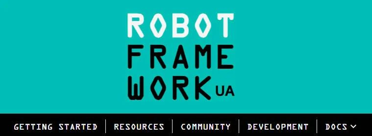
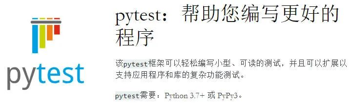

## Robot Framework
作为最重要的Python测试框架之一，Robot Framework主要被用在测试驱动(test-driven)类型的开发与验收中。  虽然是由Python开发而来，但是它也可以在基于.Net的IronPython和基于Java的Jython上运行。同时，作为一个Python框架，Robot还能够兼容诸如Windows、MacOS、以及Linux等平台。

### 使用先决条件
在使用Robot Framework(RF)之前，需要先安装Python 2.7.14及以上的版本。推荐使用Python 3.6.4，以确保适当的注释能够被添加到代码段中，并能够跟踪程序的更改。同时，还需要安装Python包管理器--pip。 当然，也必须下载相应的开发框架，例如：在开发者圈子里比较流行的PyCharm社区版。另外，由于其代码段本身并不依赖于任何IDE，因此完全可以沿用手头既有的IDE工具。

### 优点

- 通过使用关键字驱动测试(keyword-driven-test)的方法，它能够帮助测试人员轻松地创建具有可读性的测试用例，进而简化了整个自动化的过程。
- 用户能够轻松地测试数据中的语法。
- 因为是由各种通用工具和测试库所组成，所以它不但拥有庞大的生态系统，而且可以在单独的项目中使用其各个元素。
- 由于拥有许多类型的API，因此该框架具有高度的可扩展性。
- 虽然并非内置功能，但是Robot可以通过Selenium Grid(请参见[https://www.lambdatest.com/blog/lambdatest-now-live-with-an-online-selenium-grid-for-automated-cross-browser-testing/](https://www.lambdatest.com/blog/lambdatest-now-live-with-an-online-selenium-grid-for-automated-cross-browser-testing/))，来帮助用户运行各种并行测试。

### 缺点
虽然有着上述各种便利，但是Robot Framework在创建自定义的HTML报告方面比较繁琐。顶多能用它来生成xUnit格式的简短报告。 另外，Robot Framework在并行测试方面也并不见长。

### Robot的特点与竞品比较
由于Robot具有丰富的内置库，并能使用更为简单的面向测试的DSL(Domain Specific Language)，因此如果是自动化测试领域的新手，并且缺乏开发经验的话，那么将它作为Python测试框架要比下面将要提到的Pytest或Pyunit，更容易上手一些。当然，如果需要开发复杂的自动化框架，那么还请使用Pytest、或其他类型的Python框架。

## Pytest
适用于多种软件测试的Pytest，是另一个Python类型的自动化测试框架。  凭借着其开源和易学的特点，该工具经常被QA(质量分析)团队、开发团队、个人团队、以及各种开源项目所使用。鉴于Pytest具有“断言重写(assert rewriting)”之类的实用功能，许多大型互联网应用，如Dropbox和Mozilla，都已经从下面将要提到的unittest(Pyunit)切换到了Pytest之上。

### 使用先决条件
除了基本的Python知识，用户并不需要更多的技术储备。另外，用户只需要有一台带有命令行界面的测试设备，并且安装好了Python包管理器、以及可用于开发的IDE工具。

### 优点

- 过去，开发人员必须将他们的测试包含在各种大型的类中。如今，Pytest可以让用户写出更为紧凑的测试套件。
- 其他的测试工具会要求开发或测试人员使用调试器，或以日志检查的方式检测某个特定值的来源。而用户在用Pytest来编写测试用例时，完全可以将所有的值都存储在测试用例之中，直到再获悉有哪些值失败了、以及哪些值得到了断言。
- 由于涉及到的样板代码(boilerplate code)并不多，因此用户能够容易地编写和理解各种测试。
- 测试夹具(Fixture)函数常被用来向测试函数添加某个参数，并返回不同的值。在Pytest中，可以通过使用一个夹具来模块化另外一个。同时，用户可以使用多个夹具，在无需重写测试用例的情况下，将测试覆盖到所有参数的组合。
- Pytest开发人员通过发布各种实用插件，来保持框架的可扩展性。例如：pytest-xdist可以在不使用其他测试器的情况下，被用于执行并行测试。同时，单元测试也可以在无需复制任何代码的情况下，实现参数化。
- 通过为开发人员提供各种特殊的例程，它能够使得测试用例的编写更为简单、更不易出错，同时代码也会变得更短、更易被理解。

### 缺点
上述提及的特殊例程，也意味着用户必须放弃一定的兼容性。虽然方便了用户编写测试用例，但是这些用例却无法与任何其他的测试框架一起被使用。

### Pytest的特点与竞品比较
就编写功能性测试用例和开发复杂的框架而言，Pytest胜过下面将要提到的UnitTest。不过，它和Robot Framework类似，仅适用于开发出简单的测试框架。

## UnitTest/PyUnit
受到了JUnit启发的UnitTest/PyUnit，也是一种标准化的针对单元测试的Python类自动化测试框架。它的基类TestCase提供了各种断言方法、以及所有清理和设置的例程。因此，TestCase子类中的每一种方法都是以“test”作为名词前缀，以标识它们能够被作为测试用例所运行。用户可以使用load方法和TestSuite类来分组、并加载各种测试。 当然，也可以通过联合使用，来构建自定义的测试运行器。正如使用Junit去测试Selenium那样，UnitTest也会用到UnitTest-sml-reporting、并能生成各种XML类型的报告。

### 使用先决条件
由于UnitTest默认使用了Python，因此并不需要什么先决条件。除了需要具备Python框架的基本知识，也可以额外地安装pip、以及用于开发的IDE工具。

### 优点

- 开发人员并不需要安装任何其他的模块。
- UnitTest是xUnit的衍生产品，其工作原理与其他xUnit框架十分类似。因此对于那些没有过硬Python背景的人来说，也能很快地上手。
- 用户能够以更为简单的方式运行单个测试用例。只需在终端上预定好名称，该框架便可灵活地执行各种用例的测试，并产生精炼的输出。
- 它能够在几毫秒内生成各种测试报告。

### 缺点
虽然该框架常用snake_case来命名各种Python代码，但是由于它源自Junit，因此仍保留了一些传统的camelCase命名方法。这往往会让人产生混淆。 由于它过多地支持了抽象方法，因此造成了测试代码的目的有时不够清晰。需要大量的样板代码。

### PyUnit的特点与竞品比较
和部分Python开发人员的观点相似：Pytest能够培养测试人员以非常紧凑的方式编写出更好的自动化代码，这一编程习惯。尽管UnitTest是Python默认的自动化测试框架，但是其工作原理、及命名规则仍与标准的Python代码略有不同。同时，它也需要太多的样板代码。因此该框架并不太受欢迎。

## Behave
都知道：行为驱动开发(behavior-driven development，BDD)，是一种基于敏捷软件开发的方法。它能够鼓励开发人员、业务参与者和QA人员，三者之间的协作。作为另一种Python测试框架，Behave允许团队避开各种复杂的情况，去执行BDD测试。从本质上说，该框架与SpecFlow和Cucumber非常相似，常被用于执行自动化测试。用户可以通过简单易读的语言来编写测试用例，并能够在其执行期间粘贴到代码之中。而且，那些被设定的行为规范与步骤，也可以被重用到其他的测试方案中。

### 使用先决条件
任何具备Python基础知识的人都可以使用Behave。其他先决条件还包括： 必须先安装Python 2.7.14及以上的版本。 需要通过Python包管理器或pip来与Behave协作。 大多数开发人员会选择Pycharm作为开发环境，当然也可以选用其他的IDE工具。

### 优点

- 由于系统行为使用了半正式(semi-formal)语言、以及域词汇表(domain vocabulary)，因此Behave有助于在组织中保持一致性的行为。
- 让那些工作在不同模块上的开发团队，通过协调处理来具有类似的特征。
- 其构建的各个功能块能够执行各种测试用例。
- 由于具有更多值得用户推理和思考的细节，因此目标产品会具有更好的规范性。
- 根据类似的规范格式，它能够让项目经理和利益相关者，对开发团队和QA团队的输出具有更清楚地了解。

### 缺点
只适用于黑盒测试。

### Behave的特点与竞品比较
Behave最适合于诸如简单Web测试之类的黑盒测试。但是，对于那些具有复杂场景的集成测试与单元测试而言，Behave并不是一个很好的选择。作为Behave的替代品，一些开发与测试人员会推荐使用pytest-bdd。该工具融合了Pytest的所有优点，并实现了各种行为驱动测试的场景。 如果正在考虑使用Behave，那么可以借用《Behave with Selenium》(请参见[https://www.lambdatest.com/support/docs/display/TD/Behave+with+Selenium+-+Running+Behave+Automation+Scripts+on+LambdaTest+Selenium+Grid](https://www.lambdatest.com/support/docs/display/TD/Behave+with+Selenium+-+Running+Behave+Automation+Scripts+on+LambdaTest+Selenium+Grid))中提到的自动化脚本。

## Lettuce
Lettuce是另一种基于Cucumber和Python的行为驱动类自动化工具。Lettuce主要专注于那些具有行为驱动开发特征的普通任务。它不但简单易用，而且能够使得整个测试过程更流畅、甚至更有趣。

### 使用先决条件
需要安装带有IDE的Python 2.7.14、及以上的版本。当然，也可以使用Pycharm或任何其他IDE工具。同时，还需要安装Python包管理器。

### 优点

- 和其他BDD测试框架类似，Lettuce能够让开发人员创建多个场景，并用简单的自然语言去描述不同的功能。
- 根据类似的规范格式，开发与QA团队能够协调共事。
- 对于黑盒测试而言，Lettuce非常适合于那些行为驱动的测试用例。

### 缺点
为了成功地实现行为驱动测试，开发团队、QA人员以及利益相关者之间需要持续进行沟通。倘若缺乏此类沟通，则会产生流程模糊不清，并让团队遇到问题。竞品比较 在普通开发人员和自动化测试人员看来，Cucumber在执行BDD测试方面更为实用。而在Python开发和QA人员看来，Pytest-bdd才是的。Pytest的强大之处在于：其框架实现了紧凑且易于理解的代码，并能紧密地结合到行为驱动的测试之中。

## 结语
综上所述，在上述五种自动化测试的Python框架中，Pytest、Robot Framework和UnitTest可主要用于功能与单元测试，而Lettuce和Behave仅适用于行为驱动测试。通过进一步比较，对于功能测试而言，Pytest是的。如果是基于Python自动化测试的新手，那么Robot Framework是的入门工具。虽然其功能有所受限，但是它非常容易上手。对于基于Python的BDD测试而言，Lettuce和Behave同样优秀。不过，如果你已经有了一定的Pytest经验，那么请使用Pytest-bdd，希望本文能够帮助小伙伴们选出合适的Python测试框架，并顺利开展测试工作。
