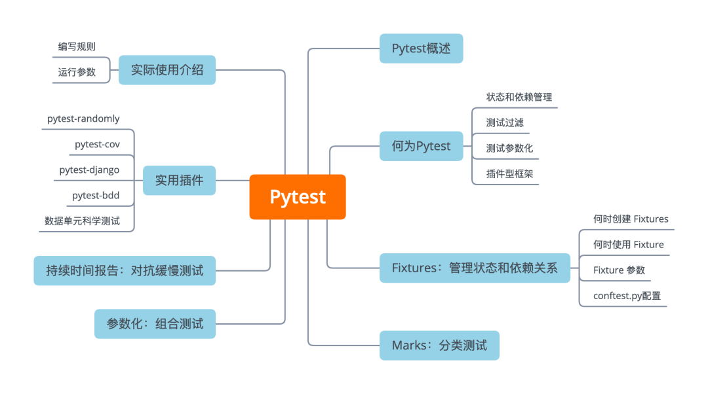

主要内容如下：

- Pytest的**优点**
- 怎么保证测试**无状态**
- 怎么让重复测试更**浅显易懂**
- 怎么命名或自定义组进行**分组**测试
- 如何创建和维护**可复用**的测试程序
- 怎么用**pytest**做数据科学的单元测试


<a name="zh0VP"></a>
## Pytest概述
首先需要安装pytest。与大多数Python软件包一样，可以使用 pip 从 PyPI 的中安装pytest。
```bash
$ python -m pip install pytest
```
Pytest命令现在将在安装环境中可用。<br />pytest是一个非常成熟的全功能的Python测试框架，主要特点有以下几点：

- 1、简单灵活，容易上手，文档丰富；
- 2、支持参数化，可以细粒度地控制要测试的测试用例；
- 3、能够支持简单的单元测试和复杂的功能测试，还可以用来做selenium/appnium等自动化测试、接口自动化测试（pytest+requests）;
- 4、pytest具有很多第三方插件，并且可以自定义扩展，比较好用的如pytest-selenium（集成selenium）、pytest-html（完美html测试报告生成）、pytest-rerunfailures（失败case重复执行）、pytest-xdist（多CPU分发）等；
- 5、测试用例的skip和xfail处理；
- 6、可以很好的和CI工具结合，例如jenkins
<a name="xviBy"></a>
## 何为 Pytest
如果曾经写过单元测试，那应该用过 Python 中的unittest模块，Pytest与它有点像。<br />目前，最流行的测试框架的代码都在解决方案 unittest 的一些问题，它们 pytest 本身就是一个生态、插件、Python 的测试体系。<br />和大多数框架一样的工具，在提供多种使用模式的时候一定会改变测试，随着测试，某些测试的开发可能会造成一些后果。时仍能保证测试效果和测试效率。<br />大多数测试都遵循**排布-行动-断言**(Arrange-Act-Assert)的模式。

1. **排布**或设置测试的条件
2. 通过调用某些函数或方法来**采取行动**
3. **断言**某些结束条件为真

测试框架通常与测试断言挂钩，以便在断言失败时提供信息。例如，unittest 提供了许多有用的断言工具，开箱即用。然而，即使是一个小的测试集也需要相当数量的模板代码。<br />写一个测试套件，只是为了确保 unittest 在项目中正常工作。可能想写一个总是通过的测试和一个总是失败的测试。
```python
# test_with_unittest.py
from unittest import TestCase
class TryTesting(TestCase):
    def test_always_passes(self):
        self.assertTrue(True)

    def test_always_fails(self):
        self.assertTrue(False)
```
然后可以使用unittest的discover选项从命令行中运行这些测试。
```bash
$ python -m unittest discover
F.
============================================================
FAIL: test_always_fails (test_with_unittest.TryTesting)
------------------------------------------------------------
Traceback (most recent call last):
  File "/.../test_with_unittest.py", line 9, in test_always_fails
    self.assertTrue(False)
AssertionError: False is not True

------------------------------------------------------------
Ran 2 tests in 0.001s

FAILED (failures=1)
```
一个测试通过，一个测试失败。虽然已经证明了unittest是有效的，但接下来需要：

1. 从unittest导入TestCase类
2. 创建TestCase的子类TryTesting
3. 在TryTesting中为每个测试写一个方法
4. 使用 `unittest.TestCase` 中的 `self.assert*` 方法下断言。

虽说这个代码量相当大，但因为这是**任何测试**所需要的**最低限度**的代码，最终仍然会重复写类似的代码。可以通过 pytest直接使用Python的assert关键字来简化这个工作流程。
```python
# test_with_pytest.py
def test_always_passes():
    assert True
def test_always_fails():
    assert False
```
不需要使用任何导入或类，因为可以使用 assert 关键字，也不需要学习或记住 unittest 中所有不同的 `self.assert*` 方法。如果可以写一个表达式，期望它的值为 "True"，那么pytest会测试它。
```bash
$ pytest
================== test session starts =============================
platform linux -- Python 3.7.3, pytest-5.3.0, py-1.8.0, pluggy-0.13.0
rootdir: /.../effective-python-testing-with-pytest
plugins: randomly-1.0.0, mock-1.2, cov-2.0.0
collected 2 items

test_with_pytest.py .F                                          [100%]

======================== FAILURES ==================================
___________________ test_always_fails ______________________________

    def test_always_fails():
>       assert False
E       assert False

test_with_pytest.py:5: AssertionError
============== 1 failed, 1 passed in 0.07s =========================
```
Pytest显示的测试结果与unittest不同，报告显示如下。

1. 系统状态，包括已经安装的Python、pytest和任何其他插件的版本
2. rootdir，或搜索配置和测试的目录。
3. 搜索、发现的测试数量

输出类似用unittest的句法之后的结果测试状态：

- **点**.表示测试通过。
- **F**表示着测试失败。
- **E**表示该测试出现异常。

**对于失败的测试，报告给出了失败的详细情况**。在上面的例子中，测试失败是因为assert False一直失败。<br />这里还有几个断言简短的例子。
```python
def test_uppercase():
    assert "loud noises".upper() == "LOUD NOISES"

def test_reversed():
    assert list(reversed([1, 2, 3, 4])) == [4, 3, 2, 1]

def test_some_primes():
    assert 37 in {
        num
        for num in range(1, 50)
        if num != 1 and not any([num % div == 0 for div in range(2, num)])
    }
```
Pytest的学习曲线比unittest要浅，因为不需要学习新的结构。对大多数人来说assert测试更容易理解。
<a name="ob8fB"></a>
### 状态和依赖管理
测试经常会依赖于代码中的一些对象的数据片断。在 unittest 中，可以将这些依赖提取到 `setUp()` 和 `tearDown()` 方法中，这样类中的每个测试都可以使用它们。但是这样做，可能会无意中使测试对特定数据或对象的依赖完全“**隐式**”。<br />随着时间的推移，隐式依赖关系会导致复杂的代码混乱，必须解开这些代码才能理解测试。测试应该帮助我们使代码更容易理解。如果测试本身是难以理解的，那么可能就有麻烦了!<br />Pytest采取了不同的方法。它引导我们进行**显式**依赖声明，由于[**fixture**](https://docs.pytest.org/en/latest/fixture.html)的可用性，这些依赖声明仍然可以重用。**pytest fixture是为测试套件创建数据或测试双精度副本或初始化某些系统状态的函数**。任何想要使用fixture的测试都**必须显式地接受它作为参数**，因此依赖关系总是预先声明的。<br />Fixture还可以使用其他fixture，同样将它们显式地声明为依赖项。即随着时间的推移，fixture可能变得笨重和模块化。尽管将fixture插入到其他fixture的能力提供了巨大的灵活性，但随着测试套件的增长，它也会使管理依赖关系变得更难了。
<a name="pSWDf"></a>
### 测试过滤
随着测试套件的增长，可能会发现我们只想在一个功能上运行几个测试，为此， pytest提供了一些方法。

- **按名字的过滤**。可以将pytest限制为只运行完全限定名称与特定表达式匹配的测试。可以使用 -k 参数来完成此操作
- **目录范围**。默认情况下，pytest将只运行那些在当前目录下的测试。
- **分类测试**：pytest可以包括或排除我们定义的特定类别的测试。可以用-m参数来实现这一点。

Pytest可以为测试创建**标记**，或自定义标签。一个测试可以有多个标签，可以用它们来细化控制哪些测试要运行。
<a name="gKYgU"></a>
### 测试参数化
当对那些处理这些数据或只是转换的函数进行测试时，可能会发现很多类似的测试，而他们可能只在被测试的代码的输入或输出方面有所不同。这需要复制测试代码，这样做有时会模糊我们试图测试的行为。<br />Unittest提供了一种将多个测试集合成一个的方法，但在结果报告中并不显示为单独的测试。如果一个测试失败了，其他的都通过了，那么整个测试组仍然会返回一个失败的结果。Pytest提供了自己的解决方案，每个测试都可以独立通过或失败。
<a name="Q19sX"></a>
### 插件型框架
Pytest最优秀的生态是它对定制和新一点的富集功能，几乎每段程序都可以破解和修改。因此，pytest的用户已经开发了一个丰富的有用插件的生态系统。<br />虽然有些pytest插件专注于特定的框架，如[**Django**](https://www.djangoproject.com/)，但其他插件适用于大多数测试套件。
<a name="dtV1y"></a>
## Fixtures：管理状态和依赖关系
**Pytest fixtures 是一种为测试提供数据、测试替身或状态设置的方式**。Fixtures是可以返回多种数值的函数。每个依赖于fixture的测试必须明确地接受该fixture作为参数。
<a name="WIqWM"></a>
### 何时创建 Fixtures
编写一个函数 `format_data_for_display()`，用来处理一个 API 端点返回的数据。这些数据代表了一个人的列表，每个人都有一个给定的名字、姓氏和工作职位。该函数应该输出一个字符串的列表，其中包括每个人的全名、冒号和他们的头衔。如下代码。
```python
def format_data_for_display(people):
    ...  # Implement this!

def test_format_data_for_display():
    people = [
        {
            "given_name": "云朵",
            "family_name": "Python",
            "title": "工程师",
        },
        {
            "given_name": "小猴子",
            "family_name": "Python",
            "title": "项目经理",
        },
    ]

    assert format_data_for_display(people) == [
        "云朵: 工程师",
        "小猴子: 项目经理",
    ]
```
现在，假设需要编写另一个函数，将数据转化为逗号分隔的数值，以便在Excel中使用。这个测试看起来会非常相似。
```
def format_data_for_excel(people):
    ... # Implement this!

def test_format_data_for_excel():
    people = [
        {
            "given_name": "云朵",
            "family_name": "Python",
            "title": "工程师",
        },
        {
            "given_name": "小猴子",
            "family_name": "Python",
            "title": "项目经理",
        },
    ]

    assert format_data_for_excel(people) == """
                                given,family,title
                                云朵,Python,工程师
                                小猴子,Python,项目经理
                                """
```
如果发现自己写的几个测试都使用了相同的底层测试数据，那么可以使用一个fixture，把重复的数据拉到一个单一的函数中，用`@pytest.fixture`来表示该函数是一个pytest的fixture。
```python
import pytest

@pytest.fixture
def example_people_data():
    return [
        {
            "given_name": "云朵",
            "family_name": "Python",
            "title": "工程师",
        },
        {
            "given_name": "小猴子",
            "family_name": "Python",
            "title": "项目经理",
        },
    ]
```
可以通过将其作为参数添加到测试中来使用该fixture。它的值将是该fixture函数的返回值。
```python
def test_format_data_for_display(example_people_data):
    assert format_data_for_display(example_people_data) == [
        "云朵 Python: 工程师",
        "小猴子 Python: 项目经理",
    ]

def test_format_data_for_excel(example_people_data):
    assert format_data_for_excel(example_people_data) == """
                                given,family,title
                                云朵,Python,工程师
                                小猴子,Python,项目经理
                                """
```
现在每个测试都明显缩短了，同时需要可以清晰地追溯到它所依赖的数据，一定要给fixture起一个具体的名字。这样，就可以在将来编写新的测试时，迅速确定是否要使用它。
<a name="WSvEO"></a>
### 何时使用 Fixture
Fixture适用于提取在多个测试中使用的相同的数据或对象，但并不适合于需要对数据进行轻微变化的测试。因为增加了一层间接性，在测试套件中加入fixture比加入普通数据或对象可能更糟。<br />当发现自己在整个项目中反复使用某个fixture时，可以将fixture从测试模块移动到更通用的fixture相关模块中。这样就可以将它们导入到任何需要它们的测试模块中。<br />Pytest 在整个目录结构中查找conftest.py 模块。每个conftest.py为 pytest 找到它的文件树提供配置。可以在整个文件的父目录和任何子目录中使用在特定 conftest.py 中定义的任何fixture。这是一个放置最广泛使用的fixture的好地方。
<a name="Jq0XQ"></a>
### Fixture 参数
Pytest中可以使用`@pytest.fixture`装饰器来装饰一个方法，被装饰方法的方法名可以作为一个参数传入到测试方法中。可以通过这种方式来完成测试之前的初始化操作，也可以返回数据给测试函数。
```python
import pytest
class TestFixture:
    @pytest.fixture(scope='function')
    def example_people_data():
        return [
            {
                "given_name": "云朵",
                "family_name": "Python",
                "title": "工程师",
            },
            {
                "given_name": "小猴子",
                "family_name": "Python",
                "title": "项目经理",
            },
        ]

    def test_format_data_for_display(example_people_data):
        assert format_data_for_display(example_people_data) == [
            "云朵 Python: 工程师",
            "小猴子 Python: 项目经理",
        ]
```
<a name="z9O6G"></a>
#### **Fixture 的 scope 参数**
根据作用范围大小范围划分，分别是：session>module>class>function。
```python
@pytest.fixture(scope='function') # scope的默认值是function
```

- function函数或者方法级别都会被调用
- class类级别调用一次
- module模块级别调用一次
- session是多个文件调用一次，可以跨.py文件调用，每个.py文件就是module

通过以下脚本可以测试一下scope的作用范围：<br />通过更改scope的枚举值，即可看到效果，可以看到`print('调用fillna方法')`在不同的scope选项下，打印出来的次数是不一样的。
```python
import pytest

@pytest.fixture(scope='function')
def example_people_data():
    return [
        {
            "given_name": "云朵",
            "family_name": "Python",
            "title": "工程师",
        },
        {
            "given_name": "小猴子",
            "family_name": "Python",
            "title": "项目经理",
        },
    ]

class TestFixture:
    def test_format_data_for_display(example_people_data):
        assert format_data_for_display(example_people_data) == [
            "云朵 Python: 工程师",
            "小猴子 Python: 项目经理",
        ]
```
<a name="BnUhE"></a>
#### **Fixture的autouse参数**
如果想让每条测试用例都添加fixture功能，那么可以使用`@pytest.fixture`里面的autouse参数，`autouse='true'`则会自动应用到所有用例中。
<a name="EvKGu"></a>
### conftest.py 配置
上面一个案例是在同一个.py文件中，多个用例调用一个数据样例example_people_data，如果有多个.py的文件都需要调用这个数据的话，那就不能把数据写到用例里面去了。<br />此时应该要有一个配置文件，单独管理一些预置的操作场景，pytest里面默认读取conftest.py里面的配置<br />conftest.py被pytest视为一个本地插件库，一般用于`scope='session'`级别的fixture。<br />使用conftest.py的规则：

1. conftest.py这个文件名是固定的，不可以更改
2. conftest.py与运行用例在同一个包下，并且该包中要有__init__.py文件
3. 使用的时候不需要导入conftest.py，pytest会自动加载，放到哪个package下，就在这个package内有效。

Fixture的另一个用途是**保护对资源的访问**。假设已经为处理API调用的代码编写了一个测试套件，并希望确保测试套件不会进行任何真正的网络调用，即使测试意外地执行了真正的网络调用代码。Pytest 提供了一个[**monkeypatch**](https://docs.pytest.org/en/latest/monkeypatch.html) 的fixture来替换值和行为，可以使用它来获得很好的效果:
```python
# conftest.py
import pytest
import requests

@pytest.fixture(autouse=True)
def disable_network_calls(monkeypatch):
    def stunted_get():
        raise RuntimeError("Network access not allowed during testing!")
    monkeypatch.setattr(
        requests, 
        "get",
        lambda *args,
        **kwargs: stunted_get())
```
通过在 conftest.py 中放置 `disable_network_calls()` 并添加 autouse=True 选项，可以确保在整个套件的每个测试中禁用网络调用。任何执行调用 `requests.get()` 的代码的测试都会引发 RuntimeError，表明会发生意外的网络调用。
<a name="Gvdra"></a>
## Marks：分类测试
在任何大型测试套件中，一些测试将不可避免地是缓慢的。例如，他们可能会测试超时行，不管是什么原因，当试图快速迭代一个新功能时，避免运行所有的慢速测试会很好。<br />Pytest可以为测试定义类别，并在运行套件时提供包括或排除类别的选项。可以用任何数量的类别来标记一个测试。<br />标记测试对于按子系统或依赖项对测试进行分类是非常有用的。例如，如果一些测试需要访问数据库，那么可以创建一个 `@pytest.mark.Database_access` 标记。<br />**提示**：因为我们可以给我们的标记起任何名字，所以很容易打错或记错标记的名字，pytest 会对它无法识别的标记发出警告。<br />给pytest命令加上`--strict-markers`选项可以确保在pytest配置中注册测试中的所有标记都。只要有任何未注册的标记，它都将阻止我们运行测试。<br />**如果想只运行那些需要数据库访问的测试**，那么可以使用`pytest -m database_access` 要运行所有的测试。可以使用`pytest -m "not database_access"`运行除了那些需要数据库访问的测试。甚至可以使用autouse fixture来限制数据库的访问，只对那些标有database_access的测试。<br />一些插件通过保护对资源的访问来扩展标记的功能。[**pytest-django**](https://pytest-django.readthedocs.io/en/latest/)插件提供了一个django_db标记。任何没有这个标记的测试在试图访问数据库时都会失败。第一个试图访问数据库的测试将触发Django测试数据库的创建。<br />添加 django_db 标记的要求促使你显式地声明依赖，即可以更快地运行不依赖数据库的测试，因为 `pytest -m "not django_db"` 会阻止测试触发数据库的创建。这样可以节省很多时间。<br />pytest提供了一些开箱即用的标记。

- sk``ip：无条件跳过测试
- `skipif`：表达式鉴别为真则跳过测试
- `xfail`：定测试失败，如果解决失败了，整轮测试的结果仍会通过
- `parametrize`（注意拼写）：创建多个不同值的测试当参数

可以通过运行pytest --markers查看完整的pytest标记列表。
<a name="yIDmu"></a>
## 参数化：组合测试
在本文前面部分，看到了如何使用pytest fixtrue 通过提取公共依赖项（fixture内容）来减少代码重复。同时也提到了一个fixtrue不适用的情况：当有输入和输出略有不同的测试时，就不那么有用了。此时可以[**parametrize**](http://doc.pytest.org/en/latest/example/parametrize.html)单个测试定义，并且pytest会根据指定的参数创建测试的变体。<br />写一个函数来判断一个字符串是否是回文，一组初始测试可以是这样的。
```python
def test_is_palindrome_empty_string():
    assert is_palindrome("")

def test_is_palindrome_single_character():
    assert is_palindrome("a")

def test_is_palindrome_mixed_casing():
    assert is_palindrome("Bob")

def test_is_palindrome_with_spaces():
    assert is_palindrome("Never odd or even")

def test_is_palindrome_with_punctuation():
    assert is_palindrome("Do geese see God?")

def test_is_palindrome_not_palindrome():
    assert not is_palindrome("abc")

def test_is_palindrome_not_quite():
    assert not is_palindrome("abab")
```
除了最后两个测试，所有其他测试都有相同的结构。
```python
def test_is_palindrome_<in some situation>():
    assert is_palindrome("<some string>")
```
可以使用`@pytest.mark.parametrize()`在这个结构中填入不同的值，大大减少测试代码。
```python
@pytest.mark.parametrize("palindrome", [
    "",
    "a",
    "Bob",
    "Never odd or even",
    "Do geese see God?",
])
def test_is_palindrome(palindrome):
    assert is_palindrome(palindrome)

@pytest.mark.parametrize("non_palindrome", [
    "abc",
    "abab",
])
def test_is_palindrome_not_palindrome(non_palindrome):
    assert not is_palindrome(non_palindrome)
```
`parametrize()`的第一个参数是一个以逗号分隔的参数名称字符串。第二个参数是一个代表参数值的元祖或单个值的列表。可以进一步参数化，将所有测试组合成一个测试。
```python
@pytest.mark.parametrize("maybe_palindrome, expected_result", [
    ("", True),
    ("a", True),
    ("Bob", True),
    ("Never odd or even", True),
    ("Do geese see God?", True),
    ("abc", False),
    ("abab", False),
])
def test_is_palindrome(maybe_palindrome, expected_result):
    assert is_palindrome(maybe_palindrome) == expected_result
```
这不仅缩短了代码，且使用参数化将测试数据从测试行为中分离出来，这样就可以清楚地知道测试在测试什么！
<a name="LrAWw"></a>
## 持续时间报告：对抗缓慢测试
每次从实现代码切换到测试代码的环境时，会产生一些开销，并且很慢。<br />前面提到过慢跑测试的时候，可以标识过滤掉测试。如果想提高测试速度，那么就很有必要知道哪些测试可以提供最大的改进。Pytest可以自动记录测试时间，并报告最慢的**top n**个测试。<br />给 pytest 命令加上 `--durations` 选项把持续时间报告加到测试结果里。`--durations`接受一个整数类型n，并将报告最慢的n个测试次数。报告内容跟在测试结果后面。
```bash
$ pytest --durations=3
3.03s call     test_code.py::test_request_read_timeout
1.07s call     test_code.py::test_request_connection_timeout
0.57s call     test_code.py::test_database_read
======================== 7 passed in 10.06s ==============================
```
持续时间报告中出现的每个测试都是加速项目，因为他们花费的时间已经超过了整体平均水平。<br />注意，有些测试可能会有一个看不见的设置开销。在前面提到，第一个标有django_db的测试会触发Django测试数据库的创建。持续时间报告反映了触发数据库创建的测试中设置数据库的时间，这可能会产生误导。
<a name="h2M3v"></a>
## 实用插件
在本文的前面，已经了解了一些有价值的pytest插件，可以在下面更深入地探索这些和其他一些插件。
<a name="FtUWB"></a>
### pytest-randomly
[**pytest-randomly**](https://github.com/pytest-dev/`pytest-randomly)做了一件看似简单但很有价值的事情：它迫使测试以随机的顺序运行。<br />这样可以发现那些依赖于以特定顺序运行的测试，这意味着它们对其他测试有一个**有状态的依赖性**。不太可能在pytest中从头开始构建测试套件，它更有可能发生在我们迁移到pytest的测试套件中。<br />该插件将在配置描述中打印一个种子值，可以使用这个值，在尝试修复问题时，以同样的顺序运行测试。
<a name="H69me"></a>
### pytest-cov
如果衡量测试对实现代码的覆盖程度，可能会使用[**coverage**](https://coverage.readthedocs.io/)包。[**pytest-cov**](https://pytest-cov.readthedocs.io/en/latest/)集成了coverage，所以可以运行`pytest --cov`来查看测试覆盖率报告。
<a name="g8KK8"></a>
### pytest-django
[**pytest-django**](https://pytest-django.readthedocs.io/en/latest/)为处理Django测试提供了一些有用的fixtures 和 marks。在本文的前面看到了django_db标记，而rf fixture提供了对Django的[**RequestFactory**](https://docs.djangoproject.com/en/3.0/topics/testing/advanced/#django.test.RequestFactory)实例的直接访问。settings fixture提供了一个快速设置或覆盖Django设置的方法。这对Django测试效率是一个很大的提升！
<a name="AGCBJ"></a>
### pytest-bdd
pytest可以用来运行传统单元测试范围以外的测试。行为驱动开发（BDD）鼓励编写可能的用户行为和期望的纯语言描述，然后可以用它来决定是否实现一个特定的功能。[**pytest-bdd**](https://pytest-bdd.readthedocs.io/en/latest/)帮助我们使用[**Gherkin**](http://docs.behat.org/en/v2.5/guides/1.gherkin.html)为我们的代码编写功能测试。<br />可以通过这个广泛的[**第三方插件列表**](http://plugincompat.herokuapp.com/)查看哪些其他插件可用于pytest。
<a name="pI1d5"></a>
### 数据单元科学测试
数据科学从业者，特别是加速，正常的错误是不写单元测试犯结果。起码可以看下输入是否正常，其实大部分数据科学项目都是从数据处理开始的。<br />项目不同但做一些通用的测试也不同。
<a name="kxxzt"></a>
#### **缺失值**
```python
#catch missing values assert 
df['column'].isna().sum()<1
```
<a name="Wo7JZ"></a>
#### **重复值**
```python
# check there is no duplicate 
assert len(df['id'].unique())==df.shape[0]
assert df.groupby(['date','id']).size().max()==1
```
<a name="ONWZJ"></a>
#### **数据形状**
```python
# have data for all ids? 
assert df['id'].unique().shape[0] == len(ids)

# function returns have shapes as expected 
assert all([some_funtion(df).shape == df[0].shape for df in dfs])
```
<a name="EKReQ"></a>
#### **取值范围**
```python
assert df.groupby('date')['percentage'].sum()==1 
assert all (df['percentage']<=1)
assert df.groupby('name')['budget'].max()<=1000
```
<a name="bz2RP"></a>
#### **连接质量**
[**d6tjoin**](https://github.com/d6t/d6tjoin)可以检查连接质量。
```python
assert d6tjoin.Prejoin([df1,df2],['date','id']).is_all_matched()
```
<a name="PnpGZ"></a>
#### **处理函数**
```python
assert preprocess_function("name\t10019\n")==["name",10019]
assert preprocess_missing_name("10019\n") is None
assert preprocess_text("Do you Realize those are genetically modified food?" ) == ["you","realize","gene","modify","food"]
```
<a name="Xt65L"></a>
## 实际使用介绍
<a name="OeCWS"></a>
### 编写规则
编写pytest测试样例非常简单，只需要按照下面的规则：

- 测试文件以test_开头(或者以_test结尾) pytest会找当前以及递归查找子文件夹下面所有的test__.py或__test.py的文件，把其当作测试文件（除非显式指定文件所在路径）
- 测试类名称以Test开头，并且不能带有init方法 如果类名称以Test开头的class类中包含了init方法，则会触发告警，提示PytestCollectionWarning: cannot collect test class 'TestXXX'
- 测试函数以test_开头
- 断言使用基本的assert即可
```python
# -*- coding:utf-8 -*-
# pytest1.py
import pytest

@pytest.fixture(scope='function')
def setup_function(request):
    def teardown_function():
        print("teardown_function called.")
    request.addfinalizer(teardown_function)  # 此内嵌函数做teardown工作
    print('setup_function called.')

@pytest.fixture(scope='module')
def setup_module(request):
    def teardown_module():
        print("teardown_module called.")
    request.addfinalizer(teardown_module)
    print('setup_module called.')

@pytest.mark.website
def test_1(setup_function):
    print('Test_1 called.')

def test_2(setup_module):
    print('Test_2 called.')

def test_3(setup_module):
    print('Test_3 called.')
    assert 2==1+1              # 通过assert断言确认测试结果是否符合预期
```
<a name="FFygY"></a>
#### **Setup和teardown操作**
这里补充一个setup和teardown操作相关知识。<br />次条中unittest里面用前置和后置setup和teardown非常好用，在每次用例开始前和结束后都去执行一次。

- setup，在测试函数或类之前执行，完成准备工作，例如数据库链接、测试数据、打开文件等
- teardown，在测试函数或类之后执行，完成收尾工作，例如断开数据库链接、回收内存资源等
- 备注：也可以通过在fixture函数中通过yield实现setup和teardown功能

当然还有更高级一点的setupClass和teardownClass，需配合@classmethod装饰器一起使用，在做selenium自动化的时候，它的效率尤为突出，可以只启动一次浏览器执行多个用例。<br />Pytest框架也有类似于setup和teardown的语法，并且还不止这四个
<a name="OI5RS"></a>
##### 用例运行级别

- 模块级（setup_module/teardown_module）开始于模块始末，全局的
- 函数级（setup_function/teardown_function）只对函数用例生效（不在类中）
- 类级（setup_class/teardown_class）只在类中前后运行一次(在类中)
- 方法级（setup_method/teardown_method）开始于方法始末（在类中）
- 类里面的（setup/teardown）运行在调用方法的前后
<a name="wMOP7"></a>
##### Fixture的优势
Firture相对于setup和teardown来说应该有以下几点优势

- 命名方式灵活，不局限于setup和teardown这几个命名
- conftest.py 配置里可以实现数据共享，不需要import就能自动找到一些配置
- scope="module" 可以实现多个.py跨文件共享前置, 每一个.py文件调用一次
- scope="session" 以实现多个.py跨文件使用一个session来完成多个用例
<a name="xsDag"></a>
### 运行参数
可能会有这样的疑问，现在大家都在用类似Pycharm的IDE工具，为什么还要去学习命令行运行的参数和方式呢？<br />Pytest框架是一个测试框架，如果需要集成到jenkins上的话，是需要用命令行的方式去执行的，有时候要执行多个用例的时候，用命令行文件比较方便。<br />Pytest可以在命令行执行，在命令行执行的时候，可以带很多参数，下面介绍几种常用到的参数用法：（使用pytest --help可以看到命令参数的帮助文档）

- 不带参数执行

使用方法：pytest 或者 py.test  ,  将会读取当前路径下所有符合规则的文件，类，方法，函数全部执行

- -v参数

打印详细运行的日志信息，方便定位问题

- -s参数

可以在控制台输出结果，当代码中有用到print语句输出信息时，不加这个参数的话，控制台是不会显示print的内容的

- -k参数

使用该参数可以指定运行满足要求的用例。用法如下：
```python
pytest -k "类名"
pytest -k "方法名"
pytest -k "类名 and not 方法名"
```
**注意: -k参数后面跟的引号只能用双引号""，不能用单引号''，否则不会识别到用例，运行会报错**

- -x参数

遇到用例执行失败或断言失败，立即停止运行，不执行后面的用例。

- --maxfail参数

设置允许失败的用例数，超过这个阈值时，停止运行。<br />pytest --maxfail=num ，失败用例数>=num时，停止运行

- -m参数

按照标签名运行所有包含某个标签的用例，需要在测试用例上面都加上装饰符@pytest.mark.标记名。使用-m选项，可以使表达式指定多个标记名。使用-m "mark1 and mark2"可以同时选中带有这两个标记的所有测试用例。使用-m "mark1 and not mark2"则会选中带mark1标记且不带mark2标记的测试用例，使用-m "mark1 or mark2"则会选中带有mark1或者mark2的所有测试用例。<br />用例标记使用用法如下：
```python
import pytest
@pytest.mark.mark1
@pytest.mark.mark2
def test_a002(self):
    print('this is test_a002 method')
```
使用-m参数运行时，有可能会提示
<a name="WCzD4"></a>
## 总结
pytest提供了一套核心的生产力功能，可以过滤和优化测试，同时还有一个灵活的插件系统，可以进一步扩展其价值。无论是有一个庞大的遗留unittest套件，还是要从头开始一个新项目，pytest都能为我们提供不少的帮助。<br />在本文中，一起学会了如何使用：

- 用于处理测试依赖性、状态和可重用功能的**fixture**
- 对测试进行分类并限制对外部资源的访问的**标记**
- 用于减少测试之间重复代码的**参数化**
- 确定最慢的测试的**持续时间**
- 用于与其他框架和测试工具集成的**插件**
<a name="tgrWQ"></a>
### 参考资料
fixture: [https://docs.pytest.org/en/latest/fixture.html](https://docs.pytest.org/en/latest/fixture.html)<br />Django: [https://www.djangoproject.com/](https://www.djangoproject.com/)<br />monkeypatch: [https://docs.pytest.org/en/latest/monkeypatch.html](https://docs.pytest.org/en/latest/monkeypatch.html)<br />pytest-django: [https://pytest-django.readthedocs.io/en/latest/](https://pytest-django.readthedocs.io/en/latest/)<br />parametrize: [http://doc.pytest.org/en/latest/example/parametrize.html](http://doc.pytest.org/en/latest/example/parametrize.html)<br />pytest-randomly: [https://github.com/pytest-dev/`pytest-randomly](https://github.com/pytest-dev/`pytest-randomly)<br />coverage: [https://coverage.readthedocs.io/](https://coverage.readthedocs.io/)<br />pytest-cov: [https://pytest-cov.readthedocs.io/en/latest/](https://pytest-cov.readthedocs.io/en/latest/)<br />pytest-django: [https://pytest-django.readthedocs.io/en/latest/](https://pytest-django.readthedocs.io/en/latest/)<br />RequestFactory: [https://docs.djangoproject.com/en/3.0/topics/testing/advanced/#django.test.RequestFactory](https://docs.djangoproject.com/en/3.0/topics/testing/advanced/#django.test.RequestFactory)<br />pytest-bdd: [https://pytest-bdd.readthedocs.io/en/latest/](https://pytest-bdd.readthedocs.io/en/latest/)<br />Gherkin: [http://docs.behat.org/en/v2.5/guides/1.gherkin.html](http://docs.behat.org/en/v2.5/guides/1.gherkin.html)<br />第三方插件列表: [http://plugincompat.herokuapp.com/](http://plugincompat.herokuapp.com/)<br />d6tjoin: [https://github.com/d6t/d6tjoin](https://github.com/d6t/d6tjoin)
