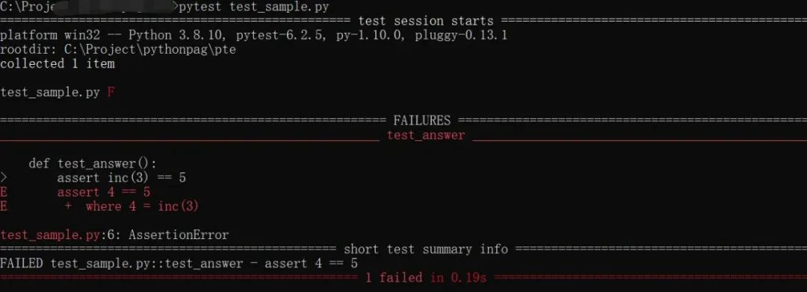
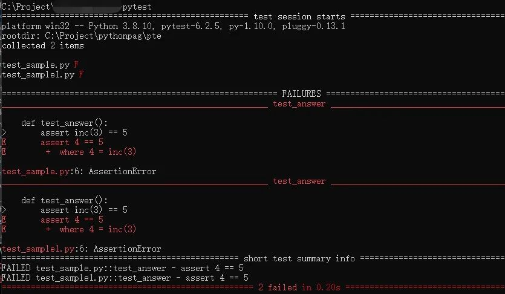

Python 单元测试
<a name="GwiOE"></a>
# 1、Pytest简介
<a name="UYYoi"></a>
## 1.1 入门阶段
<a name="Y3DpR"></a>
### 1.1.1 运行测试用例
一切的理论，都是为了实战准备的， 所以第一步，先上例子，直接实战！<br />编写简单的测试用例，文件名称为"test_sample.py"
```python
# pytest test_sample.py
def inc(x):
    return x + 1

def test_answer():
    assert inc(3) == 5
```
这两个方法都非常的简单，

- `test_answer()`对目标函数inc进行断言；- pytest test_sample.py 运行测试用例，看向运行结果

<br />测试结果显示，运行了一个测试用例，结果是红色，表示失败。错误信息显示，在代码的第7行抛出AssertionError。可以更改一下代码，让测试用例绿色通过。<br />**这个测试用例涉及pytest的3个简单的规则:**

- 测试模块以 `test_` 前缀命名- 
- 测试用例(函数)同样以 `test_` 前缀命名- 
- 结果判断使用 `assert` 断言即可
<a name="ONWZZ"></a>
### 1.1.2. 异常处理
捕获异常，及异常处理，是每段代码中必要条件， 当然，pytest也支持异常的捕获， 方法为：**使用 with + **`**pytest.raises**`** 捕获目标函数的异常**:
```python
# -*- coding:utf-8 -*-

import pytest

def f():
    raise SystemExit(1)

def test_mytest():
 #捕获异常
    with pytest.raises(SystemExit):
        f()
```
<a name="hjDCY"></a>
### 1.1.3 测试类
当然，pytest也支持测试类， 测试类的作用：用来做测试用来分组
```python
# -*- coding:utf-8 -*-

class TestClass:
 #test_开头
    def test_one(self):
        x = "this"
        assert "h" in x
 #test_开头
    def test_two(self):
        x = "hello"
        assert hasattr(x, "check")
```
这里，都是以`test_`开头， 跟**unittest**都是一样。<br />**如果不是**`**test_**`**开头，则无法被调用的**。
<a name="IS82f"></a>
### 1.1.4 自动运行测试脚本
如果一个suit文件夹有多个测试用例脚本， 只需要输入一个 pytest，即可运行全部测试脚本。<br />**如下图**<br /><br />**这就是开启了懒人模式**。
<a name="vH4OU"></a>
## 1.2 进阶技巧
<a name="vhMSm"></a>
### 1.2.1 parametrize
俗话说，**代码不参数，变参泪两行！** 所以，能参数的时候，就尽量参数，**不管重构苦不苦**。先看下parametrize的用法，如下：<br />**在测试用例的前面加上：**`**@pytest.mark.parametrize("参数名",列表数据)**`** 参数名：用来接收每一项数据，并作为测试用例的参数。列表数据：一组测试数据。**<br />**看例子** 不添加parametrize，看看怎么写测试用例
```python
def test_eval():
    assert eval("3+5") == 8
    assert eval("'2'+'4'") == "24"
    assert eval("6*9") == 54
```
看着很麻烦， 再用一下parametrize优化一下，看看是否简洁很多
```python
#使用parametrize对测试用例参数化
@pytest.mark.parametrize("test_input,expected", [
    ("3+5", 8),
    ("'2'+'4'", "24"),
    ("6*9", 54)
])
def test_eval_1(test_input, expected):
    assert eval(test_input) == expected
```
看了这段代码，就很简洁了。再来看看，parametrize做了什么。

- 先调整测试函数的参数为输入和期望；
- 然后在parametrize填写参数值；
- 运行时候会自动进行函数参数赋值。

这样再增加测试条件，不需要改动test_eval_1的函数体，增加条件数组就可以了。
<a name="pWP0L"></a>
### 1.2.2. mark
mark就是一个标签，标记哪些测试用例执行，哪些不执行。
```python
#标签
@pytest.mark.slow
def test_mark():
    print("test mark")
    # 模拟运行很耗时的测试用例
    time.sleep(10)
    assert 5 == 5
```
然后目录下增加 pytest.ini 文件，对pytest进行配置:
```
[pytest]
markers =
    slow: marks tests as slow (deselect with '-m "not slow"')
```
使用下面命令可以跳过标记的函数，加快测试速度：
```bash
pytest test_sample.py -m "not slow"
```
也可以仅仅运行标记的函数
```bash
pytest  -m slow
```
<a name="vGxQx"></a>
### 1.2.3 fixture
fixture 就类似于unittest的 setup/teardown，但是功能比这个强大一些。举个例子
```python
# -*- coding:utf-8 -*-

import pytest

#设置fixture
@pytest.fixture
def first_entry():
    return "a"


#设置fixture
@pytest.fixture
def second_entry():
    return 2


#设置fixture
@pytest.fixture
def order(first_entry, second_entry):
    return [first_entry, second_entry]


#设置fixture
@pytest.fixture
def expected_list():
    return ["a", 2, 3.0]


def test_string(order, expected_list):
    order.append(3.0)
    
    # 断言
    assert order == expected_list
```
当然了，fixture还可以嵌套，order嵌套了first_entry和second_entry。<br />那测试数据库写入的用例，需要一个数据库链接，怎么办呢？这个，也不难，fixture也可以搞定。在测试用例目录编写conftest.py
```python
@pytest.fixture
def database_connection():
    # coding...
    ...
```
<a name="xg19h"></a>
### 1.2.4 plugin&&hook
可以编写pytest的插件plugin和hook对pytest进行扩展。先创建一个目录a，然后再目录a中创建conftest.py和test_sub.py 两个文件。
```python
#在目录a下创建conftest.py
def pytest_runtest_setup(item):
    # 在目录a下运行每个用例
    print("setting up", item)
        
# 在目录a下创建test_sub.py
def test_sub():
    pass
```
使用 `pytest a/test_sub.py --capture=no` 会加载编写的pluging和hook，在console中可以看到下面字样:
```bash
...
a/test_sub.py setting up &lt;Function test_sub&gt;
```
**注意**：**使用pytest_runtest_setup可以实现测试框架中的setup类似功能。**
