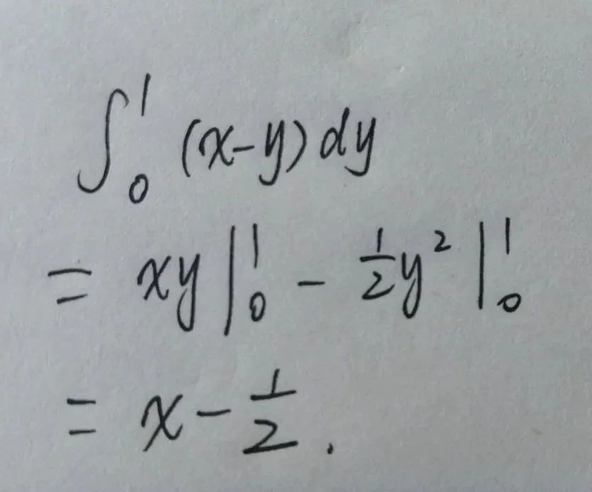

Python<br />SymPy 是一个 Python 库，专注于符号数学，它的目标是成为一个全功能的计算机代数系统，同时保持代码简洁、易于理解和扩展。<br />举一个简单的例子，比如说展开二次方程：
```python
from sympy import *
x = Symbol('x')
y = Symbol('y')
d = ((x+y)**2).expand()
print(d)
# 结果：x**2 + 2*x*y + y**2
```
可以随便输入表达式，即便是十次方，它都能轻易的展开，非常方便：
```python
from sympy import *
x = Symbol('x')
y = Symbol('y')
d = ((x+y)**10).expand()
print(d)
# 结果：x**10 + 10*x**9*y + 45*x**8*y**2 + 120*x**7*y**3 + 210*x**6*y**4 + 252*x**5*y**5 + 210*x**4*y**6 + 120*x**3*y**7 + 45*x**2*y**8 + 10*x*y**9 + y**10
```
下面就来讲讲这个模块的具体使用方法和例子。
<a name="h9sYk"></a>
## 1、准备
```bash
pip install Sympy
```
<a name="p2QMQ"></a>
## 2、基本使用
<a name="VD7Y3"></a>
### 简化表达式(化简)
sympy支持三种化简方式，分别是普通化简、三角化简、指数化简。<br />普通化简 `simplify()`：
```
from sympy import *
x = Symbol('x')
d = simplify((x**3 + x**2 - x - 1)/(x**2 + 2*x + 1))
print(d)
# 结果：x - 1
```
三角化简 `trigsimp()`：
```
from sympy import *
x = Symbol('x')
d = trigsimp(sin(x)/cos(x))
print(d)
# 结果：tan(x)
```
指数化简 `powsimp()`：
```python
from sympy import *
x = Symbol('x')
a = Symbol('a')
b = Symbol('b')
d = powsimp(x**a*x**b)
print(d)
# 结果：x**(a + b)
```
<a name="mfYc6"></a>
### 解方程 `solve()`
第一个参数为要解的方程，要求右端等于 0，第二个参数为要解的未知数。<br />如一元一次方程：
```python
from sympy import *
x = Symbol('x')
d = solve(x * 3 - 6, x)
print(d)
# 结果：[2]
```
二元一次方程：
```python
from sympy import *
x = Symbol('x')
y = Symbol('y')
d = solve([2 * x - y - 3, 3 * x + y - 7],[x, y])
print(d)
# 结果：{x: 2, y: 1}
```
<a name="qrjgA"></a>
### 求极限 `limit()`
dir='+'表示求解右极限，dir='-'表示求解左极限：
```python
from sympy import *
x = Symbol('x')
d = limit(1/x,x,oo,dir='+')
print(d)
# 结果：0
d = limit(1/x,x,oo,dir='-')
print(d)
# 结果：0
```
<a name="Z5dWR"></a>
### 求积分 `integrate()`
先试试求解不定积分：
```
from sympy import *
x = Symbol('x')
d = integrate(sin(x),x)
print(d)
# 结果：-cos(x)
```
再试试定积分：
```python
from sympy import *
x = Symbol('x')
d = integrate(sin(x),(x,0,pi/2))
print(d)
# 结果：1
```
<a name="YXP55"></a>
### 求导 `diff()`
使用 diff 函数可以对方程进行求导：
```python
from sympy import *
x = Symbol('x')
d = diff(x**3,x)
print(d)
# 结果：3*x**2

d = diff(x**3,x,2)
print(d)
# 结果：6*x
```
<a name="jrNKS"></a>
### 解微分方程 `dsolve()`
以 y′=2xy 为例：
```python
from sympy import *
x = Symbol('x')
f = Function('f')
d = dsolve(diff(f(x),x) - 2*f(x)*x,f(x))
print(d)
# 结果：Eq(f(x), C1*exp(x**2))
```
<a name="MPLNF"></a>
## 3、实战一下
如果下面这个积分用 Python 应该怎么写呢？<br />
```python
from sympy import *
x = Symbol('x')
y = Symbol('y')
d = integrate(x-y, (y, 0, 1))
print(d)
# 结果：x - 1/2
```
为了计算这个结果，integrate 的第一个参数是公式，第二个参数是积分变量及积分范围下标和上标。<br />运行后得到的结果便是 x - 1/2 与预期一致。<br />如果大家也有求解微积分、复杂方程的需要，可以试试 sympy，它几乎是完美的存在。
