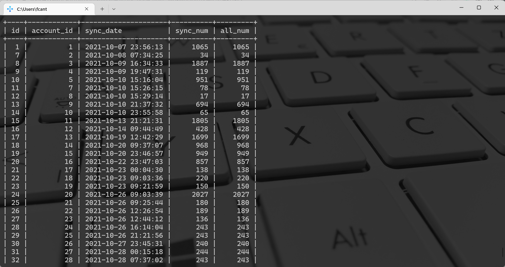

Python<br />用 MySQL 客户端查询数据的时候，是以下面这种格式显示的：<br /><br />内容展示的非常漂亮，而 Python 有一个第三方模块叫 prettytable，专门用来将数据以上面这种格式输出，来看一下用法。
<a name="PDay3"></a>
## 添加表头、添加行、添加列
类似于数据库中的表，由表头（或者说字段名），以及每一行的内容组成。
```python
from prettytable import PrettyTable

# 传入的 name、age、country 相当于表头
tb = PrettyTable(["name", "age", "country"])
# 调用 add_row 添加行记录
tb.add_row(["Jack Morrison", 49, "America"])
tb.add_row(["Shimada Genji", 35, "Japan"])
tb.add_row(["Shimada Hanzo", 38, "Japan"])
tb.add_row(["Angela Ziegler", 37, "Switzerland"])

print(tb)
"""
+----------------+-----+-------------+
|      name      | age |   country   |
+----------------+-----+-------------+
| Jack Morrison  |  49 |   America   |
| Shimada Genji  |  35 |    Japan    |
| Shimada Hanzo  |  38 |    Japan    |
| Angela Ziegler |  37 | Switzerland |
+----------------+-----+-------------+
"""
```
如果在编写的过程中，需要临时添加一列，prettytable 也是支持的。
```python
from prettytable import PrettyTable

tb = PrettyTable(["name", "age", "country"])
tb.add_row(["Jack Morrison", 49, "America"])
tb.add_row(["Shimada Genji", 35, "Japan"])
tb.add_row(["Shimada Hanzo", 38, "Japan"])
tb.add_row(["Angela Ziegler", 37, "Switzerland"])

# 调用 add_column 添加一列
tb.add_column("gender",
              ["male", "male", "male", "female"])
print(tb)
"""
+----------------+-----+-------------+--------+
|      name      | age |   country   | gender |
+----------------+-----+-------------+--------+
| Jack Morrison  |  49 |   America   |  male  |
| Shimada Genji  |  35 |    Japan    |  male  |
| Shimada Hanzo  |  38 |    Japan    |  male  |
| Angela Ziegler |  37 | Switzerland | female |
+----------------+-----+-------------+--------+
"""
```
输出内容是不是和 MySQL数据库类似呢。<br />此外 prettytable 还支持从 csv、数据库、html 等数据源中导入数据，但说实话，从数据源读取数据我们一般使用 pandas，并且还会伴随着数据处理。而使用 prettytable 只是为了让程序中产生的信息，能够以结构化的形式打印，很少会从文件或数据库里面读数据。
<a name="EA7zK"></a>
## 输出指定行、指定列
也可以输出 table 的指定行、指定列。
```python
from prettytable import PrettyTable

tb = PrettyTable(["name", "age", "country", "gender"])
tb.add_row(["Jack Morrison", 49, "America", "male"])
tb.add_row(["Shimada Genji", 35, "Japan", "male"])
tb.add_row(["Shimada Hanzo", 38, "Japan", "male"])
tb.add_row(["Angela Ziegler", 37, "Switzerland", "female"])
# 只输出 name 和 age 两列
# start 和 end 表示开始和结束的行数(从 0 开始)
print(tb.get_string(fields=["name", "age"],
                    start=1, end=3))
"""
+---------------+-----+
|      name     | age |
+---------------+-----+
| Shimada Genji |  35 |
| Shimada Hanzo |  38 |
+---------------+-----+
"""

# 此外可以用来进行排序
print(tb.get_string(sortby="age", reversesort=True))
"""
+----------------+-----+-------------+--------+
|      name      | age |   country   | gender |
+----------------+-----+-------------+--------+
| Jack Morrison  |  49 |   America   |  male  |
| Shimada Hanzo  |  38 |    Japan    |  male  |
| Angela Ziegler |  37 | Switzerland | female |
| Shimada Genji  |  35 |    Japan    |  male  |
+----------------+-----+-------------+--------+
"""
```
<a name="OdGRd"></a>
## 设置表格样式
表格也支持几种不同的样式，供我们选择。
```python
from prettytable import *

tb = PrettyTable(["name", "age", "country", "gender"])
tb.add_row(["Jack Morrison", 49, "America", "male"])
tb.add_row(["Shimada Genji", 35, "Japan", "male"])
tb.add_row(["Shimada Hanzo", 38, "Japan", "male"])
tb.add_row(["Angela Ziegler", 37, "Switzerland", "female"])

# 样式支持以下几种：
# DEFAULT、MSWORD_FRIENDLY、PLAIN_COLUMNS、RANDOM
# 之前的样式就是 DEFAULT
tb.set_style(MSWORD_FRIENDLY)
print(tb)
"""
|      name      | age |   country   | gender |
| Jack Morrison  |  49 |   America   |  male  |
| Shimada Genji  |  35 |    Japan    |  male  |
| Shimada Hanzo  |  38 |    Japan    |  male  |
| Angela Ziegler |  37 | Switzerland | female |
"""

tb.set_style(PLAIN_COLUMNS)
print(tb)
"""
     name             age          country          gender        
Jack Morrison          49          America           male         
Shimada Genji          35           Japan            male         
Shimada Hanzo          38           Japan            male         
Angela Ziegler         37        Switzerland        female     
"""

tb.set_style(RANDOM)
print(tb)
"""
;+++++++++++++++++++++++++++++++++++++++++++++++++++++++++++++++++++++;
.        name              age           country           gender     .
;+++++++++++++++++++++++++++++++++++++++++++++++++++++++++++++++++++++;
.   Jack Morrison           49           America            male      .
.   Shimada Genji           35            Japan             male      .
.   Shimada Hanzo           38            Japan             male      .
.   Angela Ziegler          37         Switzerland         female     .
;+++++++++++++++++++++++++++++++++++++++++++++++++++++++++++++++++++++;
"""
```
说实话，还是默认的 DEFAULT 样式最好看。
<a name="G1HN1"></a>
## 设置对齐方式
```python
from prettytable import *

tb = PrettyTable(["name", "age", "country", "gender"])
tb.add_row(["Jack Morrison", 49, "America", "male"])
tb.add_row(["Shimada Genji", 35, "Japan", "male"])
tb.add_row(["Shimada Hanzo", 38, "Japan", "male"])
tb.add_row(["Angela Ziegler", 37, "Switzerland", "female"])

# l 代表左对齐，c 代表居中，r 代表右对齐
# 默认居中
tb.align["name"] = "l"
tb.align["age"] = "c"
tb.align["country"] = "r"
print(tb)
"""
+----------------+-----+-------------+--------+
| name           | age |     country | gender |
+----------------+-----+-------------+--------+
| Jack Morrison  |  49 |     America |  male  |
| Shimada Genji  |  35 |       Japan |  male  |
| Shimada Hanzo  |  38 |       Japan |  male  |
| Angela Ziegler |  37 | Switzerland | female |
+----------------+-----+-------------+--------+
"""
```
<a name="JHgeL"></a>
## 设置边框样式
在 PrettyTable 中，边框由三个部分组成：横边框，竖边框，和边框连接符，我们都可以修改。
```python
from prettytable import *

tb = PrettyTable(["name", "age", "country", "gender"])
tb.add_row(["Jack Morrison", 49, "America", "male"])
tb.add_row(["Shimada Genji", 35, "Japan", "male"])
tb.add_row(["Shimada Hanzo", 38, "Japan", "male"])
tb.add_row(["Angela Ziegler", 37, "Switzerland", "female"])

# 是否显示边框，默认为True
tb.border = True
# 横边框
tb.horizontal_char = '^'
# 竖边框
tb.vertical_char = '>'
# 边框连接符
tb.junction_char='~'

print(tb)
"""
~^^^^^^^^^^^^^^^^~^^^^^~^^^^^^^^^^^^^~^^^^^^^^~
>      name      > age >   country   > gender >
~^^^^^^^^^^^^^^^^~^^^^^~^^^^^^^^^^^^^~^^^^^^^^~
> Jack Morrison  >  49 >   America   >  male  >
> Shimada Genji  >  35 >    Japan    >  male  >
> Shimada Hanzo  >  38 >    Japan    >  male  >
> Angela Ziegler >  37 > Switzerland > female >
~^^^^^^^^^^^^^^^^~^^^^^~^^^^^^^^^^^^^~^^^^^^^^~
"""
```
<a name="J44tv"></a>
## 小结
以上就是 PrettyTable 相关的内容，大部分情况下使用默认的样式即可。
