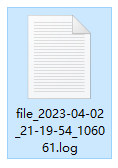
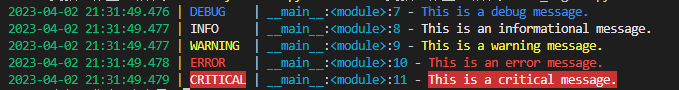
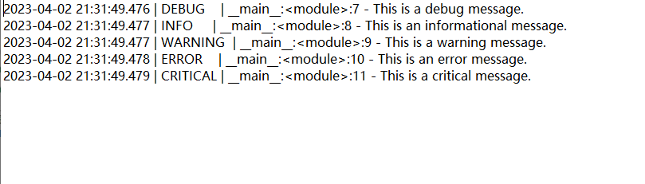

Python<br />
<a name="Ungpp"></a>
## 纯粹的loguru
loguru就是记录日志专用的，没有附带其他花里胡哨的功能。<br />而且并不设置`Handler`，`Formatter`，`Filter`，在loguru中用`add`函数就能实现完美替代。
```python
from loguru import logger

logger.add("file_1.log", rotation="500 MB")    # log文件达到500M就轮换
logger.add("file_2.log", rotation="12:00")     # 每天中午12点，生成新的log文件
logger.add("file_3.log", rotation="1 week")    # log文件保存一周后就开始轮换
logger.add("file_X.log", retention="10 days")  # log文件保存十天
logger.add("file_Y.log", compression="zip")    # 保存zip格式的压缩文件
```
还有，并不用担心日志文件名重复或没有时间戳辨别日期，只要这样就可以：
```python
logger.add("file_{time}.log")
```
就会本地生成一个这样名称的log文件：<br />
<a name="der4r"></a>
## loguru的核心功能
日志管理的核心功能，当然就是日志信息等级的记录了。<br />在日志记录中，不同的信息级别对应不同的重要性和严重性，通常使用以下几种日志等级：<br />DEBUG：最低级别的日志，用于调试信息的记录，通常包括变量、状态、方法调用等详细信息，以便开发人员进行调试。<br />INFO：一般信息的记录，用于记录应用程序正常运行的状态和事件，例如应用程序启动、连接数据库、执行任务等。<br />WARNING：警告级别的日志，用于记录可能会导致问题的情况，例如配置错误、API 调用失败等，但不影响应用程序正常运行。<br />ERROR：错误级别的日志，用于记录严重的问题和错误，例如应用程序崩溃、未处理的异常、数据库连接失败等。<br />CRITICAL：最高级别的日志，用于记录严重的问题和错误，例如系统崩溃、数据丢失等，需要立即处理。<br />这5个信息等级对应到loguru模块中:
```python
from loguru import logger

logger.debug("This is a debug message.")
logger.info("This is an informational message.")
logger.warning("This is a warning message.")
logger.error("This is an error message.")
logger.critical("This is a critical message.")
```
日志信息显示的颜色也很贴心的已经配成最常规的颜色：<br /><br />如果只要保存INFO以上级别的日志信息，通过设置 `logger.level = "INFO"` 来限制只记录特定级别的日志信息。
```python
from loguru import logger

logger.add("file.log", rotation="500 MB", retention="10 days", compression="zip")

logger.level = "INFO"

logger.debug("This is a debug message.")
logger.info("This is an informational message.")
logger.warning("This is a warning message.")
logger.error("This is an error message.")
logger.critical("This is a critical message.")
```
运行上方代码后，本地生成的log文件内的信息：<br />
