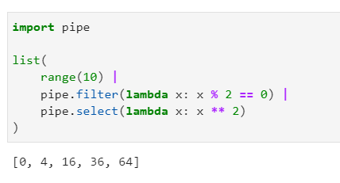
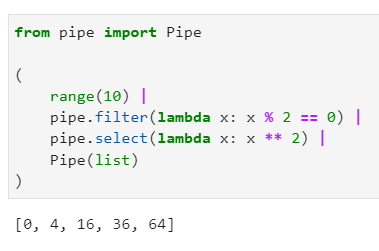
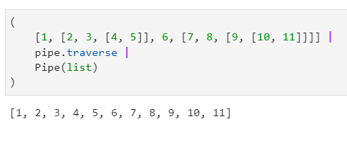
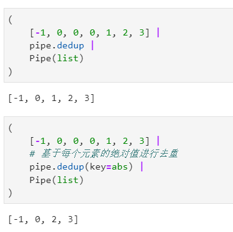
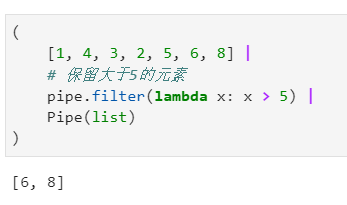
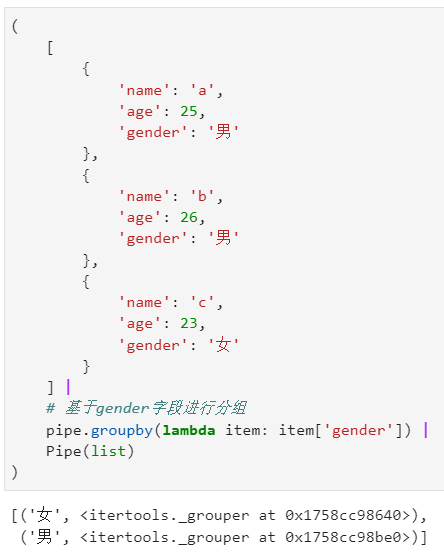
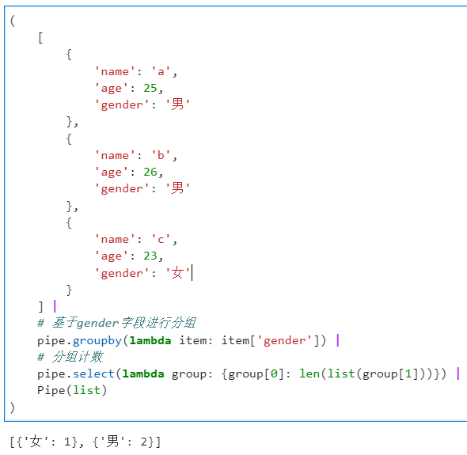
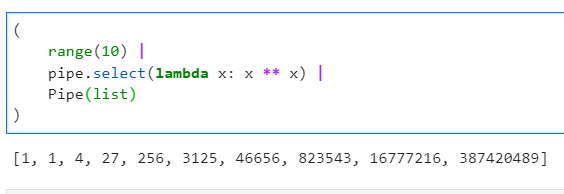
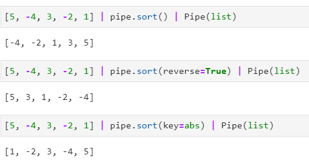

Python<br />熟悉pandas的读者朋友应该经常会使用`query()`、`eval()`、`pipe()`、`assign()`等Pandas的常用方法，书写可读性很高的**「链式」**数据分析处理代码，从而更加丝滑流畅地组织代码逻辑。<br />但在原生Python中并没有提供类似Shell中的管道操作符`|`、R中的管道操作符`%>%`等语法，也没有针对列表等数组结构的可进行链式书写的快捷方法，譬如JavaScript中数组的`map()`、`filter()`、`some()`、`every()`等。<br />正所谓“标准库不够，三方库来凑”，Python原生对链式写法支持不到位没关系，可以使用一些简单方便且轻量的第三方库来协助在Python代码中大面积实现链式写法，一起学习相关的知识技巧~
<a name="Xeehw"></a>
## 在Python中配合pipe灵活使用链式写法
这里使用到pipe这个第三方库，它不仅内置了很多实用的**「管道操作函数」**，还提供了将常规函数快捷**「转换」**为管道操作函数的方法，使用`pip install pipe`对其进行安装即可。<br />pipe的用法非常方便，类似shell中的管道操作：以数组变量为起点，使用操作符`|`衔接pipe内置的各个常见管道操作函数，组装起自己所需的计算步骤即可，譬如，筛选输入数组中为偶数的，再求平方，就可以写作：
```python
import pipe

list(
    range(10) | 
    pipe.filter(lambda x: x % 2 == 0) | 
    pipe.select(lambda x: x ** 2)
)
```
<br />因为pipe搭建的管道默认都是惰性运算的，直接产生的结果是生成器类型，所以上面的例子中最外层套上了`list()`来取得实际计算结果，更优雅的方式是配合`pipe.Pipe()`，将`list()`也改造为管道操作函数：
```python
from pipe import Pipe

(
    range(10) | 
    pipe.filter(lambda x: x % 2 == 0) | 
    pipe.select(lambda x: x ** 2) |
    Pipe(list)
)
```
<br />在上面的简单例子中使用到的`filter()`、`select()`等就是pipe中常见的管道操作函数，事实上pipe中的管道操作函数相当的丰富，下面来展示其中一些常用的：
<a name="cKFr6"></a>
### 1、pipe中常用的管道操作函数
<a name="xxJA9"></a>
#### 1.1 使用`traverse()`展平嵌套数组
如果想要将任意嵌套数组结构展平，可以使用`traverse()`：
```python
(
    [1, [2, 3, [4, 5]], 6, [7, 8, [9, [10, 11]]]] | 
    pipe.traverse | 
    Pipe(list)
)
```

<a name="vsKfX"></a>
#### 1.2 使用`dedup()`进行顺序去重
如果需要对包含若干重复值的数组进行去重，且希望保留原始数据的顺序，则可以使用`dedup()`，其还支持key参数，类似`sorted()`中的同名参数，实现自定义去重规则：
```python
(
    [-1, 0, 0, 0, 1, 2, 3] | 
    pipe.dedup |
    Pipe(list)
)

(
    [-1, 0, 0, 0, 1, 2, 3] | 
    # 基于每个元素的绝对值进行去重
    pipe.dedup(key=abs) |
    Pipe(list)
)
```

<a name="cfNT8"></a>
#### 1.3 使用`filter()`进行值过滤
最开始的例子中使用过它，用法就是基于传入的lambda函数对每个元素进行条件判断，并保留结果为True的，与javascript中的`filter()`方法非常相似：
```javascript
(
    [1, 4, 3, 2, 5, 6, 8] |
    # 保留大于5的元素
    pipe.filter(lambda x: x > 5) |
    Pipe(list)
)
```

<a name="q3FG4"></a>
#### 1.4 使用`groupby()`进行分组运算
这个函数非常实用，其功能相当于管道操作版本的`itertools.groupby()`，可以基于lambda函数运算结果对原始输入数组进行分组，通过`groupby()`操作后直接得到的结果是分组结果的二元组列表，每个元组的第一个元素是分组标签，第二个元素是分到该组内的各个元素：<br /><br />基于此，可以衔接很多其他管道操作函数，譬如衔接`select()`对分组结果进行自定义运算：<br />
<a name="HIkvk"></a>
#### 1.5 使用`select()`对上一步结果进行自定义遍历运算
这个函数是`pipe()`中核心的管道操作函数，通过前面的若干例子也能弄明白，它的功能是基于自定义的函数，对上一步的运算结果进行遍历运算。<br />
<a name="vi6wk"></a>
#### 1.6 使用`sort()`进行排序
相当于内置函数`sorted()`的管道操作版本，同样支持key、reverse参数：<br /><br />上述内容足以支撑大部分日常操作需求，也可以在[https://github.com/JulienPalard/Pipe](https://github.com/JulienPalard/Pipe)中查看pipe的更多功能介绍。
