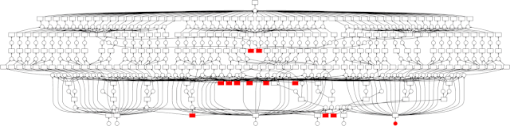

PythonPandas<br />介绍 8 个可以替代pandas的库，在加速技巧之上，再次打开速度瓶颈，大大提升数据处理的效率。
<a name="sPZPC"></a>
## **1、Dask**
Dask在大于内存的数据集上提供多核和分布式并行执行。<br /><br />在Dask中，一个DataFrame是一个大型且并行的DataFrame，由许多较小的 pandas DataFrames组成，沿索引拆分。<br />这些 pandas DataFrames 可以存在于单个机器上的磁盘中计算远超于内存的计算，或者存在集群中的很多不同机器上完成。一个 Dask DataFrame 操作会触发所有 Pandas DataFrames 的操作。<br />Dask-ML支持pandas、Numpy、Sklearn、XGBoost、XArray、RAPIDS等等，对于常用的数据处理、建模分析是完全够用的。
```bash
# 安装dask
pip install dask
```
```python
# 导入dask dataframe
import dask.dataframe as dd
```
<a name="WaiEP"></a>
## **2、Modin**
Modin是一个多进程的Dataframe库，可以加速Pandas的工作流程。多进程意味着，如果在多核的计算机上查询速度就会成倍的提升。<br />Modin具有与pandas相同的API，使用上只需在import导入时修改一下，其余操作一模一样。
```bash
# 导入 modin pandas
import modin.pandas as pd
```
<a name="ESpL5"></a>
## **3、Data Table**
Datatable是一个用于处理表格数据的 Python 库。<br />与pandas的使用上很类似，但更侧重于**速度和大数据**的支持。在单节点的机器上，无论是读取数据，还是数据转换等操作，速度均远胜于pandas。<br />如果不是分布式而是单节点处理数据，遇到内存不够或者速度慢，也不妨试试这个库。<br />使用文档：[https://datatable.readthedocs.io/en/latest/start/quick-start.html](https://datatable.readthedocs.io/en/latest/start/quick-start.html)
<a name="dlMFM"></a>
## **4、Polars**
Polars是使用 Apache Arrow Columnar Format 作为内存模型在 Rust 中实现的速度极快的 DataFrames 库。
```python
# 安装 polars
pip install polars
```
```python
# 导入 polars
import polars as pl
```
使用文档：[https://pola-rs.github.io/polars-book/user-guide/index.html](https://pola-rs.github.io/polars-book/user-guide/index.html)
<a name="un7TN"></a>
## **5、Vaex**
Vaex 也是一个开源的 DataFrame，它采用内存映射、高效的核外算法和延迟计算等技术。<br />对于大数据集而言，只要磁盘空间可以装下数据集，使用Vaex就可以对其进行分析，解决内存不足的问题。<br />它的各种功能函数也都封装为类 Pandas 的 API，几乎没有学习成本。
<a name="QqJpG"></a>
## **6、Pyspark**
Pyspark 是 Apache Spark 的 Python API，通过分布式计算处理大型数据集。
```bash
# 安装
pip install pyspark
```
```python
# 导入
from pyspark.sql import SparkSession, functions as f
spark = SparkSession.builder.appName("SimpleApp").getOrCreate()
df = spark.read.option('header', True).csv('../input/yellow-new-yo')
```
由于spark在速度上较hadoop更有优势，现在很多企业的大数据架构都会选择使用spark。
<a name="stsx5"></a>
## **7、Koalas**
Koalas 是在 Apache Spark 之上实现 的pandas DataFrame API，让数据分析更高效。<br />由于 Koalas 是在 Apache Spark 之上运行的，因此还必须安装 Spark。
```bash
# 安装
pip install pyspark
pip install koalas
```
```python
# 导入
import databricks.koalas as ks
from pyspark.sql import SparkSession
```
使用文档：[https://koalas.readthedocs.io/en/latest/index.html](https://koalas.readthedocs.io/en/latest/index.html)
<a name="tvooQ"></a>
## **8、cuDF**
cuDF 是一个 Python GPU DataFrame 库，基于 Apache Arrow 列式内存格式构建，用于数据操作。<br />cuDF 提供类 pandas 的 API，因此数据分析师也是无需了解 CUDA 编程细节的。
```python
import cudf, io, requests
from io import StringIO

url = "https://github.com/plotly/datasets/raw/master/tips.csv"
content = requests.get(url).content.decode('utf-8')

tips_df = cudf.read_csv(StringIO(content))
tips_df['tip_percentage'] = tips_df['tip'] / tips_df['total_bill'] * 100

print(tips_df.groupby('size').tip_percentage.mean())
```
使用文档：[https://github.com/rapidsai/cudf](https://github.com/rapidsai/cudf)<br />这里介绍的 8 个Python库原理不同，使用环境也有差异，大家可以根据自己的需求进行尝试。<br />但这些库基本上都提供了类pandas的API，因此在使用上没有什么学习成本，只要配置好环境就可以上手操作了。
