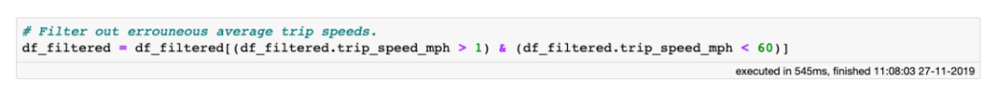

Python 许多组织都在尝试收集和利用尽可能多的数据，以改善其经营方式，增加收入和提升影响力。因此，数据科学家面对50GB甚至500GB大小的数据集情况变得越来越普遍。 不过，这类数据集使用起来不太容易。它们足够小，可以装入日常笔记本电脑的硬盘驱动器中，但同时大到无法装入RAM，导致它们已经很难打开和检查，更不用说探索或分析了。 **处理此类数据集时，通常采用3种策略。** 第一种是对数据进行二次采样，但缺点很明显：可能因为忽视相关部分数据而错过关键洞察，甚至更糟的是，这会误解了数据所阐释的含义。 第二种策略是使用分布式计算。在某些情况下这是一种有效的方法，但它需要管理和维护集群的大量开销。 又或者，可以租用一个强大的云实例，该实例具有处理相关数据所需的内存。例如，AWS提供具有TB级RAM的实例。在这种情况下，仍然必须管理云数据存储区，每次实例启动时，都需要等待数据从存储空间传输到实例，同时，还要考虑将数据存储在云上的合规性问题，以及在远程计算机上工作带来的不便。更不别说成本，尽管一开始成本很低，但后续往往会增加。 **Vaex是解决这个问题的新方法。它是一种几乎可以对任意大小的数据进行数据科学研究的更快、更安全、更方便的方法，只要数据集可以安装在笔记本电脑，台式机或服务器硬盘上。**

## 什么是Vaex？
Vaex 是一个开源的 DataFrame 库（类似于Pandas），对和硬盘空间一样大小的表格数据集，它可以有效进行可视化、探索、分析甚至进行实践机器学习。    它可以在N维网格上计算每秒超过十亿（10^9）个对象/行的统计信息，例如均值、总和、计数、标准差等 。使用直方图、密度图和三维体绘制完成可视化，从而可以交互式探索大数据。Vaex使用内存映射、零内存复制策略获得最佳性能（不浪费内存）。 为实现这些功能，Vaex 采用内存映射、高效的核外算法和延迟计算等概念。所有这些都封装为类 Pandas 的 API，因此，任何人都能快速上手。

## 十亿级计程车的数据分析
为了说明这一概念，对一个数据集进行简单的探索性数据分析，该数据集并不适合典型笔记本电脑的RAM。 本文中将使用纽约市（NYC）出租车数据集，其中包含标志性的黄色出租车在2009年至2015年之间进行的超过10亿次出行的信息。数据可以从网站（[_https://www1.nyc.gov/site/tlc/about/tlc-trip-record-data.page_](https://www1.nyc.gov/site/tlc/about/tlc-trip-record-data.page)）下载，并且为CSV格式。完整的分析可以在此Jupyter笔记本中单独查看（[_https://nbviewer.jupyter.org/github/vaexio/vaex-examples/blob/master/medium-nyc-taxi-data-eda/vaex-taxi-article.ipynb_](https://nbviewer.jupyter.org/github/vaexio/vaex-examples/blob/master/medium-nyc-taxi-data-eda/vaex-taxi-article.ipynb)）。

## 为什么要选择vaex？

- 性能：处理海量表格数据，每秒处理超过十亿行
- 虚拟列：动态计算，不浪费内存
- 高效的内存在执行过滤/选择/子集时没有内存副本。
- 可视化：直接支持，单线通常就足够了。
- 用户友好的API：只需处理一个数据集对象，制表符补全和docstring可以帮助你：ds.mean<tab>，类似于Pandas。
- 精益：分成多个包
- Jupyter集成：vaex-jupyter将在Jupyter笔记本和Jupyter实验室中提供交互式可视化和选择。

第一步是将数据转换为内存可映射文件格式，例如Apache Arrow，Apache Parquet或HDF5。在此处也可以找到如何将CSV数据转换为HDF5的示例。数据变为内存可映射格式后，即使在磁盘上的大小超过100GB，也可以使用Vaex即时打开（只需0.052秒！）：  为什么这么快？当使用Vaex打开内存映射文件时，实际上没有进行任何数据读取。Vaex仅读取文件的元数据，例如磁盘上数据的位置，数据结构（行数、列数、列名和类型），文件说明等。那么，如果要检查数据或与数据交互怎么办？打开数据集会生成一个标准的DataFrame并对其进行快速检查：  注意，单元执行时间太短了。这是因为显示Vaex DataFrame或列仅需要从磁盘读取前后5行数据。这将引向另一个重点：Vaex只会在需要时遍历整个数据集，并且会尝试通过尽可能少的数据传递来做到这一点。 无论如何，从极端异常值或错误数据输入值开始清除此数据集。一个很好的方法是使用describe方法对数据进行高级概述，其中显示了样本数、缺失值数和每一列的数据类型。如果列的数据类型为数字，则还将显示平均值、标准偏差以及最小值和最大值。所有这些统计信息都是通过对数据的一次传递来计算的。  使用describe方法获得 DataFrame 的高级概览，注意这个 DataFrame 包含 18 列数据，不过截图只展示了前 7 列。 该describe方法很好地体现了Vaex的功能和效率：所有这些统计数据都是在MacBook Pro（2018款15英寸，2.6GHz Intel Core i7，32GB RAM）上用不到3分钟的时间计算出来的。其他库或方法都需要分布式计算或拥有超过100GB的云实例来执行相同的计算。而使用Vaex，所需要的只是数据，以及只有几GB RAM的笔记本电脑。 查看describe的输出，很容易注意到数据包含一些严重的异常值。 首先开始检查上车地点。消除异常值的最简单方法是简单地绘制上下车地点的位置，并直观地定义要集中分析的NYC区域。由于正在使用如此大的数据集，因此直方图是最有效的可视化效果。使用Vaex创建和显示直方图和热力图的速度很快，而且图表可以交互！  一旦通过交互决定要关注的NYC区域，就可以简单地创建一个筛选后的DataFrame：   关于上面的代码，最酷的事情是它需要执行的内存量可以忽略不计！在筛选Vaex DataFrame时不会复制数据，而是仅创建对原始对象的引用，在该引用上应用二进制掩码。用掩码选择要显示的行，并将其用于将来的计算。这将节省100GB的RAM，而像今天许多标准数据科学工具却要复制数据。 现在，检查一下该passenger_count列。单次出租车行程记录的最大乘客数为255，这似乎有些夸张。计算每次行程的乘客人数，使用以下value_counts方法很容易做到这一点：  从上图可以看出，载客超过6人的行程可能是罕见的异常值，或者仅仅是错误的数据输入，还有大量的0位乘客的行程。由于目前尚不了解这些行程是否合法，因此也将其过滤掉。    对行程距离进行类似的练习。由于这是一个连续变量，因此可以绘制行程距离的分布图。绘制一个更合理范围的直方图。  从上图可以看出，出行次数随着距离的增加而减少。在距离约100英里处，分布有明显下降。目前，将以此为起点，根据行程距离消除极端离群值：  出行距离一列中存在极端异常值，这也是研究出行时间和出租车平均速度的动机。这些功能在数据集中尚不可用，但计算起来很简单：  上面的代码块无需内存，无需花费时间即可执行！这是因为代码只会创建虚拟列。这些列仅包含数学表达式，并且仅在需要时才进行评估。此外，虚拟列的行为与任何其他常规列都相同。注意，其他标准库将需要10 GB的RAM才能进行相同的操作。 好了，来绘制行程耗费时间的分布：  从上面的图中可以看出，尽管有一些行程可能需要花费4至5个小时，但95％的出租车花费不到30分钟即可到达目的地。能想象在纽约市被困出租车中超过3个小时吗？无论如何，要保持开放的态度，并考虑所有花费时间少于3小时的行程：  现在，研究出租车的平均速度，同时选择一个合理的数据范围：  根据分布趋平的位置，可以推断出在每小时1到60英里之间合理的平均滑行速度，因此可以更新筛选后的DataFrame：  将重点转移到出租车费用上。从describe方法的输出中，可以看到在fare_amount，total_amount和tip_amount列中有一些疯狂的异常值。对于初学者，任何这些列中的任何值都不应为负。同时数字表明，一些幸运的司机仅凭开一次出租车便几乎成为了百万富翁。看一下在相对合理的范围内这些数量的分布：  可以看到上述所有三个分布都有相当长的尾部。尾部的某些值可能是合法的，而其他值可能是错误的数据输入。无论如何，先保守下，只考虑fare_amount，total_amount和tip_amount少于$200的行程。还要求fare_amount，total_amount值大于$0。  最后，在初步清理完所有数据之后，看看有多少出租车数据需要进行分析：  还有超过11亿次旅行！大量的数据可以深入了解出租车行程背后的信息。

## 后记
此外，作者还从出租车司机最大化利润等角度利用Vaex进行分析数据。总之，Vaex会缓解可能面临的一些数据挑战的问题。 有了 Vaex，可以在短短几秒内遍历超过 10 亿行数据，计算各种统计、聚合并产出信息图表，这一切都能在笔记本电脑上完成。它免费且开源。 如果对探索本文中用到的数据集感兴趣，可以直接在 S3 中配合 Vaex 使用它，请参阅完整的 Jupyter notebook 了解如何实现。 Vaex 官方网站：[_https://vaex.io/ _](https://vaex.io/ ) 文档：[_https：//docs.vaex.io/ _](https：//docs.vaex.io/ ) GitHub：[_https : //github.com/vaexio/vaex _]() PyPi：[_https：//pypi.python.org/pypi/vaex/_](https：//pypi.python.org/pypi/vaex/)
