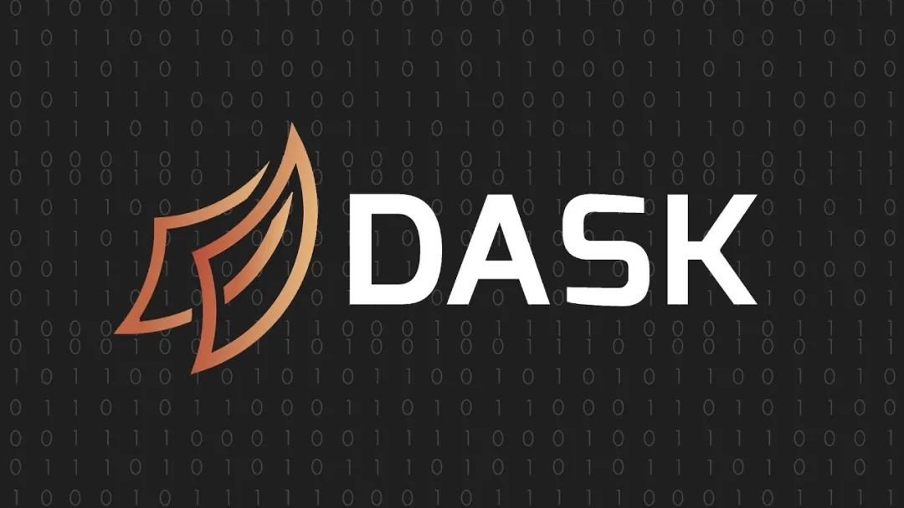
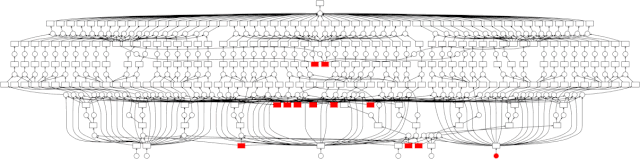
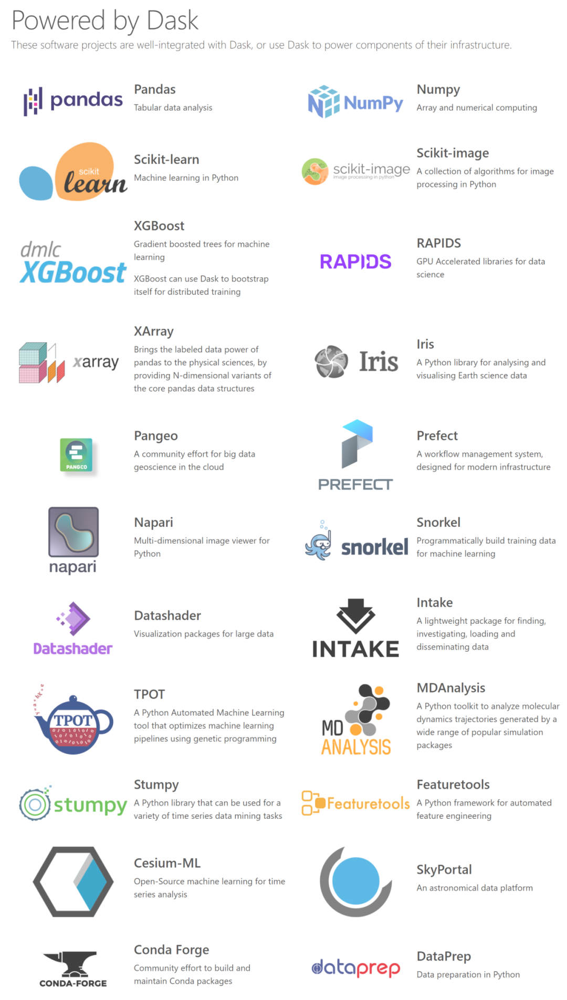
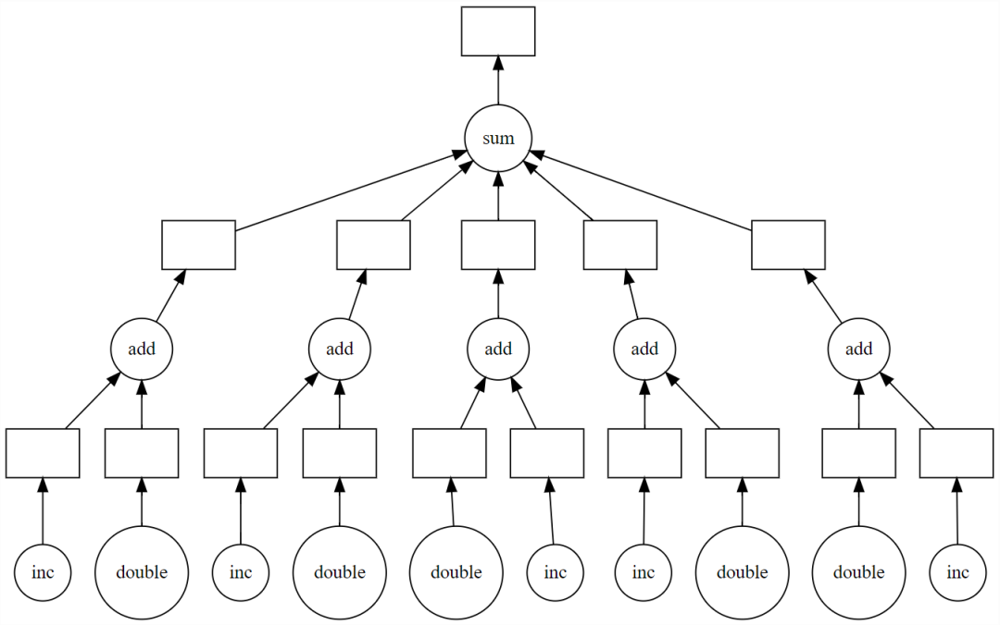
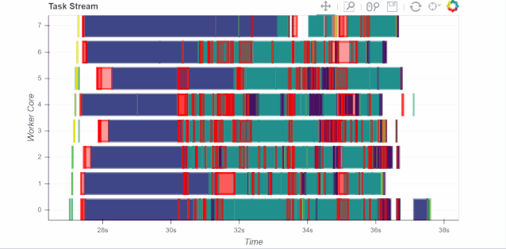

Python<br /><br />对于Pandas运行速度的提升方法，之前已经介绍过很多回了，里面经常提及**Dask**，很多朋友没接触过可能不太了解，今天就推荐一下这个神器。

<a name="VfM1i"></a>
## 1、什么是Dask？
Pandas和Numpy大家都不陌生了，代码运行后数据都加载到RAM中，如果数据集特别大，就会看到内存飙升。但有时要处理的数据并不适合RAM，这时候Dask来了。<br />Dask是开源免费的。它是与其他社区项目（如Numpy，Pandas和Scikit-Learn）协调开发的。<br />官方：[https://dask.org/](https://dask.org/)<br />Dask支持Pandas的DataFrame和NumpyArray的数据结构，并且既可在本地计算机上运行，也可以扩展到在集群上运行。<br />基本上，只要编写一次代码，使用普通的Pythonic语法，就可在本地运行或部署到多节点集群上。这本身就是一个很牛逼的功能了，但这还不是最牛逼的。<br />Dask的最牛逼的功能是：**它兼容大部分已经在用的工具，并且只需改动少量的代码，就可以利用自己笔记本电脑上已有的处理能力并行运行代码。**而并行处理数据就意味着更少的执行时间，更少的等待时间和更多的分析时间。<br />下面这个就是Dask进行数据处理的大致流程。<br />
<a name="hDEGj"></a>
## 2、Dask支持哪些现有工具？
这一点也是比较看中的，因为Dask可以与Python数据处理和建模的库包兼容，沿用库包的API，这对于Python使用者来说学习成本是极低的。而像Hadoop、Spark这种大数据处理是有很高的学习门槛和时间成本的。<br />目前，Dask可支持pandas、Numpy、Sklearn、XGBoost、XArray、RAPIDS等等，光是这几项就足够用了，至少对于常用的数据处理、建模分析是完全覆盖得掉的。<br />
<a name="dh3Uu"></a>
## 3、Dask安装
可以使用 conda 或者 pip，或从源代码安装dask 。
```bash
conda install dask
```
因为dask有很多依赖，所以为了快速安装也可用下面代码，将安装运行Dask所需的最少依赖关系集。
```bash
conda install dask-core
```
再有就是通过源来安装。
```bash
git clone https://github.com/dask/dask.git
cd dask
python -m pip install .
```
<a name="BIHtb"></a>
## 4、Dask如何使用？
<a name="VDntB"></a>
### Numpy、pandas
Dask引入了3个并行集合，它们可以存储大于RAM的数据，这些集合有**DataFrame、Bags、Arrays**。这些集合类型中的每一个都能够使用在RAM和硬盘之间分区的数据，以及分布在群集中多个节点上的数据。<br />Dask的使用是非常清晰的，如果使用NumPy数组，就从Dask数组开始，如果使用Pandas DataFrame，就从Dask DataFrame开始，依此类推。
```python
import dask.array as da
x = da.random.uniform(low=0, high=10, size=(10000, 10000),  # normal numpy code
                      chunks=(1000, 1000))  # break into chunks of size 1000x1000

y = x + x.T - x.mean(axis=0)  # Use normal syntax for high level algorithms

# DataFrames
import dask.dataframe as dd
df = dd.read_csv('2018-*-*.csv', parse_dates='timestamp',  # normal Pandas code
                 blocksize=64000000)  # break text into 64MB chunks

s = df.groupby('name').balance.mean()  # Use normal syntax for high level algorithms

# Bags / lists
import dask.bag as db
b = db.read_text('*.json').map(json.loads)
total = (b.filter(lambda d: d['name'] == 'Alice')
          .map(lambda d: d['balance'])
          .sum())
```
这些高级接口在略微变化的情况下复制了标准接口。对于原始项目中的大部分API，这些接口会自动并行处理较大的数据集，实现上不是很复杂，对照Dask的doc文档即可一步步完成。
<a name="nfEoy"></a>
### Delayed
下面说一下Dask的 **Delay **功能，非常强大。<br />Dask.delayed是一种并行化现有代码的简单而强大的方法。之所以被叫做delayed是因为，它没有立即计算出结果，而是将要作为任务计算的结果记录在一个图形中，稍后将在并行硬件上运行。<br />有时问题用已有的dask.array或dask.dataframe可能都不适合，在这些情况下，可以**使用更简单的**`**dask.delayed**`**界面并行化自定义算法**。例如下面这个例子。
```python
def inc(x):
    return x + 1

def double(x):
    return x * 2

def add(x, y):
    return x + y

data = [1, 2, 3, 4, 5]

output = []
for x in data:
    a = inc(x)
    b = double(x)
    c = add(a, b)
    output.append(c)

total = sum(output)
45
```
上面代码在单个线程中按顺序运行。但是，可以看到其中很多可以并行执行。Dask delayed函数可修饰inc、double这些函数，以便它们可延迟运行，而不是立即执行函数，它将函数及其参数放入计算任务图中。<br />简单修改代码，用delayed函数包装一下。
```python
import dask

output = []
for x in data:
    a = dask.delayed(inc)(x)
    b = dask.delayed(double)(x)
    c = dask.delayed(add)(a, b)
    output.append(c)

total = dask.delayed(sum)(output)
```
代码运行后inc、double、add和sum都还没有发生，而是生成一个计算的任务图交给了total。然后用visualizatize看下任务图。
```python
total.visualize()
```
<br />上图明显看到了并行的可能性，所以毫不犹豫，使用compute进行**并行计算，**这时才完成了计算。
```python
>>> total.compute()
45
```
由于数据集较小无法比较时间，这里只介绍下使用方法，具体可自己动手实践下。

<a name="R2alJ"></a>
### Sklearn机器学习
关于机器学习的并行化执行，由于内容较多。这里简单说下一下dask-learn。<br />dask-learn项目是与Sklearn开发人员协作完成的。现在可实现并行化有Scikit-learn的Pipeline、GridsearchCV和RandomSearchCV以及这些的变体，它们可以更好地处理嵌套的并行操作。<br />因此，如果将sklearn替换为dklearn，那么速度将会提升很多。
```python
# from sklearn.grid_search import GridSearchCV
from dklearn.grid_search import GridSearchCV
# from sklearn.pipeline import Pipeline
from dklearn.pipeline import Pipeline
```
下面是一个使用Pipeline的示例，其中应用了PCA和逻辑回归。
```python
from sklearn.datasets import make_classification

X, y = make_classification(n_samples=10000,
                           n_features=500,
                           n_classes=2,
                           n_redundant=250,
                           random_state=42)

from sklearn import linear_model, decomposition
from sklearn.pipeline import Pipeline
from dklearn.pipeline import Pipeline

logistic = linear_model.LogisticRegression()
pca = decomposition.PCA()
pipe = Pipeline(steps=[('pca', pca),
                       ('logistic', logistic)])


grid = dict(pca__n_components=[50, 100, 150, 250],
            logistic__C=[1e-4, 1.0, 10, 1e4],
            logistic__penalty=['l1', 'l2'])

# from sklearn.grid_search import GridSearchCV
from dklearn.grid_search import GridSearchCV

estimator = GridSearchCV(pipe, grid)

estimator.fit(X, y)
```
**结果是：sklearn会在40秒钟左右执行此计算，而dask-learn替代品大约需要10秒钟。**<br />另外，如果添加以下代码可以连接到集群，通过Client可以展示整个计算过程的dashboard，由Bokeh实现。
```python
from dask.distributed import Client
c = Client('scheduler-address:8786')
```

<a name="NwHjH"></a>
## 5、总结
以上就是Dask的简单介绍，Dask的功能是非常强大的，且说明文档也非常全，既有示例又有解释。感兴趣的朋友可以自行去官网或者GitHub学习。
