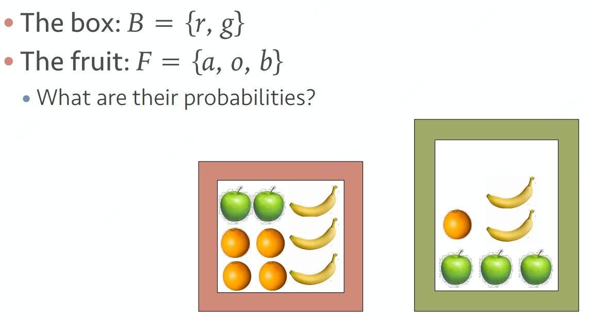
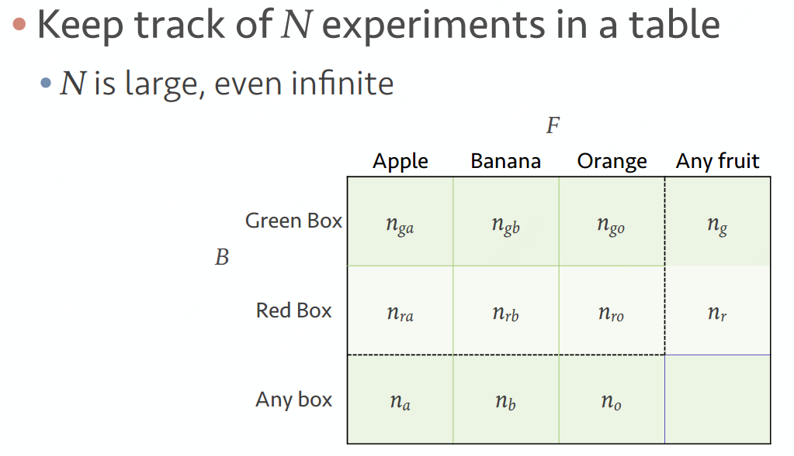

## [频率&贝叶斯学派](https://www.zhihu.com/question/20587681)

今天降雨概率：

- 频率学派：将今天重复过次，下雨次数.svg)，
- 贝叶斯学派：根据模型，假设，先验(云，风，湿度...)计算下雨的likelihood，先验分布+实验数据=后验分布

## 单变量概率(Single variable probabilities)
水果是从箱子中取出的概率：

取出水果的概率：

## 联合概率(Joint probabilities)
从箱子.svg)取出水果，且水果是.svg)的概率：

## 条件概率(Conditional probability)
从箱子.svg)中取水果，水果是.svg)的概率：

## 和定律(Sum rule)
水果是从箱子.svg)中取出的概率：

## 积定律(Product rule)
从箱子.svg)取出水果，且水果是.svg)的概率：

## 贝叶斯定理(Bayes theorem)

## 独立事件(Independence)
如果满足，则.svg)与即为相互独立事件
