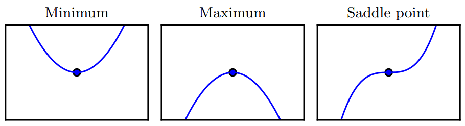
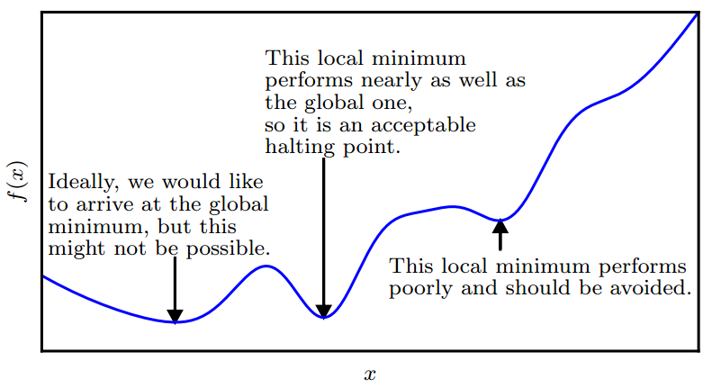

当，即导数为零时，导数无法提供往哪个方向移动的信息。的点成为临界点(critical point)或驻点(stationary point)。一个局部极小点(local minimum)意味着这个点的小于所有临近点，因此不可能通过移动无穷小的步长来减小。一个局部极大点(local maximum)意味着这个点的大于所有邻近点，因此不可能通过移动无穷小的步长来增大。有些临近点既不是最小点也不是最大点。这些点被称为鞍点(saddle point)。如下图所示

使取得绝对的最小值（相对所有其他值）的点是全局最小点(global minimum)。函数可能有一个全局最小点或存在多个全局最小点，还可能存在不是全局最优的局部极小点。在深度学习的背景下，我们要优化的函数可能含有许多不是最优的局部极小点，或者还有很多处于非常平坦的局域内的鞍点。尤其是当输入是多维的时候，所有这些都将使优化变得困难。因此，我们通常寻找使非常小的点，但这在任何形式意义下并不一定是最小，如下图例子：

