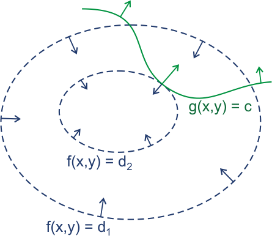
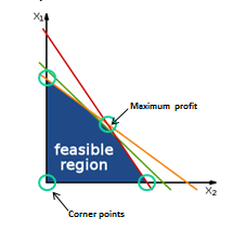

## [拉格朗日乘子法(Lagrange multiplier)](https://zh.wikipedia.org/wiki/%E6%8B%89%E6%A0%BC%E6%9C%97%E6%97%A5%E4%B9%98%E6%95%B0)

在数学中的最优化问题中，拉格朗日乘数法是一种寻找多元函数在其变量受到一个或多个条件的约束时的极值的方法，这里的条件约束是等式约束，不等式约束使用KKT解决。这种方法可以将一个有个变量与k个约束条件的最优化问题转换为一个解有个变量的方程组的解的问题。这种方法中引入了一个或一组新的未知数，即拉格朗日乘数，又称拉格朗日乘子，或拉氏乘子，它们是在转换后的方程，即约束方程中作为梯度(gradient)的线性组合中各个向量的系数。

比如，要求在时的最大值时，我们可以引入新变量拉格朗日乘数，这时我们只需要下列拉格朗日函数的极值：

更一般地，对含个变量和个约束的情况，有：

拉格朗日乘数法所得的极点会包含原问题的所有极值点，但并不保证每个极值点都是原问题的极值点。

假设有函数，要求其极值(最大值/最小值)，且满足条件：，是常数。对不同的值，不难想象出的等高线。而方程的可行集所构成的线正好是。想像我们沿着的可行集走；因为大部分情况下的等高线和的可行集线不会重合，但在有解的情况下，这两条线会相交。想像此时我们移动上的点，因为是连续的方程，我们因此能走到更高或更低的等高线上，也就是说可以变大或变小。只有当和相切，也就是说，此时，我们正同时沿着和走。这种情况下，会出现极值或鞍点。

用向量的形式来表达的话，我们说相切的性质在此意味着和的切线在某点上平行，同时也意味着两者的梯度平行。此时引入一个未知标量，并求解：

一旦求出的值，将其套入下式，易求在无约束条件下的极值和对应的极值点：

新方程在达到极值时与相等，因为达到极值时总等于零

#### Example

求满足的最小值。因为只有一个限制条件，我们只需要用一个乘数

将所有方程的偏微分设为零，得到一个方程组，最小值是以下方程组的解中的一个：

## [卡罗需－库恩－塔克条件(KKT)](https://www.zhihu.com/question/23311674)

​	卡罗需-库恩-塔克条件(Kuhn-Tuhn, KKT)是在满足一些规则的条件(可以为不等式)下，一个非线性规划(Nonlinear Programming)问题有最优化解法的一个必要和充分条件，是一个广义化拉格朗日乘数的成果。

现在考虑不等式，此时最优点要不在的区域中，或在边界上。

1. 对于的情形，约束不起作用，可直接通过条件来获得最优点；这等价于将置零然后对置零得到最优点。
2. 的情形类似于上面等式约束的分析，但需要注意的是，此时的方向必须与相反(即一个增大另一个必须减小，才能使两者和为零)，即存在常数(若则会出现，不符合约束)使得整合这两种情形，必满足

因此，在约束下最小化，可转化为在如下约束下最小化的拉格朗日函数：

上式即称为Karush-Kuhn-Tucker(KKT)条件。上式可推广到多个约束，比如问题：

也就是说，自变量是一个维向量，要最大化一个目标函数，满足若干等式和不等式约束。KKT条件宣称，如果有一个点是满足所有约束的极值点，则

简单说，就是在极值处，的梯度是一系列等式约束的梯度和不等式约束的梯度的线性组合。在这个线性组合中，等式约束梯度的权值没有要求；不等式约/束梯度的权值是非负的，并且如果每个严格小于，那这个约束不会出现在加权式子中，因为对应的权值，必须为。换句话说，只有恰好在边界上的那些的梯度才会出现在加权式中。如果去掉不等式约束部分，那么上式就是拉格朗日乘子法的精确表述。

给定一个优化问题，我们把满足所有约束条件的n维空间区域称为可行域。从可行域中的每一个点朝某个方向出发走一点点，如果还在可行域中，或者偏离可行域的程度很小，准确地说，偏移量是行进距离的高阶无穷小量，那么我们就说是一个可行方向。我们用表示点的所有可行方向的集合。对于可行域中的一个极大值点，它的可行方向集合为，从朝中某个方向走一小步，那么落点仍然(近似)在可行域中。是局部最大值点就意味着在这些可行方向上目标函数不能增大，从而我们得到这样一个结论：在极值点，让目标函数增大的方向不能在中。

#### Example

求解：

写出拉格朗日函数：

KKT方程组：

## 拉格朗日对偶性(Lagrange duality)

在约束最优化问题中，常利用拉格朗日对偶性将原始问题转换为对偶问题，通过解对偶问题得到原始问题的解。

#### 原始问题

假设是定义在上的连续可微函数。考虑约束最优化问题：

称此约束最优化问题为原始最优化问题或原始问题。

首先，引入拉格朗日函数：

这里，是拉格朗日乘子，。考虑的函数

这里，下标表示原始问题。假定给定某个。如果违反原始问题的约束条件，即存在某个使得或者存在某个使得，那么就有

因为若某个使约束，则可令，若某个使约束，则可令，而将其余各项均取值为

相反地，若满足等式和不等式约束，则可知，因此

所以如果考虑极小化问题

它是与原始最优化问题等价的，即他们有相同解。问题称为广义拉格朗日函数的极小极大问题。这样一来，就把原始最优化问题表示为拉格朗日函数的极小极大问题。为了方便，定义原始问题的最优值

#### 对偶问题

定义再考虑极大化，即

可以将广义拉格朗日函数的极大极小为表示为约束最优化问题：

称为原始问题的对偶问题。定义对偶问题的最优值

#### 原始问题和对偶问题关系

若原始问题和对偶问题都有最优值，则

证明：

由和，对任意

即，由于原始问题和对偶问题均有最优解，所以

即

推论：设分别是原始问题和对偶问题的可行解，并且，则分别是原始问题和对偶问题的最优解。

## [线性规划(Linear programming)](https://zh.wikipedia.org/wiki/%E7%BA%BF%E6%80%A7%E8%A7%84%E5%88%92)

在数学中，线性规划（Linear Programming，简称LP）特指目标函数和约束条件皆为线性的最优化问题。描述线性规划问题的常用和最直观形式是标准型。标准型包括以下三个部分：

1. 一个需要极大化的线性函数，例如
2. 以下形式的问题约束，例如
3. 和非负变量，例如

线性规划问题通常可以用矩阵形式表达成：

例如极小化等其他类型问题，不同形式的约束问题，和有负变量的问题，都可以改写成其等价问题的标准型。

## 二次规划(Quadratic programming)

二次规划包括凸二次优化和非凸二次优化。在此类问题中，目标函数是变量的二次函数，约束条件是变量的线性不等式。假定变量个数为，约束条件的个数为，则标准的二次规划问题形如下：

其中为维向量，为[实对称矩阵](https://baike.baidu.com/item/%E5%AE%9E%E5%AF%B9%E7%A7%B0%E7%9F%A9%E9%98%B5)，为[实矩阵](https://baike.baidu.com/item/%E5%AE%9E%E7%9F%A9%E9%98%B5)，和为实向量，的每一行对应一个约束。

1. 若为[半正定矩阵](https://blog.csdn.net/asd136912/article/details/79146151)，则上式是凸函数，相应的二次规划是凸二次优化问题；此时若约束条件定义的可行域不为空，且目标函数在此可行域有下界，则该问题将有全局最小值。
2. 若为[正定矩阵](https://blog.csdn.net/asd136912/article/details/79146151)，则该问题有唯一的全局最小解
3. 若为非正定矩阵，则上式有多个平稳点和局部极小点的NP-hard问题

常用的二次规划解法有椭球法，内点法，增广拉格朗日法、梯度投影法等。

## 半正定规划(Semi-Definite programming)

半正定规划(SDP)是一类凸优化问题，其中的变量可组织成半正定对称矩阵形式，且优化问题的目标函数和约束都是这些变量的线性函数。给定的对称矩阵

若也是的对称矩阵，为个实数，则半正定规划问题形如：

半正定规划与线性规划都拥有线性的目标函数和约束，但半正定规划中的约束是一个非线性、非光滑约束条件。在优化理论中，半正定规划具有的一般性，能将几种标准的优化问题(如线性规划、二次规划)统一起来。

常见的用于求解线性规划的内点法经过少许改造即可求解半正定规划问题，但半正定规划的计算复杂度较高，难以直接用于大规模的问题。
