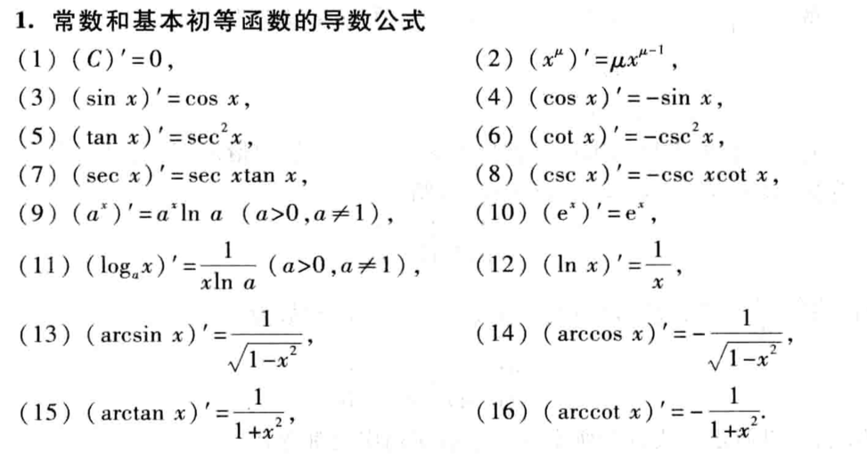
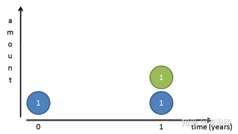
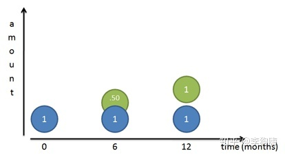
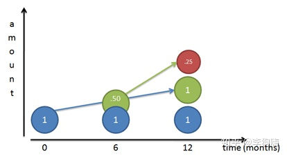
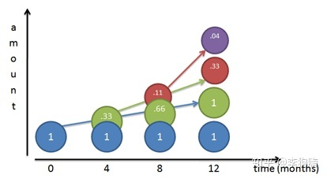
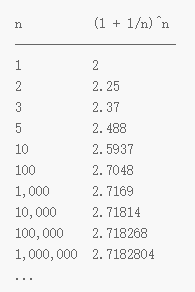

# 代数
## 导数公式

## 自然底数
要了解  的由来，一个最直观的方法是引入一个经济学名称“复利(Compound Interest)” -- 复利率法（英文：compound interest），是一种计算利息的方法。按照这种方法，利息除了会根据本金计算外，新得到的利息同样可以生息，因此俗称“利滚利”、“驴打滚”或“利叠利”。只要计算利息的周期越密，财富增长越快，而随着年期越长，复利效应亦会越为明显。

我们知道，很多细菌是通过二分裂进行繁殖的，假设某种细菌天会分裂次，也就是个增长周期为天，这意味着：每一天，细菌的总数量都是前一天的两倍。显然，如果经过天（或者说，经过个增长周期）的分裂，就相当于翻了倍。即，在第天时，细菌总数将是初始数量的倍。

如果假设初始数量为，那么天后的细菌数量则为。因此，只要保证所有细菌天分裂次，不管初始数量是多少，最终数量都将是初始数量的倍。因此，此计算关系也可以写为：

如果将 “分裂”或“翻倍”换一种更文艺的说法，也可以说是：“增长率为”。也就是说，可以将上式写为：

而当增长率不是，而是、之类的时候，则只需要将上式的换成想要的增长率即可。这样就可以得到更加普适的公式：

这个公式的数学内涵是：一个增长周期内的增长率为，在增长了个周期之后，总数量将为初始数量的倍。以上为指数增长的一个简单实例，下面来看看雅可比·伯努利的发现：

假设你有元钱存在银行里，此时发生了严重的通货膨胀，银行的利率飙到了（夸张一下，为了方便计算）。如果银行一年付一次利息，自然在一年后你可以拿到元的本金（蓝色圆）和元的利息（绿色圆），总共两元的余额。

现在银行的年利率不变，但银行为了招揽客户，推出一项惠民政策，每半年就付一次利息。那么到第六个月（也就是半年）的时候，你就能够提前从银行拿到元的利息了。

机智的你会马上把这元的利息再次存入银行，这元的利息也将在下一结算周期产生利息(红色圆)，专业术语叫“复利”，那么年底的存款余额将等于元。

此时，我们可以换个角度这样看：即，每个结算（增长）周期为半年，每半年的利率是（或者说)，一年结算两次利息，且第一次结算完后，立马将利息存入。此时我们的计算公式和结果如下：

继续，假设现在银行为了和其他银行抢生意，短期不想赚钱了，每四个月就付一次利息！而机智的你依然一拿到利息就立马存入，与半年结算一次利息类似：即，每个结算周期为四个月，每四个月的利率是（或者说 ），一年结算三次利息，且前两次结算完后，都立马将所有利息存入。

此时计算公式和结果如下：

我的天，年利率虽然没有变，但随着每年利息交付次数的增加，你年底能从银行拿到的钱居然也在增加！那么是不是会一直增大到无穷大呢？想得倒美…

现在假设存款人和银行都疯了，银行在保证年利率为的前提下连续不断地付给存款人利息，存款人天天呆在银行不走，拿到利息就往银行里存。这样，所得利息即所谓“连续复利”。

但是，你会发现，似乎有一个“天花板”挡住了你企图靠块钱疯狂赚取个亿的小目标，这个“天花板”就是！如果，我们进行一系列的迭代运算，我们将看到以下结果：  其中，指的是一年中结算利息的次数。只要在年利率保持不变的情况下，不断地提高利息的结算次数，余额就将会逼近

然后，终于可以祭出这个高等数学微积分里计算  的一个重要极限了：

现在再回头看这个重要极限，想必会有更加直观的理解。

## 大数定律
### 小数定律

喜欢总结规律是人类的天性。例如，人们抱着娱乐或者认真的态度总结了世界杯足球赛的各种“定律”，其中比较著名的有“巴西队的礼物”——“巴西队的礼物”是指：只要巴西夺冠，下一届的冠军就将是主办大赛的东道主，除非是巴西队自己夺冠。我们来看下历史下真实的数据：1962年巴西夺冠后，4年后英格兰在本土称雄。1970年巴西三夺金杯，1974年轮到东道主西德捧杯。1994年巴西在美国夺冠，下一届东道主法国队在本土夺冠。1958年，巴西队在瑞典夺冠，4年后他们未免成功，收回了“礼物”。看起来这个定律很有意思，但是这一定律在2006年被打破。2006年在德国的世界杯，德国和巴西队都没有夺冠，而是由我们中国人耳熟能详的主队里皮率领的意大利队夺冠。还有一些未被打破的定律，这些看似没有规律的神奇定律，之所有神奇，完全纯属巧合。世界杯每4年举办一次，总共才举办了20多届。只要数据足够少，我们总能发现一些神奇的定律。

如果数据少，随机现象可以看起来很不随机。甚至非常整齐，好像真的有规律一样。即小数定律——如果统计数据很少，那么事件就表现为各种极端情况，而这些情况都是偶然事件，跟它的期望值一点关系也没有

### 大数定律

大数定律就是我们从统计学中推测真相的理论基础——大数定律说如果统计数据足够大，那么事物出现的频率就能无限接近它的期望值。

某个事件的期望，也就是收益，实际上各种不同结果出现的概率乘结果的收益的和。拿我们最熟悉的投骰子举例，游戏规则是投中1点获得1元，投中2点获得2元，以此类推。那么，这个事件的期望是多少呢？

显然是

这个期望3.5代表什么意思呢？也就是说，只要你一直玩下去，你每次游戏的预期收益是3.5元。可能你某次赢了1元，某一次赢了6元，只要你长期投下去， 你平均下来每次就赢3.5元。

## 中心极限定理

中心极限定理是许多统计活动的“动力源泉”，这些活动存在着一个共同的特点，那就是使用样本对总体进行估计，例如我们经常看到的民意调查就是这方面的经典案例。

中心极限定理是说：

- 样本的平均值约等于总体的平均值。
- 不管总体是什么分布，任意一个总体的样本平均值都会围绕在总体的整体平均值周围，并且呈正态分布。

假设有一个群体，如我们之前提到的清华毕业的人，我们对这类人群的收入感兴趣。怎么知道这群人的收入呢？我会做这样4步：

1. 随机抽取1个样本，求该样本的平均值。例如我们抽取了100名毕业于清华的人，然后对这些人的收入求平均值。该样本里的100名清华的人，这里的100就是该样本的大小。有一个经验是，样本大小必须达到30，中心极限定理才能保证成立。
2. 我将第1步样本抽取的工作重复再三，不断地从毕业的人中随机抽取100个人，例如我抽取了5个样本，并计算出每个样本的平均值，那么5个样本，就会有5个平均值。这里的5个样本，就是指样本数量是5，即抽取了5次，形成了5个样本。
3. 根据中心极限定理，这些样本平均值中的绝大部分都极为接近总体的平均收入。有一些会稍高一点，有一些会稍低一点，只有极少数的样本平均值大大高于或低于群体平均值。
4. 中心极限定理告诉我们，不论所研究的群体是怎样分布的，这些样本平均值会在总体平均值周围呈现一个正态分布。

## 自由度
统计学上，自由度(degree of freedom, df)是指当以样本的统计量来估计总体的参数时，样本中独立或能自由变化的数据的个数，称为该统计量的自由度。一般来说，自由度等于独立变量减掉其衍生量数。举例来说，变异数的定义是样本减平均值(一个由样本决定的衍生量)，因此对个随机样本而言，其自由度为

### T检验(T-test)自由度
有一个有4个数据，其平均值等于5，受的条件限制，在自由确定4、2、5三个数据后， 第四个数据只能是9，否则 。因而这里的自由度 。推而广之，任何统计量的自由度

(为限制条件的个数)

### 卡方(chi-square)自由度
如下表所示，当你填了一个数后，剩下的3个数，就已经事先由每行或每列加总的数决定好了。比如我在男吸烟那里天了120，那么利用Total的值我们可以得出：男不吸烟显然是 170 - 120 ＝ 50， 女吸烟是 150 - 120 ＝ 30， 女不吸烟是 100 - 50 = 50

|  | 吸烟 | 不吸烟 | 总计 |
| --- | --- | --- | --- |
| 男 | ？ |  | 170 |
| 女 |  |  | 80 |
| 总计 | 150 | 100 |  |

再比如下表，只要填了2个值，剩下的4个数的数值也可以同时计算出来

|  | 爱打牌 | 爱打游戏 | 爱打麻将 | 总计 |
| --- | --- | --- | --- | --- |
| 男 | ？ | ？ |  | 170 |
| 女 |  |  |  | 130 |
| 总计 | 150 | 100 | 50 |  |

总结以上的例子，如果我们有行，列的表格，我们可以自由填写的有个数，这就是卡方检验的自由度计算公式：

### 回归(Regression)自由度
两点确定一条直线，三点确定一个面，只要给2个等式就能求解两元一次公式：比如已知点(1,3) (2,5)。我们能够求出斜率，和截距。在这个公式中，你没有任意的自由度去自己挑选和是多少，给定的2点已经确认了和的值，我们做的只是去求一个唯一解。所以这时候 degree of freedom 是 0。那什么时候degree of freedom 不为0呢？当给了3个点，由于我们理论上只需要任意2个点就可以确定这个公式解，所以这里的degree of freedom 是 3 - 2 = 1。如果我们回归中的feature个数，那么如果有个观察点，则：

## p-value
P值(p-value)是指在一个概率模型中，统计摘要（如两组样本均值差）与实际观测数据相同，或甚至更大这一事件发生的概率。换言之，是检验假设零假设成立或表现更严重的可能性。P值若与选定显著性水平（0.05或0.01）相比更小，则零假设会被否定而不可接受。然而这并不直接表明原假设正确。P值是一个服从正态分布的随机变量，在实际使用中因样本等各种因素存在不确定性。产生的结果可能会带来争议。

下表是常用查询表，行为不同自由度，列为不同的p-value，里面的值为卡方的查询表。越大，p-value越小，则可信度越高，通常用作为阈值，即的可信度。

|  | 0.95 | 0.90 | 0.80 | 0.70 | 0.50 | 0.30 | 0.20 | 0.10 | 0.05 | 0.01 | 0.001 |
| --- | --- | --- | --- | --- | --- | --- | --- | --- | --- | --- | --- |
| 1 | 0.004 | 0.02 | 0.06 | 0.15 | 0.46 | 1.07 | 1.64 | 2.71 | 3.84 | 6.64 | 10.83 |
| 2 | 0.10 | 0.21 | 0.45 | 0.71 | 1.39 | 2.41 | 3.22 | 4.60 | 5.99 | 9.21 | 13.82 |
| 3 | 0.35 | 0.58 | 1.01 | 1.42 | 2.37 | 3.66 | 4.64 | 6.25 | 7.82 | 11.34 | 16.27 |
| 4 | 0.71 | 1.06 | 1.65 | 2.20 | 3.36 | 4.88 | 5.99 | 7.78 | 9.49 | 13.28 | 18.47 |
| 5 | 1.14 | 1.61 | 2.34 | 3.00 | 4.35 | 6.06 | 7.29 | 9.24 | 11.07 | 15.09 | 20.52 |
| 6 | 1.63 | 2.20 | 3.07 | 3.83 | 5.35 | 7.23 | 8.56 | 10.64 | 12.59 | 16.81 | 22.46 |
| 7 | 2.17 | 2.83 | 3.82 | 4.67 | 6.35 | 8.38 | 9.80 | 12.02 | 14.07 | 18.48 | 24.32 |
| 8 | 2.73 | 3.49 | 4.59 | 5.53 | 7.34 | 9.52 | 11.03 | 13.36 | 15.51 | 20.09 | 26.12 |
| 9 | 3.32 | 4.17 | 5.38 | 6.39 | 8.34 | 10.66 | 12.24 | 14.68 | 16.92 | 21.67 | 27.88 |
| 10 | 3.94 | 4.86 | 6.18 | 7.27 | 9.34 | 11.78 | 13.44 | 15.99 | 18.31 | 23.21 | 29.59 |

# 几何
## 点线
[点到直线距离](https://baike.baidu.com/item/%E7%82%B9%E5%88%B0%E7%9B%B4%E7%BA%BF%E8%B7%9D%E7%A6%BB/8673346)公式：

## 面体
[多面体欧拉定理](https://baike.baidu.com/item/%E5%A4%9A%E9%9D%A2%E4%BD%93%E6%AC%A7%E6%8B%89%E5%AE%9A%E7%90%86/2587962)：表面数(F)+顶点数(V)-棱长数(E)=2

### 正多面体
凸正多面体有且仅有五种，即是正四面体、正六面体、正八面体、正十二面体和正二十面体。 

#### 几何学证明
每一个顶点，至少有3个面相遇，把所有于一个顶点相遇的角加起来，它们的和小于360°，因为如果和等于360°，这些角必定处于同一平面。  正三边形：正三角形每个内角都等于60°， 因此对于一个全由正三角形组成的多面体

- 3个正三角形相遇，
- 4个正三角形相遇，
- 5个正三角形相遇，

正四边形：正方形每个内角都等于90°，所以在某个顶点，只可能是

- 3个正方形相遇，

正五边形：正五边形每个内角都等于108°，所以在某个顶点，只可能是

- 3个正五边形相遇，

从正六边形开始，3个正多边形相遇内角都大于或等于360°，正六边形内角120°，，所以不可能存在由正边形组成的凸正多面体，即我们只可能拥有5个柏拉图体，对应于上述5种可能的情形。

#### 拓扑学证明
凸多面体服从[拓扑学欧拉公式](https://www.yuque.com/angsweet/machine-learning/huczfz#K8BH2)，记面(区域)个数，记顶点个数，记棱(边界)个数，则，这就是欧拉定理，具体证明可看百科里拓扑学中欧拉公式的证明。

设正多面体每个顶点有条棱，每个面都是正边形，因为两个相邻面有一公共棱，所以  因为两个相邻的顶点有一公共棱，所以  代入欧拉定理，得到  两边除以，得到  又因为，所以  由和定义可知，他们必须不小于(小于就构不成一个多边形了，小于构不成一个体了)。因此，只可能是，即正四面体、正六面体、正八面体、正十二面体和正二十面体。

# Source
[自然底数e怎么就“自然”了？](https://zhuanlan.zhihu.com/p/48391055) [大数定律的形象理解_anshuai_aw1的博客-CSDN博客](https://blog.csdn.net/anshuai_aw1/article/details/82771784) [中心极限定理的形象理解_anshuai_aw1的博客-CSDN博客_中心极限定理的理解](https://blog.csdn.net/anshuai_aw1/article/details/82769742) [滑动验证页面](https://www.jianshu.com/p/0032087b9dbb) [https://zh.m.wikipedia.org/zh/%E5%8D%A1%E6%96%B9%E5%88%86%E4%BD%88](https://zh.m.wikipedia.org/zh/%E5%8D%A1%E6%96%B9%E5%88%86%E4%BD%88)
