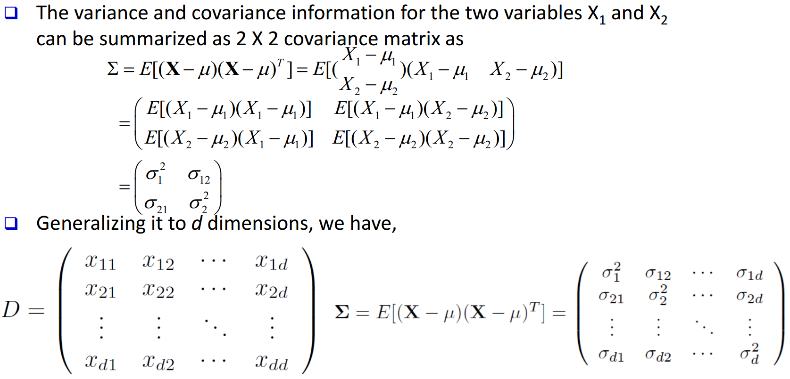
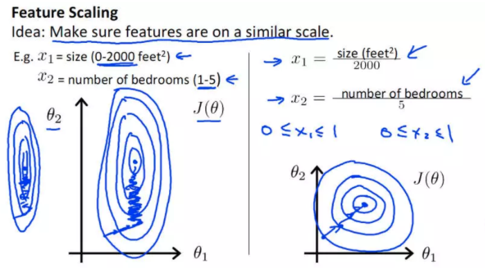

## 数据预处理主要任务
- **数据清洗(Data cleaning)：**填充空值、平滑噪声、移出异常...
- **数据整合(Data integration)：**整合多个数据库、数据立方或者文件等
- **数据缩减(Data reduction)：**降维、数量缩减、数据压缩
- **数据转化(Data transformation)：**数据标准化、层级划分

## 数据清洗

- **不完整数据：**例如数据缺属性值等，4种常规方法：
   1. 给一个新值类别，比如"unknown"
   2. 给这个属性的均值、众数或其他统计指标
   3. 样本聚类，给这一类样本中这个属性的均值、众数或其他统计指标
   4. 用贝叶斯或者决策树等去推测此属性可能的
- **噪声：**例如薪水为元，4种常规方法：
   1. 分桶(平滑)
   2. 回归(平滑)
   3. 聚类(检测与移除)
   4. 机器计算结合人工打标(检测与移除)
- **矛盾数据：**例如年龄为岁，但生日在年。
   1. 写规则整理数据
- **非合理数据：**例如每个人的生日数据都是1月1日。
   1. 进一步研究或写规则整理数据

### 分桶
eg. 排好序的数据分桶：4、8、9、15、21、21、24、25、26、28、29、34

- 根据相同频率(相同深度)分桶：
   - 桶1：4、8、9、15
   - 桶2：21、21、24、25
   - 桶3：26、28、29、34
- 按均值平滑：
   - 桶1：9、9、9、9
   - 桶2：23、23、23、23
   - 桶3：29、29、29、29
- 按桶边界平滑：
   - 桶1：4、4、4、15
   - 桶2：21、21、25、25
   - 桶3：26、26、26、34

## 数据整合

​	由于数据从不同源头来，可能出现很多问题比如格式不一或冗余等，比如：鞋号，EU 42和UK 8.0及JP 260其实是表示同样大小鞋子；一个数据来源包含鞋盒长宽数据，另一数据源含鞋盒底面积。冗余数据可用 correlation analysis 和 covariance analysis来检测

### Correlation analysis（针对分类型数据）

#### 卡方检验[chi-square](针对分类变量)
卡方检验就是统计样本的实际观测值与理论推断值之间的偏离程度，实际观测值与理论推断值之间的偏离程度就决定卡方值的大小，如果卡方值越大，二者偏差程度越大；反之，二者偏差越小；若两个值完全相等时，卡方值就为0，表明理论值完全符合。注意：卡方检验针对分类变量。通常我们使用卡方检验需要确定个值：卡方检验值和自由度后进行查表

卡方(chi-square)检验：，为观测值为期望值

|  | 喜欢下棋 | 不喜欢下棋 | 总计 |
| --- | --- | --- | --- |
| 喜欢小说 | 250(90) | 200(360) | 450 |
| 不喜欢小说 | 50(210) | 1000(840) | 1050 |
| 总计 | 300 | 1200 | 1500 |

上表为实际观测值和理论推断值(括号内的)，喜欢下棋&小说理论推断值为90，两种推断方式：

- 喜欢小说的人占总人数的(450/1500)，理论推断那喜欢下棋的人里也有(450/1500)比例喜欢小说，所以450/1500*300=90计算得出
- 喜欢下棋的人占总人数的(300/1500)，理论推断那喜欢小说的人里也有(300/1500)比例喜欢小说，所以300/1500*450=90计算得出

算出所有的推断值后，带入公式，为观测值为期望值 

再计算[自由度](https://www.yuque.com/angsweet/machine-learning/huczfz#Lruiz)： 

再进行查表，其中，[p-value](https://www.yuque.com/angsweet/machine-learning/huczfz#kmQkz)和[p_CDF](https://www.yuque.com/angsweet/machine-learning/shu-xue-ji-chu_shu-xue-ji-chu_gai-lv-tong-ji_gai-lv-fen-bu#3GVVj)介绍可点链接。越大，p-value越小，则可信度越高。通常p-value=0.05作为阈值，即95%的可信度。常用与p-value表如下：

|   | 0.95 | 0.90 | 0.80 | 0.70 | 0.50 | 0.30 | 0.20 | 0.10 | 0.05 | 0.01 | 0.001 |
| --- | --- | --- | --- | --- | --- | --- | --- | --- | --- | --- | --- |
| 1 | 0.004 | 0.02 | 0.06 | 0.15 | 0.46 | 1.07 | 1.64 | 2.71 | 3.84 | 6.64 | 10.83 |
| 2 | 0.10 | 0.21 | 0.45 | 0.71 | 1.39 | 2.41 | 3.22 | 4.60 | 5.99 | 9.21 | 13.82 |
| 3 | 0.35 | 0.58 | 1.01 | 1.42 | 2.37 | 3.66 | 4.64 | 6.25 | 7.82 | 11.34 | 16.27 |
| 4 | 0.71 | 1.06 | 1.65 | 2.20 | 3.36 | 4.88 | 5.99 | 7.78 | 9.49 | 13.28 | 18.47 |
| 5 | 1.14 | 1.61 | 2.34 | 3.00 | 4.35 | 6.06 | 7.29 | 9.24 | 11.07 | 15.09 | 20.52 |
| 6 | 1.63 | 2.20 | 3.07 | 3.83 | 5.35 | 7.23 | 8.56 | 10.64 | 12.59 | 16.81 | 22.46 |
| 7 | 2.17 | 2.83 | 3.82 | 4.67 | 6.35 | 8.38 | 9.80 | 12.02 | 14.07 | 18.48 | 24.32 |
| 8 | 2.73 | 3.49 | 4.59 | 5.53 | 7.34 | 9.52 | 11.03 | 13.36 | 15.51 | 20.09 | 26.12 |
| 9 | 3.32 | 4.17 | 5.38 | 6.39 | 8.34 | 10.66 | 12.24 | 14.68 | 16.92 | 21.67 | 27.88 |
| 10 | 3.94 | 4.86 | 6.18 | 7.27 | 9.34 | 11.78 | 13.44 | 15.99 | 18.31 | 23.21 | 29.59 |

#### 方差[Variance](针对数值型数据(单变量))

#### 协方差[Covariance](针对数值型数据(两变量))

其中，，，其实就是期望与加权均值一致。如果与相互独立，则。

eg. 假设两股票5个交易日价格：(2,5)，(3,8)，(5,10)，(4,11)，(6,14)，如果这两个股票受同行业趋势影响，他们是同上升/下降？代入公式：

   

因为，所以两支股票股价是同上升

#### 协方差矩阵[Covariance matrix]

由数据集中两两变量的协方差组成。矩阵的第个元素是数据集中第和个元素的协方差。例如，三维数据的协方差矩阵如下：

### Correlation Analysis(针对数值型数据)

与的相关性通过协方差与他们的标准差获得：

如果则两者正相关，反之负相关，为0则两者独立。

## 数据缩减

**目的：**1、降维；2、数值减少；3、数据压缩

**方法：**

1. Regression and Log-Linear Models
2. Histograms, clustering, sampling
3. Data cube aggregation
4. Data compression

## 数据转化

**目的：**1、标准化    2、概念层次生成

1. **平滑：**将噪声从数据中移除
2. **属性/特征构造：**从旧特征构造新特征，比如由长宽数据构造面积数据
3. **整合：**概要（比如各种统计指标均值，方差...），数据立方构造
4. **标准化：**min-max、z-score、十进制缩放、softmax...
5. **离散化：**分箱、直方图分析、聚类分析、决策树分析、相关性分析

### 标准化
数据标准化又叫作数据归一化，是数据挖掘过程中常用的数据预处理方式。当我们使用真实世界中的数据进行分析时，会遇到两个问题：

- 特征变量之间的量纲单位不同
- 特征变量之间的变化尺度(scale)不同

特征变量的尺度不同导致参数尺度规模也不同，带来的最大问题就是在优化阶段，梯度变化会产生震荡，减慢收敛速度。经标准化的数据，各个特征变量对梯度的影响变得统一，梯度的变化会更加稳定，如下图

总结起来，数据标准化有以下三个优点：

- 数据标准化能够是数值变化更稳定，从而使梯度的数量级不会变化过大。
- 在某些算法中，标准化后的数据允许使用更大的步长，以提高收敛地速度。
- 数据标准化可以提高被特征尺度影响较大的算法的精度，比如k-means、kNN、带有正则的线性回归。

#### min-max 标准化

#### z-score 标准化

#### 十进制缩放标准化
，这里是满足的最小整数

#### softmax标准化
大部分多分类任务采用的softmax，使用softmax的好处是凸显其中最大的值并抑制远低于最大值的其他分量 

## Source

[https://github.com/chmx0929/UIUCclasses/blob/master/412DataMining/PDF/03Preprocessing.pdf](https://github.com/chmx0929/UIUCclasses/blob/master/412DataMining/PDF/03Preprocessing.pdf)
