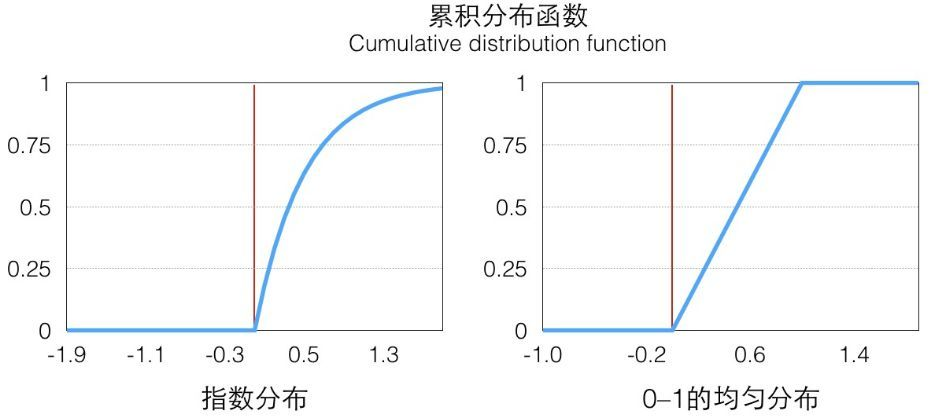
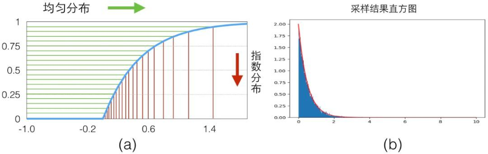
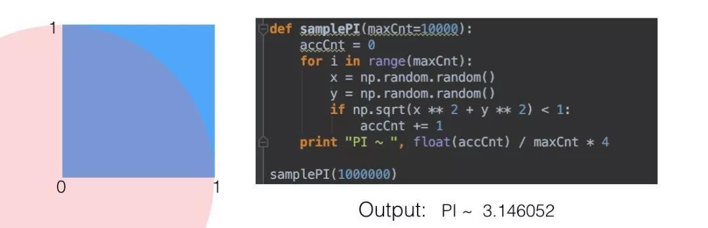
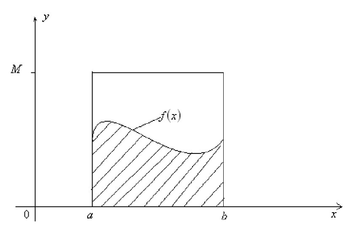
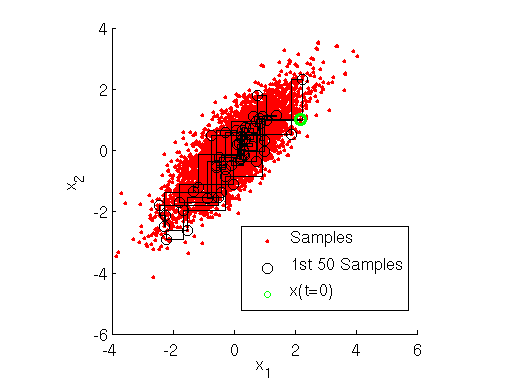

## 蓄水池采样法(Reservoir Sampling)

蓄水池算法适用于对一个不清楚规模的数据集进行采样。尤其适合针对数据流进行采样，并不知道这个流什么时候结束，且须保证每单位数据被采样到的几率相同。

假设数据序列规模为，需要采样的数量为。内存中开辟可容纳个元素的空间，并将序列前个元素放入空间中。然后从第个元素开始，以的概率来决定该元素是否被替换到数组中（数组中的元素被替换的概率是相同的）。当遍历完所有元素后，内存中所存储的即为采样的样本。

证明：

对于第个数()，被选中的概率为。当走到第步时，被第个元素替换的概率为个元素被选中的概率乘以被选择替换的概率，即。则被保留的概率为。依次类推，不被个元素替换的概率为。则运行到第步时，被保留的概率为被选中的概率乘以不被替换的概率，即。

对于第个数()。在第步被选中的概率为。不被第个元素替换的概率为。则运行到第步时，被保留的概率为被选中概率乘以不被替换概率，即

所以，对于每一个元素，被保留的概率都为。

## 逆采样(Inverse Sampling)

在蒙特卡罗方法中，有一个关键的问题需要解决，即如何基于概率密度函数去采得个的样本。

逆采样(Inverse Sampling)和拒绝采样(Reject Sampling)就是用于解决这个问题的。

我们知道，对于常见的均匀分布是非常容易采样的，一般通过[线性同余发生器](https://baike.baidu.com/item/%E7%BA%BF%E6%80%A7%E5%90%8C%E4%BD%99%E5%8F%91%E7%94%9F%E5%99%A8/22674963?fr=aladdin)就可以很方便的生成之间的伪随机数样本。而其他常见的概率分布，无论是离散的分布还是连续的分布，它们的样本都可以通过的样本转换而得。那么应该如何得到呢？这就是逆采样。

我们以指数分布为例，说明如何通过均匀分布来采样服从指数分布的样本集。指数分布的概率密度函数PDF为：

那么它的概率分布函数为：

下图为指数分布和均匀分布的CDF图。从左图上看，在的部分是一个单调递增的函数（在定义域上单调非减），定义于和值域是，在大的地方它增长快，反之亦然。

因为它是唯一映射的(在大于的部分，接下来我们只考虑这一部分)，所以它的反函数可以表示为，，值域为。因为单调递增，所以也是单调递增的：

 

利用反函数的定义，我们有：

接下来，我们定义一下均匀分布的CDF，这个很好理解：

根据上两式，有：

因为的值域，根据均匀分布的CDF，上式可改写为：

据的定义，它是分布的CDF，所以上式的意思是符合分布，我们通过的反函数将一个到均匀分布的随机数转换成了符合分布的随机数，注意，以上推导对于CDF可逆的分布都是一样的。对于来说，它的反函数的形式是：

具体的映射关系可以看下图(a)，我们从y轴0-1的均匀分布样本(绿色)映射得到了服从指数分布的样本(红色)

最后绘制出来的直方图可以看出来就是分布图，见上图(b)。可以看到随着采样数量的变多，概率直方图和真实的CDF就越接近。以上就是逆采样的过程。我们的结论是：因为CDF是单调函数(累积的概率只能越来越大，直到为1)，因此，只要某分布的CDF可逆，那么就可以通过均匀分布来采样服从该分布的样本集。

## 拒绝采样(Reject Sampling)

对于常见的分布，如均匀分布，高斯分布，指数分布，t分布，F分布，Beta分布，Gamma分布等，可以采用逆采样的方法进行采样；不过很多时候，我们的概率分布不是常见的分布，这些分布的概率分布函数CDF 不可逆，因此没有办法用逆采样来采样，这意味着我们没法方便的得到这些非常见的概率分布的样本集。拒绝采样就是用来解决这个问题的一种随机采样方法。

我们以求圆周率的例子入手，讲解拒绝采样的思想。通过采样的方法来计算值，也就是在一个的范围内随机采样一个点，如果它到原点的距离小于，则说明它在圆内，则接受它，最后通过接受的占比来计算圆形的面积，从而根据公式反算出预估的值，随着采样点的增多，最后的结果会愈加准确。

上面这个例子里说明一个问题，我们想求一个空间里均匀分布的集合面积，可以尝试在更大范围内按照均匀分布随机采样，如果采样点在集合中，则接受，否则拒绝。最后的接受概率就是集合在”更大范围“的面积占比。接下来，我们来形式化地说明拒绝采样。

给定一个概率分布，其中，已知，为归一化常数，未知。要对该分布进行拒绝采样，首先需要借用一个简单的参考分布(proposal distribution)，记为，该分布的采样易于实现，如均匀分布、高斯分布。然后引入常数，使得对所有的，满足，如下图所示，红色的曲线为，蓝色的曲线为。

在每次采样中，首先从采样一个数值，然后在区间进行均匀采样，得到。如果，则保留该采样值，否则舍弃该采样值。最后得到的数据就是对分布的一个近似采样。结合图，直观来理解上述的过程：在这条线上，从均匀采样中一个值，如果这个值小于，即这个均匀采样的这个值落在了下方，我们就接受这个采样值。

我们知道，每次采样的接受概率计算如下：

所以，为了提高接受概率，防止舍弃过多的采样值而导致采样效率低下，的选取应该在满足的基础上尽可能小。

拒绝采样问题可以这样理解，与轴之间的区域为要估计的问题，类似于求提到的圆形区域，与轴之间的区域为参考区域，类似于上面提到的正方形。由于与轴之间的区域面积为（原来的概率密度函数的面积为，现在扩大了倍）所以，与轴之间的区域面积除以即为对的估计。在每一个采样点，以为界限，落在曲线以下的点就是服从分布的点。

我们必须知道复杂分布的概率密度函数PDF，才可以进行拒绝采样。然而，在现实情况中：

- 对于一些二维分布，有时候我们只能得到条件分布和，却很难得到二维分布的概率密度函数的一般形式，这时我们无法用拒绝采样得到其样本集。
- 对于一些高维的复杂非常见分布，我们要找到一个合适的和非常困难。

因此，实际上，我们仍然要找到一种方法可以解决如何方便得到各种复杂概率分布的对应的采样样本集的问题。马尔科夫链有能力帮助找到这些复杂概率分布的对应的采样样本集，而这也是MCMC采样的基础。

## 采样和蒙特卡罗方法

有许多原因使我们希望从某个分布中采样。当我们需要以较小的代价近似许多项或某个积分时，采样是一种很灵活的选择。有时候，我们使用它加速一些很费时却易于处理的求和估计，就像我们使用小批量对整个训练代价进行子采样一样。在其他情况下，我们需要近似一个难以处理的求和或积分，例如估计一个无向模型中配分函数对数的梯度时。在许多其他情况下，抽样实际上是我们的目标，例如我们想训练一个可以从训练分布采样的模型。

### [蒙特卡罗 vs 拉斯维加斯](https://www.zhihu.com/question/20254139)

我们知道，随机算法在采样不全时，通常不能保证找到最优解，只能说是尽量找。那么根据怎么个“尽量”法儿，我们我们把随机算法分成两类：

- 蒙特卡罗算法：采样越多，越**近似**最优解；
- 拉斯维加斯算法：采样越多，越**有机会找到**最优解；

举个例子，假如筐里有100个苹果，让我每次闭眼拿1个，挑出最大的。于是我随机拿1个，再随机拿1个跟它比，留下大的，再随机拿1个……我每拿一次，留下的苹果都至少不比上次的小。拿的次数越多，挑出的苹果就越大，但我除非拿100次，否则无法肯定挑出了最大的。这个挑苹果的算法，就属于蒙特卡罗算法——**尽量找好的，但不保证是最好的**。

而拉斯维加斯算法，则是另一种情况。假如有一把锁，给我100把钥匙，只有1把是对的。于是我每次随机拿1把钥匙去试，打不开就再换1把。我试的次数越多，打开（最优解）的机会就越大，但在打开之前，那些错的钥匙都是没有用的。这个试钥匙的算法，就是拉斯维加斯的——**尽量找最好的，但不保证能找到**。

这两类随机算法之间的选择，往往受到问题的局限。如果问题要求在有限采样内，必须给出一个解，但不要求是最优解，那就要用蒙特卡罗算法。反之，如果问题要求必须给出最优解，但对采样没有限制，那就要用拉斯维加斯算法。

比如机器下棋的算法本质都是搜索树，围棋难在它的树宽可以达到好几百。在有限时间内要遍历这么宽的树，就只能牺牲深度（俗称“往后看几步”），但围棋又是依赖远见的游戏，甚至不仅是看“几步”的问题。所以，要想保证搜索深度，就只能放弃遍历，改为随机采样——这就是为什么在没有MCTS（蒙特卡罗搜树）类的方法之前，机器围棋的水平几乎是笑话。而采用了MCTS方法后，搜索深度就大大增加了。

### 蒙特卡罗采样的基础

蒙特卡罗原来是一个赌场的名称，用它作为名字大概是因为蒙特卡罗方法是一种随机模拟的方法，这很像赌博场里面的扔骰子的过程。最早的蒙特卡罗方法都是为了求解一些不太好求解的求和或者积分问题。比如积分：

如果我们很难求解出的原函数，那么这个积分比较难求解。当然我们可以通过蒙特卡罗方法来模拟求解近似值。如何模拟呢？假设我们函数图像如下图：

一个简单的近似求解方法是在之间随机的采样一个点。比如，然后用代表在区间上所有的的值。那么上面的定积分的近似求解为：

当然，用一个值代表区间上所有的的值太粗糙了。我们可以采样区间的个值：，用它们的均值来代表区间上所有的的值。这样我们上面的定积分的近似求解为：

虽然上面的方法可以一定程度上求解出近似的解，但是它隐含了一个假定，即在之间是均匀分布的，而绝大部分情况，在之间不是均匀分布的。若我们用上面的方法，则模拟求出的结果很可能和真实值相差甚远

如果我们可以得到在的概率分布函数，那么我们的定积分求和可以这样进行：

上式最右边的这个形式就是蒙特卡罗方法的一般形式。当然这里是连续函数形式的蒙特卡罗方法，但是在离散时一样成立。关于上式，我们可以这么理解最后一步转换：由于可以看做是基于概率分布的期望，那么我们可以用期望的方法来求这个式子的值。而计算期望的一个近似方法是取的若干个基于分布的采样点，然后求平均值得到。

#### Example

假设的取值只有2个，。对应的值分别是。其中的取值不是平均的，取的概率，取的概率。

那么严格来说，根据，对应的的积分等于基于概率分布的期望，根据公式，则有。

此时我们采样三次，期望求近似结果。假设第一次采样到1，第二三次采样到2，那么最后的近似结果是

这个就是我们的近似。虽然有些距离，但是由于采样太少原因。若我们采样100次，得到26次1，74次2，那么近似结果是。可见结果越来越接近。接近的原因是随着采样数的增多，采样的样本分布越来越接近于本来的分布。

### 基于马尔科夫链采样

#### 马尔可夫链转移矩阵性质

马尔科夫链定义本身比较简单，它假设某一时刻状态转移的概率只依赖于它的前一个状态。举个形象的比喻，假如每天的天气是一个状态的话，那个今天是不是晴天只依赖于昨天的天气，而和前天的天气没有任何关系。当然这么说可能有些武断，但是这样做可以大大简化模型的复杂度，因此马尔科夫链在很多时间序列模型中得到广泛的应用，比如循环神经网络RNN，隐式马尔科夫模型HMM等，当然MCMC也需要它。

如果用精确的数学定义来描述，则假设我们的序列状态是那么我们在时刻的状态的条件概率仅仅依赖于时刻，即：

既然某一时刻状态转移的概率只依赖于它的前一个状态，那么我们只要能求出系统中任意两个状态之间的转换概率，这个马尔科夫链的模型就定了。

这个马尔科夫链是表示股市模型的，共有三种状态：牛市（Bull market）,熊市（Bear market）和横盘（Stagnant market）。每一个状态都以一定的概率转化到下一个状态。比如，牛市以0.025的概率转化到横盘的状态。这个状态概率转化图可以以矩阵的形式表示。如果我们定义矩阵某一位置的值为，即从状态转化到状态的概率，并定义牛市为状态0，熊市为状态1，横盘为状态2。这样我们得到了马尔科夫链模型的状态转移矩阵为：

讲了这么多，那么马尔科夫链模型的状态转移矩阵和我们蒙特卡罗方法需要的概率分布样本集有什么关系呢？这需要从马尔科夫链模型的状态转移矩阵的收敛性质讲起。**马尔科夫链模型的状态转移矩阵收敛到的稳定概率分布与我们的初始状态概率分布无关，且这个稳定分布是唯一的。**这是一个非常好的性质，也就是说，如果我们得到了这个稳定概率分布对应的马尔科夫链模型的状态转移矩阵，则我们可以用任意的概率分布样本开始，带入马尔科夫链模型的状态转移矩阵，这样经过一些序列的转换，最终就可以得到符合对应稳定概率分布的样本。

#### 基于马尔可夫链的采样

如果我们得到了某个平稳分布所对应的马尔科夫链状态转移矩阵，我们就很容易采用出这个平稳分布的样本集。

假设我们任意初始的概率分布是，经过第一轮马尔可夫链状态转移后的概率分布是，第轮的概率分布是。假设经过轮后马尔可夫链收敛到我们的平稳分布，即：

对于每个分布，我们有：

现在我们可以开始采样了，首先，基于初始任意简单概率分布比如高斯分布采样得到状态值，基于条件概率分布采样状态值，一直进行下去，当状态转移进行到一定的次数时，比如到次时，我们认为此时的采样集即是符合我们的平稳分布的对应样本集，可以用来做蒙特卡罗模拟求和了。

#### 采样过程

1. 输入马尔可夫链状态转移矩阵，设定状态转移次数阈值，需要的样本个数
2. 从任意简单概率分布采样得到初始状态值
3. ：从条件概率分布中采样得到样本
4. 样本集即为我们需要的平稳分布对应的样本集

对采样过程的两点补充说明：

- 第3.步，每对采样一次就意味着模拟了一次操作。在此过程中，状态转化矩阵没有变化。
- 第4.步，注意的是采样的样本集的下标是，即状态稳定之后采样的样本才是我们需要的样本集。即我们需要从真正趋于稳定时候的分布抽样样本。

如果假定我们可以得到我们需要采样样本的平稳分布所对应的马尔科夫链状态转移矩阵，那么我们就可以用马尔科夫链采样得到我们需要的样本集，进而进行蒙特卡罗模拟。但是一个重要的问题是，随意给定一个平稳分布，如何得到它所对应的马尔科夫链状态转移矩阵呢？这是个大问题。我们绕了一圈似乎还是没有解决任意概率分布采样样本集的问题。幸运的是，MCMC采样通过迂回的方式解决了上面这个大问题，以及它的使用改进版采样：M-H采样和Gibbs采样。

### MCMC采样

在解决从平稳分布，找到对应的马尔可夫链状态转移矩阵之前，我们还需要先看看马尔科夫链的细致平稳条件，定义如下：

如果非周期马尔科夫链的状态转移矩阵和概率分布对于所有的，满足：

则称概率分布是状态转移矩阵的平稳分布。

证明很简单，由细致平稳条件有：

将上式用矩阵表示即为：

即满足马尔可夫链的收敛性质。也就是说，只要我们找到了可以使概率分布满足细致平稳分布的矩阵即可。这给了我们寻找从平稳分布，找到对应的马尔可夫链状态转移矩阵的新思路。

不过不幸的是，仅仅从细致平稳条件还是很难找到合适的矩阵。比如我们的目标平稳分布是，随机找一个马尔可夫链状态转移矩阵，它是很难满足细致平稳条件的，即：

​	MCMC采样是这样做的。由于一般情况下，目标平稳分布和某一个马尔可夫链状态转移矩阵不满足细致平稳条件，即上式。我们可以对上式做一个改造，使细致平稳条件成立。方法是引入一个，使上式可以去等号，即：

​	问题是什么样的可以使等式成立呢？其实很简单，只要满足下两式即可：

​	这样，我们就得到了我们的分布对应的马尔可夫链状态转移矩阵，满足：

​	也就是说，我们的目标矩阵可以通过任意一个马尔可夫链状态转移矩阵乘以得到。我们又一般称之为接受率，取值在之间。物理意义可以理解为：在原来的马氏链上，从状态以的概率转移到状态的时候，我们以的概率接受这个转移。即目标矩阵可以通过任意一个马尔科夫链状态转移矩阵以一定的接受率获得。这个很像拒绝采样的思想，那里是以一个常用分布通过一定的接受-拒绝概率得到一个非常见分布，这里是以一个常见的马尔科夫链状态转移矩阵通过一定的接受-拒绝概率得到目标转移矩阵，两者的解决问题思路是类似的。

#### 采样过程

1. 输入任意选定的马尔可夫链状态转移矩阵，平稳分布，设定状态转移次数阈值，需要的样本个数
2. 从任意简单概率分布采样得到初始状态值
3. ：
   1. 从条件概率分布中采样得到样本
   2. 从均匀分布采样
   3. 如果，则接受转移，即
   4. 否则不接受转移，即

​	样本集即为我们需要的平稳分布对应的样本集。对于3.的d步，意味着，尽管不接受转移，但是也把它放入了样本序列。而在有些算法中，被拒绝的样本就不进入采样样本序列。尽管双方有些mismatch，不过对理解算法影响不大。

​	上面这个过程基本上就是MCMC采样的完整采样理论了，但是这个采样算法还是比较难在实际中应用，为什么呢？问题在上面第三步的（c）步骤，接受率这儿。由于可能非常的小，比如，导致我们大部分的采样值都被拒绝转移，采样效率很低。有可能我们采样了上百万次马尔可夫链还没有收敛，也就是上面这个要非常非常的大，这让人难以接受，怎么办呢？这时就轮到我们的M-H采样出场了。

### M-H采样

M-H采样是Metropolis-Hastings采样的简称，这个算法首先由Metropolis提出，被Hastings改进，因此被称之为Metropolis-Hastings采样或M-H采样。M-H采样解决了MCMC采样接受率过低的问题。

​	我们回到MCMC采样的细致平稳条件：

​	我们采样效率低的原因是太小了，比如为，而为。即：

​	我们可以看到，如果两边同时扩大五倍，接受率提高到了，但是细致平稳条件却仍然是满足的，即：

​	这样我们的接受率可以做如下改进，即：

​	对上式多解释一下：此时已经不是原来的意义，变为了的倍率关系，这里默认右边为，看左边的较大的那个接受率的值。即当原始的时，扩大了倍；时，直接变为。

#### 采样过程

1. 输入任意选定的马尔可夫链状态转移矩阵，平稳分布，设定状态转移次数阈值，需要的样本个数
2. 从任意简单概率分布采样得到初始状态值
3. ：
   1. 从条件概率分布中采样得到样本
   2. 从均匀分布采样
   3. 如果，则接受转移，即
   4. 否则不接受转移，即

样本集即为我们需要的平稳分布对应的样本集。

### 吉布斯采样(Gibbs sampling)

​	M-H采样已经可以很好的解决蒙特卡罗方法需要的任意概率分布的样本集的问题。但是M-H采样有两个缺点：一是需要计算接受率，在高维时计算量大。并且由于接受率的原因导致算法收敛时间变长。二是有些高维数据，特征的条件概率分布好求，但是特征的联合分布不好求。因此需要一个好方法改进M-H采样，这就是Gibbs采样。

​	从上面内容我们得到细致平稳条件：若非周期马尔科夫链的状态转移矩阵和概率分布对所有的满足：

​	则称概率分布是状态转移矩阵的平稳分布。

​	在M-H采样中我们通过引入接受率使细致平稳条件满足。现在我们换一个思路。

​	从二维的数据分布开始，假设是一个二维联合数据分布，观察第一个特征维度相同的两个点和，容易发现下面两式成立：

成立的原因是：和

由于上面两式右边相等，因此我们有：

也就是

观察上式再观察细致平稳条件的公式，我们发现在这条直线上，如果用条件概率分布作为马尔科夫链的状态转移概率，则任意两个点之间的转移满足细致平稳条件！这真是一个开心的发现，同样的道理，在这条直线上，如果用条件概率分布作为马尔科夫链的状态转移概率，则任意两个点之间的转移也满足细致平稳条件。那是因为假如有一点，我们可以得到：

基于上面的发现，我们可以这样构造分布的马尔可夫链对应的状态转移矩阵：

  

有了上面这样的状态转移矩阵，我们很容易验证平面上的任意两点，，满足细致平稳条件：

#### 二维Gibbs采样

利用上一节找到的状态转移矩阵，我们就得到了二维Gibbs采样，这个采样必须要知道两个维度之间的条件概率。具体过程如下：

1. 输入平稳分布，设定状态转移次数阈值，需要的样本个数
2. 随机初始化初始状态值和
3. ：
   1. 从条件概率分布中采样得到样本
   2. 从条件概率分布中采样得到样本

样本即为我们需要的平稳分布对应的样本集。整个采样过程中，我们通过轮换坐标轴，采样的过程为：

用下图可以很直观的看出，采样是在两个坐标轴上不停的轮换的。当然，坐标轴轮换不是必须的，我们也可以每次随机选择一个坐标轴进行采样。不过常用的Gibbs采样的实现都是基于坐标轴轮换的。

#### 多维Gibbs采样

上面的这个算法推广到多维的时候也是成立的。比如一个维的概率分布，我们可以通过个坐标轴上轮换采样，来得到新的样本。对于轮换到的任意一个坐标轴上的转移，马尔科夫链的状态转移概率为，即固定个坐标轴，在某一个坐标轴上移动。

#### 采样过程

1. 输入平稳分布或者对应的所有特征的条件概率分布，设定状态转移次数阈值，需要的样本个数
2. 随机初始化初始状态值
3. ：
   1. 从条件概率分布中采样得到样本
   2. 从条件概率分布中采样得到样本
   3. ...
   4. 从条件概率分布中采样得到样本
   5. ...
   6. 从条件概率分布中采样得到样本

样本即为我们需要的平稳分布对应的样本集。整个采样过程和Lasso回归的坐标轴下降法算法非常类似，只不过Lasso回归是固定个特征，对某一个特征求极值。而Gibbs采样是固定个特征在某一个特征采样。

同样的，轮换坐标轴不是必须的，我们可以随机选择某一个坐标轴进行状态转移，只不过常用的Gibbs采样的实现都是基于坐标轴轮换的。

## Source

[https://www.zhihu.com/question/20254139/answer/33572009](https://www.zhihu.com/question/20254139/answer/33572009) [https://www.jiqizhixin.com/articles/061001](https://www.jiqizhixin.com/articles/061001) [https://blog.csdn.net/anshuai_aw1/article/details/84792383](https://blog.csdn.net/anshuai_aw1/article/details/84792383) [https://blog.csdn.net/anshuai_aw1/article/details/84875521](https://blog.csdn.net/anshuai_aw1/article/details/84875521) [https://blog.csdn.net/anshuai_aw1/article/details/84883617](https://blog.csdn.net/anshuai_aw1/article/details/84883617) [https://www.cnblogs.com/snowInPluto/p/5996269.html](https://www.cnblogs.com/snowInPluto/p/5996269.html)
