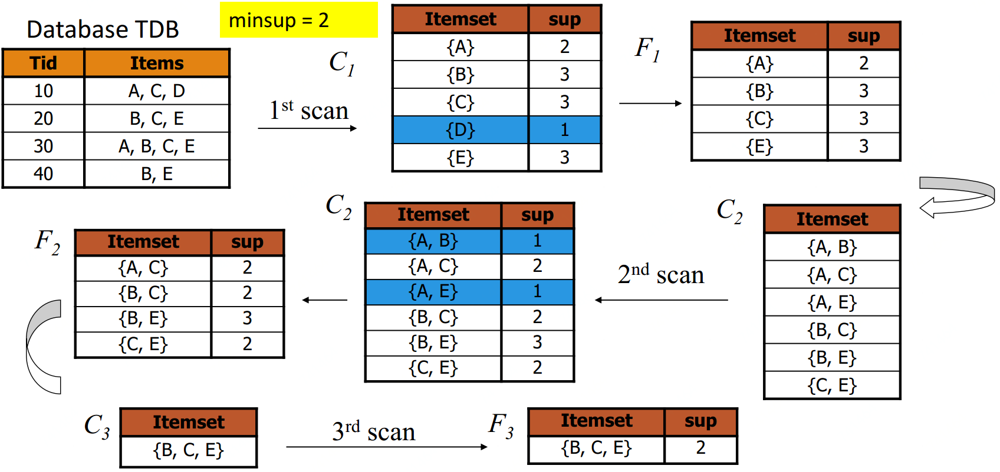
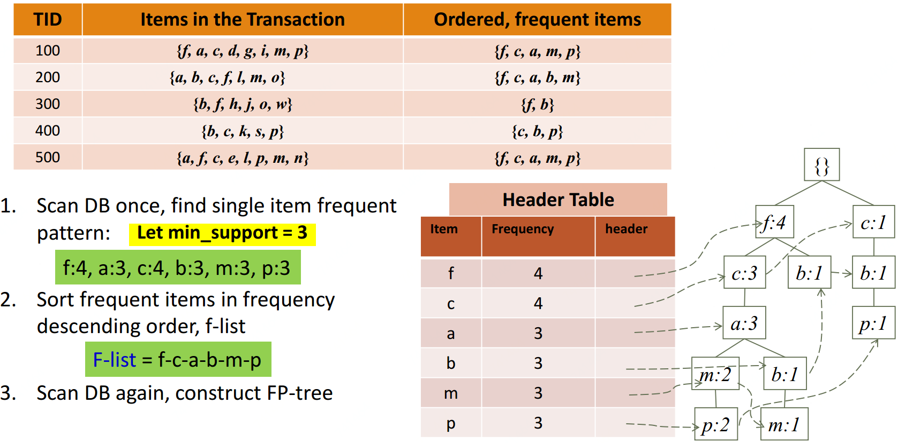
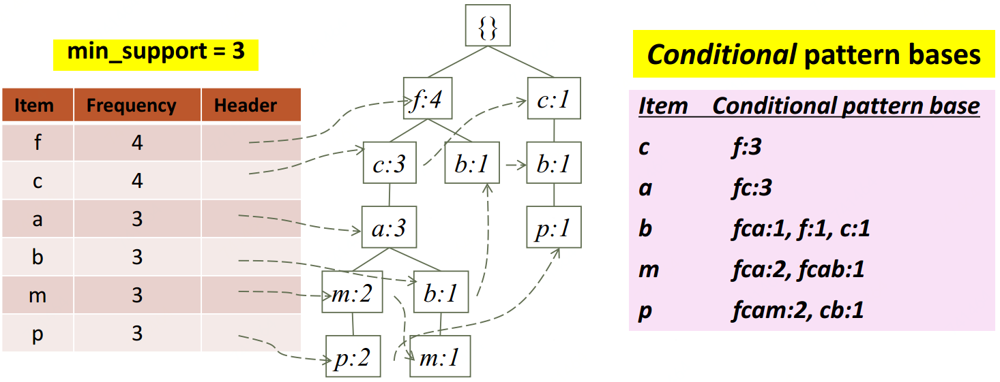
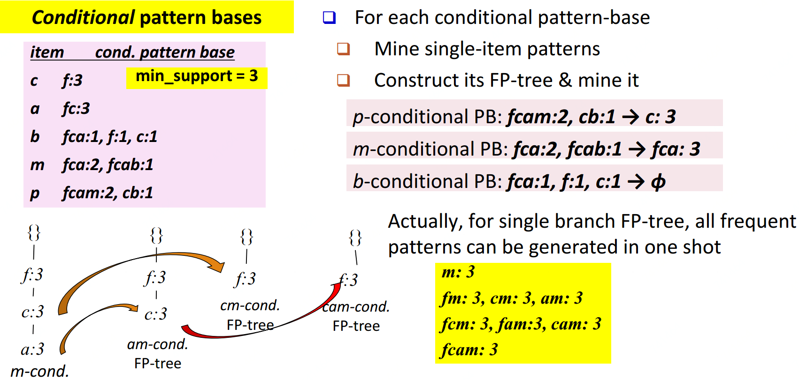
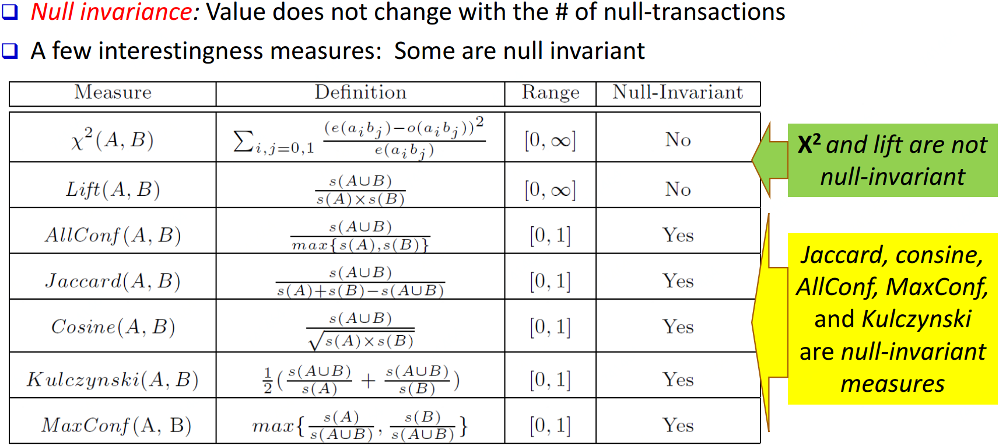
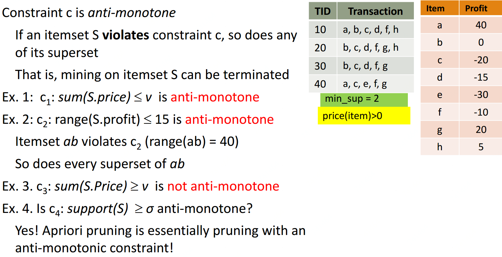
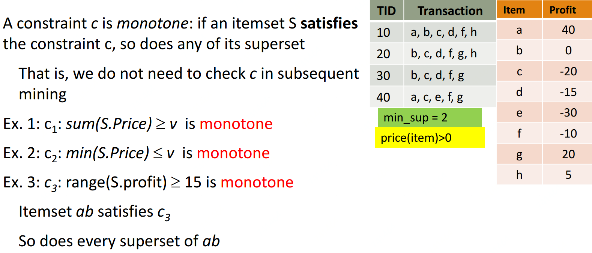
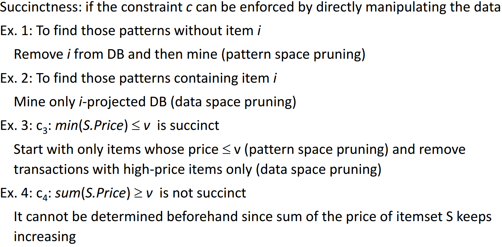
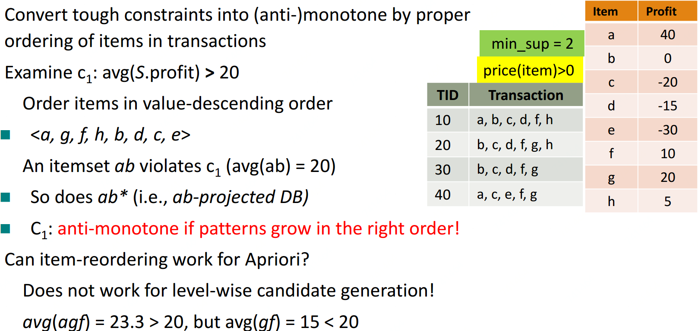
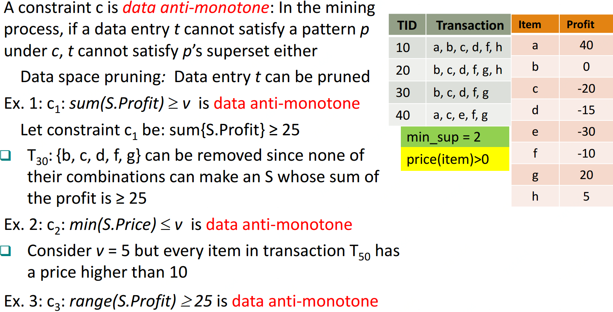

什么样的数据才是频繁项集呢？也许你会说，这还不简单，肉眼一扫，一起出现次数多的数据集就是频繁项集吗！的确，这也没有说错，但是有两个问题，第一是当数据量非常大的时候，我们没法直接肉眼发现频繁项集，这催生了关联规则挖掘的算法，比如Apriori，PrefixSpan等。第二是我们缺乏一个频繁项集的标准。比如10条记录，里面A和B同时出现了三次，我们能不能说A和B构成频繁项集呢？因此我们需要一个评估频繁项集的标准。


## 评估标准

常用的频繁项集的评估标准有支持度，置信度和提升度三个。

### 支持度

支持度就是几个关联的数据在数据集中出现的次数占总数据集的比重。或者说几个数据关联出现的概率。如果我们有两个想分析关联性的数据和，则对应的支持度为：


以此类推，如果我们有三个想分析关联性的数据，和，则对应的支持度为：


一般来说，支持度高的数据不一定构成频繁项集，但是支持度太低的数据肯定不构成频繁项集。

<a name="8f3599b6"></a>
### 置信度

置信度体现了一个数据出现后，另一个数据出现的概率，或者说数据的条件概率。如果我们有两个想分析关联性的数据和，对的置信度为


以此类推到多个数据的关联置信度，比如对于三个数据，和，则对于和的置信度为：


举个例子，在购物数据中，纸巾对应鸡爪的置信度为40%，支持度为1%。则意味着在购物数据中，总共有1%的用户既买鸡爪又买纸巾；同时买鸡爪的用户中有40%的用户购买纸巾。

<a name="e4792cca"></a>

### 提升度

提升度表示含有的条件下，同时含有的概率，与总体发生的概率之比，即：


---


## 项集挖掘
### Apriori

Apriori算法是常用的用于挖掘出数据关联规则的算法，它用来找出数据值中频繁出现的数据集合，找出这些集合的模式有助于我们做一些决策。比如在常见的超市购物数据集，或者电商的网购数据集中，如果我们找到了频繁出现的数据集，那么对于超市，我们可以优化产品的位置摆放，对于电商，我们可以优化商品所在的仓库位置，达到节约成本，增加经济效益的目的。下面我们就对Apriori算法做一个总结。 [文本挖掘](..\文本挖掘) 

找到支持度大于的项集，若了，那更小，所以不可能是频繁项集，所以就不用计算了。反之，那肯定。Apriori就基于此思想迭代和剪枝

```
扫描数据库，生成高频1-项集(只有1项的)
while:
     根据上一轮k-项集生成(k+1)-项集作为候选集
     扫描数据库测试生成的(k+1)-项集候选集是否高频(这里构造时，新加的项必须也满足支持度)
     k = k+1
     Until: 没有大于阈值的 或 没有新候选集可生成
return: 返回所有满足频繁项集
```




Code实现：[https://spark.apache.org/docs/2.3.0/mllib-frequent-pattern-mining.html](https://spark.apache.org/docs/2.3.0/mllib-frequent-pattern-mining.html)


### FP-Growth

也基于了若k-项集都不满足支持度，那含k-项集的(k+1)项集也不满足的思想。

算法思想如下图：

1. 扫第一遍数据库，统计出所有满足最低支持度的单项的支持度；把不满足最低支持度的单项去掉（如果单项都不满足支持度，此单项和其他组合支持度肯定更低更不满足，所以直接去掉即可）
2. 每笔交易中的商品按支持度高低排序。
3. 再扫一遍数据库，建立FP-tree。这里FP-tree使用链表保存，注意这里非一棵树但相同元素也有指针指向(比如p：2（最左下）指向了p：1（最右下）)，这样是为了寻找p的频繁项集时，方便全找到FP-tree中的p。
4. 查询时从对应叶节点往上找就好。

<br />

Code实现：[https://spark.apache.org/docs/2.3.0/mllib-frequent-pattern-mining.html](https://spark.apache.org/docs/2.3.0/mllib-frequent-pattern-mining.html)

---


## 项集衡量


---


## 基于约束的频繁项集

有时我们并不关心所有的频繁项集，只想了解我们关心的。加约束条件去挖掘既灵活又可加快速度。

### 模式空间剪枝约束
#### Anti-monotonic

<a name="Cgl5l"></a>
#### Monotonic

<a name="H2DpY"></a>
#### Succinct

<a name="jZwCY"></a>
#### Convertible


<a name="VORFV"></a>

### 数据空间剪枝约束

#### Data succinct

<a name="ggURg"></a>
#### Data anti-monotonic<br />

