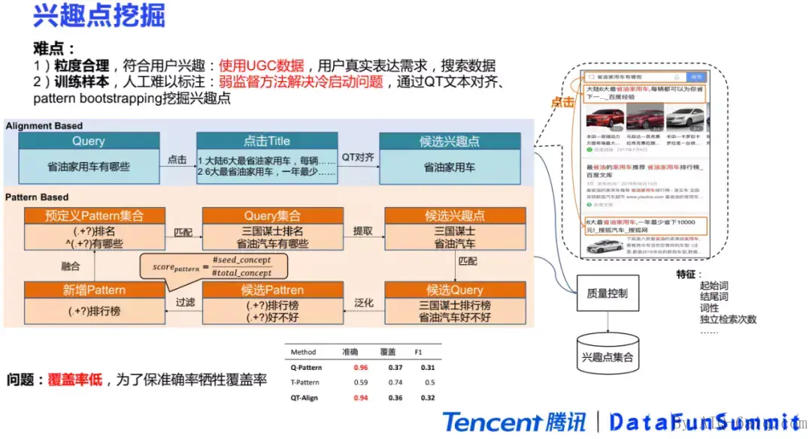
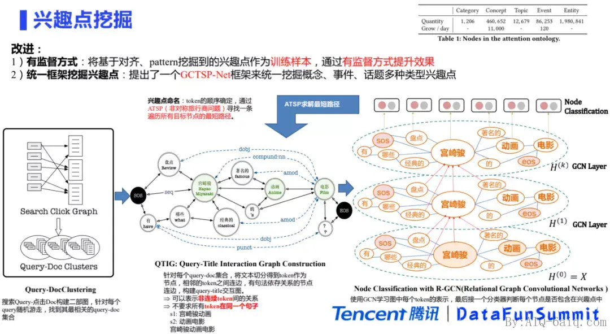

大家可能听过啤酒与尿布湿的例子，即通过模式挖掘超市的订单，发现啤酒和尿不湿经常同时出现在的相同订单中，通过大量的调研发现，是中年男性来买尿不湿时，通常会再买些啤酒，所以在超市货架摆放时，将啤酒和尿不湿之间再摆放些针对中年男性的商品，例如下酒速食菜、剃须泡沫等，隐性诱导消费，提高了超市的收入。虽然这个例子是为了帮助大家理解模式挖掘的应用而伪造的，其实实际实践的例子很多，之前听了腾讯新闻关于模式挖掘应用的分享，这里给大家简单介绍一下。  我们使用了一些UGC（User Generated Content，用户创造）的数据，主要是用户的些搜索和点击的行为数据。因为搜索和点击数据是用户真实需求的一个表达，用户有需求才会去搜索，搜索结果符合要求才会去点击。通过对搜索和点击语料进行挖掘之后，可以找到符合用户需求，并且力度合理的兴趣点。对于训练样本难以获取的问题，我们采用了两种弱监督的方式来解决冷启动：

1. 第一种是基于query和title对齐的方式。用户在搜索query之后会点击相应的篇章，这个时候就可以得到一些（query，title）文本对。将两个文本进行对齐，例如求两个文本的最长公共子序列，就可以得到一些候选的兴趣点。
2. 第二种方式是基于pattern的方式。pattern的方式是信息抽取中常用的方法，这里采用的是兴趣点pattern的bootstrap的方式来进行挖掘。bootstrap需要预定义一个pattern集合，利用这些pattern在query集合中召回匹配一些query，并从里面抽取出一些候选的兴趣点。在拿到这些兴趣点之后，可以去把包含这些兴趣点的query都召回出来，再把这些query进行泛化。比如把“三国谋士”进行泛化之后，就可以得到一些新的pattern。这些pattern可能数量会很多，所以需要进行一些质量控制，得到选一些高质量的pattern，最后把它们加入到之前的pattern集合里。通过循环往复的bootstrapping的方式，就可以不断地去获取到更多的pattern和兴趣点。目前基于Query-Pattern的准确率是96%，基于Query-Title对齐的准确率是94%。但这两种方式为了保证高准确率，牺牲了覆盖率，它们的整体覆盖率都很低，只有30%多。

# Source
[GIANT: Scalable Creation of a Web-scale Ontology](https://arxiv.org/abs/2004.02118) [腾讯基于兴趣点图谱的内容理解 - AIQ](https://www.6aiq.com/article/1630676224202)
