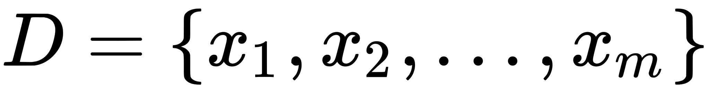
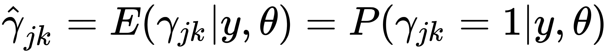
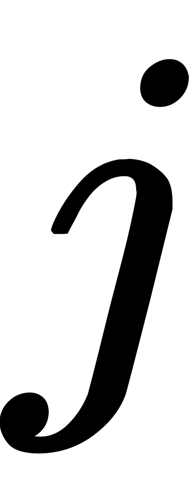

<a name="f8483ee5"></a>
## K-clustering

不同数据类型或场景适合K-clustering家族的不同方法，见下表

|  | K-Means | K-Medoids | K-Medians | K-Modes | Kernel K-Means |
| --- | :---: | :---: | :---: | :---: | :---: |
| 数据特点 | 常规数值 | 可能包含异常值 | 可能包含异常值 | 类别数据 | 非凸簇类 |


<a name="K-Means"></a>
### K-Means

K-Means即每一簇类使用类的均值来表示

输入：样本集，聚类簇数

过程：

- 从中随机选取个样本作为初始均值向量
- repeat：
   - 令
   - 
      - 计算样本与各均值向量的距离
      - 根据距离最近的均值向量确定的簇标记
      - 将样本划入相应的簇
   - 
      - 计算新均值向量
      - 
         - 将当前均值向量更新为
      - 
         - 保持当前均值不变
- until：当前均指向量均未更新


<a name="K-Medoids"></a>
### K-Medoids

K-Means对异常值敏感，如果一个极端值会干扰结果。这时可以使用K-Medoids

```
初始化：从数据点集中随机选择k个点，作为初始中心点；将待聚类的数据点集中的点，指派到最近的中心点
迭代(收敛或变化小于阈值停止)：
    对每中心点，和其每一个非中心点交换，计算交换后划分所生成的代价值，若交换造成代价增加，则取消交换
```


<a name="7490c7d4"></a>
### K-Medians&K-Modes

相较均值(mean)，中位数(median)更不易被异常值影响，所以也可使用K-Medians，即将均值换为中位数

K-Means不好处理类别数据(不好计算距离)，此时可使用K-Modes(众数)。K-Modes是用每个聚类中的众数（mode）做中心点。距离的定义也不同，通常K-Means较多使用欧式距离，K-Modes一般是汉明距离，也就是对于每个特征来说，如果不同记为1，相同则为0。

<a name="71e1856c"></a>
#### [K-Modes例子](http://sofasofa.io/forum_main_post.php?postid=1000500)
| 手机 | 国家 | 人群 | 颜色 |
| :---: | :---: | :---: | :---: |
| 1 | 中 | 青年 | 白 |
| 2 | 日 | 青年 | 黑 |
| 3 | 中 | 青年 | 蓝 |
| 4 | 中 | 青年 | 黑 |
| 5 | 日 | 青年 | 白 |
| 6 | 日 | 中年 | 黑 |
| 7 | 美 | 中年 | 蓝 |
| 8 | 美 | 中年 | 白 |
| 9 | 中 | 中年 | 黑 |
| 10 | 美 | 中年 | 黑 |


假定我们选择聚类的数量K=2，初始点为手机1（中，青年，白）和手机6（日，中年，黑），得到

|  | 与手机1距离 | 与手机6距离 |
| :---: | :---: | :---: |
| 2 | 2 | 1 |
| 3 | 1 | 3 |
| 4 | 1 | 2 |
| 5 | 1 | 2 |
| 7 | 3 | 2 |
| 8 | 2 | 2 |
| 9 | 2 | 1 |
| 10 | 3 | 1 |


距离越小属于同一类别，若到距离相同则可以随机归于一类。

<a name="ba15f7c9"></a>
### Kernel K-Means

对于非凸簇类，可使用核函数映射到高维，再进行聚类。


---

<a name="c4daeb06"></a>
## 高斯混合模型

高斯混合模型（Gaussian Mixture Model）通常简称GMM，是一种业界广泛使用的聚类算法，该方法使用了高斯分布作为参数模型，并使用了期望最大（Expectation Maximization，简称EM）算法进行训练。在特定约束条件下，K-means算法可以被看作是高斯混合模型（GMM）的一种特殊形式。

高斯混合模型（Gaussian Mixed Model）指的是多个高斯分布函数的线性组合，理论上GMM可以拟合出任意类型的分布，通常用于解决同一集合下的数据包含多个不同的分布的情况（或者是同一类分布但参数不一样，或者是不同类型的分布，比如正态分布和伯努利分布）。

<a name="26d620f0"></a>
### 例子一

如下图，图中的点在我们看来明显分成两个聚类。这两个聚类中的点分别通过两个不同的正态分布随机生成而来。但是如果没有GMM，那么只能用一个的二维高斯分布来描述下图中的数据。图中的椭圆即为二倍标准差的正态分布椭圆。这显然不太合理，毕竟肉眼一看就觉得应该把它们分成两类。<br /><br />这时候就可以使用GMM了！如下图，数据在平面上的空间分布和上图一样，这时使用两个二维高斯分布来描述图中的数据，分别记为和。图中的两个椭圆分别是这两个高斯分布的二倍标准差椭圆。可以看到使用两个二维高斯分布来描述图中的数据显然更合理。实际上图中的两个聚类的中的点是通过两个不同的正态分布随机生成而来。如果将两个二维高斯分布和合成一个二维的分布，那么就可以用合成后的分布来描述图中的所有点。最直观的方法就是对这两个二维高斯分布做线性组合，用线性组合后的分布来描述整个集合中的数据。这就是高斯混合模型（GMM）。<br />
<a name="f6b5449b"></a>
### 例子二
<br />上图为男性（蓝）和女性（红）的身高采样分布图。上图的y-轴所示的概率值，是在已知每个用户性别的前提下计算出来的。但通常情况下我们并不能掌握这个信息（也许在采集数据时没记录），因此不仅要学出每种分布的参数，还需要生成性别的划分情况。当决定期望值时，需要将权重值分别生成男性和女性的相应身高概率值并相加。

<a name="fd1f40f1"></a>
### 高斯混合模型定义

高斯混合模型，顾名思义，就是数据可以看作是从多个高斯分布中生成出来的。从中心极限定理可以看出，高斯分布这个假设其实是比较合理的。为什么我们要假设数据是由若干个高斯分布组合而成的，而不假设是其他分布呢？实际上不管是什么分布，只取得足够大，这个XX Mixture Model就会变得足够复杂，就可以用来逼近任意连续的概率密度分布。只是因为高斯函数具有良好的计算性能，所GMM被广泛地应用。

每个GMM由K个高斯分布组成，每个高斯分布称为一个组件（Component），这些组件线性加成在一起就组成了GMM的概率密度函数。高斯混合模型具有如下形式的概率分布模型：


其中，是系数，，；是高斯分布密度，，


称为第个分模型。

<a name="71f18442"></a>
### 高斯混合参数估计

假设观测数据由告诉混合模型生成


其中，。我们用EM算法估计高斯混合模型的参数

<a name="a829d0a9"></a>
#### 1、明确变量，写出完全数据的对数似然函数

可以设想观测数据，是这样产生的：首先依概率选择第个高斯分布分模型；然后依第个分模型的概率分布生成观测数据。这时观测数据是已知的；反映观测数据来自第个分模型的数据是未知的，，以隐变量表示，其定义如下：

。其中是0-1随机变量

有了观测数据及未观测数据，那么完全数据是


于是，可以写出完全数据的似然函数：

<br /><br /><br />

式中，，。

那么，完全数据的对数似然函数为：


<a name="72466605"></a>
#### 2、EM算法的E步：确定Q函数

                    <br />                                 <br />                                 

这里需要计算，记为<br /><br /><br /><br />

是在当前模型参数下第个观测数据来自第个分模型的概率，称为分模型对观测数据的响应度。

将及代入即得


<a name="512ab217"></a>
#### 3、确定EM算法的M步

迭代的M步是球函数对的极大值，即求新一轮迭代的模型参数：


用，及，表示的各参数。求，只需将分别对，求偏导数并令其为0，即可得到；求是在条件下求偏导数并令其为0得到的。结果如下：

<br /><br />

重复以上计算，直到对数似然函数值不再有明显的变化为止。

<a name="76c144a2"></a>
### 高斯混合模型EM算法

输入：观测数据，高斯混合模型；

输出：高斯混合模型参数

（1）取参数的初始值开始迭代

（2）E步：依据当前模型参数，计算分模型对观测数据的响应度


（3）M步：计算新一轮迭代的模型参数

<br /><br />

（4）重复第（2）步和第（3）步，直到收敛。

<a name="Source"></a>
## Source

[http://sofasofa.io/forum_main_post.php?postid=1000500](http://sofasofa.io/forum_main_post.php?postid=1000500)<br />[https://zhuanlan.zhihu.com/p/31103654](https://zhuanlan.zhihu.com/p/31103654)<br />[https://blog.csdn.net/jinping_shi/article/details/59613054](https://blog.csdn.net/jinping_shi/article/details/59613054)<br />[https://github.com/endymecy/spark-ml-source-analysis/blob/master/聚类/gaussian-mixture/gaussian-mixture.md](https://github.com/endymecy/spark-ml-source-analysis/blob/master/%E8%81%9A%E7%B1%BB/gaussian-mixture/gaussian-mixture.md)
