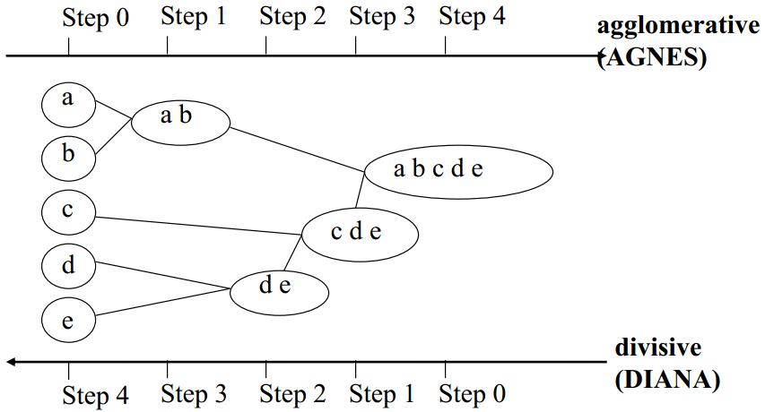
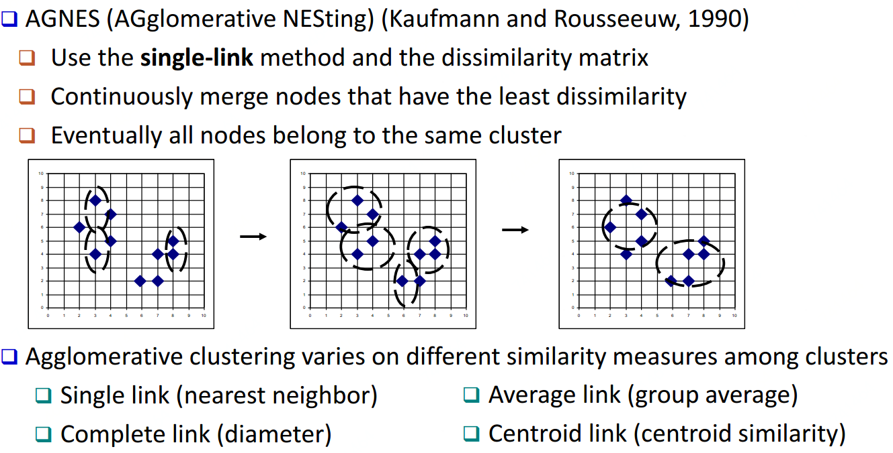
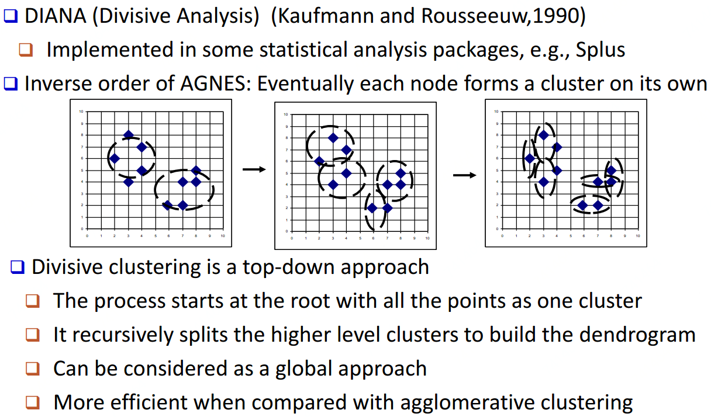
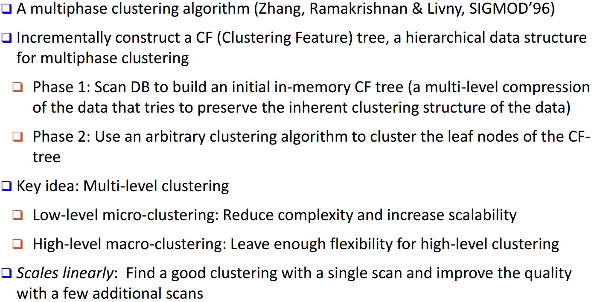
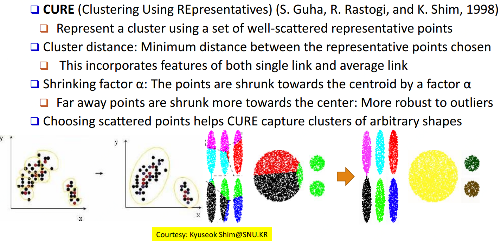
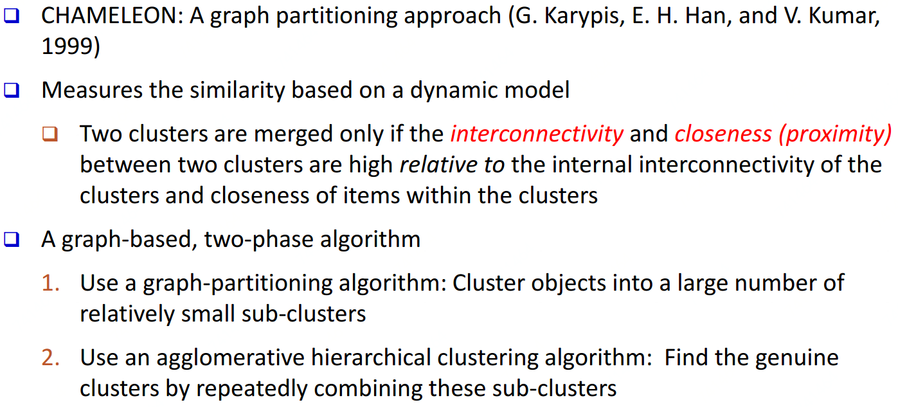
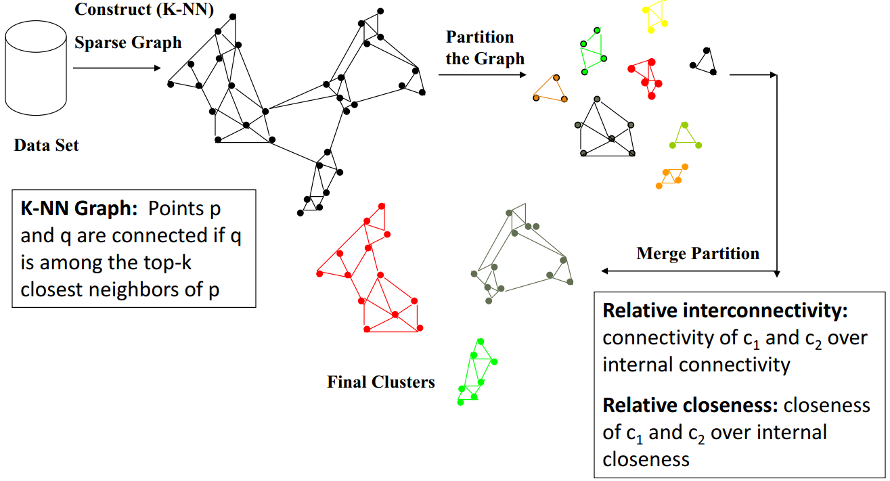

生成一个聚类层级（用树状图展示），聚合方法：AGNES，分裂方法：DIANA，其他层级方法：BIRCH、CURE、CHAMELEON 

## AGNES(Agglomerative Nesting)

AGNES是一种采用自底向上聚合策略的层次聚类算法。它先将数据集中的每个样本看作一个初始聚类簇，然后在算法运行的每一步中找出距离最近的两个聚类簇进行合并，该过程不断重复，直至达到预设的聚类簇个数。 

## DIANA(Divisive Analysis)

## BIRCH(Balanced Iterative Reducing and Clustering Using Hierarchies)

## CURE(Clustering Using Representatives)

## CHAMELEON(Hierarchical Clustering Using Dynamic Modeling)

