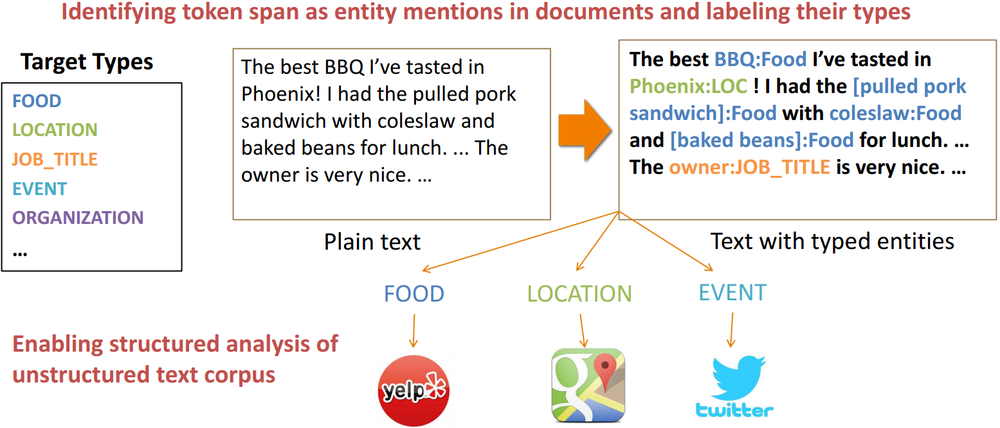
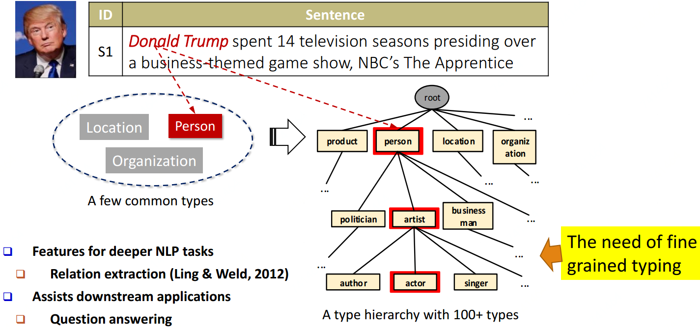
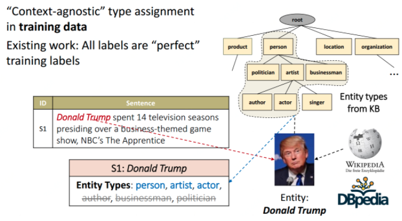
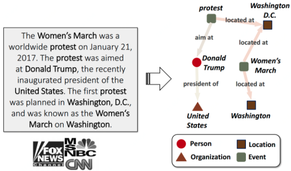
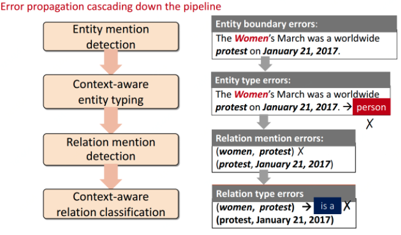

## 传统的NER局限

1、领域受限：必须已经在NER工具中记录过的实体，在实体识别在才有可能被发掘

2、名称多义：比如华盛顿，即使地名又是人名还是球队名

3、文本稀疏：某些实体只有在少数文本中提及

## 基于关系图结构和传递性的实体提取与类型标记

#### [ClusType: Effective Entity Recognition and Typing by Relation Phrase-Based Clustering](https://github.com/INK-USC/ClusType)

## 细粒度实体类型的标记

细粒度实体类型标记是指，不仅将懂王识别出来是person，还要识别出在此文本中，他是政客还是演员还是商人等等细粒度的标记。

    

#### [PLE(Heterogeneous Partial-Label Embedding)](https://github.com/INK-USC/PLE)

#### [AFET(Automatic Fine-Grained Entity Typing by Hierarchical Partial-Label Embedding)](https://github.com/INK-USC/AFET)

## 实体与相互间关系的联合类型标记

实体与相互间关系联合类型标记是指不仅将实体识别出来，还要标注出实体间关系。     

#### [CoType: Joint Typing of Entities and Relations](https://github.com/INK-USC/DS-RelationExtraction)

