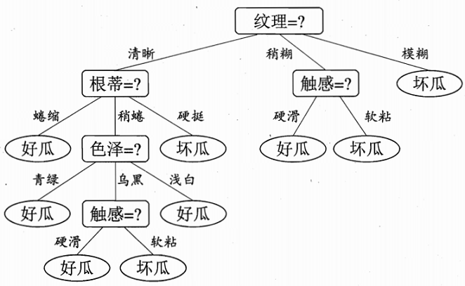
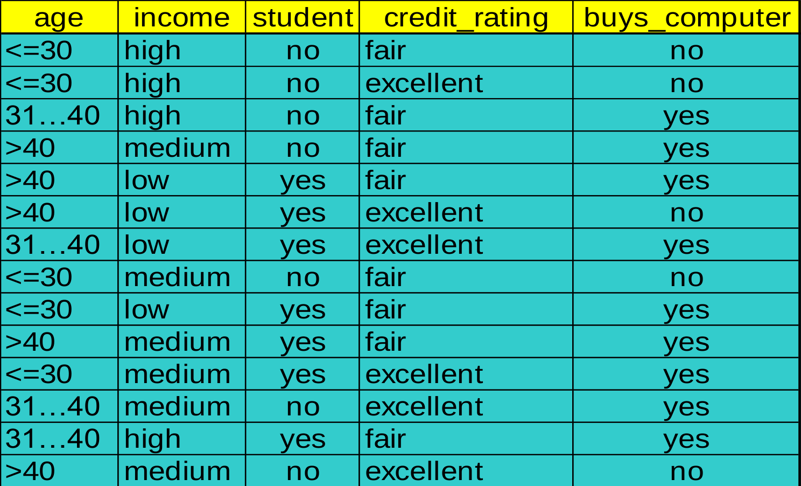

决策树是一种自上而下，对样本进行树形分类的过程，由结点和有向边组成。结点分为内部结点和叶结点，每个内部结点表示一个特征或属性，叶结点表示类别。从顶部根节点开始，所有样本聚在一起。经过根节点的划分，样本被分到不同的子结点中。再根据子结点的特征进一步划分，直至所有样本都被归到某一个类别(即叶结点)中



输入：训练集，属性集

过程：函数TreeGenerate(D, A)

```latex
生成结点node；
if D中样本全属于同一类别C
    将node标记为C类叶结点；return

if A为空或D中样本在A上取值相同
    将node标记为叶结点，其类别标记为D中样本最多的类；return

从A中选择较优划分属性a
for a的每一个值v
    为node生成一个分支；令Dv表示D在a上取值为v的样本子集
    if Dv为空
        将分支结点标记为叶结点，其类别标记为D中样本最多的类；return
    else
        以TreeGenerate(Dv,A\a)为分支结点
```

输出：以node为根结点的一颗决策树

显然，决策树的生成是一个递归过程，在决策树算法中，有三种情形会导致递归返回：

1. 当前结点包含的样本全属于同一类别，无需划分
2. 当前结点属性集为空，或是所有样本在所有属性上取值相同，无法划分
3. 当前结点包含的样本集合为空，不能划分

这里情形2.是在是在利用当前结点的后验分布，情形3则是把父结点的样本分布作为当前结点的先验分布

<a name="4a5807be"></a>
## 模型与划分

从决策树学习的逻辑可以看出，第8行和第10行，**即如何找到最优划分属性和这个属性的最优划分点最为关键**。随着划分不断进行，我们希望决策树的分支结点所包含的样本尽可能属于同一类别，即结点的”纯度“越来越高。

从样本类型的角度，ID3只能处理离散型变量，而C4.5和CART都可以处理连续型变量。C4.5处理连续型变量时，通过对数据排序之后找到类别不同的切割线作为切分点，根据切分点把连续属性转化为布尔型，从而将连续型变量转换多个取值区间的离散型变量。CART由于构建时每次都会对特征进行二值划分，因此可以很好地适用于连续型变量。

从应用角度，ID3和C4.5只能用于分类任务，而CART(Classification and Regression Tree)不仅可以用于分类，还可以应用于回归任务。

从其他角度，ID3对样本特征缺失值敏感，而C4.5和CART可以对缺失值进行不同方式的处理；ID3和C4.5可以在每个结点上产生出多叉分支，且每个特征在层级之间不会复用，而CART每个结点只会产生两个分支(二叉树)，且每个特征可以被重复使用；ID3和C4.5通过剪枝来权衡树的准确性和泛化能力，而CART直接利用全部数据发现所有可能的树结构进行对比。

|  | ID3 | C4.5 | CART |
| --- | --- | --- | --- |
| 样本类型 | 离散 | 离散、连续 | 离散、连续 |
| 应用任务 | 分类 | 分类 | 分类、回归 |
| 缺失值 | 敏感 | 不敏感 | 不敏感 |
| 分支 | 多叉 | 多叉 | 二叉 |
| 特征复用 | 不复用 | 不复用 | 复用 |
| 提高泛化 | 剪枝 | 剪枝 | 利用数据优化结构 |


以下为三个模型举例数据(buys_computer为类别)：



<a name="82c2648d"></a>
### ID3 信息增益(Information Gain)

<a name="c3e7ee53"></a>
#### 信息熵(信息熵越高说明不确定性越高)

是样本集合中属于第类的样本子集，该子集的元素个数，样本集合的元素个数：


<a name="c2ee67ba"></a>
#### 经验条件熵(按特征A划分)

表示中特征取第个值的样本子集，表示中属于第类的样本子集：


<a name="1f7f7fd0"></a>
#### 信息增益(Information Gain)


<a name="614fc656"></a>
#### 示例


，代表的14个中有5个，且2个yes，3个no，同理剩下两项各代表4个和5个的样本

所以，，同理得，，，最高，所以按年龄划分

<a name="00277df6"></a>
### C4.5 增益率(Gain ratio)

ID3采用信息增益作为评价标准，会倾向于取值较多的特征。因为信息增益反应的是给定条件不确定性减少的程度，特征取值越多就意味着确定性高，也就是条件熵越小，信息增益越大。这在实际应用中是一个缺陷。比如我们引入“DNA”特征，每个人的“DNA”都不同，如果ID3按照“DNA"特征进行划分一定是最优的，但这种泛化能力非常弱。因此，C4.5实际上是对ID3进行优化，通过引入信息增益比，一定程度上对取值比较多的特征进行惩罚，避免ID3出现的过拟合的特性，提升决策树的泛化能力。

，其中

求得各特征增益率，选出信息增益率最大的特征进行切分

<a name="614fc656-1"></a>
#### 示例


<a name="f058d1f5"></a>
### CART 基尼指数(Gini index)

基尼指数描述数据的纯度，对于数据集，有个类别的话，则：


CART的特征可以重复使用，每次只产生两个分支，设根据特征将数据集分为和，则：


求得各特征所有切分点的Gini index后，找到最小的进行切分

<a name="614fc656-2"></a>
#### 示例

，例子中有9个有电脑5个没有(类别)

按收入low，medium一组(10个样本在)，high一组(4个在)切分的话：

<br /><br />

同理得各特征所有切分的Gini Index，找到最小的那个进行切分最优

<a name="f6549c41"></a>
## 剪枝处理

一颗完全生长的决策树很容易出现过拟合问题，除了常规的机器学习解决过拟合的方法外，我们可以对决策树进行剪枝，常用的剪枝方法有预剪枝(Pre-Pruning)和后剪枝(Post-Pruning)。

<a name="b8b23939"></a>
### 预剪枝

预剪枝的核心思想是在树中结点进行扩展之前，先计算当前的划分能否带来模型泛化能力的提升，如果不能，则不再继续生长子树。预剪枝对于何时停止决策树的生长有以下几种方法：

1、当树到达一定深度的时候，停止树的生长

2、当到达当前结点的样本数量小于某个阈值的时候，停止树的生长

3、计算每次分裂对测试集的准确度提升，当小于某个阈值的时候，不再继续拓展

预剪枝具有思想直接、算法简单、效率高等特点，适合解决大规模问题。但如何准确地估计何时停止树的生长(即上述方法中的深度或阈值)，针对不同问题会有很大差别，需要一定经验判断。且预剪枝存在一定局限性，有欠拟合风险，虽然当前的划分会导致测试集准确率降低，但在之后的划分中，准确率可能会有显著上升。

<a name="742ca4c3"></a>
### 后剪枝

后剪枝的核心思想是让算法生成一颗完全生长的决策树，然后从最底层向上计算是否剪枝。剪枝过程将子树删除，用一个叶子结点替代，该节点的类别按多数投票原则进行判断。同样地，后剪枝也可以通过在测试集上的准确率进行判断，如果剪枝过后准确率有所提升，则进行剪枝。相比于预剪枝，后剪枝方法通常可以得到泛化能力更强的决策树，但时间开销会更大。

常见的后剪枝方法包括错误率降低剪枝 (Reduced Error Pruning, REP)，悲观剪枝(Pessimistic Error Pruning, PEP)、代价复杂度剪枝(Cost Complexity Pruning, CCP)、最小误差剪枝(Minimum Error Pruning, MEP)、CVP(Critical Value Pruning)、OPP(Optimal Pruning)。

<a name="b22c1342"></a>
## [Code实现](https://github.com/fengdu78/lihang-code/blob/master/code/%E7%AC%AC5%E7%AB%A0%20%E5%86%B3%E7%AD%96%E6%A0%91%28DecisonTree%29/DT.ipynb)

三种：ID3（基于信息增益）C4.5（基于信息增益比）CART（Gini指数）

Entropy：

Conditional entropy：

Information gain：

Information gain ratio：

Gini index：

数据取值《统计学习方法(第1版))》(李航)书上题目5.1

<a name="0d830788"></a>
### 数据

```python
import numpy as np
import pandas as pd
import matplotlib.pyplot as plt
%matplotlib inline

from sklearn.datasets import load_iris
from sklearn.model_selection import train_test_split

from collections import Counter
import math
from math import log

import pprint

# 书上题目5.1
def create_data():
    datasets = [['青年', '否', '否', '一般', '否'],
               ['青年', '否', '否', '好', '否'],
               ['青年', '是', '否', '好', '是'],
               ['青年', '是', '是', '一般', '是'],
               ['青年', '否', '否', '一般', '否'],
               ['中年', '否', '否', '一般', '否'],
               ['中年', '否', '否', '好', '否'],
               ['中年', '是', '是', '好', '是'],
               ['中年', '否', '是', '非常好', '是'],
               ['中年', '否', '是', '非常好', '是'],
               ['老年', '否', '是', '非常好', '是'],
               ['老年', '否', '是', '好', '是'],
               ['老年', '是', '否', '好', '是'],
               ['老年', '是', '否', '非常好', '是'],
               ['老年', '否', '否', '一般', '否'],
               ]
    labels = [u'年龄', u'有工作', u'有自己的房子', u'信贷情况', u'类别']
    # 返回数据集和每个维度的名称
    return datasets, labels

datasets, labels = create_data()
train_data = pd.DataFrame(datasets, columns=labels)
```

<a name="6f8f142d"></a>
### 手写实现

```python
# 熵
def calc_ent(datasets):
    data_length = len(datasets)
    label_count = {}
    for i in range(data_length):
        label = datasets[i][-1]
        if label not in label_count:
            label_count[label] = 0
        label_count[label] += 1
    ent = -sum([(p/data_length)*log(p/data_length, 2) for p in label_count.values()])
    return ent

# 经验条件熵
def cond_ent(datasets, axis=0):
    data_length = len(datasets)
    feature_sets = {}
    for i in range(data_length):
        feature = datasets[i][axis]
        if feature not in feature_sets:
            feature_sets[feature] = []
        feature_sets[feature].append(datasets[i])
    cond_ent = sum([(len(p)/data_length)*calc_ent(p) for p in feature_sets.values()])
    return cond_ent

# 信息增益
def info_gain(ent, cond_ent):
    return ent - cond_ent

def info_gain_train(datasets):
    count = len(datasets[0]) - 1
    ent = calc_ent(datasets)
    best_feature = []
    for c in range(count):
        c_info_gain = info_gain(ent, cond_ent(datasets, axis=c))
        best_feature.append((c, c_info_gain))
        print('特征({}) - info_gain - {:.3f}'.format(labels[c], c_info_gain))
    # 比较大小
    best_ = max(best_feature, key=lambda x: x[-1])
    return '特征({})的信息增益最大，选择为根节点特征'.format(labels[best_[0]])

info_gain_train(np.array(datasets))
```

```python
# 定义节点类 二叉树
class Node:
    def __init__(self, root=True, label=None, feature_name=None, feature=None):
        self.root = root
        self.label = label
        self.feature_name = feature_name
        self.feature = feature
        self.tree = {}
        self.result = {'label:': self.label, 'feature': self.feature, 'tree': self.tree}

    def __repr__(self):
        return '{}'.format(self.result)

    def add_node(self, val, node):
        self.tree[val] = node

    def predict(self, features):
        if self.root is True:
            return self.label
        return self.tree[features[self.feature]].predict(features)
    
class DTree:
    def __init__(self, epsilon=0.1):
        self.epsilon = epsilon
        self._tree = {}

    # 熵
    @staticmethod
    def calc_ent(datasets):
        data_length = len(datasets)
        label_count = {}
        for i in range(data_length):
            label = datasets[i][-1]
            if label not in label_count:
                label_count[label] = 0
            label_count[label] += 1
        ent = -sum([(p/data_length)*log(p/data_length, 2) for p in label_count.values()])
        return ent

    # 经验条件熵
    def cond_ent(self, datasets, axis=0):
        data_length = len(datasets)
        feature_sets = {}
        for i in range(data_length):
            feature = datasets[i][axis]
            if feature not in feature_sets:
                feature_sets[feature] = []
            feature_sets[feature].append(datasets[i])
        cond_ent = sum([(len(p)/data_length)*self.calc_ent(p) for p in feature_sets.values()])
        return cond_ent

    # 信息增益
    @staticmethod
    def info_gain(ent, cond_ent):
        return ent - cond_ent

    def info_gain_train(self, datasets):
        count = len(datasets[0]) - 1
        ent = self.calc_ent(datasets)
        best_feature = []
        for c in range(count):
            c_info_gain = self.info_gain(ent, self.cond_ent(datasets, axis=c))
            best_feature.append((c, c_info_gain))
        # 比较大小
        best_ = max(best_feature, key=lambda x: x[-1])
        return best_

    def train(self, train_data):
        """
        input:数据集D(DataFrame格式)，特征集A，阈值eta
        output:决策树T
        """
        _, y_train, features = train_data.iloc[:, :-1], train_data.iloc[:, -1], train_data.columns[:-1]
        # 1,若D中实例属于同一类Ck，则T为单节点树，并将类Ck作为结点的类标记，返回T
        if len(y_train.value_counts()) == 1:
            return Node(root=True,
                        label=y_train.iloc[0])

        # 2, 若A为空，则T为单节点树，将D中实例树最大的类Ck作为该节点的类标记，返回T
        if len(features) == 0:
            return Node(root=True, label=y_train.value_counts().sort_values(ascending=False).index[0])

        # 3,计算最大信息增益 同5.1,Ag为信息增益最大的特征
        max_feature, max_info_gain = self.info_gain_train(np.array(train_data))
        max_feature_name = features[max_feature]

        # 4,Ag的信息增益小于阈值eta,则置T为单节点树，并将D中是实例数最大的类Ck作为该节点的类标记，返回T
        if max_info_gain < self.epsilon:
            return Node(root=True, label=y_train.value_counts().sort_values(ascending=False).index[0])

        # 5,构建Ag子集
        node_tree = Node(root=False, feature_name=max_feature_name, feature=max_feature)

        feature_list = train_data[max_feature_name].value_counts().index
        for f in feature_list:
            sub_train_df = train_data.loc[train_data[max_feature_name] == f].drop([max_feature_name], axis=1)

            # 6, 递归生成树
            sub_tree = self.train(sub_train_df)
            node_tree.add_node(f, sub_tree)

        # pprint.pprint(node_tree.tree)
        return node_tree

    def fit(self, train_data):
        self._tree = self.train(train_data)
        return self._tree

    def predict(self, X_test):
        return self._tree.predict(X_test)

datasets, labels = create_data()
data_df = pd.DataFrame(datasets, columns=labels)
dt = DTree()
tree = dt.fit(data_df)

tree
dt.predict(['老年', '否', '否', '一般'])
```

<a name="904b59e8"></a>
### sklearn实现

[https://sklearn.tree.DecisionTreeClassifier](https://sklearn.tree.DecisionTreeClassifier)

```python
from sklearn.tree import DecisionTreeClassifier
from sklearn.tree import export_graphviz
import graphviz

clf = DecisionTreeClassifier()
clf.fit(X_train, y_train,)

clf.score(X_test, y_test)
clf.predict(X_test)
```
