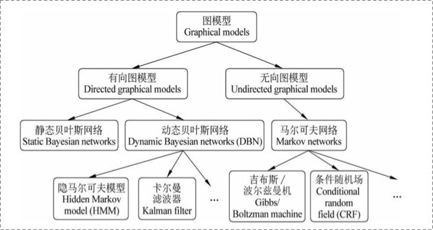

 在概率图模型中，数据(样本)由公式建模表示：

- 表示节点，即随机变量(放在此处的，可以是一个token或者一个label)，具体地，用为随机变量建模，注意现在是代表了一批随机变量(想象对应一条sequence，包含了很多的token)，为这些随机变量的分布；
- 表示边，即概率依赖关系。

## [有向图vs.无向图](https://www.zhihu.com/question/35866596/answer/236886066)

上图可以看到，贝叶斯网络（信念网络）都是有向的，马尔科夫网络无向。所以，贝叶斯网络适合为有单向依赖的数据建模，马尔科夫网络适合实体之间互相依赖的建模。具体地，他们的核心差异表现在如何求，即怎么表示这个的联合概率。

### **有向图**

对于有向图模型，这么求联合概率：

举个例子，对于下面的这个有向图的随机变量(注意，这个是比较广义的)：

应该这样表示他们的联合概率:

### **无向图**

对于无向图，我看资料一般就指马尔科夫网络(注意，这个图我也是比较广义的)。

如果一个graph太大，可以用因子分解将写为若干个联合概率的乘积。咋分解呢，将一个图分为若干个“小团”，注意每个团必须是“最大团”（就是里面任何两个点连在了一块，具体……算了不解释，有点“最大连通子图”的感觉），则有：

，其中 

归一化是为了让结果算作概率，所以像上面的无向图：

其中，是一个最大团上随机变量们的联合概率，一般取指数函数的：

好了，这个叫做[势函数](https://baike.baidu.com/item/%E5%8A%BF%E5%87%BD%E6%95%B0)。注意是否有看到CRF的影子。

那么概率无向图的联合概率分布可以在因子分解下表示为：

## 概率图联系

## Source

[https://www.zhihu.com/question/35866596/answer/236886066](https://www.zhihu.com/question/35866596/answer/236886066)
