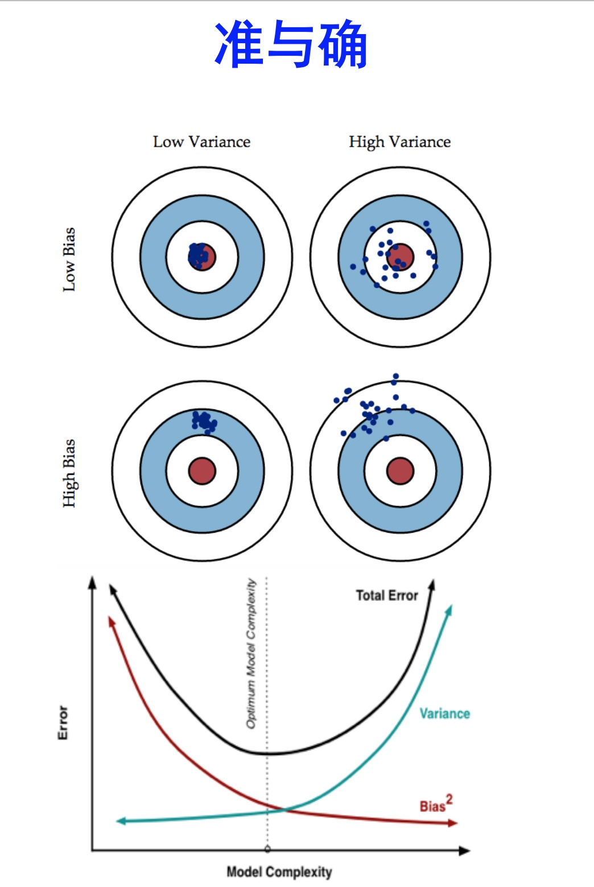

熟悉集成学习的读者，肯定对bagging和boosting都比较熟悉。在学习这二者的时候，肯定都知道一句话：即bagging是减少variance，而boosting是减少bias。那么，为什么是这样的效果呢？

**准：**bias描述的是训练样本预测结果的期望与真实结果的差距，简单讲就是在样本拟合的好不好。要想low bias，就得复杂化模型，增加模型的参数但这样容易过拟合，过拟合对应上图的high variance，点很分散。low bias对应就是点都打在靶心附近，所以瞄的是准的，但手不一定稳。

**确：**variance描述的是训练出来的模型在测试集上的表现，要想low variance，就要简化模型，但这样容易欠拟合，欠拟合对应上图的high bias，点偏离中心。low variance对应就是点都打的很集中，但不一定是靶心附近，手很稳，但瞄的不准。

## bagging减少variance

Bagging对样本重采样（有放回），对每一重采样得到的子样本集训练一个模型，最后取平均。由于子样本集的相似性以及使用的是同种模型，因此各模型有近似相等的bias和variance（事实上，各模型的分布也近似相同，但不独立）。

为了方便进行讲解，不妨认为各个子模型的bias和variance完全相等。因此，所以bagging后的bias和单个子模型的接近，一般来说不能显著降低bias。另一方面，若各子模型独立，则有，此时可以显著降低variance。若各子模型完全相同，则，此时不会降低variance。bagging方法得到的各子模型是有一定相关性的，属于上面两个极端状况的中间态，因此可以一定程度降低variance。

为了进一步降低variance，Random forest通过随机选取变量子集做拟合的方式de-correlated了各子模型（树），使得variance进一步降低。用公式可以一目了然：设有i.d.（同分布）的个随机变量，方差记为，两两变量之间的平均相关性为，则的方差为，bagging降低的是第二项，random forest是同时降低两项。更多细节见[ESL](https://web.stanford.edu/~hastie/ElemStatLearn//printings/ESLII_print10.pdf)588页。

## boosting减少bias

boosting从优化角度来看，是用forward-stagewise这种贪心法去最小化损失函数。例如，常见的AdaBoost即等价于用这种方法最小化exponential loss：。所谓forward-stagewise，就是在迭代的第步，求解新的子模型及步长（或者叫组合系数），来最小化，这里是前步得到的子模型的和。因此boosting是在sequential地最小化损失函数，其bias自然逐步下降。但由于是采取这种sequential、adaptive的策略，各子模型之间是强相关的，于是子模型之和并不能显著降低variance。所以说boosting主要还是靠降低bias来提升预测精度。

## Source

[https://blog.csdn.net/anshuai_aw1/article/details/82911612](https://blog.csdn.net/anshuai_aw1/article/details/82911612) [https://www.zhihu.com/question/27068705](https://www.zhihu.com/question/27068705) [https://www.zhihu.com/question/26760839](https://www.zhihu.com/question/26760839)
