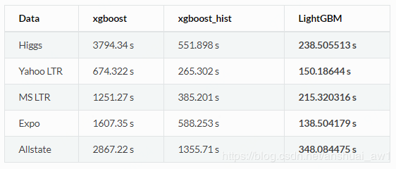
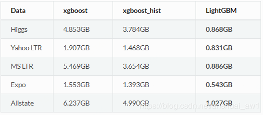
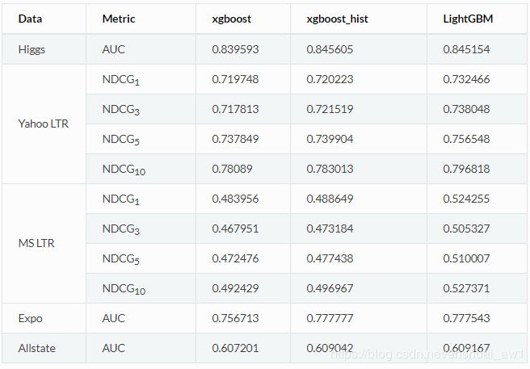
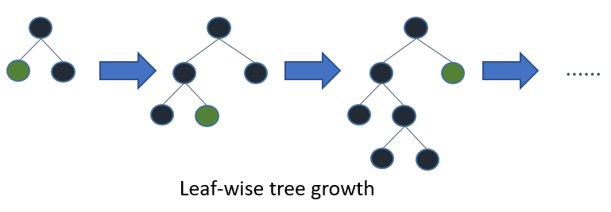
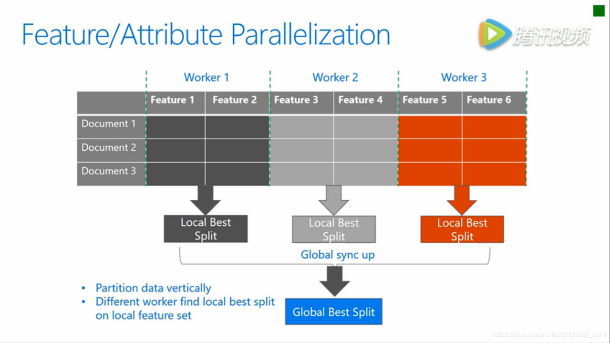
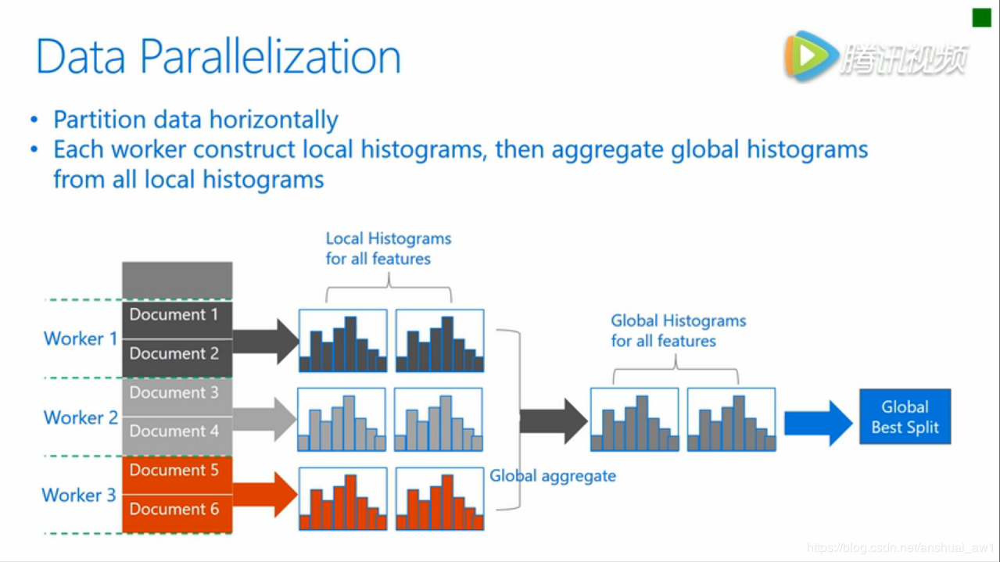

LightGBM （Light Gradient Boosting Machine）([官方github](https://github.com/Microsoft/LightGBM)，[英文官方文档](https://lightgbm.readthedocs.io/en/latest/Python-Intro.html)，[中文官方文档](http://lightgbm.apachecn.org/cn/latest/Development-Guide.html))是一个实现XGBoosrt算法的轻量级框架，支持高效率的并行训练，并且具有以下优点：

更快的训练速度

低内存使用

准确率方面

还有支持并行化学习、可处理大规模数据

## [Histogram直方图](https://blog.csdn.net/anshuai_aw1/article/details/83040541)

XGBoost中默认的算法对于决策树的学习使用基于 pre-sorted 的算法，这是一个简单的解决方案，但是不易于优化。LightGBM 利用基于histogram的算法，通过将连续特征（属性）值分段为 discrete bins 来加快训练的速度并减少内存的使用。 如下是基于 histogram 算法的优点：

减少分割增益的计算量：Pre-sorted 算法需要次的计算。即计算最大分裂增益需要；Histogram 算法只需要计算次，并且bins的个数远少于data。即计算最大分裂增益需要

通过直方图的相减来进行进一步的加速：在二叉树中可以通过利用叶节点的父节点和相邻节点的直方图的相减来获得该叶节点的直方图；所以仅仅需要为一个叶节点建立直方图 (其小于它的相邻节点)就可以通过直方图的相减来获得相邻节点的直方图，而这花费的代价很小。

减少内存的使用：可以将连续的值替换为 discrete bins。 如果bins的个数较小, 可以利用较小的数据类型来存储训练数据, 如uint8_t；无需为 pre-sorting 特征值存储额外的信息。

减少并行学习的通信代价：减少并行交互次数。

## Leaf-wise (Best-first) 决策树生长策略

大部分决策树的学习算法通过 level(depth)-wise 策略生长树，即一层一层的生长树，如下图

LightGBM 通过 leaf-wise (best-first)策略来生长树。它将选取具有最大 delta loss 的叶节点来生长。 当生长相同的 #leaf，leaf-wise 算法可以比 level-wise 算法减少更多的损失。

当 #data 较小的时候，leaf-wise 可能会造成过拟合。 所以，LightGBM 可以利用额外的参数 max_depth 来限制树的深度并避免过拟合（树的生长仍然通过 leaf-wise 策略）

## [类别特征值的最优分割](https://blog.csdn.net/anshuai_aw1/article/details/83275299)

我们通常将类别特征转化为 one-hot coding。 然而，对于学习树来说这不是个好的解决方案。 原因是对于一个基数较大的类别特征，学习树会生长的非常不平衡，并且需要非常深的深度才能来达到较好的准确率

事实上，最好的解决方案是将类别特征划分为两个子集，总共有种可能的划分，是这个类别特征的可能取值个数。但是对于回归树有个有效的解决方案。为了寻找最优的划分需要大约。

基本的思想是根据训练目标的相关性对类别进行重排序。 更具体的说，根据累加值(sum_gradient / sum_hessian)重新对（类别特征的）直方图进行排序，然后在排好序的直方图中寻找最好的分割点。

## 特征并行

### 传统算法

传统的特征并行算法旨在于在并行化决策树中的Find Best Split。主要流程如下：

1. 垂直划分数据（不同的机器有不同的特征集）
2. 在本地特征集寻找最佳划分点
3. 本地进行各个划分的通信整合并得到最佳划分
4. 以最佳划分方法对数据进行划分，并将数据划分结果传递给其他线程
5. 其他线程对接收到的数据进一步划分

传统的特征并行方法不足：

- split finding计算复杂度高为，当数据量很大的时候，慢。
- 需要对划分的结果进行通信整合，其额外的时间复杂度约为 “”（一个数据一个字节）。

### LightGBM 中的特征并行

既然在数据量很大时，传统数据并行方法无法有效地加速，我们做了一些改变：不再垂直划分数据，即每个线程都持有全部数据。 因此，LightGBM中没有数据划分结果之间通信的开销，各个线程都知道如何划分数据。 而且，“#data” 不会变得更大，所以，在使每天机器都持有全部数据是合理的。

LightGBM 中特征并行的流程如下：

1. 每个线程都在本地数据集上寻找最佳划分点
2. 本地进行各个划分的通信整合并得到最佳划分
3. 执行最佳划分

然而，该特征并行算法在数据量很大时，每个机器存储所有数据代价高。因此，数据量很大时使用数据并行。

## 数据并行

### 传统算法

数据并行旨在于并行化整个决策学习过程。数据并行的主要流程如下：

1. 水平划分数据
2. 线程以本地数据构建本地直方图
3. 将本地直方图整合成全局整合图
4. 在全局直方图中寻找最佳划分，然后执行此划分

传统数据划分的不足：

高通讯开销。 如果使用点对点的通讯算法，一个机器的通讯开销大约为 “O(#machine #feature #bin)” 。 如果使用集成的通讯算法（例如， “All Reduce”等），通讯开销大约为 “O(2  #feature  #bin)” 。

### LightGBM中的数据并行

LightGBM 中采用以下方法较少数据并行中的通讯开销：

1. 不同于“整合所有本地直方图以形成全局直方图”的方式，LightGBM 使用分散规约(Reduce scatter)的方式，把直方图合并的任务分摊到不同的机器，对不同机器的不同特征（不重叠的）进行整合。 然后线程从本地整合直方图中寻找最佳划分并同步到全局的最佳划分中。
2. LightGBM 通过直方图做差法加速训练。 基于此，我们可以进行单叶子的直方图通讯，并且在相邻直方图上使用做差法。

通过上述方法，LightGBM 将数据并行中的通讯开销减少到 “O(0.5  #feature  #bin)”。

## 投票并行

投票并行未来将致力于将“数据并行”中的通讯开销减少至常数级别。 其将会通过两阶段的投票过程较少特征直方图的通讯开销。

基于投票的并行是对数据并行的优化，数据并行的瓶颈主要在于合并直方图的时候，通信代价比较大。根据这一点，基于投票的并行，用投票的方式只合并部分特征值的直方图，达到了降低通信量的目的。首先，通过本地的数据找到本地的top k best features. 然后利用投票筛选出可能是全局最优分割点的特征，合并直方图的时候只合并这些被选出来的特征，从此降低了通信量。

## Source

[https://papers.nips.cc/paper/6907-lightgbm-a-highly-efficient-gradient-boosting-decision-tree](https://papers.nips.cc/paper/6907-lightgbm-a-highly-efficient-gradient-boosting-decision-tree) [https://blog.csdn.net/anshuai_aw1/article/details/83659932](https://blog.csdn.net/anshuai_aw1/article/details/83659932)
