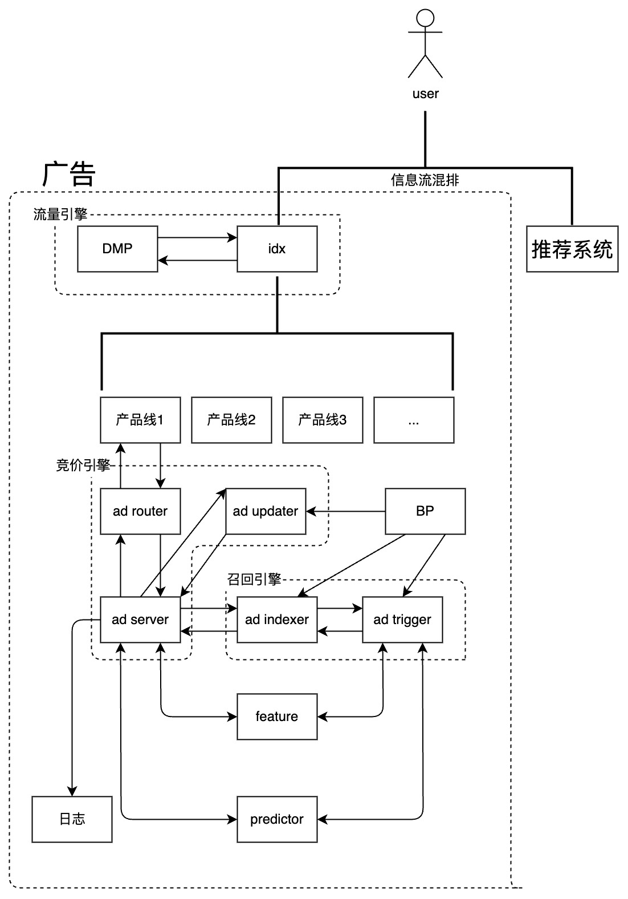

系统四阶段")我面试时问同学广告链路，大家基本只知道推荐(广告)系统细分可分为四阶段(如上图)，但对整个广告系统工程链路完全不了解，这对一个做广告的同学来说是不合格的。以信息流广告举例，当一个用户刷新App时，整个链路上如下图(每个公司框架一致但细节可能略有差异) 

| 模块名称 | 模块任务 |
| --- | --- |
| idx | 请求画像平台/DMP获得用户画像随请求携带给下游 整合各产品线返回的广告结果并进行筛选排序 |
| DMP | 存放用户的相关画像标签信息等 |
| ad router | 进行请求解析，流量降级等 |
| ad server | 调用ad indexer获取召回广告物料 请求predictor进行排序模型 应用相关策略，完成竞价 |
| ad updater | 将在投计划写入Laser，供ad server异步更新 |
| ad indexer | 通过查询倒排获取符合该次流量定向的广告 调用ad trigger进行召回模型获得扩量计划 |
| ad trigger | 通过调用召回模型进行广告召回，即四阶段中召回阶段 |
| feature | 提供特征查询服务 |
| predictor | 提供在线推断服务 |
| BP | Business Platform，即广告主操作的平台，在此创建/修改广告计划等 |

