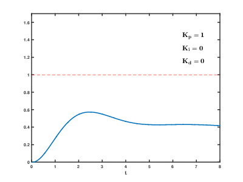
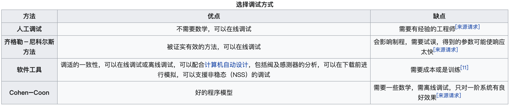

任何一个广告投放体系在商业化的过程中必须考虑的两个因素就是：投放成本和投放量。只有投放成本低于整个商业链条中可接受的成本，这个商业模式才能够成立，而投放量决定了这个模式能够有多大的规模。

成本控制是衡量广告投放能力最直观的指标。 广告主、业务人员，在使用广告投放系统(例如DSP)时，与这个产品进行交互，设定成本，能够最直接感知到的就是实际投放成本，不失一般性的，我们这里讨论一种最简单的成本，cpc(cost per click).。在实际投放过程中，由于模型预估ctr不可能非常精准，甚至会有量级的差异，再加上二价的机制，都会导致=实际投放出的cpc和目标cpc严重不一致，导致成本不可控。而出价体系就是为了保证投放cpc符合预期。出价策略对于广告投放体系，就类似于GUI对于计算机的重要性，直接影响了用户体验。

# PID
PID算法是控制理论中，最简单，但也是应用最广泛的一种控制方法，小到控制一个元件的温度，大到控制无人机的飞行姿态和飞行速度等等，都可以使用PID控制。这里我们从原理上来理解PID控制。

PID(Proportion Integration Differentiation)其实就是指比例，积分，微分控制，由比例单元（Proportional）、积分单元（Integral）和微分单元（Derivative）组成，如下图和公式所示。PID控制器（比例-积分-微分控制器），由比例单元()、积分单元()和微分单元()组成，透过，和三个参数的设定。PID控制器主要适用于基本上线性，且动态特性不随时间变化的系统。  

- ：比例增益，是调适参数
- ：积分增益，也是调适参数
- ：微分增益，也是调适参数
- ：误差=设定值(SP)-回授值(PV)
- ：目前时间
- ：积分变数，数值从到目前时间

## 比例控件
我们先说PID中最简单的比例控制，抛开其他两个不谈。还是用一个经典的例子吧。假设我有一个水缸，最终的控制目的是要保证水缸里的水位永远的维持在米的高度。假设初始时刻，水缸里的水位是米，那么当前时刻的水位和目标水位之间是存在一个误差的，且。这个时候，假设旁边站着一个人，这个人通过往缸里加水的方式来控制水位。如果单纯的用比例控制算法，就是指加入的水量和误差是成正比的。即

 假设设置为， 时（表示第1次加水，也就是第一次对系统施加控制），那么，所以这一次加入的水量会使水位在的基础上上升，达到 时（第2次施加控制），当前水位是。，会使水位再次上升，达到。 如此这么循环下去，就是比例控制算法的运行方法。根据取值不同，系统最后都会达到米，只不过大了到达的快，小了到达的慢一些。不会有稳态误差。

**稳态误差：**考虑另外一种情况，假设这个水缸在加水的过程中，存在漏水的情况，假设每次加水的过程，都会漏掉米高度的水。仍然假设取，那么会存在着某种情况，假设经过几次加水，水缸中的水位到时，水位将不会再变换！！！因为，水位为，则误差。 所以每次往水缸中加水的量为。同时，每次加水，缸里又会流出去米的水！！！加入的水和流出的水相抵消，水位将不再变化！！也就是说，我们的目标是米，但是最后系统达到米的水位就不再变化了，且系统已经达到稳定。由此产生的误差就是稳态误差了。

在实际情况中，这种类似水缸漏水的情况往往更加常见，比如控制汽车运动，摩擦阻力就相当于是“漏水”，控制机械臂、无人机的飞行，各类阻力和消耗都可以理解为本例中的“漏水”。所以，单独的比例控制，在很多时候并不能满足要求。

## 积分控件
积分控制考虑过去误差，将误差值过去一段时间和（误差和）乘以一个正值的常数。从过去的平均误差值来找到系统的输出结果和预定值的平均误差。一个简单的比例系统会震荡，会在预定值的附近来回变化，因为系统无法消除多余的纠正。通过加上负的平均误差值，平均系统误差值就会渐渐减少。所以，最终这个PID回路系统会在设定值稳定下来。

积分控制会加速系统趋近设定值的过程，并且消除纯比例控制器会出现的稳态误差。积分增益越大，趋近设定值的速度越快，不过因为积分控制会累计过去所有的误差，可能会使回授值出现过冲的情形。

还是用上面的例子来说明，第一次的误差是，第二次的误差是，至此时，误差的积分(离散情况下积分其实就是做累加)，。这个时候的控制量，除了比例的那一部分，还有一部分就是一个系数乘以这个积分项。由于这个积分项会将前面若干次的误差进行累计，所以可以很好的消除稳态误差（假设在仅有比例项的情况下，系统卡在稳态误差了，即上例中的，由于加入了积分项的存在，会让输入增大，从而使得水缸的水位可以大于，渐渐到达目标的）这就是积分项的作用。

## 微分控件
微分控制考虑将来误差，计算误差的一阶导，并和一个正值的常数相乘。这个导数的控制会对系统的改变作出反应。导数的结果越大，那么控制系统就对输出结果作出更快速的反应。这个参数也是PID被称为可预测的控制器的原因。参数对减少控制器短期的改变很有帮助。一些实际中的速度缓慢的系统可以不需要参数。

微分控制可以提升整定时间及系统稳定性。不过因为纯微分器不是因果系统，因此在PID系统实现时，一般会为微分控制加上一个低通滤波器以限制高频增益及噪声。实际上较少用到微分控制，估计PID控制器中只有约20%用到微分控制。

换一个另外的例子，考虑刹车情况。平稳的驾驶车辆，当发现前面有红灯时，为了使得行车平稳，基本上提前几十米就放松油门并踩刹车了。当车辆离停车线非常近的时候，则使劲踩刹车，使车辆停下来。整个过程可以看做一个加入微分的控制策略。微分，说白了在离散情况下，就是error的差值，就是时刻和时刻error的差，即

其中的是一个系数项。可以看到，在刹车过程中，因为error是越来越小的，所以这个微分控制项一定是负数，在控制中加入一个负数项，他存在的作用就是为了防止汽车由于刹车不及时而闯过了线。从常识上可以理解，越是靠近停车线，越是应该注意踩刹车，不能让车过线，所以这个微分项的作用，就可以理解为刹车，当车离停车线很近并且车速还很快时，这个微分项的绝对值（实际上是一个负数）就会很大，从而表示应该用力踩刹车才能让车停下来。切换到上面给水缸加水的例子，就是当发现水缸里的水快要接近的时候，加入微分项，可以防止给水缸里的水加到超过米的高度，说白了就是减少控制过程中的震荡。

现在在回头看这个公式，就很清楚了

- ：比例增益，是调适参数
- ：积分增益，也是调适参数
- ：微分增益，也是调适参数
- ：误差=设定值(SP)-回授值(PV)
- ：目前时间
- ：积分变数，数值从到目前时间

## 参数调试
PID算法的参数调试是指通过调整控制参数（比例增益、积分增益/时间、微分增益/时间）让系统达到最佳的控制效果。调试中稳定性（不会有发散性的震荡）是首要条件，此外，不同系统有不同的行为，不同的应用其需求也不同，而且这些需求还可能会互相冲突。  PID算法只有三个参数，在原理上容易说明，但PID算法参数调试是一个困难的工作，因为要符合一些特别的判据，而且PID控制有其限制存在。

### 稳定性
若PID算法控制器的参数未挑选妥当，其控制器输出可能是不稳定的，也就是其输出发散，过程中可能有震荡，也可能没有震荡，且其输出只受饱和或是机械损坏等原因所限制。不稳定一般是因为过大增益造成，特别是针对延迟时间很长的系统。

### 最佳性能
PID控制器的最佳性能可能和针对过程变化或是设定值变化有关，也会随应用而不同。

两个基本的需求是调整能力（regulation，干扰拒绝，使系统维持在设定值）及命令追随 （设定值变化下，控制器输出追随设定值的反应速度）。有关命令追随的一些判据包括有上升时间及整定时间。有些应用可能因为安全考量，不允许输出超过设定值，也有些应用要求在到达设定值过程中的能量可以最小化。

### 调试方法
有许多种调试PID控制器参数的方法，最有效的方式多半是建立某种程序，再依不同参数下的动态特性来调试参数。相对而言人工调试其效率较差，若是系统的响应时间到数分钟以上，更可以看出人工调试效率的不佳。

调试方法的选择和是否可以暂时将控制回路“离线”有关，也和系统的响应时间有关。离线是指一个和实际使用有些不同的条件（例如不加负载），而且控制器的输出只需考虑理论情况，不需考虑实际应用。在线调试是在实际应用的条件，控制器的输出需考虑实际的系统 。若控制回路可以离线，最好的调试方法是对系统给一个步阶输入，量测其输出对时间的关系，再用其响应来决定参数 

# 系统调控

## 微观调控
基于PID的广告智能出价，广告主设置的是投放成本，比如设置的为元，即上面例子水池里要达到的水深米 (1)若现状超成本，投放成本为元，则系统会降低该广告出价，基于，只有更高时，也就是此次PV的点击转化率较高的时候，该广告才会竞得此次曝光，以达到降低成本 (2)同理，当欠成本时，比如当前投放成本为元，系统会提升该广告出价，基于，许多稍低的PV也有可能竞争到，增加曝光机会，帮助跑量

## 宏观调控

### 流量倾斜
广告系统是十分复杂的，除了基于成本单个广告的出价调整，也会有曝光倾斜等。广告分为效果广告和品牌广告

- 效果广告更看重效果，基本采用cpx(x可能为点击(click)、激活/关注/转化(action))等计费方式
- 品牌广告的目标是较长时间的回报，更看重增加影响力，要保证一定的曝光量，基本采用cpm计费方式

由于cpm只为可见的广告展示次数付费，只看展现量，按展现量收费，不管点击、下载、注册等。所以对平台来讲，最优策略是优质(点击/转化率高的)流量尽量分配给效果广告，低质流量分配给品牌广告。基于此策略，平台会进行流量倾斜调整等，比如平台分析用户使用习惯，流量预测当日晚间会有大量打工人下班登陆平台打发时间，纯为打发时间，并不会进行广告转化(低质流量)。当白天某效果广告以微弱劣势竞价不过品牌广告，平台也可能进行流量倾斜，将此次曝光机会给效果广告，品牌广告的曝光由晚间低质流量保底。

### 保育队列
现在绝大多数公司都采用机器学习或深度学习模型进行用户此次PV对各广告的，但能够利用模型的前提是有足够的数据可以进行模型训练。像冷启动等情况，数据量不足，预测不准，很容易出现为抢夺流量出价高到上天，或者投放许久压根抢不到流量的情况。保育队列的作用就是解决像冷启动数据量不足的情况，调控竞价，帮助广告计划积攒数据以可以进行较为准确的模型预估。

# Source
[https://zh.wikipedia.org/wiki/PID%E6%8E%A7%E5%88%B6%E5%99%A8](https://zh.wikipedia.org/wiki/PID%E6%8E%A7%E5%88%B6%E5%99%A8) [一文搞懂PID控制算法](https://zhuanlan.zhihu.com/p/347372624) [PID控制算法原理（抛弃公式，从本质上真正理解PID控制）](https://zhuanlan.zhihu.com/p/39573490)
