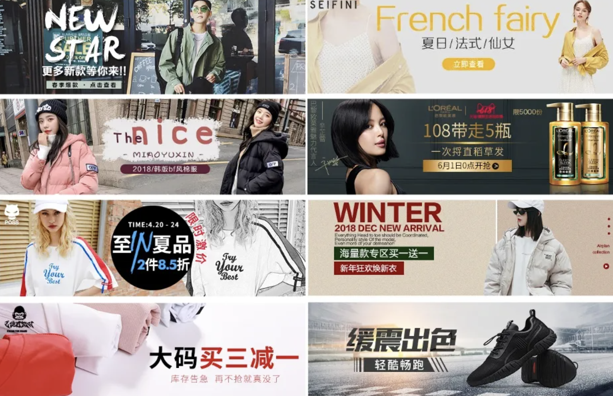
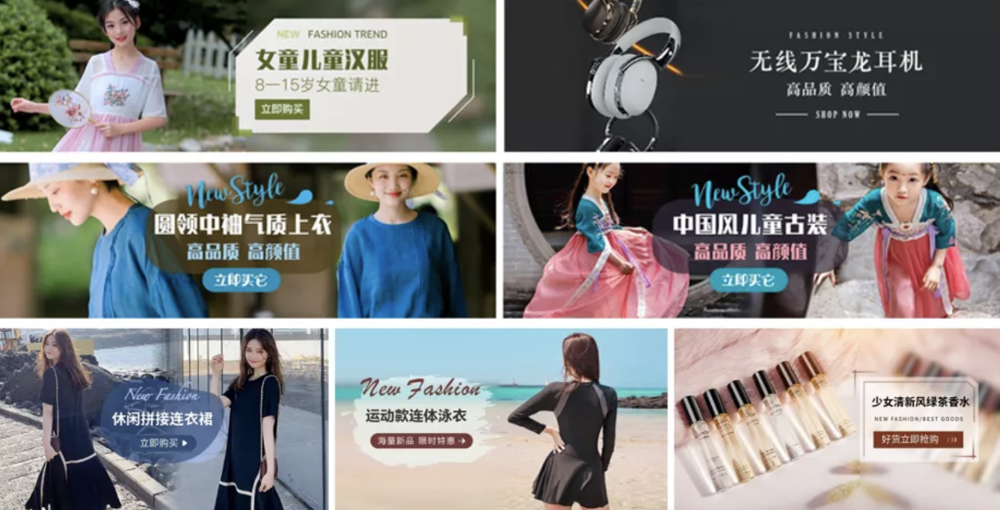
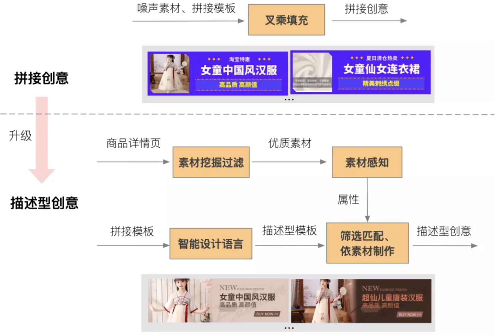
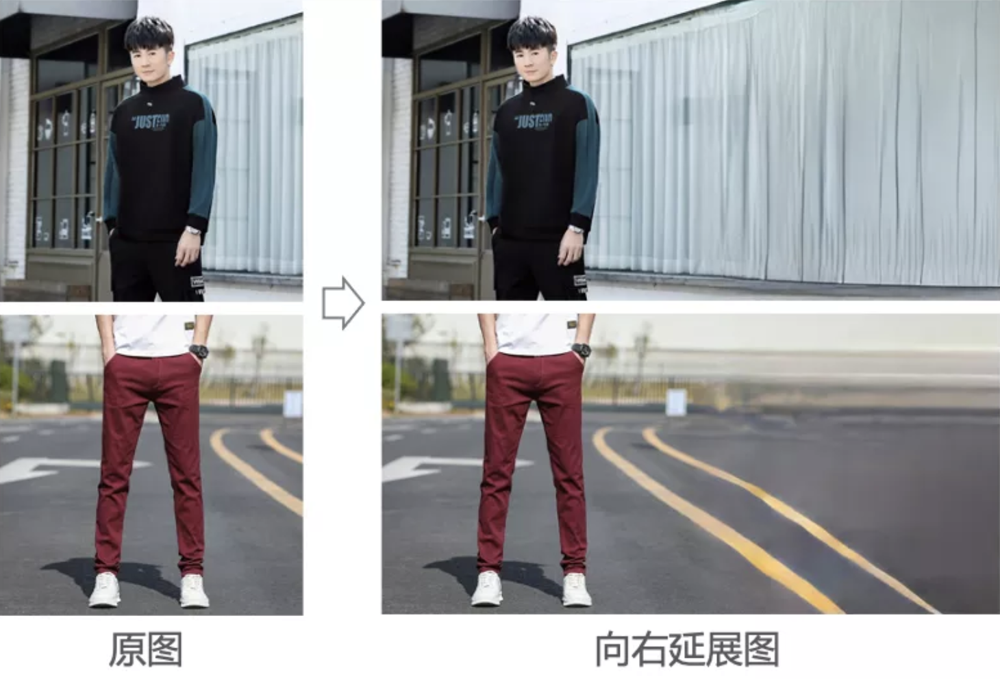
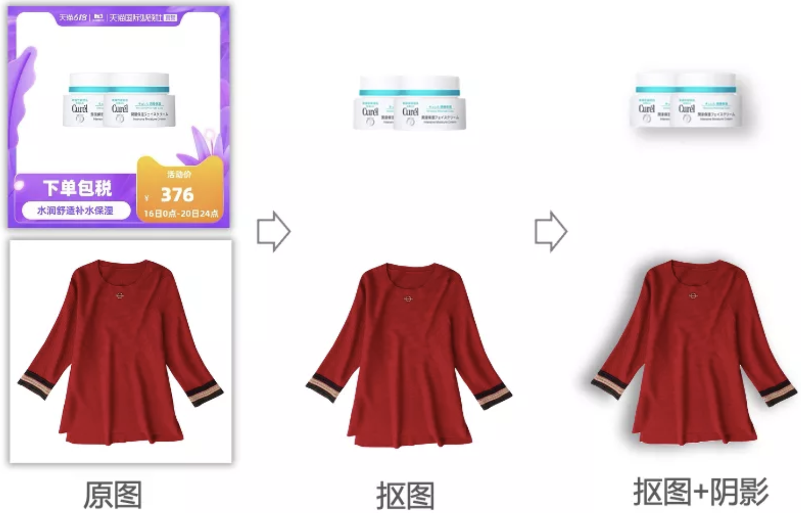
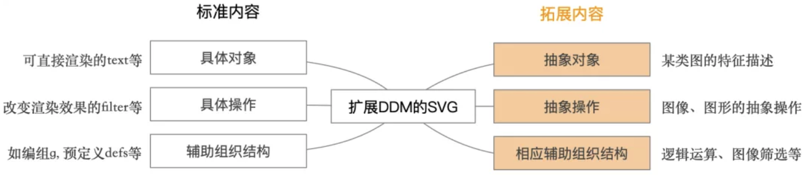
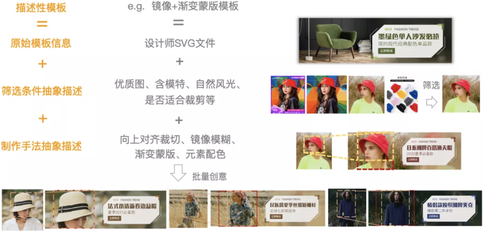
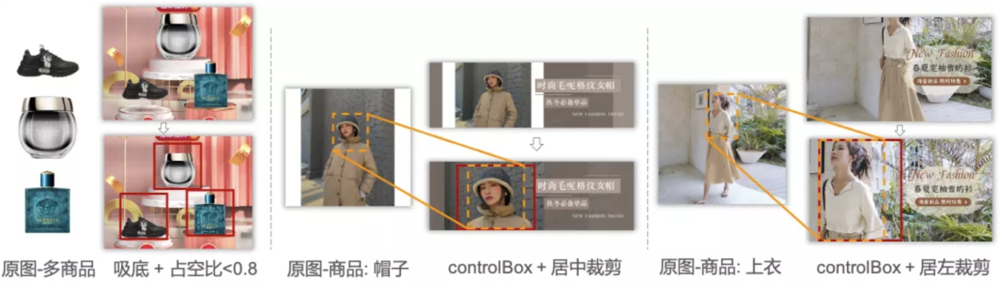
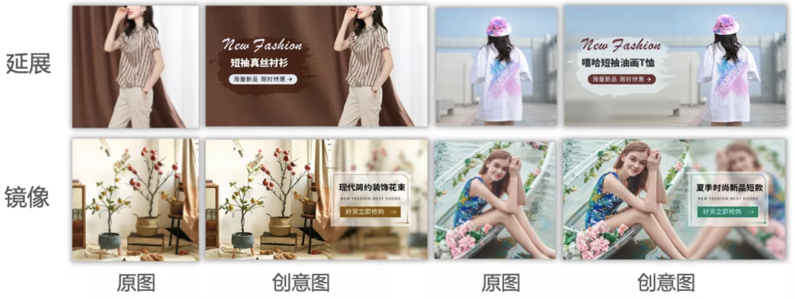
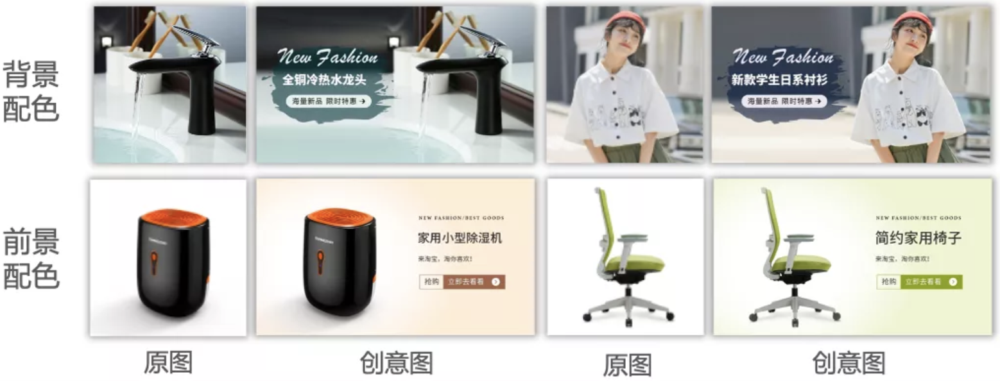

要问广告主最烧脑的是什么，那一定做创意图了。创意图是广告的呈现方式，是向消费者传达商品、品牌等信息的媒介，也是广告能否完成投放、触达消费者的先决条件。为了自家商品能够脱颖而出，广告主常常各显神通，通过ps等软件加班加点精心做图：  然而，随着互联网媒体的兴盛，可投放广告的媒体资源位也快速扩张，样式尺寸各异。广告主和平台若想在全域媒体投放广告，则需根据不同广告资源位要求一一制作创意。而创意随着节日、主推商品等因素变换，往往需要高频更新和测试，再考虑到个性化的创意制作和投放，这在实际业务中，人工制作几乎不可能完成。于是，广告平台会贴心地提供一些程序化自动制作的创意，它们通常是这样的：  这类业界常用的低成本规模化创意生产方法（一般称为程序化拼接型创意），在设计阶段，设计师凭借积累的设计经验，设计静态通用模板，预留出展示商品信息的图片和文案区域；在创意大规模生成阶段，程序（算法）使用收集到的商品图片和文案素材，简单填充对应模板区域，完成创意生产。上面的示例中，分别对应三个模板生成的不同商品创意图。

程序化拼接型创意具有简单、制作过程自动化、可大规模生产的优点，但其合成的创意相比于人工针对商品和素材特性制作的创意，原生感较差、拼接感严重、千篇一律。因此，如何保持低成本规模化生成的优势，提升产出创意图的视觉效果，让规模化自动生成的创意图更逼近人工制作的原生创意？本文试图针对对这个问题，给出我们的思考和解法。

# 高品质原生创意规模化生成范式
经过2年多的探索与实践，我们沉淀出一套以视觉感知技术和智能设计语言为基础的高品质原生创意规模化生产范式和系统，我们命名为动态描述模型（DynamicDescriptiveModel，DDM）， 它生成的创意图是这样的：  PC端网址： [淘宝网 - 淘！我喜欢](https://chuangyi.taobao.com/pages/ddm)

## 系统Overview
通过对比分析拼接、人工创意，我们认为拼接创意的主要缺陷在于模板与素材脱节、缺乏素材针对性操作，基于这种想法，我们通过不断积累、抽象，提出了动态描述模型（DDM） 的概念，将拼接创意升级为描述型创意。描述型创意的整体制作流程如下图所示：

1. 先从商品详情页抓取商品的图像、文案等素材，并通过分类模型滤去不适合制作创意的素材；
2. 然后基于深度学习等方法，对图像进行多维度的理解分析，构建成大规模的素材感知库；
3. 同时，通过一套自定义的智能设计语言，将设计师对素材筛选、制作的经验抽象化沉淀在模板中，形成描述型模板；
4. 生成创意时，结合描述型模板的筛选条件和素材感知库进行筛选匹配，找出合适的模板-素材组，并依据描述型模板的抽象操作、素材具体属性值对模板进行调整，从而产出对应创意。

## 素材挖掘过滤
素材是创意和设计的原料，重要性不言而喻。获取优质素材，一般有两个途径，一种是依赖人工招商，通过运营活动的方式，让商家按照平台对于商品素材的规范，上传干净、符合目标资源位尺寸的优质素材（如场景图、透明图、白底图、全画幅等素材图片）。另一种方式为采用视觉感知技术，挖掘商品详情页里的图片素材（如主附图、详情图、主图视频、直播片段等）。我们选用了后一种方式，低成本规模化地获取素材，并通过一些视觉模型来过滤不适合制作创意的素材，保证素材质量。

## 素材感知
制作的前提是理解。如前所述，对于高品质的创意，需要通过各种图像处理手法凸显商品本身，需要各装饰元素、文案与商品素材图的高契合度融合，为了达到这一点，就必然需要先对素材本身有充分的理解。因此，从创意制作的角度出发，我们构建了一个针对图像的多维度素材感知体系，主要可分为三方面：

### 1）图像位置布局属性

- 元素检测：结合分类、目标检测、显著性检测、人体姿态预估等多个模型，对图像中的主体、模特、画幅、logo、文字等多种元素进行定位和分析，以将商品以合适的位置和比例在创意中进行展示；
- 图像延展：实际应用中，资源位尺寸千差万别，因此我们通过Outpaingting GAN模型对图像进行延展，结合裁剪来适应不同的资源位尺寸。如下图就是两个商品图向右延展一倍的效果。

### 2）主体抠图与阴影生成
对于一些背景过于简单的图（如白底图），直接在原图上扩展生成创意会比较单调，因此我们也会对主体进行精细到头发丝的抠图，同时，还可结合图像的光照方向智能生成阴影，使得其合成到背景上时效果更柔和、逼真。 

### 3）风格/颜色匹配属性
在考虑图像内容位置信息的基础上，我们进一步地，在风格匹配、颜色搭配上也进行了相关分析，如将图像按背景场景分类、进行细致的区域颜色分析等

## 智能设计语言
我们在常见的标准设计文件基础上，拓展定义了一种更为抽象的设计语言，并通过它，将设计师积累的创意制作经验转化为可解析可执行的描述，添加在原有的模板文件中，形成描述型模板。制作创意时，则根据这些抽象描述进行筛选和实例化，得到最终的创意。

在此，我们选择了在SVG（Scalable Vecotr Graphics，可缩放矢量图形）的基础上进行拓展，SVG是一种开放的，基于XML的矢量图形语言，也可视为一种图像图形文件格式。在SVG的标准定义里，从图文创意制作出发，我们将其元素按功能分为三类：可直接渲染的具体对象，改变对象渲染效果的具体操作，用于辅助组织的结构。在渲染成图像时，则按对象的先后出现顺序，结合对象所引用的操作一层层地叠加渲染。

在SVG的基础上，如下图所示，我们扩展定义了抽象对象、抽象操作，与相应的逻辑运算等元素，以形成描述型模板。  抽象对象，此处主要指抽象图像，不再是具体的RGB值，而是对某类图特征描述的层级结构，即使用自定义的逻辑算子，结合素材感知属性，通过一系列筛选逻辑完成对所需图像的描述。

抽象操作，与抽象图像类似，不再是具体的计算值，而是更具有泛化性的指令。抽象操作一般由若干原子操作自由组合形成，按作用对象可分为图像、图形的处理。其中，对于图像，有在普通操作上衍生出的选区、放置、镜像、延展、调整占空比等原子操作，可精细控制图像的商品、模特、可延展区等区域在模板中的位置、比例和对齐方式。对于图形，则有提取图像指定区域颜色、调整形状、调整颜色、融合等针对形状、颜色的原子操作。

## 筛选匹配 & 依素材制作
制作创意时，如下图所示，先对描述型模板进行解析，根据抽象对象的描述条件、素材感知结果筛选出符合条件的图像，然后根据图像感知属性将抽象操作中的参数转换为具体数值，并用该图像和计算结果修改SVG中的相应元素，从而得到一个个常规的SVG文件，即可渲染出相应创意。此外，我们还定义了一套渲染指令集合，将随素材所需的调整转换为相应指令，即可在访问url时实时请求渲染引擎得到创意图。得益于渲染引擎的强大性能，我们可灵活高效地完成大批量创意制作与投放，并可根据投放情况对渲染指令进行在线调优。  通过抽象图像、抽象操作，描述型模板可以完成对模板更为精细、准确的控制，实现一些拼接模板无法完成的功能，从而优化视觉效果，例如：

### 1）精细裁剪
可通过选区、放置等抽象操作，控制商品在创意中的展现区域、比例，并去除白边等非画幅区域。 

### 2）多种图像变换
可通过延展、镜像等操作扩大实景图在模板中的区域，增强整体原生感。 

### 3）自动化颜色适配
对于提升整体和谐度，增加模板丰富性而言，随商品的图形配色是必要的一环。利用素材感知里图像各区域的颜色分析，我们可以灵活对图中各元素进行配色。 

# Source
[告别拼接模板 —— 阿里妈妈动态描述广告创意](https://mp.weixin.qq.com/s?__biz=Mzg3MDYxODE2Ng==&mid=2247484845&idx=1&sn=9b436aca0540f8e538a4f1c536af053a&chksm=ce8a40f4f9fdc9e20287a44b04404cf316d0b746530977683ae223290cd6cf0485984f871e3c&scene=21#wechat_redirect) [高并发图片实时渲染技术在阿里妈妈的大规模应用](https://mp.weixin.qq.com/s?__biz=Mzg3MDYxODE2Ng==&mid=2247484678&idx=1&sn=bd5e8c5c5d6a6ed93b14d278e65d180b&chksm=ce8a405ff9fdc949a38d1e807afc69344af04cf165f144c1f224b4c33160ddf43aa243b15a71&scene=21#wechat_redirect)
