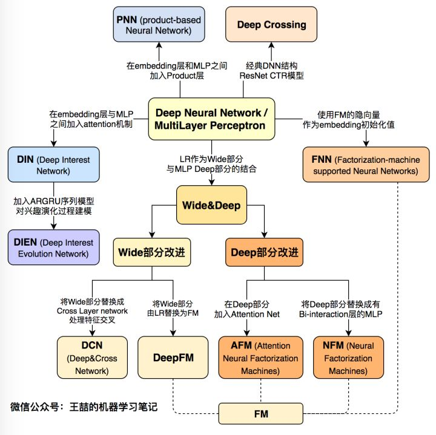

在进入深度学习时代之后，CTR模型不仅在表达能力、模型效果上有了质的提升，而且大量借鉴并融合了深度学习在图像、语音以及自然语言处理方向的成果，在模型结构上进行了快速的演化  在刨析完经典深度模型后，我们再基于阿里巴巴的相关工作共同讨论较新的技术方向 

# Source
[谷歌、阿里、微软等10大深度学习CTR模型最全演化图谱【推荐、广告、搜索领域】](https://zhuanlan.zhihu.com/p/63186101) [屠龙少年与龙：漫谈深度学习驱动的广告推荐技术发展周期](https://zhuanlan.zhihu.com/p/398041971)
