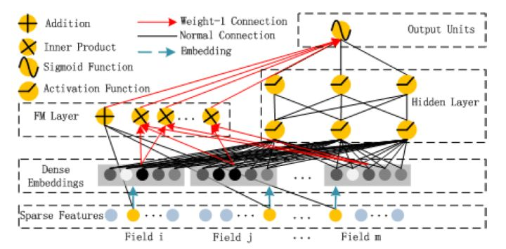
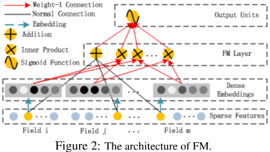
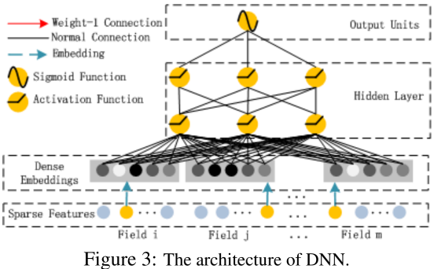
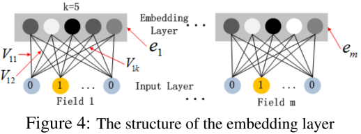

在Wide&Deep之后，诸多模型延续了双网络组合的结构，DeepFM就是其中之一。DeepFM对Wide&Deep的改进之处在于，它**用FM替换掉了原来的Wide部分**，加强了浅层网络部分特征组合的能力。事实上，由于FM本身就是由一阶部分和二阶部分组成的，DeepFM相当于同时组合了原Wide部分+二阶特征交叉部分+Deep部分三种结构，无疑进一步增强了模型的表达能力。<br /><br />为了学习多阶交叉特征，DeepFM由FM和Deep两部分组成，两部分共用相同的输入，模型预测输出为


其中，是预测CTR的结果，是FM部分的输出，是Deep部分的输出。
<a name="kYmNM"></a>
# FM部分
<br />FM是由一阶部分和二阶部分组成的，其输出是一个Addition unit和一系列Inner Product units的和：

<br />其中(为特征one hot后的维度数)，(为设置的Dense Embedding的维度数)。Addition unit（）表达一阶特征，Inner Product表达二阶。

<a name="LbP2F"></a>
# Deep部分
<br />Deep部分用来学习高阶特征，其输入是连续稠密向量，由原始的超高维稀疏且具有组(field)属性(性别、地点、年龄等)数据由Dense Embedding层映射至低维稠密向量。
<a name="WfVqZ"></a>
# Dense Embedding
<br />如上图所示，embedding层的输出为：


其中为第i个特征向量，为特征类别数(比如只有年龄，性别，地点3种类特征则m=3)。

<a name="cxjl5"></a>
# Code
```python
# deepFM.py
import tensorflow as tf
from tensorflow.python.ops import embedding_ops
from tensorflow.python.layers import normalization


class EmbeddingTable:
    def __init__(self):
        self._weights = {}

    def add_weights(self, vocab_name, vocab_size, embed_dim):
        """
        :param vocab_name: 一个field拥有两个权重矩阵，一个用于线性连接，另一个用于非线性（二阶或更高阶交叉）连接
        :param vocab_size: 字典总长度
        :param embed_dim: 二阶权重矩阵shape=[vocab_size, order2dim]，映射成的embedding, 既用于接入DNN的第一屋，也是用于FM二阶交互的隐向量
        """
        linear_weight = tf.get_variable(name='{}_linear_weight'.format(vocab_name),
                                        shape=[vocab_size, 1],
                                        initializer=tf.glorot_normal_initializer(),
                                        dtype=tf.float32)

        # 二阶（FM）与高阶（DNN）的特征交互，共享embedding矩阵
        embed_weight = tf.get_variable(name='{}_embed_weight'.format(vocab_name),
                                       shape=[vocab_size, embed_dim],
                                       initializer=tf.glorot_normal_initializer(),
                                       dtype=tf.float32)

        self._weights[vocab_name] = (linear_weight, embed_weight)

    def get_linear_weights(self, vocab_name): return self._weights[vocab_name][0]

    def get_embed_weights(self, vocab_name): return self._weights[vocab_name][1]


def build_embedding_table(params):
    embed_dim = params['embed_dim']  # 必须有统一的embedding长度

    embedding_table = EmbeddingTable()
    for vocab_name, vocab_size in params['vocab_sizes'].items():
        embedding_table.add_weights(vocab_name=vocab_name, vocab_size=vocab_size, embed_dim=embed_dim)

    return embedding_table


def output_logits_from_linear(features, embedding_table, params):
    field2vocab_mapping = params['field_vocab_mapping']
    combiner = params.get('multi_embed_combiner', 'sum')

    fields_outputs = []
    # 当前field下有一系列的<tag:value>对，每个tag对应一个bias（待优化），
    # 将所有tag对应的bias，按照其value进行加权平均，得到这个field对应的bias
    for fieldname, vocabname in field2vocab_mapping.items():
        sp_ids = features[fieldname + "_ids"]
        sp_values = features[fieldname + "_values"]

        linear_weights = embedding_table.get_linear_weights(vocab_name=vocabname)

        # weights: [vocab_size,1]
        # sp_ids: [batch_size, max_tags_per_example]
        # sp_weights: [batch_size, max_tags_per_example]
        # output: [batch_size, 1]
        output = embedding_ops.safe_embedding_lookup_sparse(linear_weights, sp_ids, sp_values,
                                                            combiner=combiner,
                                                            name='{}_linear_output'.format(fieldname))

        fields_outputs.append(output)

    # 因为不同field可以共享同一个vocab的linear weight，所以将各个field的output相加，会损失大量的信息
    # 因此，所有field对应的output拼接起来，反正每个field的output都是[batch_size,1]，拼接起来，并不占多少空间
    # whole_linear_output: [batch_size, total_fields]
    whole_linear_output = tf.concat(fields_outputs, axis=1)
    tf.logging.info("linear output, shape={}".format(whole_linear_output.shape))

    # 再映射到final logits（二分类，也是[batch_size,1]）
    # 这时，就不要用任何activation了，特别是ReLU
    return tf.layers.dense(whole_linear_output, units=1, use_bias=True, activation=None)
    #return tf.layers.dense(whole_linear_output, units=6, use_bias=True, activation=None)

def output_logits_from_bi_interaction(features, embedding_table, params):
    field2vocab_mapping = params['field_vocab_mapping']

    # 论文上的公式就是要求sum，而且我也试过mean和sqrtn，都比用mean要差上很多
    # 但是，这种情况，仅仅是针对criteo数据的，还是理论上就必须用sum，而不能用mean和sqrtn
    # 我还不太确定，所以保留一个接口能指定其他combiner的方法
    combiner = params.get('multi_embed_combiner', 'sum')

    # 见《Neural Factorization Machines for Sparse Predictive Analytics》论文的公式(4)
    fields_embeddings = []
    fields_squared_embeddings = []

    for fieldname, vocabname in field2vocab_mapping.items():
        sp_ids = features[fieldname + "_ids"]
        sp_values = features[fieldname + "_values"]

        # --------- embedding
        embed_weights = embedding_table.get_embed_weights(vocabname)
        # embedding: [batch_size, embed_dim]
        embedding = embedding_ops.safe_embedding_lookup_sparse(embed_weights, sp_ids, sp_values,
                                                               combiner=combiner,
                                                               name='{}_embedding'.format(fieldname))
        fields_embeddings.append(embedding)

        # --------- square of embedding
        squared_emb_weights = tf.square(embed_weights)

        squared_sp_values = tf.SparseTensor(indices=sp_values.indices,
                                            values=tf.square(sp_values.values),
                                            dense_shape=sp_values.dense_shape)

        # squared_embedding: [batch_size, embed_dim]
        squared_embedding = embedding_ops.safe_embedding_lookup_sparse(squared_emb_weights, sp_ids, squared_sp_values,
                                                                       combiner=combiner,
                                                                       name='{}_squared_embedding'.format(fieldname))
        fields_squared_embeddings.append(squared_embedding)

    # calculate bi-interaction
    sum_embedding_then_square = tf.square(tf.add_n(fields_embeddings))  # [batch_size, embed_dim]
    square_embedding_then_sum = tf.add_n(fields_squared_embeddings)  # [batch_size, embed_dim]
    bi_interaction = 0.5 * (sum_embedding_then_square - square_embedding_then_sum)  # [batch_size, embed_dim]
    tf.logging.info("bi-interaction, shape={}".format(bi_interaction.shape))

    # calculate logits
    logits = tf.layers.dense(bi_interaction, units=1, use_bias=True, activation=None)
    #logits = tf.layers.dense(bi_interaction, units=6, use_bias=True, activation=None)
    # 因为FM与DNN共享embedding，所以除了logits，还返回各field的embedding，方便搭建DNN
    return logits, fields_embeddings


def output_logits_from_dnn(fields_embeddings, params, is_training):
    dropout_rate = params['dropout_rate']
    do_batch_norm = params['batch_norm']

    X = tf.concat(fields_embeddings, axis=1)
    tf.logging.info("initial input to DNN, shape={}".format(X.shape))

    for idx, n_units in enumerate(params['hidden_units'], start=1):
        X = tf.layers.dense(X, units=n_units, activation=tf.nn.relu)
        tf.logging.info("layer[{}] output shape={}".format(idx, X.shape))

        X = tf.layers.dropout(inputs=X, rate=dropout_rate, training=is_training)
        if is_training:
            tf.logging.info("layer[{}] dropout {}".format(idx, dropout_rate))

        if do_batch_norm:
            # BatchNormalization的调用、参数，是从DNNLinearCombinedClassifier源码中拷贝过来的
            batch_norm_layer = normalization.BatchNormalization(momentum=0.999, trainable=True,
                                                                name='batchnorm_{}'.format(idx))
            X = batch_norm_layer(X, training=is_training)

            if is_training:
                tf.logging.info("layer[{}] batch-normalize".format(idx))

    # connect to final logits, [batch_size,1]
    #connect to final logits, [batch_size,6] 6类
    #return tf.layers.dense(X, units=1, use_bias=True, activation=None)
    return tf.layers.dense(X, units=1, use_bias=True, activation=None)


def model_fn(features, labels, mode, params):
    for featname, featvalues in features.items():
        if not isinstance(featvalues, tf.SparseTensor):
            raise TypeError("feature[{}] isn't SparseTensor".format(featname))

    # ============= build the graph
    embedding_table = build_embedding_table(params)

    linear_logits = output_logits_from_linear(features, embedding_table, params)

    bi_interact_logits, fields_embeddings = output_logits_from_bi_interaction(features, embedding_table, params)

    dnn_logits = output_logits_from_dnn(fields_embeddings, params, (mode == tf.estimator.ModeKeys.TRAIN))

    general_bias = tf.get_variable(name='general_bias', shape=[1], initializer=tf.constant_initializer(0.0))

    logits = linear_logits + bi_interact_logits + dnn_logits
    logits = tf.nn.bias_add(logits, general_bias)  # bias_add，获取broadcasting的便利

    # reshape [batch_size,1] to [batch_size], to match the shape of 'labels'
    logits = tf.reshape(logits, shape=[-1])
    probabilities = tf.sigmoid(logits)

    # ============= predict spec
    if mode == tf.estimator.ModeKeys.PREDICT:
        return tf.estimator.EstimatorSpec(
            mode=mode,
            predictions={'uids':tf.sparse_tensor_to_dense(features['uids']),'probabilities': probabilities})

    # ============= evaluate spec
    # 这里不设置regularization，模仿DNNLinearCombinedClassifier的做法, L1/L2 regularization通过设置optimizer=
    # tf.train.ProximalAdagradOptimizer(learning_rate=0.1,
    #     l1_regularization_strength=0.001,
    #     l2_regularization_strength=0.001)来实现
    # STUPID TENSORFLOW CANNOT AUTO-CAST THE LABELS FOR ME
    loss = tf.reduce_mean(tf.nn.sigmoid_cross_entropy_with_logits(logits=logits, labels=labels))
    #predictions=tf.greater_equal(probabilities,0.5)
    eval_metric_ops = {'auc': tf.metrics.auc(labels, probabilities)}
    if mode == tf.estimator.ModeKeys.EVAL:
        return tf.estimator.EstimatorSpec(
            mode=mode,
            loss=loss,
            eval_metric_ops=eval_metric_ops)

    # ============= train spec
    assert mode == tf.estimator.ModeKeys.TRAIN
    train_op = params['optimizer'].minimize(loss, global_step=tf.train.get_global_step())
    return tf.estimator.EstimatorSpec(mode,
                                      loss=loss,
                                      train_op=train_op,
                                      eval_metric_ops=eval_metric_ops)

```
<a name="u3vSn"></a>
# Source
[DeepFM: A Factorization-Machine based Neural Network for CTR Prediction](https://arxiv.org/abs/1703.04247)<br />[GitHub - ChenglongChen/tensorflow-DeepFM: Tensorflow implementation of DeepFM for CTR prediction.](https://github.com/ChenglongChen/tensorflow-DeepFM)<br />[谷歌、阿里、微软等10大深度学习CTR模型最全演化图谱【推荐、广告、搜索领域】](https://zhuanlan.zhihu.com/p/63186101)
